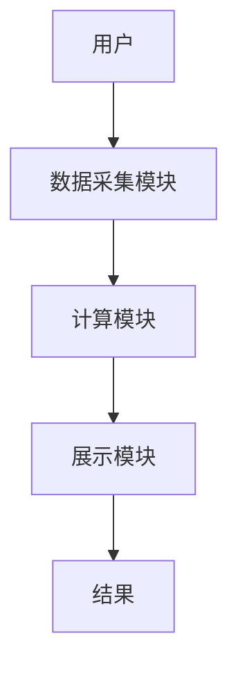
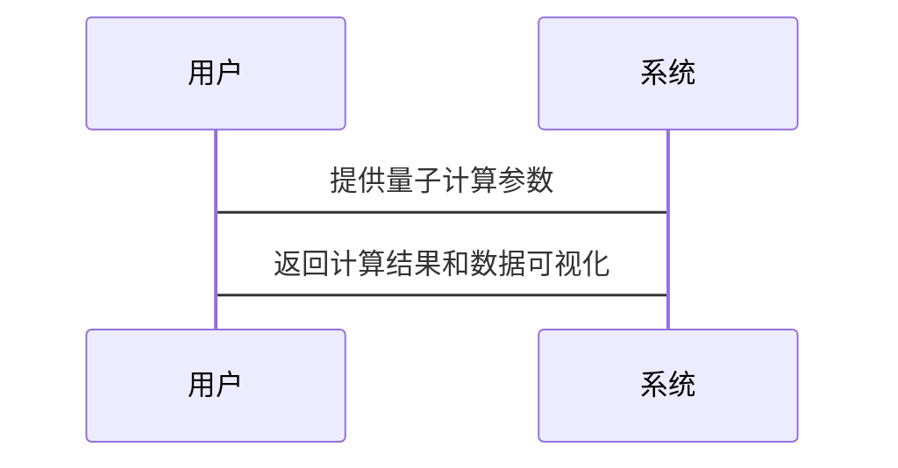

                 


```markdown
# 巴菲特-芒格的量子人工智能芯片投资：新一代AI硬件革命

> 关键词：巴菲特，芒格，量子计算，AI芯片，投资策略，技术革命

> 摘要：本文探讨了巴菲特和芒格的价值投资理念在量子人工智能芯片领域的应用，分析了量子计算与AI芯片的结合，详细讲解了量子计算算法的实现，系统设计与架构，以及实际项目实战案例，最后总结了投资要点和未来展望。

---

## 第1章 巴菲特与芒格的价值投资概述

### 1.1 巴菲特与芒格的投资理念

#### 1.1.1 巴菲特的价值投资原则
- **长期投资**：巴菲特强调长期投资，避免短期市场波动的干扰。
- **安全边际**：投资时留有安全边际，即以低于内在价值的价格买入。
- **企业基本面**：关注企业的财务状况、盈利能力和发展前景。

#### 1.1.2 芒格的多元思维模型
- **跨学科思维**：芒格倡导建立多元思维模型，将不同领域的知识结合起来。
- **逆向思维**：从反方向思考问题，寻找市场的空白点。

#### 1.1.3 价值投资的核心要素
- **内在价值**：企业的真正价值，而非市场估值。
- **竞争优势**：企业具备的独特优势，如技术壁垒、成本优势等。

### 1.2 巴菲特与芒格的投资策略

#### 1.2.1 股票选择的标准
- **行业地位**：选择行业龙头，具备竞争优势。
- **财务健康**：关注企业的盈利能力、资产负债表和现金流。

#### 1.2.2 长期投资的哲学
- **时间的力量**：长期持有优质资产，享受复利效应。
- **避免短期波动**：忽略市场的短期波动，专注于企业的长期价值。

#### 1.2.3 风险控制的策略
- **分散投资**：通过投资多个行业和公司降低风险。
- **避免过度集中**：防止单一投资的风险过高。

---

## 第2章 AI芯片的发展现状

### 2.1 AI芯片的定义与分类

#### 2.1.1 AI芯片的定义
- AI芯片是一种专门用于加速人工智能算法计算的硬件，如GPU、TPU等。

#### 2.1.2 当前主流AI芯片的技术特点
- **并行计算能力**：AI芯片通过并行计算提升处理速度。
- **专用架构**：针对特定任务优化，如图形处理器（GPU）和张量处理器（TPU）。

#### 2.1.3 量子计算的基本原理
- **量子位**：量子位可以同时表示0和1，具有叠加和纠缠的特性。
- **量子叠加**：量子态可以同时处于多个状态。
- **量子纠缠**：两个或多个量子位之间存在纠缠，一个的状态影响另一个的状态。

### 2.2 量子计算与AI芯片的协同效应

#### 2.2.1 量子计算在AI中的应用潜力
- **优化问题**：量子计算可以快速解决复杂的优化问题，如旅行商问题。
- **机器学习**：量子计算可以加速某些机器学习算法的训练过程。

#### 2.2.2 AI芯片在量子计算中的角色
- **加速计算**：AI芯片可以加速量子计算的模拟和实现。
- **硬件优化**：专门设计的AI芯片可以提升量子计算的效率。

#### 2.2.3 量子AI芯片的未来发展趋势
- **硬件融合**：量子计算与AI芯片的结合将更加紧密。
- **算法创新**：开发适用于量子计算的新型AI算法。

---

## 第3章 量子计算算法原理

### 3.1 量子计算的基本概念

#### 3.1.1 量子位与经典位的区别
- **经典位**：只能表示0或1。
- **量子位**：可以同时表示0和1，具有叠加和纠缠的特性。

#### 3.1.2 量子叠加与量子纠缠
- **量子叠加**：量子态可以同时处于多个状态。
- **量子纠缠**：两个或多个量子位之间存在纠缠，一个的状态影响另一个的状态。

#### 3.1.3 量子计算的数学基础
- **线性代数**：量子态用向量表示，量子操作用矩阵表示。
- **量子门**：基本的量子操作，如H门、X门等。

### 3.2 量子计算算法的实现

#### 3.2.1 量子傅里叶变换算法
- **原理**：量子傅里叶变换用于将信号从时间域转换到频率域。
- **应用**：广泛应用于信号处理和加密算法中。

#### 3.2.2 量子搜索算法
- **原理**：量子搜索算法可以在O(√N)时间内找到目标，而经典算法需要O(N)时间。
- **应用**：应用于数据库搜索和密码学。

#### 3.2.3 量子计算的数学模型
- **量子态表示**：用向量表示量子态，如|ψ⟩ = a|0⟩ + b|1⟩。
- **量子操作表示**：用矩阵表示量子门，如H门的矩阵表示为(1/√2)[[1, 1], [1, -1]]。

---

## 第4章 AI芯片的投资价值分析

### 4.1 AI芯片的技术壁垒

#### 4.1.1 制程工艺
- **先进制程**：如5nm、3nm制程工艺，直接影响芯片的性能和功耗。
- **封装技术**：高密度封装技术提升芯片的性能和可靠性。

#### 4.1.2 架构创新
- **专用架构**：如GPU、TPU等，针对特定任务优化。
- **可扩展性**：支持扩展性和灵活性，适应不同的应用场景。

### 4.2 AI芯片的市场前景

#### 4.2.1 市场规模
- **全球AI芯片市场**：预计未来几年将以高增长率增长。
- **主要应用领域**：包括云计算、自动驾驶、智能安防等。

#### 4.2.2 竞争格局
- **主要厂商**：如英伟达、谷歌、AMD等，竞争激烈。
- **技术发展趋势**：向更高效、更低功耗方向发展。

### 4.3 量子AI芯片的投资策略

#### 4.3.1 财务指标分析
- **收入与利润**：关注公司的收入增长和盈利能力。
- **研发投入**：高研发投入是技术创新的关键。

#### 4.3.2 技术壁垒评估
- **专利数量**：评估公司的技术储备。
- **技术领先性**：比较公司在技术上的优势。

---

## 第5章 系统分析与架构设计

### 5.1 项目背景

#### 5.1.1 问题场景介绍
- **目标**：设计一个量子计算与AI芯片结合的系统。
- **需求**：实现量子计算模拟和AI芯片性能分析。

### 5.2 系统功能设计

#### 5.2.1 领域模型
- **用户需求**：用户提供量子计算模拟和AI芯片性能分析的需求。
- **系统功能**：包括量子计算模拟、AI芯片性能分析、数据可视化等功能。

#### 5.2.2 系统架构设计
- **分层架构**：包括数据采集层、计算层、展示层。
- **模块划分**：数据采集模块、计算模块、展示模块。

### 5.3 系统架构图



### 5.4 接口设计

#### 5.4.1 API接口
- **输入接口**：接收用户的输入，如量子计算参数。
- **输出接口**：返回计算结果和数据可视化。

#### 5.4.2 数据接口
- **数据源**：包括量子计算数据和AI芯片性能数据。
- **数据存储**：存储数据以便后续分析。

### 5.5 交互设计

#### 5.5.1 交互流程图



---

## 第6章 项目实战

### 6.1 构建量子计算模拟器

#### 6.1.1 环境安装
- **Python**：安装Python 3.8及以上版本。
- **量子计算库**：安装Qiskit库，如`pip install qiskit`。

#### 6.1.2 源代码实现

```python
from qiskit import QuantumCircuit, Aer, execute
from qiskit.visualization import plot_histogram

# 创建量子电路
qc = QuantumCircuit(2, 2)

# 添加量子门
qc.h(0)
qc.cx(0, 1)
qc.measure(0, 0)
qc.measure(1, 1)

# 模拟器
simulator = Aer.get_backend('qasm_simulator')

# 执行电路
job = execute(qc, simulator)
result = job.result()

# 绘制结果
plot_histogram(result.get_counts())
```

#### 6.1.3 代码解读与分析
- **量子电路**：定义了一个2量子位的电路，添加了H门和CX门。
- **模拟器**：使用QASM模拟器执行电路。
- **结果可视化**：使用plot_histogram绘制结果分布。

#### 6.1.4 案例分析
- **案例背景**：模拟一个简单的量子计算任务，如量子叠加。
- **分析结果**：结果显示量子叠加的状态分布。

### 6.2 AI芯片投资分析系统

#### 6.2.1 环境安装
- **Python**：安装Python 3.8及以上版本。
- **数据分析库**：安装Pandas、Matplotlib等库。

#### 6.2.2 源代码实现

```python
import pandas as pd
import matplotlib.pyplot as plt

# 读取数据
data = pd.read_csv('chip_data.csv')

# 数据分析
data['收入增长率'] = data['收入'] / data['上年收入'] - 1

# 可视化
plt.plot(data['年份'], data['收入增长率'])
plt.xlabel('年份')
plt.ylabel('收入增长率')
plt.title('AI芯片公司收入增长率分析')
plt.show()
```

#### 6.2.3 代码解读与分析
- **数据读取**：从CSV文件中读取AI芯片公司的数据。
- **数据分析**：计算收入增长率。
- **可视化**：绘制收入增长率随时间的变化趋势图。

#### 6.2.4 案例分析
- **案例背景**：分析某家AI芯片公司的收入增长情况。
- **分析结果**：通过可视化展示公司的收入增长率趋势。

---

## 第7章 总结与展望

### 7.1 投资要点回顾

#### 7.1.1 投资策略
- **长期投资**：关注企业的长期价值。
- **安全边际**：选择低于内在价值的投资标的。

#### 7.1.2 技术趋势
- **量子计算**：未来AI芯片的重要发展方向。
- **硬件创新**：持续关注制程工艺和架构创新。

### 7.2 未来展望

#### 7.2.1 量子计算的潜力
- **算法优化**：量子计算在优化算法中的应用前景广阔。
- **AI芯片的融合**：量子计算与AI芯片的结合将推动AI技术的进一步发展。

#### 7.2.2 投资机会
- **技术创新**：关注具有技术创新能力的公司。
- **市场扩展**：关注AI芯片在新兴领域的应用机会。

### 7.3 投资建议

#### 7.3.1 风险提示
- **技术风险**：量子计算技术尚未成熟，存在不确定性。
- **市场风险**：AI芯片市场竞争激烈，存在降价压力。

#### 7.3.2 优化建议
- **分散投资**：通过投资多个公司降低风险。
- **持续学习**：关注行业动态和技术发展，及时调整投资策略。

---

## 作者

作者：AI天才研究院/AI Genius Institute & 禅与计算机程序设计艺术 /Zen And The Art of Computer Programming
```

