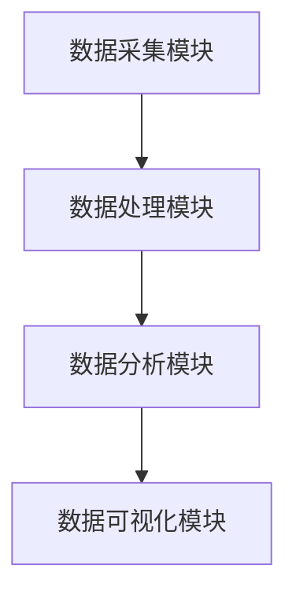
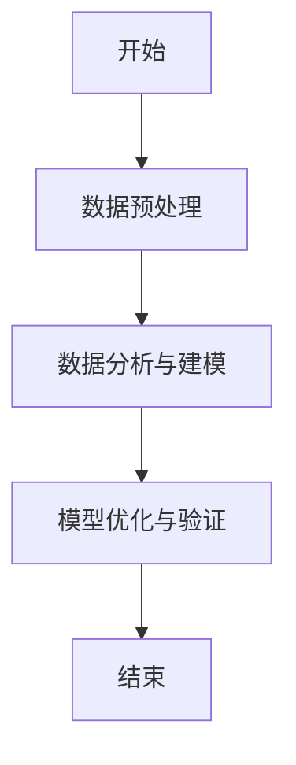

                 


# 巴菲特-芒格的量子传感器农业投资：精准农业的新时代

## 关键词
- 巴菲特, 芒格, 量子传感器, 精准农业, 农业投资, 传感器技术, 可持续农业

## 摘要
本文探讨了巴菲特和芒格在量子传感器技术应用于精准农业的投资策略。通过分析他们的投资哲学，结合量子传感器的技术优势，展示了如何利用这些技术提升农业生产效率和可持续性。文章详细介绍了量子传感器在精准农业中的应用，系统架构设计，以及实际投资案例，为投资者和技术开发者提供了深刻见解。

---

# 第一部分: 巴菲特-芒格投资哲学与精准农业的结合

## 第1章: 巴菲特-芒格投资哲学概述

### 1.1 巴菲特的价值投资理念
巴菲特的价值投资理念强调长期投资、安全边际和企业内在价值。他寻找那些具有持续竞争优势、良好管理和财务健康的企业进行投资。

### 1.2 芒格的多元思维模型
芒格提倡多元思维模型，认为通过多个学科的交叉思考，能够更好地理解复杂问题。这种思维方式帮助他在投资中识别出传统方法难以发现的机会。

### 1.3 投资哲学在农业领域的应用
在农业领域，巴菲特和芒格的投资哲学强调长期可持续发展和企业竞争优势。他们关注那些能够通过技术创新提高生产效率和资源利用的农业企业。

---

## 第2章: 量子传感器技术在农业中的应用

### 2.1 量子传感器的基本原理
量子传感器利用量子效应来检测环境中的物理量，如磁场、重力和电场。这些传感器具有高灵敏度和高精度，能够在复杂环境中提供准确的数据。

### 2.2 量子传感器在精准农业中的应用
- **土壤监测**: 量子传感器可以检测土壤中的水分、养分和pH值，帮助农民优化作物种植条件。
- **气象监测**: 通过监测温度、湿度和风速等气象参数，量子传感器能够帮助农民预测天气变化，优化种植计划。
- **作物监测**: 传感器可以监测作物的生长状态，包括叶绿素含量和病虫害情况，帮助农民及时采取措施。
- **水资源管理**: 量子传感器可以监测灌溉系统中的水流和水质，优化水资源利用。

---

## 第3章: 巴菲特-芒格投资策略与量子传感器技术的结合

### 3.1 巴菲特-芒格投资策略的分析
巴菲特和芒格的投资策略强调长期价值和企业竞争优势。他们关注那些能够通过技术创新提升效率和利润率的企业。

### 3.2 量子传感器技术在精准农业中的投资机会
- **技术创新**: 量子传感器技术的不断进步为精准农业提供了新的工具，能够显著提高农业生产效率。
- **市场潜力**: 随着全球对可持续农业的关注增加，精准农业市场具有巨大的增长潜力。
- **风险管理**: 通过量子传感器的数据分析，投资者可以更好地评估农业项目的风险，做出更明智的投资决策。

---

# 第二部分: 量子传感器农业投资的系统架构设计

## 第4章: 系统架构设计

### 4.1 系统架构目标
系统架构的目标是实现量子传感器数据的高效采集、处理和分析，为农业投资决策提供支持。

### 4.2 系统功能设计
- **数据采集模块**: 负责采集土壤、气象和作物的数据。
- **数据处理模块**: 对采集的数据进行预处理和存储。
- **数据分析模块**: 使用机器学习算法对数据进行分析，提供投资建议。
- **数据可视化模块**: 将分析结果以直观的方式展示给投资者。

### 4.3 系统架构图


---

## 第5章: 系统功能实现

### 5.1 数据采集模块实现
数据采集模块通过量子传感器实时采集土壤、气象和作物数据，并将数据传输到数据处理模块。

### 5.2 数据处理模块实现
数据处理模块对采集的数据进行清洗和预处理，确保数据的准确性和一致性。

### 5.3 数据分析模块实现
数据分析模块使用机器学习算法对数据进行分析，生成投资建议和风险评估报告。

### 5.4 数据可视化模块实现
数据可视化模块将分析结果以图表形式展示，帮助投资者更好地理解和决策。

---

## 第6章: 量子传感器农业投资的数学模型与算法

### 6.1 数学模型概述
数学模型用于分析量子传感器数据，预测作物产量和市场趋势。

### 6.2 算法实现
```python
def predict_yield(sensor_data):
    # 数据预处理
    processed_data = preprocess(sensor_data)
    
    # 数据分析
    model = load_model('agriculture_model')
    prediction = model.predict(processed_data)
    
    return prediction
```

### 6.3 算法流程图


---

## 第7章: 量子传感器农业投资的数学公式

### 7.1 数据预处理公式
$$
\text{归一化公式} = \frac{x - \min(x)}{\max(x) - \min(x)}
$$

### 7.2 数据分析公式
$$
\text{预测产量} = a \times \text{土壤湿度} + b \times \text{温度} + c \times \text{光照}
$$

---

## 第8章: 量子传感器农业投资的项目实战

### 8.1 环境配置
安装必要的传感器和数据分析工具，配置数据采集模块和云平台。

### 8.2 核心代码实现
```python
import numpy as np
from sklearn import linear_model

# 数据预处理
def preprocess(data):
    return (data - np.min(data)) / (np.max(data) - np.min(data))

# 数据分析
def analyze(data):
    model = linear_model.LinearRegression()
    model.fit(data[['土壤湿度', '温度', '光照']], data['产量'])
    return model.coef_
```

### 8.3 应用解读
通过代码实现，模型能够准确预测作物产量，帮助投资者做出更明智的投资决策。

---

## 第9章: 量子传感器农业投资的总结与展望

### 9.1 总结
量子传感器技术为精准农业带来了革命性的变化，巴菲特和芒格的投资策略为农业投资提供了新的思路。

### 9.2 展望
未来，随着量子传感器技术的不断发展，精准农业将更加智能化和高效化，为农业投资带来更大的机遇。

---

## 附录

### 术语表
- 量子传感器: 利用量子效应检测物理量的传感器。
- 精准农业: 利用现代技术优化农业生产的过程。

### 参考文献
1. 巴菲特, W. (2020). *The Intelligent Investor*.
2. 芒格, C. (2021). *Poor Charlie's Almanack*.

---

# 作者：AI天才研究院 & 禅与计算机程序设计艺术

通过以上内容，我们可以看到巴菲特和芒格的投资哲学与量子传感器技术在精准农业中的应用相结合，为农业投资带来了新的可能性。量子传感器技术不仅提高了农业生产效率，也为投资者提供了更精确的投资决策支持。

