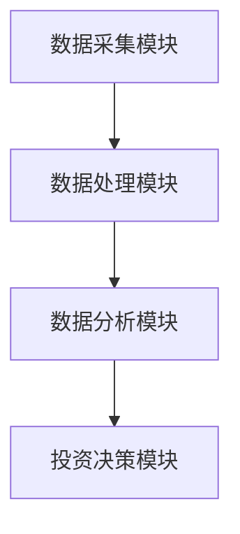
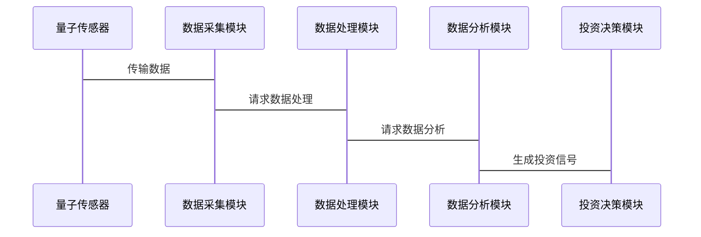

                 


# 巴菲特-芒格的量子传感器投资：精密测量的未来

## 关键词：
- 巴菲特投资理念、芒格思维模型、量子传感器、投资技术、风险管理、算法原理

## 摘要：
本文探讨了巴菲特和芒格的投资理念与量子传感器技术的结合，分析了量子传感器在投资中的应用前景。文章详细介绍了量子传感器的原理、在金融市场的应用，以及如何利用这些技术提升投资决策的精确性和效率。通过算法原理、系统架构设计和实际案例分析，展示了量子传感器在投资领域的潜力和未来发展方向。

---

# 第1章 巴菲特-芒格投资理念概述

## 1.1 巴菲特的价值投资理论

### 1.1.1 价值投资的核心理念
价值投资是一种长期投资策略，强调以低于内在价值的价格购买优质资产。巴菲特认为，市场先生的短期情绪波动不应影响长期投资决策，真正的投资价值来源于企业的基本面。

### 1.1.2 巴菲特的投资策略
- **长期持有**：巴菲特定睐于持有优质资产，避免频繁交易。
- **安全边际**：通过购买价格远低于内在价值的资产，降低投资风险。
- **企业基本面分析**：关注企业的盈利能力、财务状况和竞争优势。

### 1.1.3 芒格的多元思维模型
芒格提倡构建跨学科的知识框架，通过多角度分析问题，避免单一思维的局限性。他认为，投资者需要理解物理学、心理学、经济学等多个领域的知识，才能做出明智的决策。

---

## 1.2 巴菲特-芒格投资理念的现代发展

### 1.2.1 现代投资理论的演变
从传统的基本面分析到现代的量化投资，投资理论不断进步。现代投资强调数据驱动和模型化决策，而巴菲特-芒格理念则结合了基本面分析与长期价值投资。

### 1.2.2 巴菲特-芒格理念与传统投资理论的差异
- **长期视角**：巴菲特-芒格理念注重长期价值，而传统投资可能更关注短期波动。
- **跨学科思维**：芒格的多元思维模型与传统单一的金融分析形成对比。
- **风险管理**：巴菲特强调安全边际，而传统投资可能更关注收益最大化。

### 1.2.3 巴菲特-芒格理念在科技时代的应用
随着科技的发展，巴菲特-芒格理念也在不断演变。量子传感器技术为投资决策提供了新的可能性，尤其是在数据采集和分析方面。

---

## 1.3 巴菲特-芒格投资理念与量子传感器的结合

### 1.3.1 量子传感器的基本概念
量子传感器是一种基于量子力学原理的测量工具，能够以极高的精度检测物理量，如磁场、重力、温度等。其核心优势在于高灵敏度和高分辨率。

### 1.3.2 量子传感器在投资中的潜在应用
量子传感器可以用于实时监测市场波动、企业基本面数据变化等，为投资者提供更精确的决策支持。

### 1.3.3 巴菲特-芒格理念与量子传感器技术的融合
通过量子传感器技术，巴菲特-芒格理念中的长期价值投资可以更精确地量化，同时跨学科思维模型可以更好地应用于复杂的投资环境。

---

# 第2章 量子传感器的原理与技术

## 2.1 量子传感器的基本原理

### 2.1.1 量子力学基础
量子力学研究微观粒子的行为，其核心概念包括波函数、概率幅、不确定性原理等。

### 2.1.2 量子传感器的工作原理
量子传感器利用量子系统的特性，如量子纠缠和量子干涉，来实现高精度测量。

### 2.1.3 量子传感器的优势与局限性
- **优势**：高灵敏度、高分辨率、抗干扰能力强。
- **局限性**：技术复杂、成本高、应用场景有限。

---

## 2.2 量子传感器的主要技术

### 2.2.1 量子纠缠技术
量子纠缠是指两个或多个粒子之间存在特殊关联，无论距离多远，测量其中一个粒子会立即影响另一个粒子的状态。

### 2.2.2 量子干涉技术
量子干涉技术利用量子叠加效应，通过干涉图样来提取信息。

### 2.2.3 量子测量技术
量子测量技术通过测量量子系统的状态，获取高精度的物理量。

---

## 2.3 量子传感器的最新进展

### 2.3.1 国际量子传感器研究现状
国际上，许多国家都在积极开展量子传感器研究，如德国、英国和美国。

### 2.3.2 国内量子传感器研究进展
国内在量子传感器领域的研究也取得了重要进展，尤其是在量子重力梯度仪和量子磁场传感器方面。

### 2.3.3 量子传感器技术的未来发展方向
未来，量子传感器技术将朝着小型化、低成本和广泛应用方向发展。

---

# 第3章 量子传感器在投资中的应用

## 3.1 量子传感器在金融市场的应用

### 3.1.1 量子传感器在股票市场的应用
通过量子传感器实时监测市场波动，帮助投资者捕捉潜在的投资机会。

### 3.1.2 量子传感器在债券市场的应用
量子传感器可以用于监测债券发行企业的财务状况，评估债券信用风险。

### 3.1.3 量子传感器在外汇市场的应用
量子传感器可以实时监测全球经济指标，帮助投资者做出更精准的外汇交易决策。

---

## 3.2 量子传感器在风险管理中的应用

### 3.2.1 量子传感器在市场风险中的应用
通过量子传感器实时监测市场波动，评估市场风险。

### 3.2.2 量子传感器在信用风险中的应用
量子传感器可以用于评估企业的信用状况，预测企业违约风险。

---

# 第4章 量子传感器投资的算法原理

## 4.1 时间序列分析

### 4.1.1 时间序列分析的定义
时间序列分析是一种统计方法，用于分析随时间变化的数据序列。

### 4.1.2 时间序列分析的数学模型
常用的时间序列模型包括ARIMA和GARCH模型。

### 4.1.3 时间序列分析的实现步骤
1. 数据预处理：清洗数据，处理缺失值。
2. 模型选择：选择合适的模型。
3. 模型训练：使用历史数据训练模型。
4. 模型预测：基于模型预测未来趋势。

---

## 4.2 机器学习模型

### 4.2.1 机器学习模型的定义
机器学习是一种人工智能技术，通过数据训练模型，使其能够自动学习和预测。

### 4.2.2 机器学习模型的实现步骤
1. 数据收集：收集相关数据。
2. 数据预处理：清洗数据，特征工程。
3. 模型选择：选择合适的机器学习算法。
4. 模型训练：训练模型。
5. 模型评估：评估模型性能。
6. 模型部署：将模型应用于实际场景。

---

# 第5章 量子传感器投资的系统架构设计

## 5.1 系统功能设计

### 5.1.1 数据采集模块
负责采集量子传感器的数据，包括时间戳、传感器类型、测量值等。

### 5.1.2 数据处理模块
对采集到的数据进行清洗、转换和存储。

### 5.1.3 数据分析模块
对数据进行统计分析、机器学习建模和预测。

### 5.1.4 投资决策模块
基于分析结果，生成投资信号，指导投资决策。

---

## 5.2 系统架构设计

### 5.2.1 系统架构图


---

## 5.3 系统接口设计

### 5.3.1 数据采集接口
定义数据采集模块与量子传感器的接口，包括数据格式和通信协议。

### 5.3.2 数据处理接口
定义数据处理模块与数据库的接口，包括数据存储格式和操作接口。

---

## 5.4 系统交互设计

### 5.4.1 数据采集流程


---

# 第6章 量子传感器投资的项目实战

## 6.1 环境安装

### 6.1.1 安装Python环境
使用Anaconda安装Python 3.8及以上版本。

### 6.1.2 安装相关库
安装Pandas、NumPy、Scikit-learn、Matplotlib等库。

```bash
pip install pandas numpy scikit-learn matplotlib
```

---

## 6.2 核心实现

### 6.2.1 数据采集代码
```python
import pandas as pd

def collect_data(sensor_id):
    # 模拟数据采集
    data = {'timestamp': [], 'value': []}
    for i in range(100):
        data['timestamp'].append(i)
        data['value'].append(sensor_id + i)
    return pd.DataFrame(data)
```

---

### 6.2.2 数据处理代码
```python
import pandas as pd

def process_data(df):
    # 数据清洗
    df.dropna(inplace=True)
    # 数据转换
    df['value'] = df['value'].astype(float)
    return df
```

---

### 6.2.3 数据分析代码
```python
from sklearn.linear_model import LinearRegression

def analyze_data(df):
    model = LinearRegression()
    model.fit(df[['timestamp']], df['value'])
    return model
```

---

## 6.3 案例分析

### 6.3.1 案例背景
假设我们有一个量子传感器用于监测股票市场的波动。

### 6.3.2 数据分析结果
通过线性回归模型，我们预测未来股票价格走势。

### 6.3.3 投资决策
根据模型预测结果，生成买入或卖出信号。

---

## 6.4 项目小结

### 6.4.1 项目总结
量子传感器投资系统能够实时监测市场波动，提供高精度的分析结果，辅助投资者做出更明智的决策。

### 6.4.2 项目经验
在实际项目中，需要考虑传感器的精度、数据的实时性以及模型的准确性。

---

# 第7章 总结与展望

## 7.1 总结

### 7.1.1 量子传感器的优势
量子传感器在投资中的应用前景广阔，能够提供高精度的数据支持。

### 7.1.2 巴菲特-芒格理念的现代发展
巴菲特-芒格理念与量子传感器技术的结合，为投资决策提供了新的可能性。

---

## 7.2 展望

### 7.2.1 量子传感器技术的发展方向
未来，量子传感器技术将更加小型化、低成本化，并在更多领域得到应用。

### 7.2.2 投资领域的未来趋势
随着人工智能和量子计算的发展，投资决策将更加数据驱动和模型化。

---

# 作者：AI天才研究院 & 禅与计算机程序设计艺术

