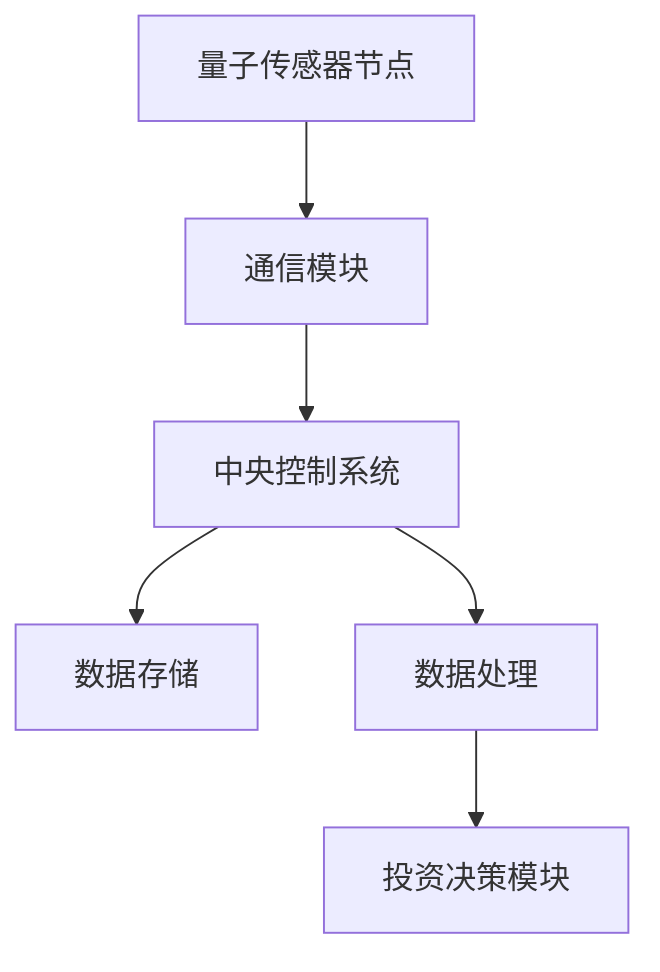
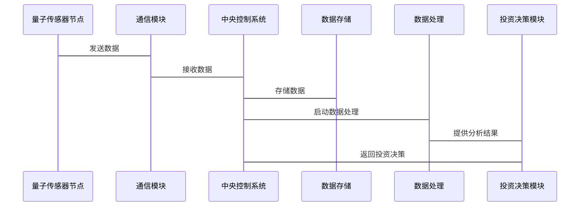

                 


# 巴菲特-芒格的量子传感器网络投资：物联网的下一代

> 关键词：量子传感器网络，物联网，巴菲特，芒格，投资策略

> 摘要：本文探讨了巴菲特和芒格的价值投资理念与量子传感器网络的结合，分析了物联网的下一代发展，详细介绍了量子传感器网络的投资逻辑、核心技术、算法原理、系统架构、项目实战以及最佳实践。通过理论与实践相结合的方式，为投资者和技术创新者提供了深度洞察。

---

## 第1章 巴菲特-芒格投资理念与量子传感器网络的结合

### 1.1 巴菲特与芒格的投资哲学

#### 1.1.1 巴菲特的价值投资理念
沃伦·巴菲特的价值投资理念强调长期主义和基本面分析。他主张投资于具有持续竞争优势的企业，并以合理的价格买入，长期持有。这种理念的核心在于寻找具有强大护城河（competitive moat）的企业，这些企业能够在长期的竞争中保持优势。

#### 1.1.2 芒格的多元思维模型
查理·芒格的多元思维模型强调通过跨学科的知识来理解问题。他认为，投资者需要构建一个由多个学科组成的“心智模型”，以更好地理解和预测市场的变化。这种思维方式帮助投资者避免单一视角的局限性，从而做出更明智的投资决策。

#### 1.1.3 价值投资与长期主义的结合
价值投资与长期主义的结合是巴菲特和芒格投资理念的核心。他们认为，短期市场的波动不应该影响长期投资决策，真正的投资机会往往来自于对行业趋势和技术创新的深刻理解。

---

### 1.2 量子传感器网络的概念与特点

#### 1.2.1 量子传感器的基本原理
量子传感器利用量子效应（如量子干涉、量子纠缠）来感知和测量物理量（如磁场、重力、温度）。与传统传感器相比，量子传感器具有更高的灵敏度和精度，能够在更复杂的环境中提供准确的数据。

#### 1.2.2 传感器网络的架构与功能
传感器网络由多个传感器节点组成，这些节点通过无线通信技术（如LoRa、NB-IoT）连接到中央控制系统。每个节点负责采集特定的物理数据（如温度、湿度、压力），并将数据传输到云端进行处理和分析。

#### 1.2.3 量子传感器网络的优势与挑战
量子传感器网络的优势在于其高灵敏度、高精度和低功耗。然而，其商业化面临技术瓶颈（如成本高、稳定性差）和市场接受度的挑战。

---

### 1.3 物联网的下一代发展

#### 1.3.1 物联网的现状与未来趋势
物联网（IoT）已经渗透到各个行业，从智能家居到工业自动化，再到智慧城市。随着技术的进步，物联网的下一代发展将更加注重数据的实时性、可靠性和安全性。

#### 1.3.2 量子技术在物联网中的应用
量子技术（如量子计算、量子通信）为物联网提供了新的可能性。例如，量子传感器可以用于环境监测、医疗设备、自动驾驶等领域，而量子通信则可以为物联网提供更高的安全性。

#### 1.3.3 量子传感器网络的投资机会
量子传感器网络的投资机会主要集中在以下几个领域：
1. **智能医疗**：用于精准诊断和实时监测。
2. **智能制造**：用于设备状态监测和预测维护。
3. **智慧城市**：用于环境监测和交通管理。

---

## 第2章 量子传感器网络的投资逻辑

### 2.1 量子传感器网络的投资背景

#### 2.1.1 物联网市场的增长潜力
物联网市场的规模预计将以年均10%的速度增长，到2030年将超过1万亿美元。量子传感器网络作为物联网的下一代技术，具有巨大的市场潜力。

#### 2.1.2 量子技术的商业化进程
尽管量子技术仍处于早期阶段，但其商业化进程正在加速。例如，量子传感器已经在某些领域（如国防、科研）得到应用，未来将逐步进入民用市场。

#### 2.1.3 投资者关注的热点领域
投资者对量子传感器网络的关注主要集中在以下几个方面：
- 技术成熟度：量子传感器的性能和稳定性。
- 市场需求：特定行业的应用潜力。
- 商业模式：如何将量子传感器网络商业化。

---

### 2.2 巴菲特-芒格投资策略的创新

#### 2.2.1 从传统投资到量子传感器网络
传统的价值投资主要关注企业的财务状况和管理团队。而在量子传感器网络领域，投资者需要更加关注技术的创新和市场的潜力。

#### 2.2.2 量子传感器网络的长期价值
量子传感器网络的长期价值在于其对物联网的推动作用。通过高精度、低延迟的传感器网络，企业可以实现更高效的运营和更智能的决策。

#### 2.2.3 投资者的风险与收益分析
量子传感器网络的投资风险主要在于技术不确定性和市场接受度。然而，一旦技术成熟并得到广泛应用，其收益将是巨大的。

---

### 2.3 量子传感器网络的市场分析

#### 2.3.1 市场规模与增长预测
量子传感器网络的市场规模预计将在未来几年快速增长，年均增长率可能超过20%。

#### 2.3.2 主要参与者与竞争格局
当前市场的主要参与者包括传统传感器制造商（如 Bosch、Siemens）和新兴的量子技术公司（如 Rigetti、IonQ）。竞争格局主要集中在技术开发和市场拓展方面。

#### 2.3.3 技术壁垒与投资门槛
量子传感器网络的技术壁垒较高，主要体现在量子传感器的设计和制造。因此，投资者需要具备一定的技术背景和行业资源。

---

## 第3章 量子传感器网络的核心技术与投资机会

### 3.1 量子传感器的关键技术

#### 3.1.1 量子传感的基本原理
量子传感利用量子效应来测量物理量。例如，基于量子干涉的传感器可以用于磁场测量，而基于量子纠缠的传感器可以用于温度测量。

#### 3.1.2 传感器的灵敏度与精度
量子传感器的灵敏度和精度远高于传统传感器。例如，量子磁力计可以检测到微特斯拉级别的磁场变化。

#### 3.1.3 量子传感器的制造与成本
量子传感器的制造成本较高，主要原因是其复杂的制造工艺和材料要求。然而，随着技术的进步，成本有望逐步下降。

---

### 3.2 传感器网络的架构设计

#### 3.2.1 网络拓扑结构
传感器网络的拓扑结构包括星型、树型和网状结构。网状结构（Mesh）是最常用的，因为它具有良好的扩展性和容错性。

#### 3.2.2 数据采集与传输
传感器节点通过无线通信技术将数据传输到中央控制系统。数据传输的延迟和带宽是影响系统性能的关键因素。

#### 3.2.3 数据处理与分析
数据处理主要通过云端进行，利用大数据技术对传感器数据进行分析和挖掘，以提取有价值的信息。

---

### 3.3 投资机会与风险评估

#### 3.3.1 智能医疗领域的应用
量子传感器可以用于实时监测患者的生理指标，如心率、血压和血糖。这种应用具有巨大的市场潜力。

#### 3.3.2 智能制造领域的应用
在智能制造中，量子传感器可以用于设备状态监测和预测维护，从而提高生产效率和降低成本。

#### 3.3.3 智慧城市领域的应用
在智慧城市中，量子传感器可以用于环境监测（如空气质量、温度和湿度），帮助城市管理者做出更明智的决策。

---

## 第4章 量子传感器网络的算法原理与实现

### 4.1 量子传感器网络的算法原理

#### 4.1.1 量子计算的基本原理
量子计算利用量子位（qubit）进行计算，具有并行性和叠加性。与经典计算相比，量子计算在某些领域（如优化问题）具有显著优势。

#### 4.1.2 传感器数据的处理算法
传感器数据的处理算法包括信号滤波、特征提取和数据融合。这些算法可以帮助提高数据的准确性和可靠性。

#### 4.1.3 投资决策的优化算法
基于量子计算的投资决策优化算法可以帮助投资者找到最优的投资组合，从而实现最大化的收益和最小化的风险。

---

### 4.2 量子传感器网络的实现步骤

#### 4.2.1 环境安装与配置
需要安装量子传感器节点、通信模块和中央控制系统。配置包括网络参数、传感器参数和数据处理算法。

#### 4.2.2 系统核心实现
系统核心包括数据采集、数据传输、数据处理和投资决策模块。数据采集模块负责收集传感器数据，数据传输模块负责将数据传输到云端，数据处理模块负责对数据进行分析，投资决策模块负责基于分析结果做出投资决策。

#### 4.2.3 代码实现与解读
以下是一个简单的量子传感器网络的Python代码示例：

```python
import numpy as np

def quantum_sensor_data():
    # 生成量子传感器数据
    data = np.random.randn(100)
    return data

def investment_decision(data):
    # 基于量子传感器数据的投资决策算法
    mean = np.mean(data)
    if mean > 0:
        return "买入"
    else:
        return "卖出"

# 主程序
data = quantum_sensor_data()
decision = investment_decision(data)
print(f"投资决策：{decision}")
```

---

## 第5章 量子传感器网络的系统架构与设计

### 5.1 系统分析与架构设计

#### 5.1.1 问题场景介绍
假设我们正在设计一个量子传感器网络，用于监测某工业园区的环境参数（如温度、湿度、空气质量）。系统需要实时采集数据，并基于这些数据做出投资决策。

#### 5.1.2 系统功能设计
系统功能包括：
- 数据采集：通过量子传感器采集环境参数。
- 数据传输：通过无线通信技术将数据传输到云端。
- 数据处理：对数据进行分析和挖掘，提取有价值的信息。
- 投资决策：基于分析结果做出买入或卖出的投资决策。

#### 5.1.3 系统架构图
以下是系统架构的Mermaid图：



---

### 5.2 接口与交互设计

#### 5.2.1 接口设计
系统接口包括：
- 传感器节点接口：负责与量子传感器通信。
- 数据存储接口：负责存储传感器数据。
- 投资决策接口：负责接收数据处理模块的分析结果。

#### 5.2.2 交互流程图
以下是交互流程的Mermaid图：



---

## 第6章 量子传感器网络的项目实战与案例分析

### 6.1 项目实战

#### 6.1.1 环境安装与配置
需要安装量子传感器节点、通信模块、中央控制系统和数据分析工具。建议使用云平台（如AWS、Azure）进行数据存储和处理。

#### 6.1.2 系统核心实现
以下是系统核心实现的Python代码：

```python
import numpy as np
import requests
import json

def collect_data():
    # 模拟量子传感器数据采集
    data = np.random.randn(100)
    return data.tolist()

def send_data(data, url):
    # 将数据发送到云端
    payload = {"data": data}
    response = requests.post(url, json=payload)
    return response.status_code

def analyze_data(data):
    # 数据分析与处理
    mean = np.mean(data)
    return {"mean": mean}

def make_investment_decision(mean):
    # 投资决策算法
    if mean > 0:
        return "买入"
    else:
        return "卖出"

# 主程序
data = collect_data()
status = send_data(data, "http://cloud.example.com/api")
analysis = analyze_data(data)
decision = make_investment_decision(analysis["mean"])
print(f"投资决策：{decision}")
```

---

### 6.2 案例分析

#### 6.2.1 智能医疗案例
某医院引入量子传感器网络，用于实时监测患者的生理指标。通过量子传感器网络，医院可以实现精准诊断和实时监测，从而提高医疗效率和患者满意度。

#### 6.2.2 智能制造案例
某制造企业使用量子传感器网络，用于设备状态监测和预测维护。通过量子传感器网络，企业可以减少设备故障率，提高生产效率和产品质量。

#### 6.2.3 智慧城市案例
某城市采用量子传感器网络，用于环境监测和交通管理。通过量子传感器网络，城市可以实现更高效的环境管理和交通调度，从而改善城市居民的生活质量。

---

## 第7章 量子传感器网络的最佳实践与总结

### 7.1 最佳实践

#### 7.1.1 技术选择
在选择量子传感器网络技术时，需要综合考虑技术成熟度、成本、市场潜力等因素。建议优先选择具有较高技术壁垒和良好市场前景的技术。

#### 7.1.2 投资策略
投资者需要制定科学的投资策略，包括风险评估、收益分析和投资组合优化。建议结合巴菲特和芒格的价值投资理念，选择具有长期竞争优势的企业。

#### 7.1.3 项目管理
在项目实施过程中，需要注重项目管理和团队协作。建议采用敏捷开发模式，定期评估项目进展和风险。

---

### 7.2 小结与展望

量子传感器网络作为物联网的下一代技术，具有巨大的市场潜力和投资机会。通过巴菲特和芒格的价值投资理念，投资者可以更好地把握技术趋势和市场动态，从而实现长期稳定的收益。

---

## 作者：AI天才研究院/AI Genius Institute & 禅与计算机程序设计艺术 /Zen And The Art of Computer Programming

---

以上是《巴菲特-芒格的量子传感器网络投资：物联网的下一代》的技术博客文章。文章从背景介绍、核心概念、算法原理、系统架构、项目实战到最佳实践，全面阐述了量子传感器网络的投资机会和实现方案。通过理论与实践相结合的方式，为投资者和技术创新者提供了深度洞察。

