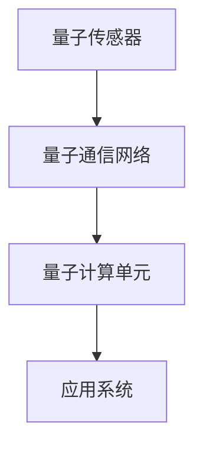
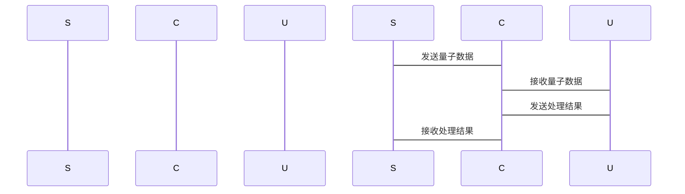

                 


# 巴菲特-芒格的量子传感网络投资：物联网的量子飞跃

> 关键词：量子传感网络，物联网，巴菲特，芒格，投资，量子飞跃

> 摘要：本文探讨了巴菲特和芒格的投资理念与量子传感网络技术的结合，分析了量子传感网络在物联网中的应用前景，以及如何通过量子传感网络的投资实现物联网的量子飞跃。

---

## 第一章：巴菲特-芒格投资理念概述

### 1.1 巴菲特与芒格的投资哲学

#### 1.1.1 巴菲特的价值投资理念
- 巴菲特的价值投资理念强调长期投资、安全边际和公司基本面分析。
- 他注重公司的内在价值，即公司未来现金流的现值。

#### 1.1.2 芒格的多元思维模型
- 芒格提出“多元思维模型”，强调通过多个学科的交叉应用来理解复杂问题。
- 他主张将物理学、心理学、经济学等多学科知识结合起来，形成完整的知识框架。

#### 1.1.3 巴菲特与芒格投资理念的结合
- 巴菲特与芒格的理念共同点在于对长期价值的追求和对安全边际的关注。
- 两者的结合体现在对量子传感网络这一新兴技术的投资中。

### 1.2 量子传感网络的基本概念

#### 1.2.1 量子传感的定义与原理
- 量子传感是一种利用量子力学原理进行测量的技术。
- 其核心原理包括量子纠缠、量子叠加和量子测量。

#### 1.2.2 物联网的定义与架构
- 物联网（IoT）是指通过各种信息传感设备，按照约定的协议，把任何物品与互联网连接起来，进行信息交换和通信。
- 物联网的架构通常包括感知层、网络层和应用层。

#### 1.2.3 量子传感与物联网的结合
- 量子传感技术可以提升物联网的感知能力，特别是在高精度测量和安全性方面。

---

## 第二章：量子传感网络的核心技术

### 2.1 量子传感技术的原理

#### 2.1.1 量子纠缠与量子测量
- 量子纠缠：两个或多个粒子处于纠缠状态，无论相隔多远，测量其中一个粒子会立即影响另一个粒子的状态。
- 量子测量：通过测量量子系统来获取信息，但测量会对量子系统产生不可逆的影响。

#### 2.1.2 量子传感在物联网中的应用
- 高精度测量：量子传感技术可以实现超高的测量精度，适用于环境监测、医疗设备等领域。
- 安全性：量子传感技术可以提高物联网的安全性，防止数据被篡改。

#### 2.1.3 量子传感网络的优缺点
- 优点：高精度、高灵敏度、抗干扰能力强。
- 缺点：技术复杂、成本高、实现难度大。

### 2.2 物联网系统架构

#### 2.2.1 物联网的层次结构
- 感知层：包括传感器、射频识别（RFID）等设备，用于采集数据。
- 网络层：包括各种通信网络，用于数据传输。
- 应用层：包括各种应用系统，用于数据处理和决策。

#### 2.2.2 量子传感网络的系统架构
- 量子传感器：用于采集量子信息。
- 量子通信网络：用于数据传输。
- 量子计算单元：用于数据处理和分析。

#### 2.2.3 量子传感网络的协议与标准
- 需要制定新的协议和标准，以适应量子传感技术的特点。

---

## 第三章：巴菲特-芒格投资理念与量子传感网络的结合

### 3.1 巴菲特-芒格投资理念的核心要素

#### 3.1.1 价值投资的核心要素
- 公司的长期盈利能力。
- 行业地位和竞争优势。
- 财务状况和现金流。

#### 3.1.2 多元思维模型的应用
- 通过多学科交叉分析，评估量子传感网络的技术可行性和市场潜力。

#### 3.1.3 巴菲特-芒格投资理念的数学模型
- 通过数学模型评估公司的内在价值，判断是否值得投资。

### 3.2 量子传感网络的投资价值

#### 3.2.1 量子传感网络的市场潜力
- 随着技术的进步，量子传感网络在物联网中的应用将越来越广泛。
- 市场规模将快速增长。

#### 3.2.2 量子传感网络的技术壁垒
- 技术复杂，研发难度大。
- 需要大量资金投入。

#### 3.2.3 量子传感网络的长期投资价值
- 量子传感网络是未来物联网发展的趋势。
- 具备长期的投资价值。

---

## 第四章：量子传感网络的算法原理

### 4.1 量子传感网络的算法基础

#### 4.1.1 量子测量的数学模型
- 量子测量可以用数学模型描述，例如利用量子态的叠加性和纠缠性。

#### 4.1.2 量子纠缠的数学表达
- 利用量子力学的基本方程，描述量子纠缠的状态。

#### 4.1.3 量子传感网络的信号处理算法
- 利用信号处理算法，提取量子传感网络中的有用信息。

### 4.2 量子传感网络的优化算法

#### 4.2.1 量子传感网络的优化目标
- 提高测量精度。
- 降低能耗。
- 提升安全性。

#### 4.2.2 量子传感网络的优化方法
- 利用优化算法，如遗传算法、模拟退火等，优化量子传感网络的性能。

#### 4.2.3 量子传感网络的优化效果
- 通过优化算法，可以显著提高量子传感网络的性能。

---

## 第五章：量子传感网络的系统架构设计

### 5.1 量子传感网络的系统架构

#### 5.1.1 系统层次结构
- 包括感知层、网络层和应用层。

#### 5.1.2 系统功能设计
- 传感器负责采集数据。
- 通信模块负责数据传输。
- 处理模块负责数据处理和分析。

#### 5.1.3 系统架构的mermaid图


### 5.2 系统接口设计

#### 5.2.1 接口定义
- 传感器接口：负责与量子传感器通信。
- 通信接口：负责与量子通信网络通信。
- 处理接口：负责与量子计算单元交互。

#### 5.2.2 接口协议
- 需要制定新的接口协议，以适应量子传感网络的特点。

### 5.3 系统交互的mermaid序列图


---

## 第六章：量子传感网络的项目实战

### 6.1 项目环境配置

#### 6.1.1 硬件配置
- 需要量子传感器、量子通信模块等硬件设备。

#### 6.1.2 软件配置
- 需要安装量子计算软件和相关开发工具。

### 6.2 系统核心实现

#### 6.2.1 量子传感器的实现
```python
class QuantumSensor:
    def __init__(self):
        self.state = 0

    def measure(self):
        # 模拟量子测量过程
        import random
        return random.choice([0, 1])
```

#### 6.2.2 量子通信模块的实现
```python
class QuantumCommunicator:
    def __init__(self):
        self.data = []

    def send(self, data):
        self.data.append(data)

    def receive(self):
        return self.data.pop(0)
```

#### 6.2.3 量子计算单元的实现
```python
class QuantumComputer:
    def __init__(self):
        self.data = []

    def process(self, data):
        # 模拟量子计算过程
        result = sum(data) % 2
        return result
```

### 6.3 案例分析

#### 6.3.1 案例背景
- 某公司计划投资量子传感网络，用于环境监测。

#### 6.3.2 案例分析
- 通过量子传感器采集环境数据。
- 通过量子通信网络传输数据。
- 通过量子计算单元分析数据，得出结论。

### 6.4 项目小结
- 量子传感网络的投资和应用前景广阔。
- 需要克服技术和成本等挑战。

---

## 第七章：最佳实践与小结

### 7.1 最佳实践

#### 7.1.1 投资建议
- 关注量子传感网络领域的领先企业。
- 评估企业的技术实力和市场前景。

#### 7.1.2 技术建议
- 加强量子传感技术的研究和开发。
- 推动量子传感网络的标准化进程。

### 7.2 小结
- 量子传感网络是物联网未来发展的重要方向。
- 巴菲特和芒格的投资理念可以为量子传感网络的投资提供指导。

### 7.3 注意事项
- 量子传感网络技术尚处于发展阶段，投资需谨慎。
- 需要关注技术风险和市场风险。

### 7.4 拓展阅读
- 建议阅读《巴菲特投资哲学》和《芒格的多元思维模型》。

---

作者：AI天才研究院 & 禅与计算机程序设计艺术

