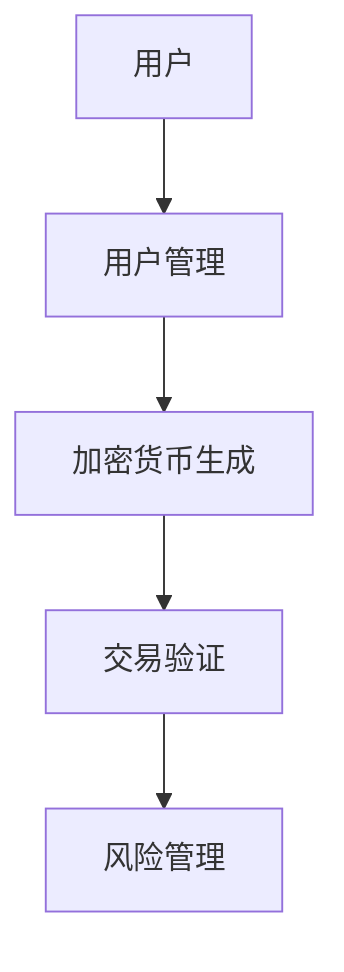

                 


# 巴菲特-芒格的量子加密货币投资：后量子时代的金融安全

> 关键词：巴菲特, 芒格, 量子加密货币, 后量子时代, 金融安全, 投资策略, 风险管理

> 摘要：本文探讨了巴菲特和芒格的投资理念在后量子时代的应用，特别是他们在量子加密货币领域的投资策略。文章分析了量子计算对现有加密算法的威胁，以及如何构建安全的量子-resistant加密货币。通过结合金融安全和量子计算的技术细节，本文为投资者提供了在后量子时代进行加密货币投资的深度分析和实战指导。

---

# 第1章: 量子计算与加密货币的背景介绍

## 1.1 量子计算的定义与原理

### 1.1.1 量子计算的基本概念

量子计算是一种利用量子力学原理进行计算的新型计算方式，其核心在于利用量子叠加和量子纠缠的特性，能够在某些特定问题上远超经典计算机的计算能力。

### 1.1.2 量子计算的核心原理

量子计算通过量子位（qubit）进行信息处理，每个量子位可以同时处于多个状态（量子叠加）。量子纠缠允许多个量子位之间形成强关联，从而实现并行计算。

### 1.1.3 量子计算与经典计算的主要区别

- 经典计算基于二进制位（bit），只能处于0或1；
- 量子计算基于量子位（qubit），可以处于0和1的叠加态；
- 量子计算在某些特定问题上具有指数级的加速能力。

## 1.2 加密货币的基础知识

### 1.2.1 加密货币的定义与特点

加密货币是一种基于密码学的数字货币，具有去中心化、匿名性和不可篡改等特点。

### 1.2.2 比特币与以太坊的原理

- 比特币采用区块链技术，通过哈希函数保证交易的安全性；
- 以太坊在比特币的基础上引入了智能合约，支持更复杂的去中心化应用。

### 1.2.3 加密货币的安全性与风险

- 安全性：依赖于密码算法的强度；
- 风险：包括市场波动、技术漏洞和监管风险。

## 1.3 巴菲特与芒格的投资理念

### 1.3.1 巴菲特的价值投资理论

巴菲特的价值投资强调长期持有优质资产，注重基本面分析和公司内在价值。

### 1.3.2 芒格的多元思维模型

芒格提倡通过跨学科的思维模型来理解复杂问题，强调独立思考和长期视角。

### 1.3.3 投资哲学与加密货币的结合

将巴菲特的长期价值投资和芒格的多元思维模型应用到加密货币领域，注重技术安全性和长期发展趋势。

## 1.4 后量子时代的金融安全挑战

### 1.4.1 量子计算对现有加密算法的威胁

现有的RSA和椭圆曲线加密算法在面对量子计算时将被破解，导致金融系统的安全性受到威胁。

### 1.4.2 后量子加密算法的发展趋势

NIST推荐的后量子加密算法（如 lattice-based 算法）将成为未来的主流。

### 1.4.3 金融安全的未来发展方向

金融系统需要逐步过渡到后量子加密算法，确保在后量子时代的安全性。

---

# 第2章: 量子加密货币的核心概念

## 2.1 量子加密货币的定义与特点

### 2.1.1 量子加密货币的定义

量子加密货币是基于量子-resistant算法的数字货币，能够抵御量子计算的攻击。

### 2.1.2 量子加密货币的核心特点

- 抗量子攻击；
- 分布式账本；
- 高度安全性。

### 2.1.3 量子加密货币与传统加密货币的对比

| 特性            | 传统加密货币 | 量子加密货币 |
|-----------------|---------------|---------------|
| 安全性          | 易受量子攻击  | 抗量子攻击     |
| 算法基础        | RSA, ECC      | Post-quantum  |
| 应用场景        | 传统金融      | 后量子金融     |

## 2.2 量子加密货币的数学模型

### 2.2.1 量子加密货币的数学基础

后量子加密算法基于数学难题，如格（lattice）、编码理论和多变量公钥加密。

### 2.2.2 量子加密货币的算法原理

使用NIST推荐的后量子加密算法，如NIST-Lattice-Based Cryptography。

### 2.2.3 量子加密货币的安全性分析

通过数学证明确保算法的安全性，抵御量子攻击。

## 2.3 量子加密货币的实现原理

### 2.3.1 量子加密货币的生成过程

通过后量子算法生成密钥和签名。

### 2.3.2 量子加密货币的交易流程

交易通过区块链进行，确保交易的不可篡改性和透明性。

### 2.3.3 量子加密货币的验证机制

利用后量子算法验证交易签名的有效性。

---

# 第3章: 量子加密货币的投资策略

## 3.1 巴菲特与芒格投资策略的量子视角

### 3.1.1 巴菲特的长期价值投资

注重长期持有优质资产，关注技术安全性和市场潜力。

### 3.1.2 芒格的多元思维模型

通过跨学科思维分析量子加密货币的技术和市场风险。

## 3.2 量子加密货币的市场分析

### 3.2.1 量子加密货币的市场现状

市场仍以传统加密货币为主，后量子加密货币逐渐兴起。

### 3.2.2 量子加密货币的市场趋势

随着量子计算的发展，后量子加密货币的需求将快速增长。

### 3.2.3 量子加密货币的市场风险

技术风险、市场波动和监管不确定性。

## 3.3 量子加密货币的投资组合管理

### 3.3.1 投资组合的构建原则

- 分散投资，降低风险；
- 选择具有抗量子攻击能力的加密货币；
- 关注技术发展和市场需求。

### 3.3.2 投资组合的风险控制

- 定期评估投资组合的安全性；
- 及时调整投资策略；
- 设置止损点。

### 3.3.3 投资组合的动态调整

根据市场和技术的发展，动态调整投资组合。

---

# 第4章: 量子加密货币的安全性与风险管理

## 4.1 量子加密货币的安全性分析

### 4.1.1 量子加密货币的安全性评估

通过数学证明和安全性审查，确保算法的安全性。

### 4.1.2 量子加密货币的安全性保障

采用多层安全措施，确保系统的抗量子攻击能力。

### 4.1.3 量子加密货币的安全性挑战

算法标准化、技术实现难度和市场接受度。

## 4.2 量子加密货币的风险管理

### 4.2.1 量子加密货币的主要风险

- 技术风险：算法被破解；
- 市场风险：价格波动；
- 运行风险：系统故障。

### 4.2.2 量子加密货币的风险识别

通过市场分析和技术评估，识别潜在风险。

### 4.2.3 量子加密货币的风险应对

- 技术风险：选择标准化的后量子算法；
- 市场风险：分散投资，降低波动影响；
- 运行风险：建立备用系统。

---

# 第5章: 后量子加密算法的技术实现

## 5.1 后量子加密算法的数学模型

### 5.1.1 NIST推荐的后量子算法

NIST推荐了四种后量子加密算法：NIST-Lattice-Based Cryptography。

### 5.1.2 后量子加密算法的数学公式

例如，格基加密（lattice-based cryptography）的数学模型：

$$ \text{加密：} c = s \cdot x + e $$
$$ \text{解密：} m = s \cdot y $$

其中，\( s \) 是秘密密钥，\( x \) 是明文，\( e \) 是噪声，\( y \) 是公钥。

## 5.2 后量子加密算法的实现

### 5.2.1 Python实现的后量子加密算法

```python
import numpy as np

def lattice_encrypt(public_key, plaintext):
    s, x, e = generate_keys(public_key)
    return s * x + e

def lattice_decrypt(secret_key, ciphertext):
    return secret_key * ciphertext
```

### 5.2.2 后量子加密算法的安全性验证

通过数学证明和安全性审查，确保算法的安全性。

---

# 第6章: 系统架构设计与实现

## 6.1 系统功能设计

### 6.1.1 系统功能模块

- 用户管理模块；
- 加密货币生成模块；
- 交易验证模块；
- 风险管理模块。

### 6.1.2 功能模块的交互流程

用户 -> 加密货币生成 -> 交易验证 -> 风险管理。

## 6.2 系统架构设计

### 6.2.1 系统架构图



### 6.2.2 接口设计

- 用户管理接口：`POST /api/users`
- 加密货币生成接口：`POST /api/crypto_generate`
- 交易验证接口：`POST /api/transaction_verify`
- 风险管理接口：`POST /api/risk_manage`

---

# 第7章: 项目实战与案例分析

## 7.1 项目实战

### 7.1.1 环境安装

安装必要的Python库，如`cryptography`和`mermaid`。

### 7.1.2 核心实现

实现后量子加密算法的生成和验证。

```python
def generate_quantum_signature(private_key):
    # 实现量子签名生成
    return signature

def verify_quantum_signature(public_key, signature):
    # 实现量子签名验证
    return True
```

## 7.2 案例分析

### 7.2.1 案例背景

假设一个金融系统需要过渡到后量子加密算法。

### 7.2.2 案例分析

通过实际案例分析，展示如何将现有系统迁移到后量子加密算法。

## 7.3 小结

通过实战项目，验证后量子加密算法的可行性和安全性。

---

# 第8章: 总结与展望

## 8.1 总结

本文探讨了巴菲特和芒格的投资理念在后量子时代的应用，分析了量子加密货币的技术和市场挑战，提出了投资策略和风险管理方法。

## 8.2 展望

随着量子计算的发展，后量子加密货币将逐步取代传统加密货币，成为金融安全的重要保障。

## 8.3 最佳实践 Tips

- 投资者应关注后量子加密算法的发展；
- 加强风险管理，降低投资风险；
- 密切关注监管动态，合规投资。

---

# 作者

作者：AI天才研究院/AI Genius Institute & 禅与计算机程序设计艺术/Zen And The Art of Computer Programming

