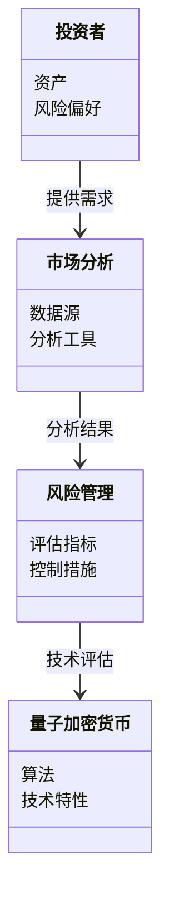
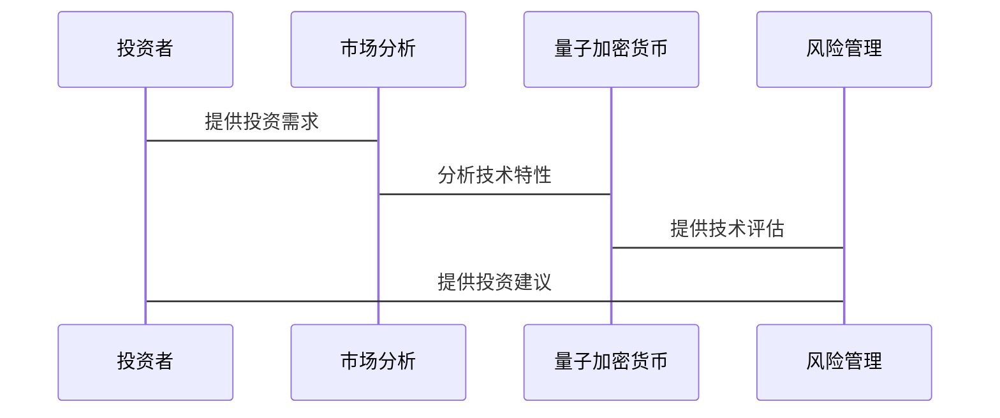

                 


# 巴菲特-芒格的量子加密货币投资：未来金融的安全基石

> **关键词**：巴菲特, 芒格, 量子加密货币, 投资策略, 系统架构设计, 风险管理, 金融安全

> **摘要**：  
本文探讨了巴菲特和芒格的投资理念如何与量子加密货币相结合，分析其在未来的投资潜力和安全优势。通过深入的技术分析和系统设计，展示了如何利用量子加密货币构建安全、可靠的金融体系。

---

## 第1章: 巴菲特与芒格的投资哲学

### 1.1 巴菲特的投资理念

#### 1.1.1 长期价值投资
巴菲特的长期价值投资理念强调选择具有持久竞争优势和良好管理的公司，长期持有以实现资本增值。其核心是寻找那些能够在市场波动中保持稳定的优质资产。

#### 1.1.2 投资策略
- **集中投资**：将资金集中在少数优质资产上，避免分散带来的风险。
- **安全边际**：确保投资价格低于其内在价值，以降低风险。

#### 1.1.3 成功案例
- **可口可乐案例**：巴菲特长期持有可口可乐，因其强大的品牌和市场地位，实现稳定收益。
- **苹果公司案例**：巴菲特旗下公司买入苹果股票，长期持有，获得丰厚回报。

### 1.2 芒格的多元思维模型

#### 1.2.1 多元思维模型
芒格提出“多元思维模型”概念，强调将多个学科的思维方式整合，形成全面的决策框架。

#### 1.2.2 多元思维模型的应用
- **跨学科分析**：通过物理学、心理学、经济学等多学科视角，全面评估投资标的。
- **决策框架**：在复杂问题中，使用多维度模型进行分析，避免单一视角的局限性。

#### 1.2.3 决策框架
- **决策过程**：通过多元思维模型，识别潜在风险和机会，制定最优决策。
- **案例分析**：通过具体案例，展示如何使用多元思维模型进行投资决策。

---

## 第2章: 量子加密货币的原理与技术基础

### 2.1 量子加密货币的定义

#### 2.1.1 量子加密货币的起源
量子加密货币是一种基于量子计算技术的加密货币，利用量子力学的特性，提供更高的安全性。

#### 2.1.2 量子加密货币的特点
- **安全性**：利用量子纠缠和叠加特性，增强加密强度。
- **去中心化**：采用区块链技术，确保交易的透明和不可篡改。

#### 2.1.3 量子加密货币的优势
- **抗量子攻击**：传统加密算法在量子计算机前脆弱，量子加密货币具备抗量子攻击能力。
- **高效性**：通过量子计算优化加密过程，提升交易速度和效率。

### 2.2 量子加密货币的技术基础

#### 2.2.1 量子计算的基本原理
量子计算利用量子比特（qubit）的叠加和纠缠特性，实现并行计算，远超经典计算机的性能。

#### 2.2.2 量子加密算法的实现
- **BB84协议**：用于密钥分发，确保通信的安全性。
- **EPR对**：利用量子纠缠实现远距离通信的加密。

#### 2.2.3 量子加密的安全性
- **安全性分析**：量子加密算法在理论上具备不可破解的特性，确保数据安全。
- **安全性挑战**：实际应用中，需防范侧信道攻击和设备缺陷。

---

## 第3章: 巴菲特-芒格投资理念与量子加密货币的结合

### 3.1 投资理念与量子加密货币的契合点

#### 3.1.1 长期价值投资与量子加密货币的稳定性
- **长期价值**：量子加密货币具备抗量子攻击的特性，长期来看具备投资价值。
- **稳定性分析**：通过技术成熟度和市场接受度，评估量子加密货币的稳定性。

#### 3.1.2 多元思维模型与量子加密货币的多样性
- **多样性分析**：利用多元思维模型，评估不同量子加密货币的技术优劣和市场前景。
- **风险管理**：通过多元分析，识别潜在风险，制定应对策略。

### 3.2 量子加密货币在投资中的应用

#### 3.2.1 投资策略的制定
- **目标设定**：确定投资目标，选择具有长期稳定性和高安全性的量子加密货币。
- **投资组合**：结合多元思维模型，构建多元化的量子加密货币投资组合。

#### 3.2.2 风险管理的实施
- **风险识别**：识别量子加密货币投资中的技术风险和市场风险。
- **风险控制**：通过分散投资和定期评估，降低投资风险。

---

## 第4章: 量子加密货币的投资策略与风险管理

### 4.1 投资策略的制定

#### 4.1.1 确定投资目标
- **长期投资**：选择具有长期增长潜力的量子加密货币。
- **短期投资**：根据市场波动，调整投资策略。

#### 4.1.2 制定投资计划
- **资产分配**：根据风险承受能力，分配投资比例。
- **投资时间表**：制定分阶段的投资计划，逐步进入市场。

#### 4.1.3 监测投资进展
- **定期评估**：定期检查投资组合的表现，及时调整策略。
- **市场动态**：关注市场动态和技术发展，确保投资决策的科学性。

### 4.2 风险管理的实施

#### 4.2.1 风险识别与评估
- **技术风险**：量子加密算法可能存在的漏洞或改进空间。
- **市场风险**：市场波动可能导致资产价格下跌。

#### 4.2.2 风险控制措施
- **分散投资**：通过投资多种量子加密货币，降低单一资产的风险。
- **止损机制**：设定止损点，避免重大损失。

#### 4.2.3 风险应对策略
- **动态调整**：根据市场变化，动态调整投资组合。
- **专业咨询**：借助专业团队，进行风险管理和投资决策。

---

## 第5章: 量子加密货币投资的系统架构设计

### 5.1 系统需求分析

#### 5.1.1 投资者需求
- **安全性**：确保投资资金的安全性。
- **透明性**：了解投资过程和结果。

#### 5.1.2 市场分析需求
- **数据收集**：收集市场数据，进行分析和预测。
- **趋势分析**：分析市场趋势，指导投资决策。

#### 5.1.3 风险管理需求
- **风险评估**：评估潜在风险，制定应对策略。
- **监控系统**：实时监控投资组合的风险。

### 5.2 系统功能设计

#### 5.2.1 领域模型（Mermaid 类图）


#### 5.2.2 系统架构设计（Mermaid 架构图）
```mermaid
archimate
架构 {
    定义: 定义系统的整体架构
    包括: 投资者、市场分析、风险管理模块
    关系: 各模块之间的交互和数据流
}
```

#### 5.2.3 系统接口设计
- **投资者接口**：提供投资需求和风险偏好的输入。
- **市场分析接口**：接收市场数据，输出分析结果。
- **风险管理接口**：根据分析结果，制定风险控制措施。

#### 5.2.4 系统交互（Mermaid 序列图）


### 5.3 系统实现

#### 5.3.1 环境安装
- **开发环境**：建议使用Python和相关框架进行开发。
- **工具安装**：安装数据分析和可视化工具，如Pandas、Matplotlib等。

#### 5.3.2 核心实现代码
```python
import pandas as pd
import numpy as np

def calculate_risk(assets, market_data):
    # 计算资产的风险值
    risk = pd.Series(index=assets, data={asset: np.std(market_data[asset]) for asset in assets})
    return risk

def generate_recommendation(risk, threshold=0.1):
    # 根据风险值生成投资建议
    recommendation = []
    for asset in risk.index:
        if risk[asset] < threshold:
            recommendation.append(asset)
    return recommendation

# 示例数据
assets = ['量子加密货币A', '量子加密货币B', '传统加密货币']
market_data = {
    '量子加密货币A': [0.05, 0.03, 0.04],
    '量子加密货币B': [0.06, 0.02, 0.05],
    '传统加密货币': [0.10, 0.08, 0.09]
}

# 计算风险
risk = calculate_risk(assets, market_data)
print("风险值:", risk)

# 生成推荐
recommendation = generate_recommendation(risk, 0.05)
print("推荐投资:", recommendation)
```

#### 5.3.3 代码解读
- **数据输入**：市场数据包括不同资产的历史价格数据。
- **风险计算**：使用标准差计算资产的风险值。
- **投资建议**：根据风险值和预设阈值，生成投资推荐。

---

## 第6章: 项目实战分析

### 6.1 项目背景
选择一家量子加密货币公司，分析其技术优势和市场前景。

### 6.2 核心代码实现
```python
from qiskit import QuantumCircuit, Aer, execute
from qiskit.visualization import plot_histogram

def quantum_algorithm(circuit_length=2):
    circuit = QuantumCircuit(circuit_length, circuit_length)
    circuit.h(range(circuit_length))
    circuit.measure(range(circuit_length), range(circuit_length))
    backend = Aer.get_backend('qasm_simulator')
    job = execute(circuit, backend)
    result = job.result()
    return result.get_counts()

# 执行算法
counts = quantum_algorithm()
print("执行结果:", counts)

# 可视化
plot_histogram(counts)
```

### 6.3 案例分析
分析该量子加密货币公司的技术实现和市场表现，评估其投资价值。

### 6.4 总结
通过实战项目，验证量子加密货币的投资潜力和风险管理策略的有效性。

---

## 第7章: 结论与展望

### 7.1 结论
巴菲特和芒格的投资理念与量子加密货币的结合，为未来的投资提供了新的方向。通过技术分析和系统设计，可以构建安全、可靠的量子加密货币投资体系。

### 7.2 未来展望
随着量子计算技术的发展，量子加密货币将在金融领域发挥越来越重要的作用。未来的研究方向包括进一步优化投资策略和提升系统的安全性。

---

## 附录

### 附录A: 量子加密货币相关术语表
- **量子比特（Qubit）**：量子计算机的基本单位。
- **量子叠加**：量子比特可以同时处于多个状态的特性。
- **量子纠缠**：两个或多个量子比特之间的特殊关联。

### 附录B: 参考文献
-巴菲特，格雷厄姆，等等。

---

**作者：AI天才研究院/AI Genius Institute & 禅与计算机程序设计艺术 /Zen And The Art of Computer Programming**

