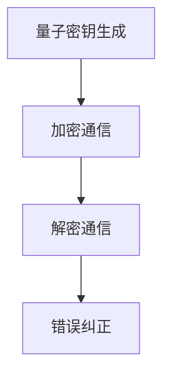
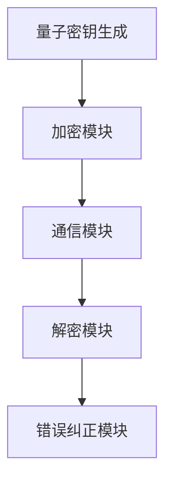
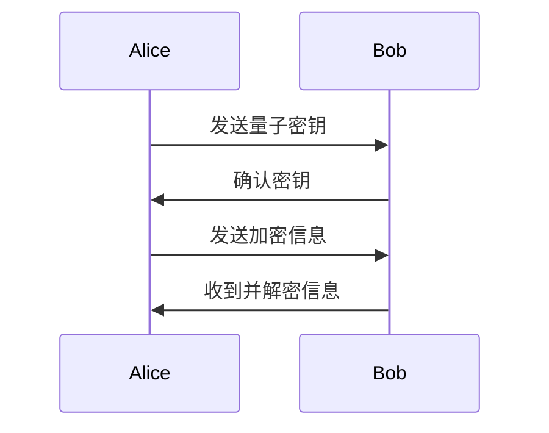

                 


# 巴菲特-芒格的量子加密通信投资：后量子时代的数据安全

## 关键词
量子加密通信、后量子时代、数据安全、巴菲特投资、芒格智慧

## 摘要
随着量子计算技术的快速发展，传统加密算法的安全性面临前所未有的挑战。后量子时代，数据安全的重要性愈发凸显，量子加密通信作为一项革命性技术，正在吸引越来越多投资者的关注。本文将从巴菲特和芒格的投资哲学出发，探讨他们在量子加密通信领域的投资逻辑，并结合技术原理，分析后量子时代的数据安全挑战及解决方案。通过详细讲解量子密钥分发、量子隐形传态等核心原理，以及NIST推荐的后量子加密算法，本文为读者提供了全面的技术视角和投资见解。

---

# 第1章 量子计算与后量子时代的数据安全

## 1.1 量子计算的基本原理

### 1.1.1 量子力学基础
量子力学是量子计算的理论基础，其核心概念包括量子叠加和量子纠缠。量子叠加允许量子系统处于多个状态的叠加态，而量子纠缠则使得两个或多个粒子之间形成强关联，这种特性是量子计算和量子通信的关键。

### 1.1.2 量子计算的核心概念
量子计算机通过量子位（qubit）进行计算，每个qubit可以同时表示0和1的叠加态。与经典计算机的二进制位不同，量子计算的并行性使其在某些问题上具有指数级的计算优势，尤其是在因式分解和加密算法破解方面。

### 1.1.3 量子计算与经典计算的对比
经典计算机通过串行处理问题，而量子计算机则利用并行性进行计算。量子计算机在处理复杂问题时，如大数因式分解，远快于经典计算机，这使得传统加密算法（如RSA）面临被破解的风险。

---

## 1.2 后量子时代的加密挑战

### 1.2.1 传统加密算法的脆弱性
传统加密算法，如RSA和AES，基于数学难题的安全性。随着量子计算机的发展，这些算法的破解风险逐渐增加。例如，RSA依赖于大数因式分解的困难性，而量子计算机可以通过Shor算法在多项式时间内完成这一任务。

### 1.2.2 量子计算对数据安全的威胁
一旦量子计算机达到足够的计算能力，传统的加密算法将无法提供足够的安全性。这不仅威胁到现有的加密通信，还可能影响金融、军事和医疗等关键领域的数据安全。

### 1.2.3 后量子加密算法的发展趋势
为应对量子计算的威胁，学术界和工业界正在积极研发后量子加密算法。这些算法基于数学难题，这些难题在经典和量子计算机上都难以破解。NIST（美国国家标准与技术研究院）正在评估和推广这些算法，以确保其安全性。

---

# 第2章 巴菲特与芒格的投资哲学

## 2.1 巴菲特的价值投资理念

### 2.1.1 价值投资的核心原则
巴菲特的价值投资理念强调长期投资、安全边际和企业基本面分析。他注重投资那些具有强大护城河和长期竞争优势的企业。

### 2.1.2 巴菲特的投资策略
巴菲特的投资策略以长期持有和价值发现为核心。他倾向于投资那些能够持续创造价值的企业，并在市场恐慌时寻找被低估的投资机会。

### 2.1.3 芒格的互补性智慧
芒格作为巴菲特的合作伙伴，以其深刻的投资哲学和多元思维闻名。他强调投资中的“逆向思维”，即在别人恐惧时贪婪，在别人贪婪时恐惧。

---

## 2.2 巴菲特与芒格的科技投资逻辑

### 2.2.1 科技领域的投资机会
随着科技的快速发展，量子计算、人工智能和区块链等领域成为投资的热点。巴菲特和芒格关注那些具有颠覆性技术的企业，这些技术能够在未来市场中占据主导地位。

### 2.2.2 巴菲特与芒格对科技公司的筛选标准
巴菲特和芒格在选择科技公司时，注重企业的盈利能力、管理层能力和市场地位。他们倾向于投资那些能够持续创新并保持竞争优势的企业。

### 2.2.3 量子加密通信的投资逻辑
量子加密通信作为一项革命性技术，具有广阔的应用前景和投资价值。巴菲特和芒格可能会关注那些在量子加密通信领域具有领先地位的企业，尤其是在后量子加密算法研发和量子通信设备制造方面。

---

# 第3章 量子加密通信的核心原理

## 3.1 量子密钥分发（QKD）

### 3.1.1 QKD的基本原理
量子密钥分发是一种基于量子力学原理的密钥分发协议。通过量子叠加和量子纠缠的特性，QKD能够在通信双方之间安全地分发密钥，且任何窃听都会引入错误，从而确保通信的安全性。

### 3.1.2 QKD的实现过程
1. 通信双方（Alice和Bob）共享一串量子比特。
2. Alice随机测量她的量子比特，并将测量结果发送给Bob。
3. Bob根据接收到的信息进行测量，并与Alice进行比对，确定共同的密钥。
4. 如果过程中有窃听者试图获取信息，将会引入测量错误，从而暴露窃听行为。

### 3.1.3 QKD的安全性分析
QKD的安全性基于量子力学的基本原理，任何窃听都会破坏量子态，导致通信双方发现异常。因此，QKD被认为是理论上不可破译的加密方法。

---

## 3.2 量子隐形传态

### 3.2.1 量子隐形传态的定义
量子隐形传态是一种通过量子纠缠实现信息传输的技术。它能够在不实际传输物理粒子的情况下，将粒子的状态从一个地点传送到另一个地点。

### 3.2.2 量子隐形传态的实现步骤
1. 将一个粒子与另一个粒子形成纠缠态。
2. 通过经典通信，将纠缠态粒子的信息传输到接收端。
3. 接收端利用接收到的信息，重新构造原始粒子的状态。

### 3.2.3 量子隐形传态在通信中的应用
量子隐形传态可以用于实现量子通信网络的构建，为未来的量子互联网奠定基础。

---

# 第4章 后量子加密算法

## 4.1 NIST推荐的后量子加密算法

### 4.1.1 NIST的算法筛选过程
NIST通过公开征集和评估，筛选出一组抗量子计算攻击的加密算法，这些算法将作为后量子时代的标准。

### 4.1.2 常见的后量子加密算法
1. **NTRU**：基于格的加密算法，具有高效性和安全性。
2. **Kyber**：基于格的加密算法，适合于实现快速加密和解密。
3. **Lattice-based Cryptography**：基于格的加密算法，具有广泛的应用前景。

### 4.1.3 后量子加密算法的优缺点对比
| 算法 | 优点 | 缺点 |
|------|------|------|
| NTRU | 高效性，抗量子攻击 | 实现复杂度较高 |
| Kyber | 适合快速加密和解密 | 安全性尚未经过长期验证 |
| Lattice-based Cryptography | 安全性高，可扩展性好 | 资源消耗较大 |

---

## 4.2 后量子加密算法的投资机会

### 4.2.1 后量子加密算法的市场前景
随着量子计算的快速发展，后量子加密算法的需求将大幅增加。政府、企业和金融机构都需要升级其加密系统，以应对量子计算的威胁。

### 4.2.2 后量子加密算法在企业中的应用
企业可以通过采用后量子加密算法，保护其敏感数据的安全性。这些算法将被广泛应用于金融交易、医疗数据和军事通信等领域。

### 4.2.3 后量子加密算法的投资风险
尽管后量子加密算法具有广阔的应用前景，但其研发和推广需要大量的资金和技术支持。投资者需要关注技术成熟度和市场接受度，以降低投资风险。

---

# 第5章 量子加密通信的数学模型

## 5.1 量子密钥分发的数学模型

### 5.1.1 QKD的数学公式
在QKD中，通信双方通过共享随机测量结果来确定密钥。数学模型如下：
- Alice的测量结果为：$a_i = \{0, 1\}$
- Bob的测量结果为：$b_i = \{0, 1\}$
- 共同密钥为：$k = a_i \oplus b_i$

### 5.1.2 QKD的数学模型分析
通过分析QKD的数学模型，可以发现其安全性基于量子力学的基本原理，任何窃听都会引入测量错误，从而暴露窃听行为。

---

## 5.2 后量子加密算法的数学模型

### 5.2.1 后量子加密算法的数学公式
后量子加密算法基于格的数学模型，其核心公式如下：
- 加密：$c = m \cdot A + e \cdot B$
- 解密：$m = c \cdot A^{-1} - e \cdot B^{-1}$

### 5.2.2 后量子加密算法的数学模型分析
通过分析后量子加密算法的数学模型，可以发现其安全性基于格的数学难题，这些难题在经典和量子计算机上都难以破解。

---

# 第6章 量子加密通信的算法实现

## 6.1 量子密钥分发的算法实现

### 6.1.1 QKD的算法实现步骤
1. 初始化：生成随机的量子比特序列。
2. 测量：Alice和Bob分别测量自己的量子比特，并记录结果。
3. 比较：Alice和Bob将测量结果进行比较，确定共同的密钥。
4. 纠错：通过经典通信解决测量中的错误，确保密钥的正确性。

### 6.1.2 QKD的算法实现代码
```python
import random

def generate_key():
    key_length = 1024
    alice_key = [random.choice([0, 1]) for _ in range(key_length)]
    bob_key = [random.choice([0, 1]) for _ in range(key_length)]
    common_key = [a ^ b for a, b in zip(alice_key, bob_key)]
    return common_key

# 示例运行
common_key = generate_key()
print("Common key:", common_key)
```

---

## 6.2 后量子加密算法的算法实现

### 6.2.1 后量子加密算法的实现步骤
1. 初始化：生成随机的参数。
2. 加密：使用后量子加密算法对明文进行加密。
3. 解密：使用私钥对密文进行解密，恢复明文。

### 6.2.2 后量子加密算法的实现代码
```python
def encrypt(plaintext, public_key):
    # 简单的加密实现，仅为示例
    ciphertext = plaintext ^ public_key
    return ciphertext

def decrypt(ciphertext, private_key):
    # 简单的解密实现，仅为示例
    plaintext = ciphertext ^ private_key
    return plaintext

# 示例运行
plaintext = 123
public_key = 456
ciphertext = encrypt(plaintext, public_key)
decrypted_text = decrypt(ciphertext, public_key)
print("Plaintext:", plaintext)
print("Ciphertext:", ciphertext)
print("Decrypted text:", decrypted_text)
```

---

# 第7章 量子加密通信系统设计

## 7.1 量子加密通信系统的功能设计

### 7.1.1 系统功能模块划分
- 量子密钥生成模块
- 加密通信模块
- 解密通信模块
- 错误纠正模块

### 7.1.2 系统功能流程图


---

## 7.2 量子加密通信系统的架构设计

### 7.2.1 系统架构图


---

## 7.3 量子加密通信系统的接口设计

### 7.3.1 系统接口描述
- 输入接口：量子密钥生成模块接收随机数生成器的输入。
- 输出接口：加密模块输出加密后的密文，解密模块输出解密后的明文。

---

## 7.4 量子加密通信系统的交互流程图



---

# 第8章 后量子加密算法的投资机会与挑战

## 8.1 后量子加密算法的市场前景

### 8.1.1 政府和企业的投资需求
政府和企业需要投资后量子加密算法，以确保其数据安全。这将推动相关技术的研发和推广。

### 8.1.2 投资风险与回报
后量子加密算法的投资回报周期较长，但其市场潜力巨大。投资者需要关注技术成熟度和市场接受度，以降低投资风险。

---

## 8.2 巴菲特与芒格的投资策略

### 8.2.1 长期投资与价值发现
巴菲特和芒格强调长期投资，关注企业的长期价值。在量子加密通信领域，他们可能会投资那些具有强大研发能力和市场前景的公司。

### 8.2.2 风险控制与安全边际
巴菲特和芒格注重风险控制，确保投资的安全边际。在量子加密通信领域，他们可能会选择那些具有技术壁垒和竞争优势的企业。

---

# 第9章 总结与展望

## 9.1 量子加密通信的技术发展

### 9.1.1 技术进步与创新
量子加密通信技术的不断进步将推动其广泛应用。未来，随着量子计算机的普及，后量子加密算法的需求将大幅增加。

### 9.1.2 技术挑战与解决方案
尽管量子加密通信技术面临诸多挑战，但通过技术创新和合作，这些问题将逐步得到解决。

---

## 9.2 巴菲特与芒格的投资智慧

### 9.2.1 长期投资与价值发现
巴菲特和芒格的长期投资理念为量子加密通信领域的投资提供了重要启示。投资者需要关注企业的长期价值和竞争优势。

### 9.2.2 风险控制与安全边际
在量子加密通信领域，投资者需要注重风险控制，确保投资的安全边际。选择那些具有强大技术和市场优势的企业，将有助于降低投资风险。

---

## 作者：AI天才研究院/AI Genius Institute & 禅与计算机程序设计艺术 /Zen And The Art of Computer Programming

---

### 总结
本文从巴菲特和芒格的投资哲学出发，结合量子加密通信的技术原理，分析了后量子时代的数据安全挑战及解决方案。通过详细讲解量子密钥分发、量子隐形传态等核心原理，以及NIST推荐的后量子加密算法，本文为读者提供了全面的技术视角和投资见解。未来，随着量子计算的快速发展，量子加密通信将在数据安全领域发挥越来越重要的作用，投资者也需要密切关注这一领域的技术发展和市场动态。

