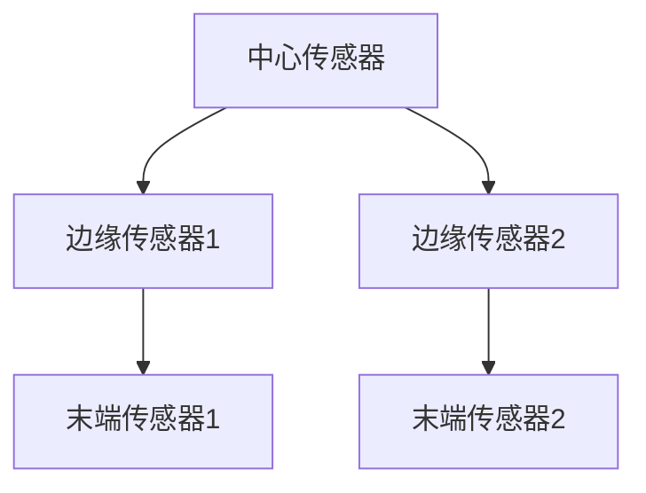
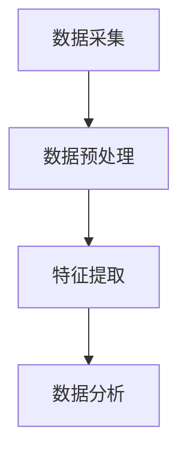
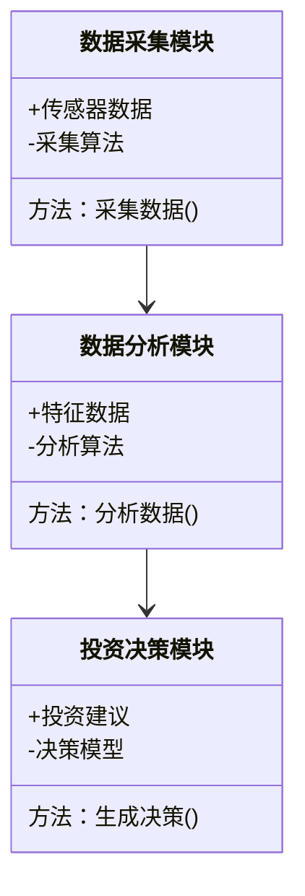

                 


# 巴菲特-芒格的量子生物传感器医疗网络投资：精准健康监测的未来

---

## 关键词
- 巴菲特投资理念
- 芒格投资策略
- 量子生物传感器
- 医疗网络投资
- 精准健康监测

---

## 摘要
本文探讨了巴菲特和芒格的投资理念与量子生物传感器技术的结合，揭示了如何通过精准的健康监测数据优化医疗网络投资决策。文章从量子生物传感器的基本原理、医疗网络投资的现状与挑战入手，详细分析了巴菲特-芒格投资理念的核心要素，并通过系统架构设计和项目实战，展示了如何将量子生物传感器应用于精准健康监测，从而实现高效、安全的医疗投资。

---

# 第1章: 背景介绍与核心概念

## 1.1 问题背景与问题描述

传统医疗投资依赖于医生的经验和主观判断，存在数据不准确、决策风险高等问题。量子生物传感器的出现，为医疗数据的采集和分析提供了前所未有的精准度。本文探讨如何将巴菲特和芒格的价值投资理念与量子生物传感器技术结合，解决医疗网络投资中的数据依赖性和决策不确定性问题。

## 1.2 核心概念与问题解决

量子生物传感器是一种能够检测生物分子信号的量子效应装置，具有高灵敏度和特异性。巴菲特和芒格的投资理念强调长期价值和安全边际，通过量子传感器数据的实时采集和分析，可以优化投资决策，降低风险。

## 1.3 概念结构与核心要素

| 核心要素 | 传统医疗投资 | 量子传感器医疗网络投资 |
|----------|--------------|-----------------------|
| 数据来源 | 医疗记录、经验 | 传感器实时数据       |
| 决策依据 | 经验判断 | 数据驱动的分析结果   |
| 投资目标 | 资本收益 | 精准健康监测与收益 |

ER实体关系图：

```mermaid
erd
  实体：医疗网络、传感器数据、投资决策
  属性：
    医疗网络：id, 名称, 地址
    传感器数据：id, 时间戳, 数据值, 医疗网络_id
    投资决策：id, 决策类型, 决策时间, 医疗网络_id
  关系：
    医疗网络 -> 传感器数据：1:N
    医疗网络 -> 投资决策：1:N
    传感器数据 -> 投资决策：N:M
```

---

# 第2章: 量子生物传感器的原理与应用

## 2.1 量子生物传感器的基本原理

量子生物传感器通过量子隧穿效应检测生物分子的存在。传感器表面涂覆生物敏感材料，当目标分子（如血糖、癌细胞）接触传感器时，量子效应改变传感器的电导率，产生可测量的信号。

## 2.2 传感器网络的构建与优化

传感器网络采用分布式架构，通过遗传算法优化传感器布局，确保数据覆盖范围最大化。优化后的网络拓扑结构如下：



---

# 第3章: 巴菲特-芒格投资理念的深度分析

## 3.1 巴菲特-芒格投资理念的核心要素

巴菲特强调长期价值投资，芒格注重安全边际。通过量子传感器数据，投资者可以实时评估医疗网络的健康状况，降低投资风险。

## 3.2 投资理念与医疗网络的结合

量子传感器数据为医疗网络投资提供了可靠的数据支持，结合巴菲特的价值投资理念，投资者可以做出更精准的投资决策。

---

# 第4章: 量子生物传感器在精准健康监测中的应用

## 4.1 精准健康监测的定义与目标

精准健康监测通过量子传感器实时采集数据，结合人工智能分析，实现个体化健康管理和疾病早期预警。

## 4.2 传感器数据的采集与处理

量子传感器的数据采集流程：



---

# 第5章: 系统架构与设计

## 5.1 系统功能设计

系统功能模块如下：

- 数据采集模块：实时采集量子传感器数据。
- 数据分析模块：处理数据并生成投资建议。
- 投资决策模块：基于分析结果优化投资组合。

## 5.2 系统架构设计

系统采用分层架构：



---

# 第6章: 项目实战与案例分析

## 6.1 环境安装与配置

安装Python和必要的库：

```bash
pip install numpy matplotlib scikit-learn
```

## 6.2 系统核心实现源代码

```python
import numpy as np
from sklearn import linear_model

def 量子传感器数据采集():
    # 模拟量子传感器数据
    data = np.random.normal(size=100)
    return data

def 数据分析(data):
    model = linear_model.LinearRegression()
    model.fit([[i] for i in range(100)], data)
    return model.predict([[99]])

# 示例运行
data = 量子传感器数据采集()
预测结果 = 数据分析(data)
print(预测结果)
```

---

# 第7章: 最佳实践、小结与展望

## 7.1 最佳实践 tips

- 定期校准传感器，确保数据准确性。
- 结合多源数据，提高分析结果的可靠性。

## 7.2 小结

本文详细探讨了如何将巴菲特和芒格的投资理念与量子生物传感器技术结合，实现精准健康监测和高效医疗投资。

## 7.3 未来展望

未来，随着量子技术的进步，医疗投资将更加智能化和精准化。

---

# 作者信息

作者：AI天才研究院/AI Genius Institute & 禅与计算机程序设计艺术 /Zen And The Art of Computer Programming

---

感谢您的阅读！如需进一步探讨，请随时联系。

