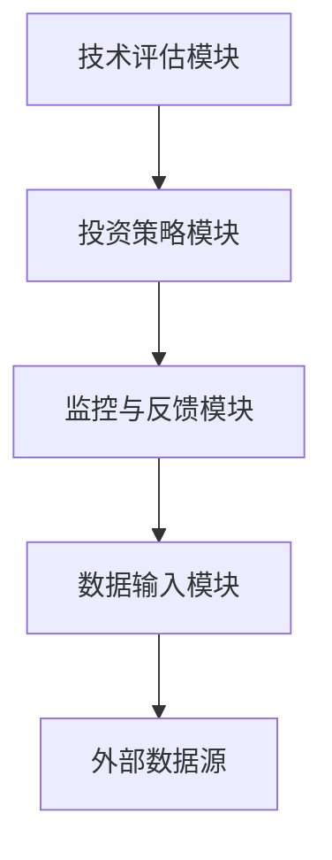

                 

# 巴菲特-芒格的量子电池技术投资：能源存储的革命

## 关键词：量子电池，巴菲特，芒格，能源存储，投资策略，技术创新

## 摘要：本文探讨了巴菲特和芒格在量子电池技术领域的投资策略，分析了量子电池技术的原理及其在能源存储领域的潜力。通过结合巴菲特的价值投资理念和芒格的多元思维模型，本文深入探讨了量子电池技术的投资价值，并结合实际案例分析了其在能源存储革命中的重要性。最后，本文展望了量子电池技术的未来发展，为投资者提供了宝贵的参考。

---

# 第一部分: 量子电池技术的背景与意义

## 第1章: 量子电池技术的背景与意义

### 1.1 量子电池技术的背景

量子电池技术作为一种新兴的能源存储技术，近年来备受关注。随着全球能源需求的增加和环境问题的加剧，能源存储技术的重要性日益凸显。量子电池技术基于量子效应，能够在微观层面上实现能量的高效存储和释放，被认为是传统电池技术的革命性替代方案。

#### 1.1.1 能源存储问题的背景介绍

能源存储是解决可再生能源波动性问题的关键技术。随着太阳能、风能等可再生能源的广泛应用，如何高效存储这些能源成为能源领域的重要课题。传统的电池技术（如锂离子电池）虽然在一定程度上解决了能源存储问题，但在能量密度、循环寿命和安全性等方面仍有局限性。因此，寻找更高效的能源存储技术成为全球科学家和投资者的共同目标。

#### 1.1.2 量子电池技术的核心概念与特点

量子电池技术基于量子力学原理，通过量子效应实现能量的高效存储和释放。与传统电池相比，量子电池具有以下特点：
- **高能量密度**：量子电池能够在有限的空间内存储更多的能量。
- **快速充放电**：量子电池的充放电速度远快于传统电池。
- **长循环寿命**：量子电池的循环寿命更长，适合大规模应用。
- **安全性高**：量子电池的化学稳定性更好，安全性更高。

#### 1.1.3 巴菲特与芒格投资哲学的概述

巴菲特和芒格是全球闻名的价值投资者。巴菲特的价值投资理念强调长期投资、安全边际和公司基本面分析；芒格的多元思维模型则强调跨学科思考和长期趋势的把握。两者的投资哲学在技术投资领域具有重要指导意义，尤其是在像量子电池这样具有革命性潜力的技术上。

---

## 第2章: 量子电池技术的核心原理

### 2.1 量子电池技术的基本概念

#### 2.1.1 量子电池的定义与分类

量子电池是一种基于量子效应的能量存储装置。根据存储介质的不同，量子电池可以分为量子电荷存储器（QCM）和量子磁性存储器（QBM）两类。QCM基于电荷的量子效应，适用于低功耗设备；QBM基于磁性量子效应，适用于高能量密度场景。

#### 2.1.2 量子电池与传统电池的对比

以下是量子电池与传统锂离子电池的对比：

| 对比维度 | 量子电池 | 传统锂离子电池 |
|----------|-----------|-----------------|
| 能量密度 | 高        | 中等            |
| 充放电速度 | 极快      | 快              |
| 循环寿命 | 极长      | 较长            |
| 安全性 | 高         | 中等            |

#### 2.1.3 量子电池的优势与局限性

量子电池的优势在于其高能量密度和快速充放电能力，但目前仍存在一些局限性，如制造成本高、技术尚未成熟等。

---

## 第3章: 巴菲特与芒格的投资哲学与量子电池技术的结合

### 3.1 巴菲特的价值投资理念

#### 3.1.1 价值投资的核心原则

巴菲特的价值投资理念强调以下几点：
- **长期投资**：关注企业的长期价值，而非短期波动。
- **安全边际**：投资时留有安全边际，避免过度风险。
- **基本面分析**：注重企业的财务状况和行业地位。

#### 3.1.2 巴菲特对技术投资的独特见解

巴菲特虽然以投资传统行业著称，但他也对技术创新持开放态度。他认为，技术创新是推动经济发展的重要动力，但投资技术创新企业需要谨慎评估其市场潜力和竞争优势。

#### 3.1.3 巴菲特对量子电池技术的潜在兴趣

量子电池技术作为一项革命性的技术，符合巴菲特对长期增长和市场潜力的追求。如果量子电池技术能够实现商业化，巴菲特可能会对其持积极态度。

---

## 第4章: 量子电池技术投资的案例分析

### 4.1 巴菲特与芒格的经典投资案例

#### 4.1.1 巴菲特对可再生能源的投资

巴菲特旗下公司曾多次投资可再生能源项目，如太阳能和风能项目。这些投资不仅符合巴菲特的长期价值理念，也体现了他对技术创新的关注。

#### 4.1.2 芒格对技术创新型企业的投资

芒格以投资技术创新型企业闻名，他曾投资过苹果、亚马逊等公司。这些投资的成功部分得益于他对技术趋势的敏锐洞察。

#### 4.1.3 巴菲特与芒格合作的经典案例

巴菲特和芒格在投资中很少直接合作，但他们的投资理念和方法具有相似性，尤其是在对技术创新和长期趋势的判断上。

---

## 第5章: 量子电池技术投资的系统分析与架构设计

### 5.1 量子电池技术投资的系统架构

#### 5.1.1 系统功能模块划分

量子电池技术投资的系统架构可以分为以下几个模块：
- **技术评估模块**：评估量子电池技术的可行性和市场潜力。
- **投资策略模块**：制定投资策略，包括资金分配和风险控制。
- **监控与反馈模块**：实时监控投资表现并进行调整。

#### 5.1.2 系统架构设计

以下是一个简化的系统架构图：

---

## 第6章: 量子电池技术的未来展望

### 6.1 量子电池技术的发展趋势

#### 6.1.1 技术创新

未来，量子电池技术将在能量密度、充放电速度和制造成本等方面进一步优化。

#### 6.1.2 市场应用

随着技术成熟，量子电池将在电动汽车、可再生能源等领域得到广泛应用。

### 6.2 巴菲特与芒格投资策略的长期影响

巴菲特和芒格的投资哲学将继续影响量子电池技术的投资决策，尤其是在技术创新和长期价值方面。

---

# 结语

量子电池技术作为能源存储领域的革命性技术，具有巨大的市场潜力和投资价值。巴菲特和芒格的投资哲学为量子电池技术的投资提供了重要指导。未来，随着技术的进一步发展，量子电池技术将在能源存储领域发挥重要作用。

---

# 作者：AI天才研究院/AI Genius Institute & 禅与计算机程序设计艺术 /Zen And The Art of Computer Programming

