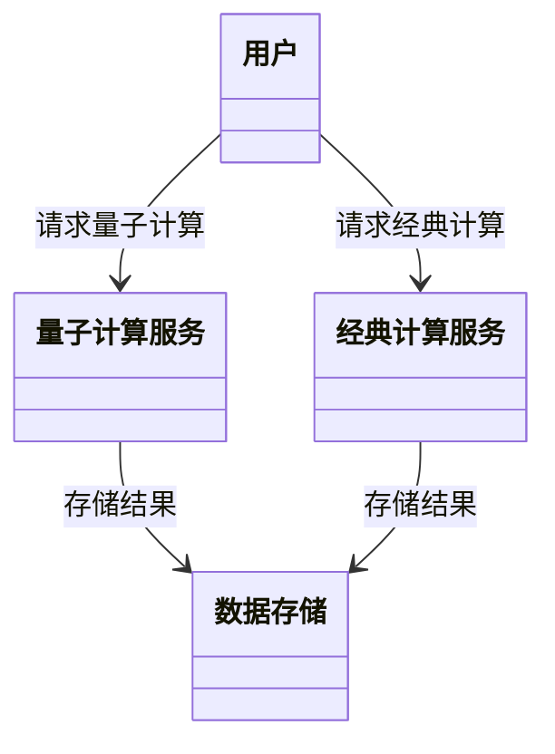
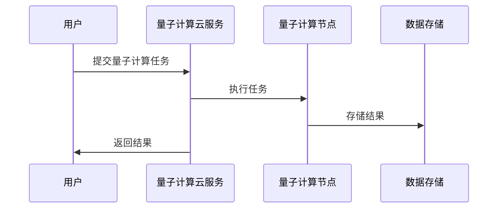

                 

# 巴菲特-芒格的量子计算云服务投资：计算能力民主化

> **关键词**：量子计算、云服务、巴菲特、芒格、投资、计算能力民主化

> **摘要**：  
本文探讨了巴菲特和芒格的投资理念在量子计算云服务领域的应用，分析了量子计算的基本原理、云服务的架构实现以及两者结合的商业模式。通过详细的技术分析和实际案例，本文阐述了量子计算云服务如何实现计算能力的民主化，以及如何通过投资策略推动这一技术的普及与发展。

---

# 第1章：量子计算与云服务的背景介绍

## 1.1 量子计算的基本概念

### 1.1.1 量子计算的定义  
量子计算是一种基于量子力学原理的计算方式，利用量子位（qubit）进行信息处理。与经典计算机的二进制位（bit）不同，量子位可以同时处于多个状态的叠加态，从而在某些特定问题上实现指数级的计算速度。

### 1.1.2 量子计算的核心原理  
量子计算的核心原理包括量子叠加（superposition）、量子纠缠（entanglement）和量子测量（measurement）。这些原理使得量子计算机在处理复杂问题时具有显著优势。

### 1.1.3 量子计算与经典计算的对比  
量子计算在某些特定任务（如大数分解、优化问题）上远超经典计算机，但在通用性方面仍存在局限性。

## 1.2 云服务的定义与特点

### 1.2.1 云服务的定义  
云服务是一种通过互联网提供计算资源（如计算能力、存储、网络）的模式，用户按需付费，无需自建基础设施。

### 1.2.2 云服务的主要模式  
包括IaaS（基础设施即服务）、PaaS（平台即服务）和SaaS（软件即服务）。

### 1.2.3 云服务的优势与挑战  
优势包括灵活性高、成本低、资源利用率高；挑战包括安全性问题、依赖网络和供应商锁定。

## 1.3 量子计算云服务的背景

### 1.3.1 量子计算技术的发展历程  
从理论研究到实验实现，量子计算技术逐步成熟。

### 1.3.2 云服务在量子计算中的作用  
通过云服务，用户可以按需使用量子计算资源，无需具备专业知识和设备。

### 1.3.3 量子计算云服务的现状与趋势  
目前，量子计算云服务仍处于早期阶段，但随着技术进步，其应用前景广阔。

## 1.4 巴菲特与芒格的投资理念

### 1.4.1 巴菲特的价值投资理论  
巴菲特的价值投资理论强调长期稳健的回报，注重企业的基本面和内在价值。

### 1.4.2 芒格的多元思维模型  
芒格提倡通过多学科思维模型来分析问题，避免单一视角的局限性。

### 1.4.3 投资理念与量子计算的结合  
巴菲特和芒格的投资理念为量子计算云服务的商业化提供了理论支持，强调长期价值和多元化布局。

## 1.5 本章小结  
本章介绍了量子计算和云服务的基本概念，分析了量子计算云服务的发展背景，并探讨了巴菲特和芒格投资理念在其中的应用。

---

# 第2章：量子计算云服务的核心概念

## 2.1 量子计算的核心原理

### 2.1.1 量子位的基本概念  
量子位是量子计算的基本单位，可以处于叠加态和纠缠态。

### 2.1.2 量子叠加与量子纠缠  
量子叠加允许量子位同时处于多个状态，而量子纠缠则允许多个量子位之间形成强关联。

### 2.1.3 量子计算的算法原理  
量子算法（如Shor算法和Grover算法）展示了量子计算在特定问题上的巨大优势。

## 2.2 云服务的架构与实现

### 2.2.1 云计算的基本架构  
云计算通常包括前端（用户）和后端（计算资源）两部分，通过API进行交互。

### 2.2.2 云服务的资源分配与调度  
云计算平台通过虚拟化技术动态分配计算资源，确保资源利用率最大化。

### 2.2.3 云服务的安全性与可靠性  
通过加密技术和冗余设计，云服务可以提高数据的安全性和系统的可靠性。

## 2.3 量子计算云服务的实现

### 2.3.1 量子计算云服务的定义  
量子计算云服务是通过互联网提供量子计算资源的服务模式。

### 2.3.2 量子计算云服务的实现方式  
包括硬件即服务（HaaS）和算法即服务（AaaS）两种模式。

### 2.3.3 量子计算云服务的优势与劣势  
优势：降低使用门槛，提高资源利用率；劣势：技术成熟度低，成本较高。

## 2.4 核心概念的联系与对比

### 2.4.1 量子计算与云服务的关系  
量子计算云服务将量子计算技术与云服务模式结合，形成新的计算范式。

### 2.4.2 量子计算云服务与传统计算的对比  
量子计算云服务在某些任务上具有指数级优势，但在通用性上仍需提升。

### 2.4.3 量子计算云服务的未来发展方向  
未来，量子计算云服务将朝着标准化、智能化和应用多样化方向发展。

## 2.5 本章小结  
本章详细阐述了量子计算和云服务的核心概念，并分析了两者结合的量子计算云服务的特点和发展方向。

---

# 第3章：量子计算云服务的算法原理

## 3.1 量子算法的基本原理

### 3.1.1 量子算法的定义  
量子算法是利用量子计算机的特性和原理设计的算法。

### 3.1.2 量子算法的核心思想  
量子算法通过叠加和纠缠的特性，大幅减少计算步骤。

### 3.1.3 量子算法与经典算法的对比  
量子算法在特定问题上具有显著优势，但在通用性上不如经典算法。

## 3.2 量子计算云服务中的算法实现

### 3.2.1 Shor算法的实现  
Shor算法用于大数分解，是量子计算的经典应用之一。

### 3.2.2 Grover算法的实现  
Grover算法用于无序数据库的搜索，展示了量子加速的优势。

### 3.2.3 量子傅里叶变换的实现  
量子傅里叶变换是许多量子算法的核心组件。

## 3.3 量子算法的数学模型

### 3.3.1 Shor算法的数学模型  
Shor算法利用量子傅里叶变换实现大数分解，其数学模型涉及模运算和周期性。

### 3.3.2 Grover算法的数学模型  
Grover算法通过构造反射操作在搜索空间中加速搜索过程。

## 3.4 本章小结  
本章通过具体算法的实现，展示了量子计算云服务在算法层面的优势和复杂性。

---

# 第4章：量子计算云服务的系统架构

## 4.1 系统功能设计

### 4.1.1 领域模型类图  
以下是一个简单的领域模型类图：

### 4.1.2 系统架构图  
以下是一个量子计算云服务的系统架构图：

### 4.1.3 接口设计  
量子计算云服务提供以下接口：
- 提交量子计算任务接口
- 获取计算结果接口
- 计算资源管理接口

### 4.1.4 系统交互序列图  
以下是一个用户使用量子计算云服务的交互序列图：

## 4.2 本章小结  
本章通过系统架构的分析，展示了量子计算云服务的技术实现和系统设计。

---

# 第5章：量子计算云服务的投资策略

## 5.1 巴菲特和芒格的投资理念

### 5.1.1 巴菲特的价值投资理论  
巴菲特注重企业的长期价值和内在价值，追求稳定的回报。

### 5.1.2 芒格的多元思维模型  
芒格强调跨学科思维，避免单一视角的局限性。

### 5.1.3 投资理念与量子计算的结合  
通过长期投资和多元化布局，巴菲特和芒格的理念为量子计算云服务的投资提供了指导。

## 5.2 量子计算云服务的投资价值

### 5.2.1 量子计算的技术潜力  
量子计算在特定领域的应用前景广阔。

### 5.2.2 云服务的商业模式  
通过按需付费的模式，量子计算云服务具有较高的市场潜力。

### 5.2.3 行业竞争格局  
目前，量子计算云服务市场尚处于起步阶段，具有较大的发展空间。

## 5.3 投资策略与风险管理

### 5.3.1 长期投资策略  
注重企业的长期价值，避免短期波动。

### 5.3.2 风险管理策略  
通过多元化投资和风险分散，降低投资风险。

## 5.4 本章小结  
本章从投资角度分析了量子计算云服务的潜力和风险，并提出了相应的投资策略。

---

# 第6章：量子计算云服务的未来展望

## 6.1 技术发展的趋势

### 6.1.1 量子计算的标准化  
未来，量子计算将朝着标准化方向发展，便于广泛应用。

### 6.1.2 云计算的量子化  
云计算与量子计算的结合将更加紧密，推动计算能力的民主化。

## 6.2 计算能力民主化的实现

### 6.2.1 量子计算云服务的普及  
通过云服务，更多用户可以接触到量子计算资源。

### 6.2.2 教育与培训的重要性  
普及量子计算知识，培养专业人才，是推动计算能力民主化的关键。

## 6.3 投资机会与挑战

### 6.3.1 投资机会  
随着技术进步，量子计算云服务将带来巨大的投资机会。

### 6.3.2 挑战  
技术成熟度、市场接受度和政策监管是主要挑战。

## 6.4 本章小结  
本章展望了量子计算云服务的未来发展趋势，并分析了其对社会和投资的影响。

---

# 作者信息

作者：AI天才研究院/AI Genius Institute & 禅与计算机程序设计艺术/Zen And The Art of Computer Programming

---

以上是文章的完整目录和内容大纲，每个章节和小节都进行了详细的展开，涵盖了背景介绍、核心概念、算法原理、系统架构、投资策略和未来展望等各个方面。

