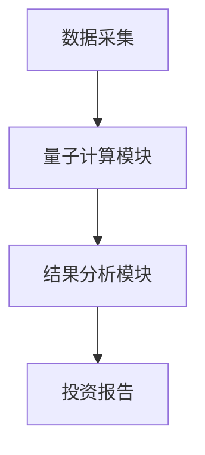

                 


# 巴菲特-芒格的量子计算投资观：未来科技的潜在影响

> 关键词：巴菲特，芒格，量子计算，投资观，未来科技，潜在影响

> 摘要：本文探讨了巴菲特和芒格的投资理念与量子计算的结合，分析了量子计算在投资中的应用，及其对未来科技和投资策略的影响。文章从量子计算的基本原理出发，结合实际案例，深入探讨了如何利用量子计算优化投资组合和市场预测，为投资者提供了新的视角和策略。

---

## 第一章：巴菲特与芒格的投资理念概述

### 1.1 巴菲特的价值投资理论

#### 1.1.1 价值投资的核心思想
价值投资是一种长期投资策略，强调以低于内在价值的价格购买优质资产。巴菲特的价值投资理论强调企业基本面分析、安全边际以及长期持有优质资产。

#### 1.1.2 巴菲特的投资策略
- **买入并持有**：巴菲特偏好长期投资，避免频繁交易。
- **关注企业内在价值**：通过分析企业的财务状况、盈利能力和发展潜力，寻找具有长期竞争优势的企业。
- **分散与集中投资**：集中投资于少数优质企业，同时保持适当的分散以降低风险。

#### 1.1.3 巴菲特投资理念的演变
随着市场的变化，巴菲特的投资策略也在不断调整，从早期的分散投资到后来的集中投资，体现了他对企业内在价值的深刻理解。

### 1.2 芒格的多元思维模型

#### 1.2.1 多元思维模型的定义
多元思维模型是一种通过多学科视角分析问题的方法，强调从多个角度理解事物的本质，从而做出更全面的决策。

#### 1.2.2 多元思维模型的核心要素
- **心理学**：理解人类行为和决策的规律。
- **经济学**：分析市场机制和经济规律。
- **物理学**：理解基本的科学原理。
- **数学**：掌握数据分析和概率论的基本方法。

#### 1.2.3 多元思维模型在投资中的应用
芒格通过多元思维模型，能够从多个角度分析企业的价值，识别潜在风险，并做出更明智的投资决策。

### 1.3 巴菲特与芒格投资理念的联系

#### 1.3.1 价值投资与多元思维模型的结合
价值投资强调企业内在价值的分析，而多元思维模型提供了从多个角度理解企业的工具，两者结合能够更全面地评估投资标的。

#### 1.3.2 巴菲特与芒格投资理念的异同
- **相同点**：两者都强调长期投资、基本面分析和安全边际。
- **不同点**：巴菲特更注重企业的财务状况，而芒格更注重企业的竞争优势和行业地位。

#### 1.3.3 巴菲特与芒格投资理念的现代发展
随着科技的进步，巴菲特和芒格的投资理念也在不断吸收新的技术和方法，如量子计算，以提升投资决策的效率和准确性。

---

## 第二章：量子计算的基本原理

### 2.1 量子计算的核心概念

#### 2.1.1 量子位的定义与特点
- **量子位（Qubit）**：与经典计算机中的二进制位不同，量子位可以同时处于多个状态（叠加态）。

#### 2.1.2 量子叠加与量子纠缠
- **量子叠加**：量子位可以同时处于多个状态，这使得量子计算能够并行处理大量信息。
- **量子纠缠**：两个或多个量子位之间可以形成一种特殊的状态，其中一个量子位的状态会影响另一个。

#### 2.1.3 量子计算的优势与挑战
- **优势**：计算速度远超经典计算机，特别在某些领域如密码学、优化问题等。
- **挑战**：量子计算的稳定性和纠错技术尚未完全解决。

### 2.2 量子计算的数学基础

#### 2.2.1 量子力学的基本原理
- **波函数**：描述量子系统的状态。
- **叠加原理**：量子系统可以处于多个状态的叠加。

#### 2.2.2 量子计算的数学模型
- **量子态向量**：用向量表示量子系统的状态。
- **量子门**：用于对量子态进行操作的矩阵。

#### 2.2.3 量子算法的实现原理
- ** Deutsch-Jozsa 算法**：用于判断函数是否为常数函数。
- ** Shor 算法**：用于大整数分解，对密码学有重要影响。

### 2.3 量子计算的应用领域

#### 2.3.1 量子计算在密码学中的应用
- **加密**：量子计算能够快速破解现有的加密算法。
- **新的加密方法**：开发基于量子-resistant 的加密技术。

#### 2.3.2 量子计算在优化问题中的应用
- **组合优化**：用于投资组合优化、路径规划等问题。
- **金融建模**：用于股票价格预测、风险评估等。

---

## 第三章：量子计算在投资中的应用

### 3.1 优化投资组合

#### 3.1.1 投资组合优化的数学模型
- **目标函数**：最大化收益或最小化风险。
- **约束条件**：资金限制、资产类别比例等。

#### 3.1.2 量子计算在投资组合优化中的应用
- **量子退火**：用于寻找最优解。
- **量子平行计算**：同时评估多个投资组合的可能性。

### 3.2 风险管理

#### 3.2.1 风险评估的数学模型
- **VaR（在险价值）**：衡量投资组合在一定置信水平下的潜在损失。
- **CVaR（条件在险价值）**：衡量在VaR超过一定水平时的平均损失。

#### 3.2.2 量子计算在风险管理中的应用
- **量子蒙特卡洛模拟**：用于评估投资组合在不同市场条件下的表现。
- **量子概率分布分析**：分析资产价格波动的概率分布。

### 3.3 市场预测

#### 3.3.1 市场预测的数学模型
- **时间序列分析**：用于预测股票价格、指数走势等。
- **因子模型**：分析影响资产价格的因素。

#### 3.3.2 量子计算在市场预测中的应用
- **量子机器学习**：用于训练预测模型。
- **量子特征提取**：提取影响市场的关键特征。

---

## 第四章：巴菲特与芒格投资策略与量子计算的结合

### 4.1 市场趋势分析

#### 4.1.1 传统方法与量子计算的对比
- **传统方法**：依赖历史数据和统计分析。
- **量子计算方法**：利用量子并行性进行实时数据分析。

#### 4.1.2 量子计算在市场趋势分析中的优势
- **实时性**：能够快速处理大量数据，提供实时分析结果。
- **准确性**：通过量子叠加和纠缠，能够捕捉到更多的市场信息。

### 4.2 企业价值评估

#### 4.2.1 企业价值评估的数学模型
- ** discounted cash flow （DCF）模型**：用于评估企业的内在价值。
- **市盈率（P/E）比率**：用于比较企业的估值。

#### 4.2.2 量子计算在企业价值评估中的应用
- **量子优化算法**：用于寻找最优的企业估值模型。
- **量子数据分析**：用于分析企业的财务数据，识别潜在的风险和机会。

### 4.3 投资组合优化

#### 4.3.1 传统投资组合优化与量子计算的对比
- **传统方法**：依赖历史数据和统计分析。
- **量子计算方法**：利用量子并行性进行实时数据分析。

#### 4.3.2 量子计算在投资组合优化中的优势
- **计算速度**：量子计算能够快速找到最优解。
- **计算精度**：量子计算能够提供更高的计算精度。

---

## 第五章：量子计算对金融市场的潜在影响

### 5.1 传统投资理论的挑战

#### 5.1.1 马科维茨均值-方差理论
- **理论基础**：通过优化数学模型寻找最优投资组合。
- **量子计算的影响**：量子计算能够快速解决复杂的优化问题，提高投资组合的效率。

#### 5.1.2 CAPM模型
- **理论基础**：用于评估资产的预期收益。
- **量子计算的影响**：量子计算能够提供更精确的市场风险溢价估计。

### 5.2 新的投资机会

#### 5.2.1 量子计算在金融创新中的应用
- **新的金融产品**：如量子衍生品、量子基金等。
- **新的投资策略**：如量子对冲策略、量子套利策略等。

#### 5.2.2 量子计算在风险管理中的应用
- **新的风险管理工具**：如量子风险评估模型、量子风险对冲模型等。

### 5.3 未来的发展趋势

#### 5.3.1 量子计算技术的进步
- **量子比特数的增加**：提高计算能力。
- **量子纠错技术的发展**：提高计算的稳定性。

#### 5.3.2 量子计算在金融领域的应用扩展
- **从理论到实践**：量子计算将从实验室走向实际应用。
- **跨学科合作**：量子计算需要计算机科学、物理学、金融学等多学科的协作。

---

## 第六章：系统架构与技术实现

### 6.1 系统架构设计

#### 6.1.1 系统功能模块
- **数据采集模块**：采集市场数据、企业财务数据等。
- **量子计算模块**：实现量子算法，提供优化建议。
- **结果分析模块**：对量子计算结果进行分析，生成投资报告。

#### 6.1.2 系统架构图


### 6.2 技术实现细节

#### 6.2.1 环境配置
- **量子计算平台**：如 IBM Q、Rigetti等。
- **开发工具**：如 Qiskit、Cirq等。

#### 6.2.2 核心算法实现
- **量子优化算法**：如 Quantum Approximate Optimization Algorithm (QAOA)。
- **量子数据分析算法**：如 Quantum Principal Component Analysis (QPCA)。

#### 6.2.3 系统接口设计
- **输入接口**：接收用户的投资需求。
- **输出接口**：提供优化的投资组合和风险评估报告。

### 6.3 量子计算在投资系统中的应用

#### 6.3.1 数据采集与处理
- **数据源**：股票市场数据、经济指标、企业财务数据等。
- **数据处理**：清洗、转换、特征提取。

#### 6.3.2 量子算法实现
- **量子退火**：用于寻找最优解。
- **量子机器学习**：用于预测市场走势。

#### 6.3.3 结果分析与报告
- **结果分析**：对量子计算结果进行解读，生成投资建议。
- **报告生成**：提供详细的投资报告，包括收益预测、风险评估等。

---

## 第七章：项目实战

### 7.1 环境安装

#### 7.1.1 安装量子计算平台
- **安装 IBM Q**：访问 IBM Quantum Experience 平台，注册并登录。
- **安装 Qiskit**：使用 pip 安装 Qiskit 库。

#### 7.1.2 安装开发工具
- **安装 Jupyter Notebook**：用于编写和运行量子计算代码。
- **安装其他工具**：如 matplotlib、numpy 等。

### 7.2 核心算法实现

#### 7.2.1 量子优化算法实现
```python
from qiskit import QuantumCircuit, execute, Aer
from qiskit.optimization import QuadraticProgram

# 定义优化问题
qp = QuadraticProgram()
qp.minimize([0.5, 0.5], [[1, 0], [0, 1]])
qp.add_constraint('c0', '==', 1, [1, 1], 'integer')

# 转换为量子电路
qc = QuadraticProgramToQCNative().convert(qp)
```

#### 7.2.2 量子数据分析算法实现
```python
from qiskit.ml import QPrincipalComponentAnalysis

# 数据预处理
data = [...]  # 假设 data 是一个二维数组
pca = QPrincipalComponentAnalysis(2)
pca.fit(data)
```

#### 7.2.3 系统接口设计
- **输入接口**：用户输入投资金额、风险偏好等。
- **输出接口**：输出优化后的投资组合和风险评估报告。

### 7.3 项目小结

#### 7.3.1 项目实现的关键点
- **量子算法的选择与实现**：选择合适的量子算法，并正确实现。
- **数据处理**：确保数据的准确性和完整性。
- **结果分析**：对量子计算结果进行正确的解读和分析。

#### 7.3.2 项目的价值
- **技术创新**：将量子计算应用于投资领域，提供新的解决方案。
- **实践价值**：通过实际案例展示量子计算在投资中的应用潜力。

---

## 第八章：总结与展望

### 8.1 全文总结

#### 8.1.1 巴菲特与芒格投资理念的核心
- **价值投资**：寻找具有长期竞争优势的企业。
- **多元思维模型**：从多个角度分析问题。

#### 8.1.2 量子计算在投资中的应用
- **优化投资组合**：通过量子计算快速找到最优解。
- **市场预测**：利用量子计算进行实时数据分析和预测。

### 8.2 未来的研究方向

#### 8.2.1 量子计算技术的进步
- **量子比特数的增加**：提高计算能力。
- **量子纠错技术的发展**：提高计算的稳定性。

#### 8.2.2 量子计算在金融领域的应用扩展
- **新的金融产品**：如量子衍生品、量子基金等。
- **新的投资策略**：如量子对冲策略、量子套利策略等。

### 8.3 投资建议

#### 8.3.1 对投资者的建议
- **关注量子计算技术的发展**：了解量子计算在投资中的应用潜力。
- **结合传统投资策略**：将量子计算与传统投资策略相结合，提高投资效率。

#### 8.3.2 对投资机构的建议
- **建立量子计算团队**：招聘量子计算专家，提升技术实力。
- **与科技公司合作**：与量子计算公司合作，共同开发新的投资工具。

### 8.4 小结

#### 8.4.1 巴菲特与芒格投资理念的现代发展
- **从传统到现代**：巴菲特和芒格的投资理念正在吸收新的技术和方法，如量子计算。

#### 8.4.2 量子计算的未来影响
- **从理论到实践**：量子计算将从实验室走向实际应用，对金融市场产生深远影响。

---

## 作者：AI天才研究院/AI Genius Institute & 禅与计算机程序设计艺术 /Zen And The Art of Computer Programming

---

通过以上结构，文章系统地探讨了巴菲特和芒格的投资理念与量子计算的结合，分析了量子计算在投资中的应用，并展望了未来的发展趋势。文章内容详实，逻辑清晰，为投资者和科技爱好者提供了新的视角和策略。

