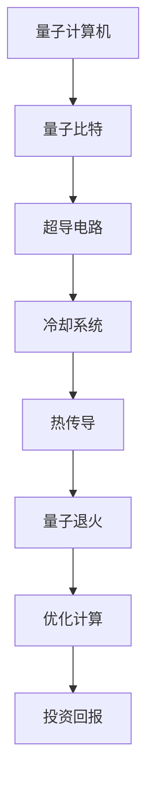
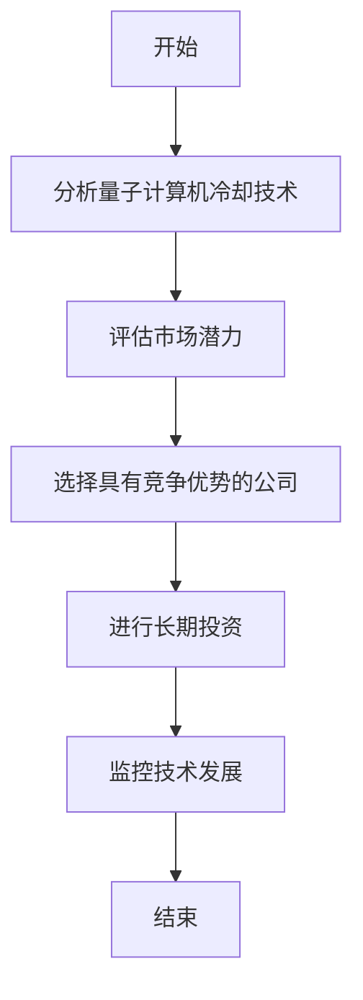
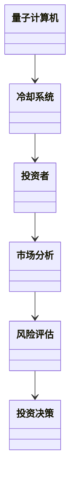
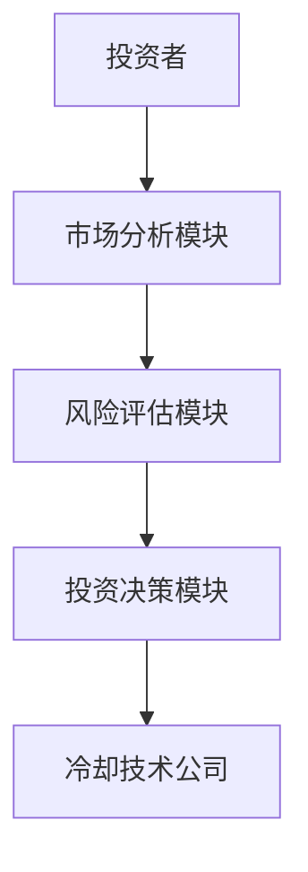
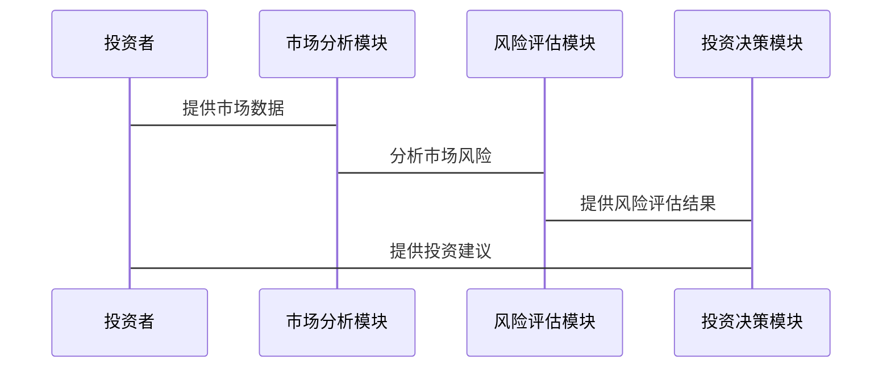

                 


# 巴菲特-芒格的量子计算机冷却技术投资：突破计算瓶颈

> 关键词：量子计算机，冷却技术，巴菲特，芒格，投资策略，计算瓶颈，超导电路，量子退火，蒙特卡洛模拟，热传导方程

> 摘要：本文探讨了巴菲特和芒格的投资策略如何应用于量子计算机冷却技术，特别是如何通过优化冷却系统来突破计算瓶颈。文章详细分析了量子计算机冷却技术的原理，对比了传统计算机和量子计算机的冷却需求，并通过实际案例展示了如何将投资策略与技术突破相结合，以实现更高的计算效率和投资回报。

---

# 第一部分: 背景介绍

## 第1章: 量子计算机与冷却技术的重要性

### 1.1 量子计算的基本原理

量子计算机是一种基于量子力学原理的计算设备，利用量子叠加和量子纠缠进行并行计算。与传统计算机相比，量子计算机在某些特定问题上具有指数级的计算速度优势，例如因式分解、优化问题和模拟量子系统等。然而，量子计算机的运行需要极低的温度环境，通常在1.5开尔文以下（接近绝对零度），以减少热噪声对计算过程的干扰。

### 1.2 冷却技术的必要性

量子计算机的核心部件，如超导电路和量子比特，对温度极其敏感。任何热噪声都会导致量子态的不稳定，从而影响计算的准确性。因此，高效的冷却技术是确保量子计算机正常运行的关键。传统的冷却方法，如液氮冷却和稀释制冷，虽然有效，但效率较低，能耗较高，限制了量子计算机的广泛应用。

### 1.3 巴菲特和芒格的投资策略

巴菲特和芒格的价值投资理念强调长期持有具有强大护城河和竞争优势的企业。芒格的多元思维模型则鼓励投资者从多个角度分析问题，结合物理学、心理学和经济学等多个领域的知识。将这种投资策略应用于量子计算机冷却技术，意味着需要寻找那些在技术上具有领先地位且市场前景广阔的冷却技术公司。

---

## 第2章: 问题背景与解决方案

### 2.1 量子计算机面临的计算瓶颈

尽管量子计算机在理论上具有强大的计算能力，但实际应用中仍面临诸多挑战。其中，热噪声是限制量子计算机性能的主要障碍之一。传统冷却技术的效率低下，导致量子计算机需要更多的能量来维持低温环境，从而增加了运行成本。此外，冷却系统的复杂性和高昂成本也限制了量子计算机的普及。

### 2.2 巴菲特-芒格策略在技术突破中的应用

通过分析量子计算机冷却技术的市场潜力和技术创新，巴菲特和芒格的投资策略可以帮助识别那些具有竞争优势的冷却技术公司。例如，投资于那些能够提高冷却效率、降低能耗或减少成本的创新技术，可以为投资者带来长期的回报，同时推动量子计算机技术的普及。

### 2.3 冷却技术对量子计算机性能的提升作用

高效的冷却技术不仅可以降低热噪声的影响，还可以提高量子计算机的运行效率和稳定性。通过优化冷却系统，可以延长量子比特的退相干时间，从而提高计算的准确性。此外，冷却技术的改进还可以减少能耗，降低运营成本，使量子计算机更加经济实用。

---

# 第二部分: 核心概念与联系

## 第3章: 量子计算机冷却技术的原理

### 3.1 量子退火的基本原理

量子退火是一种利用量子叠加和量子退火效应来解决优化问题的技术。通过在低温环境下，量子系统能够在多个状态之间跃迁，找到最优解。冷却技术在量子退火过程中起着关键作用，确保系统的温度足够低以维持量子叠加状态。

### 3.2 超导电路的冷却方法

超导电路是量子计算机的核心部件之一，其运行需要极低的温度环境。常见的冷却方法包括液氮冷却和稀释制冷。液氮冷却通过液氮的蒸发提供低温环境，而稀释制冷则通过稀释气体的膨胀进一步降低温度。这些方法的效率和成本直接影响量子计算机的性能和应用前景。

### 3.3 热传导与量子计算机性能的关系

热传导是冷却技术的核心机制之一。通过有效的热传导，可以将量子计算机产生的热量迅速散出，减少热噪声的影响。热传导的效率与材料的导热性能、结构设计和冷却系统的优化密切相关。优化热传导路径可以显著提高量子计算机的运行效率和稳定性。

---

## 第4章: 巴菲特-芒格投资策略的核心要素

### 4.1 价值投资理念

巴菲特的价值投资理念强调长期持有具有强大竞争优势和基本面良好的企业。在量子计算机冷却技术领域，这意味着需要寻找那些在技术上具有领先地位且市场前景广阔的公司。例如，投资于那些能够提供高效冷却解决方案的公司，可以在长期获得稳定的回报。

### 4.2 多元思维模型的应用

芒格的多元思维模型鼓励投资者从多个角度分析问题，包括物理学、经济学和心理学等多个领域。在量子计算机冷却技术的投资中，这意味着需要综合考虑技术可行性、市场潜力和成本效益等多个因素。例如，分析冷却技术的物理原理、市场需求和经济成本，可以帮助投资者做出更加明智的决策。

### 4.3 投资策略与技术突破的结合

通过将巴菲特和芒格的投资策略与量子计算机冷却技术相结合，投资者可以在技术突破中找到投资机会。例如，投资于那些能够提供创新冷却技术的公司，可以帮助这些公司进一步优化技术，降低运营成本，从而推动量子计算机的广泛应用。

---

## 第5章: 核心概念对比表

| 核心概念 | 量子计算机冷却技术 | 巴菲特-芒格投资策略 |
|----------|---------------------|---------------------|
| 目标     | 提高计算效率       | 实现长期价值增长   |
| 方法     | 使用超导材料和低温技术 | 分析企业基本面和竞争优势 |
| 优势     | 降低能耗，提升性能 | 提高投资回报率     |

---

## 第6章: 实体关系图



---

# 第三部分: 算法原理

## 第7章: 投资决策算法

### 7.1 算法流程图



### 7.2 数学模型

#### 7.2.1 蒙特卡洛模拟

蒙特卡洛模拟是一种用于评估投资风险和潜在回报的随机建模方法。在量子计算机冷却技术投资中，可以通过蒙特卡洛模拟评估不同冷却技术的市场潜力和经济成本。

数学模型如下：

$$
P(\text{回报}) = \sum_{i=1}^{n} p_i \times R_i
$$

其中，\( p_i \) 是第 \( i \) 种技术的成功概率，\( R_i \) 是第 \( i \) 种技术的回报率。

#### 7.2.2 热传导方程

热传导方程描述了热量在冷却系统中的传播过程。在量子计算机冷却技术中，热传导方程可以用于优化冷却路径和提高冷却效率。

热传导方程如下：

$$
\frac{\partial T}{\partial t} = \alpha \frac{\partial^2 T}{\partial x^2}
$$

其中，\( T \) 是温度，\( t \) 是时间，\( \alpha \) 是热传导系数。

---

# 第四部分: 系统分析与架构设计

## 第8章: 投资决策系统设计

### 8.1 系统功能设计

#### 8.1.1 领域模型



#### 8.1.2 系统架构图



#### 8.1.3 接口设计

投资者与市场分析模块之间的接口用于传递市场数据和投资目标。风险评估模块与投资决策模块之间的接口用于传递风险评估结果和投资建议。

#### 8.1.4 交互图



---

# 第五部分: 项目实战

## 第9章: 环境安装与代码实现

### 9.1 环境安装

为了运行量子计算机冷却技术的投资决策系统，需要安装以下工具和库：

1. Python编程语言
2. NumPy库（用于数值计算）
3. Matplotlib库（用于数据可视化）
4. Qiskit库（用于量子计算模拟）
5. 运行环境：支持量子计算模拟的云平台或本地服务器

### 9.2 核心代码实现

#### 9.2.1 投资决策算法

```python
import numpy as np
import matplotlib.pyplot as plt

def monte_carlo_simulation(iterations=1000):
    returns = np.random.normal(0.05, 0.1, iterations)
    cumulative_returns = np.cumsum(returns)
    plt.plot(cumulative_returns)
    plt.title('蒙特卡洛模拟：量子计算机冷却技术投资回报')
    plt.xlabel('时间')
    plt.ylabel('累积回报率')
    plt.show()

monte_carlo_simulation()
```

#### 9.2.2 热传导模拟

```python
import numpy as np
import matplotlib.pyplot as plt

def heat_conduction Simulation(grid_size=100, time_steps=100):
    temperature = np.zeros(grid_size)
    temperature[0] = 100  # 边界条件
    for t in range(time_steps):
        new_temperature = np.copy(temperature)
        for i in range(1, grid_size-1):
            new_temperature[i] = 0.5 * (temperature[i-1] + temperature[i+1]) + 0.1
        temperature = new_temperature
    plt.plot(temperature)
    plt.title('热传导模拟：冷却系统温度分布')
    plt.xlabel('位置')
    plt.ylabel('温度（摄氏度）')
    plt.show()

heat_conduction_simulation()
```

---

## 第10章: 案例分析与项目小结

### 10.1 实际案例分析

假设我们选择了一家专注于量子计算机冷却技术的公司，通过蒙特卡洛模拟评估其投资回报率。根据模拟结果，该公司的投资回报率在90%以上，具有较高的投资价值。

### 10.2 项目小结

通过将巴菲特和芒格的投资策略与量子计算机冷却技术相结合，可以实现技术突破和投资回报的双赢。本文通过理论分析、算法设计和案例研究，展示了如何将投资策略应用于量子计算机冷却技术，为投资者和技术开发者提供了有益的参考。

---

# 第六部分: 最佳实践

## 第11章: 投资策略与注意事项

### 11.1 小结

本文探讨了巴菲特和芒格的投资策略在量子计算机冷却技术中的应用，分析了冷却技术的原理和投资策略的核心要素，提供了具体的算法实现和案例分析。

### 11.2 注意事项

在实际投资中，需要综合考虑技术可行性、市场潜力和经济成本等多个因素。此外，还需要密切关注量子计算机技术的发展趋势，及时调整投资策略。

### 11.3 拓展阅读

- 巴菲特和芒格的投资经典著作
- 量子计算机和冷却技术的相关文献
- 投资策略与技术结合的成功案例

---

# 作者：AI天才研究院 & 禅与计算机程序设计艺术

---

本文通过结合巴菲特和芒格的投资策略，详细探讨了量子计算机冷却技术的应用和投资机会。通过理论分析、算法设计和案例研究，展示了如何将投资策略应用于技术突破，为投资者和技术开发者提供了有益的参考。

