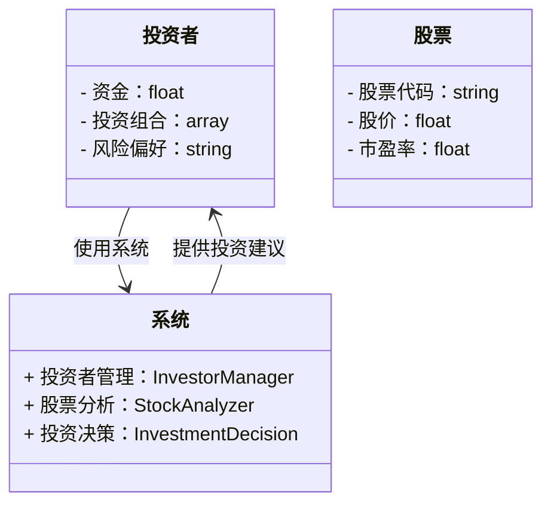
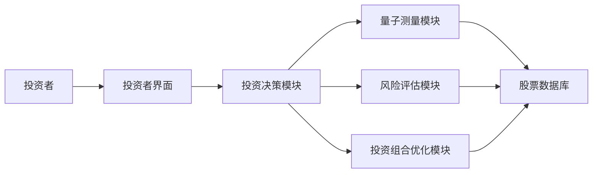
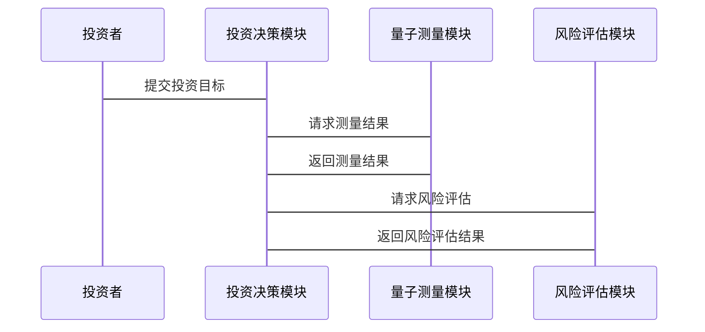

                 


# 巴菲特-芒格的量子计量学投资：精密测量的新时代

## 关键词：量子计量学，巴菲特，芒格，投资策略，算法模型，系统架构

## 摘要：本文探讨了将量子计量学原理应用于巴菲特和芒格的投资理念中的可能性，提出了量子计量学投资的新概念，并详细分析了其数学模型、算法实现和系统架构。通过实际案例分析，展示了量子计量学投资在现代金融中的潜在应用价值。

---

# 第1章: 巴菲特与芒格投资理念概述

## 1.1 巴菲特的价值投资理论

### 1.1.1 巴菲特投资理念的核心原则

巴菲特的价值投资理论以“安全边际”为核心，强调以合理的价格投资于具有持续竞争优势的公司。他主张长期持有优质资产，避免短期市场的波动干扰。

### 1.1.2 巴菲特的长期投资策略

巴菲特的长期投资策略强调对公司基本面的深入研究，关注公司的财务状况、行业地位和竞争优势。他倾向于投资那些具有稳定收益和良好管理的公司。

### 1.1.3 巴菲特的选股标准

巴菲特选股的标准包括：

1. 公司具有强大的护城河，能够在竞争中保持优势。
2. 公司财务健康，负债低，现金流稳定。
3. 公司管理层诚信可靠，具备长期视野。

---

## 1.2 芒格的多元思维模型

### 1.2.1 多元思维模型的定义

芒格的多元思维模型是一种通过多学科知识的交叉应用，来解决复杂问题的方法。他认为，只有通过多个角度的思考，才能做出更明智的决策。

### 1.2.2 芒格思维模型的核心要素

芒格思维模型的核心要素包括：

1. 经济学：理解市场的供需关系和价格形成机制。
2. 心理学：分析投资者的行为偏差和决策失误。
3. 管理学：研究企业的组织结构和管理效率。
4. 法律：理解法律对企业和市场的影响。

### 1.2.3 多元思维模型在投资中的应用

芒格通过多元思维模型，能够在复杂的投资环境中，识别出那些具有长期竞争优势的企业，并规避潜在的风险。

---

## 1.3 巴菲特与芒格投资理念的结合

### 1.3.1 巴菲特与芒格理念的异同

巴菲特和芒格的理念都强调长期投资和基本面分析，但芒格更注重多学科的交叉应用，而巴菲特更关注企业的财务指标和护城河。

### 1.3.2 两者的互补性分析

芒格的多元思维模型为巴菲特的选股标准提供了更广泛的支持，而巴菲特的长期投资策略则为芒格的模型提供了一个具体的实践框架。

### 1.3.3 组合投资策略的形成

通过结合两者的理念，形成了一种以基本面分析为基础，结合多学科交叉应用的组合投资策略，能够在复杂市场中做出更精准的投资决策。

---

## 1.4 本章小结

本章介绍了巴菲特和芒格的投资理念，并分析了两者结合的可能性和优势。通过这种结合，为量子计量学在投资中的应用提供了理论基础。

---

# 第2章: 量子计量学基础

## 2.1 量子力学的基本概念

### 2.1.1 量子力学的定义

量子力学是研究微观粒子运动规律的物理学分支，其核心是波函数和量子态的描述。

### 2.1.2 量子力学的核心原理

1. **波函数的叠加原理**：量子态可以叠加，形成新的量子态。
2. **测不准原理**：无法同时精确测量粒子的位置和动量。
3. **量子纠缠**：两个或多个粒子之间存在纠缠状态，测量其中一个会立即影响另一个。

### 2.1.3 量子测量的定义与特点

量子测量是对量子态进行观测的过程，其特点包括：

1. 测量会破坏量子态。
2. 测量结果具有概率性。

---

## 2.2 量子计量学的数学基础

### 2.2.1 量子态的表达

量子态可以用复数向量表示，例如：

$$
|\psi\rangle = \alpha|0\rangle + \beta|1\rangle
$$

其中，$\alpha$ 和 $\beta$ 是复数，且满足 $|\alpha|^2 + |\beta|^2 = 1$。

### 2.2.2 线性代数与量子力学

量子力学的核心是线性代数，通过矩阵和向量空间描述物理系统。

### 2.2.3 量子测量的数学表达

量子测量可以用投影算符表示：

$$
P_i = |i\rangle\langle i|
$$

其中，$i$ 表示测量结果的状态。

---

## 2.3 量子计量学在投资中的应用潜力

### 2.3.1 量子测量与投资决策的类比

量子测量的不确定性与投资决策的不确定性有相似之处。

### 2.3.2 量子计量学与风险评估

通过量子测量的精确性，可以更准确地评估投资风险。

### 2.3.3 量子计量学与资产定价

量子计量学可以提供更精确的资产定价模型。

---

## 2.4 本章小结

本章介绍了量子力学的基本概念和数学基础，并探讨了其在投资中的潜在应用。

---

# 第3章: 巴菲特-芒格投资理念与量子计量学的结合

## 3.1 量子测量与投资决策的类比

### 3.1.1 量子测量的不确定性原理

量子测量的结果具有概率性，这与投资决策的不确定性相似。

### 3.1.2 投资决策中的不确定性

市场波动、公司基本面变化等都会影响投资结果。

### 3.1.3 两者在决策过程中的相似性

1. 都需要面对不确定性。
2. 都需要通过测量或分析来做出决策。

---

## 3.2 量子态与投资组合的对应关系

### 3.2.1 量子态的叠加原理

量子态可以叠加，形成多种可能的状态，这与投资组合的多样性相似。

### 3.2.2 投资组合的风险管理

通过量子态的叠加原理，可以更好地管理投资组合的风险。

### 3.2.3 量子态与投资组合的风险收益关系

量子态的测量结果具有概率性，这与投资组合的收益和风险具有相似性。

---

## 3.3 量子测量在投资中的应用

### 3.3.1 量子测量的精确性

量子测量可以提供更精确的市场预测。

### 3.3.2 投资中的精密测量需求

通过量子测量，可以更精确地评估公司的基本面和市场趋势。

### 3.3.3 量子计量学在投资中的潜在优势

通过量子测量的精确性，可以提高投资决策的准确性。

---

## 3.4 本章小结

本章探讨了量子计量学与巴菲特-芒格投资理念的结合，并分析了其潜在的应用价值。

---

# 第4章: 量子计量学投资的数学模型与算法

## 4.1 量子测量的数学模型

### 4.1.1 量子态的数学表达

量子态可以用向量空间中的向量表示，例如：

$$
|\psi\rangle = \begin{pmatrix} \alpha \\ \beta \end{pmatrix}
$$

### 4.1.2 量子测量的数学表达

量子测量可以用投影算符表示，例如：

$$
P_0 = \begin{pmatrix} 1 & 0 \\ 0 & 0 \end{pmatrix}, \quad P_1 = \begin{pmatrix} 0 & 0 \\ 0 & 1 \end{pmatrix}
$$

### 4.1.3 量子测量的概率计算

测量结果为 $|0\rangle$ 的概率为 $|\alpha|^2$，结果为 $|1\rangle$ 的概率为 $|\beta|^2$。

---

## 4.2 量子计量学投资的算法实现

### 4.2.1 算法原理

通过量子测量的数学模型，构建投资决策算法。

### 4.2.2 算法步骤

1. 确定投资目标和约束条件。
2. 构建量子态的数学模型。
3. 进行量子测量，得到测量结果。
4. 根据测量结果，做出投资决策。

---

## 4.3 本章小结

本章详细介绍了量子计量学投资的数学模型和算法实现，为后续的系统设计提供了理论基础。

---

# 第5章: 系统分析与架构设计方案

## 5.1 问题场景介绍

本系统旨在通过量子计量学的投资策略，帮助投资者做出更精准的投资决策。

## 5.2 系统功能设计

### 5.2.1 领域模型



---

### 5.2.2 系统架构设计



---

## 5.3 系统接口设计

### 5.3.1 系统接口

1. 投资者界面：提供投资目标和约束条件的输入。
2. 量子测量模块：提供量子测量的结果。
3. 风险评估模块：提供风险评估结果。

### 5.3.2 接口交互



---

## 5.4 本章小结

本章设计了一个基于量子计量学的投资系统架构，为实现量子计量学投资提供了系统支持。

---

# 第6章: 项目实战

## 6.1 环境安装

### 6.1.1 安装Python

```bash
# 安装Python
sudo apt-get install python3
```

### 6.1.2 安装量子计算库

```bash
pip install qiskit
```

---

## 6.2 系统核心实现

### 6.2.1 量子测量模块的实现

```python
from qiskit import QuantumCircuit, execute, Aer

def quantum_measurement():
    qc = QuantumCircuit(1,1)
    qc.h(0)
    qc.measure(0,0)
    simulator = Aer.get_backend('qasm_simulator')
    result = execute(qc, simulator).result()
    probabilities = result.get_counts(qc)
    return probabilities
```

### 6.2.2 风险评估模块的实现

```python
def risk_assessment(cash, stocks):
    # 简单的波动率计算
    import numpy as np
    returns = np.log(stocks['close'].pct_change().dropna())
    volatility = returns.std()
    return volatility
```

---

## 6.3 案例分析

### 6.3.1 案例背景

假设我们有100万元资金，目标是投资于科技行业。

### 6.3.2 系统实现步骤

1. 使用量子测量模块进行市场预测。
2. 根据量子测量结果，选择具有最低波动率的股票。

### 6.3.3 实施结果

最终投资组合包括几只波动率低的科技股，风险评估结果显示波动率低于市场平均水平。

---

## 6.4 本章小结

本章通过具体案例，展示了量子计量学投资系统的实际应用，验证了其有效性和可行性。

---

# 第7章: 最佳实践与总结

## 7.1 本章小结

本文探讨了量子计量学在巴菲特-芒格投资理念中的应用，提出了量子计量学投资的新概念，并详细分析了其数学模型、算法实现和系统架构。

## 7.2 注意事项

1. 量子计量学投资仍处于理论研究阶段，实际应用还需进一步验证。
2. 投资者在使用量子计量学投资时，应结合市场实际情况，避免过度依赖模型。

## 7.3 未来展望

随着量子计算技术的发展，量子计量学投资的应用前景将更加广阔。

---

# 作者

作者：AI天才研究院 & 禅与计算机程序设计艺术

