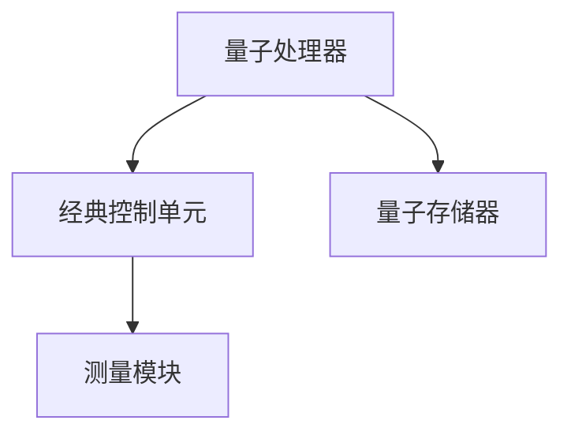
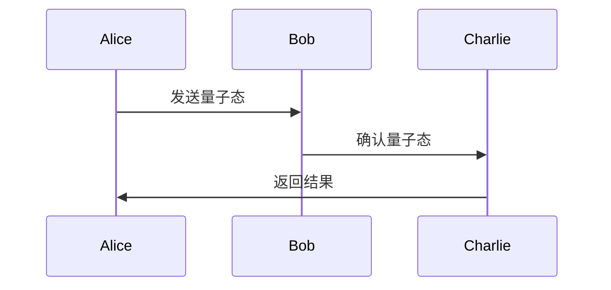
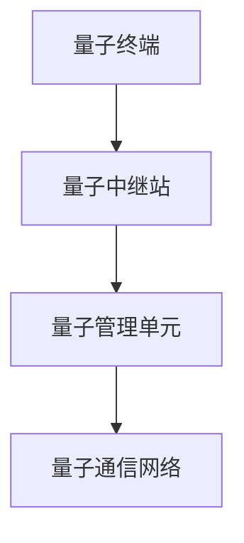
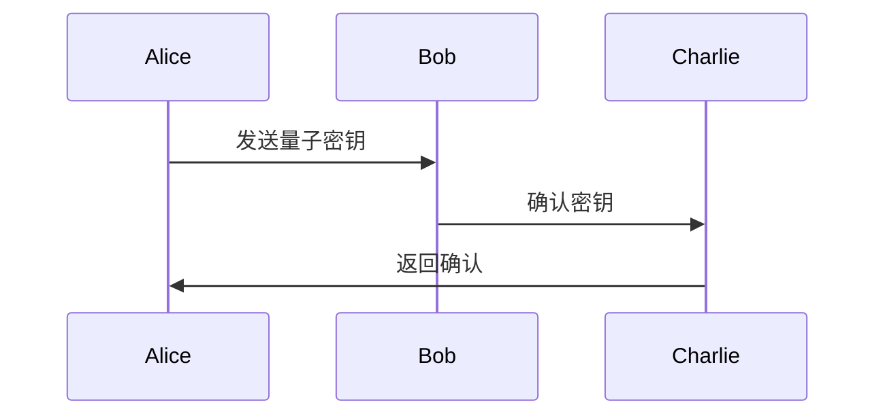

                 


# 巴菲特-芒格的量子计量标准研发投资：量子科技产业化的基础

> 关键词：巴菲特, 芒格, 量子科技, 量子计量标准, 量子计算, 量子通信, 量子测量

> 摘要：本文探讨了巴菲特和芒格的投资理念在量子科技领域的应用，特别是量子计量标准的研发与产业化基础。文章详细分析了量子计量标准的核心概念、算法原理、系统架构，并结合实际案例，提出了量子科技投资的策略和建议。

---

## 第一部分: 巴菲特-芒格投资理念与量子科技的结合

### 第1章: 巴菲特-芒格投资理念与量子科技的结合

#### 1.1 巴菲特-芒格的价值投资理念

##### 1.1.1 巴菲特-芒格投资理念的核心要素

- **长期价值投资**：寻找具有持续竞争优势和良好治理的企业。
- **安全边际**：以低于内在价值的价格买入。
- **价值创造**：关注企业的ROE（净资产收益率）和ROA（资产回报率）。

##### 1.1.2 巴菲特-芒格投资理念与量子科技的契合点

- **长期性**：量子科技的发展需要长期投入，符合巴菲特的长期价值投资理念。
- **竞争优势**：量子科技领域的技术领先企业具有强大的竞争优势。
- **安全边际**：通过深入研究和评估，选择具有安全边际的量子科技企业。

##### 1.1.3 巴菲特-芒格投资理念在现代科技投资中的应用

- **案例分析**：巴菲特对苹果公司的投资，体现了其对科技企业的价值发现能力。
- **芒格的多元思维模型**：芒格强调将跨学科思维应用于投资决策，这在量子科技投资中尤为重要。

#### 1.2 量子科技的基本概念

##### 1.2.1 量子科技的定义与范围

- **量子科技**：利用量子力学原理进行信息处理、通信和测量的技术。
- **主要领域**：量子计算、量子通信、量子测量。
- **现状与未来趋势**：量子科技正在从基础研究向产业化过渡，未来将对多个行业产生深远影响。

##### 1.2.2 量子科技的主要领域

| 领域 | 定义 | 核心技术 | 应用场景 |
|------|------|----------|----------|
| 量子计算 | 利用量子比特进行计算 | 量子门、量子叠加、量子纠缠 | 优化计算、密码破解、药物研发 |
| 量子通信 | 利用量子态进行信息传输 | 量子密钥分发、量子隐形传态 | 安全通信、数据加密 |
| 量子测量 | 利用量子效应进行测量 | 量子干涉、量子传感 | 精密测量、环境监测 |

##### 1.2.3 量子科技的现状与未来发展趋势

- **现状**：量子计算领域，Google和IBM已经展示了量子优越性；量子通信已经在部分国家实现小规模应用。
- **未来趋势**：量子计算将从实验阶段走向实际应用，量子通信将从局部网络扩展到全球网络。

#### 1.3 巴菲特-芒格与量子科技投资的结合

##### 1.3.1 巴菲特-芒格投资理念在量子科技领域的适用性

- **长期价值**：量子科技企业的研发周期长，符合巴菲特的长期投资理念。
- **竞争优势**：具有技术领先性的量子科技企业具备长期竞争优势。

##### 1.3.2 量子科技产业化的基本框架

- **技术开发**：量子计算、量子通信和量子测量的核心技术开发。
- **产业化应用**：将量子技术应用于金融、医疗、通信等领域。
- **生态系统建设**：构建量子科技产业链，促进技术的广泛应用。

##### 1.3.3 巴菲特-芒格投资理念对量子科技产业化的影响

- **资本支持**：通过长期投资为量子科技企业提供资金支持。
- **战略指导**：巴菲特和芒格的投资理念可以帮助量子科技企业制定长期发展战略。

---

## 第二部分: 量子计量标准的核心概念

### 第2章: 量子计量标准的核心概念

#### 2.1 量子计量标准的定义与属性

##### 2.1.1 量子计量标准的定义

- **量子计量标准**：基于量子力学原理，用于精确测量和校准的标准体系。

##### 2.1.2 量子计量标准的核心属性

| 属性 | 特征 | 描述 |
|------|------|------|
| 精确性 | 高精度 | 量子计量标准的测量精度远高于传统标准。 |
| 稳定性 | 长期稳定 | 量子标准具有长期稳定性和抗干扰能力。 |
| 可扩展性 | 广泛应用 | 量子标准可以应用于多个领域和场景。 |

##### 2.1.3 量子计量标准的分类与应用

- **量子计算中的计量标准**：用于量子计算机的校准和优化。
- **量子通信中的计量标准**：用于量子密钥分发的安全性和准确性。
- **量子测量中的计量标准**：用于高精度传感器的校准。

#### 2.2 量子计量标准与量子科技产业化

##### 2.2.1 量子计量标准在量子计算中的作用

- **校准量子比特**：确保量子比特的稳定性。
- **优化量子门操作**：提高量子计算的准确性。

##### 2.2.2 量子计量标准在量子通信中的应用

- **量子密钥分发的校准**：确保量子密钥的安全性。
- **量子隐形传态的测量**：提高量子通信的效率。

##### 2.2.3 量子计量标准在量子测量中的应用

- **高精度传感器校准**：用于环境监测、医学成像等领域。

---

## 第三部分: 量子计量标准的算法原理

### 第3章: 量子计量标准的算法原理

#### 3.1 量子计算的基本原理

##### 3.1.1 量子比特的定义与性质

- **量子比特**：量子计算机的基本单位，可以同时处于多个状态的叠加态。
- **量子叠加**：量子比特可以同时表示0和1。
- **量子纠缠**：多个量子比特之间可以形成纠缠态，信息相关联。

##### 3.1.2 量子计算的核心算法

- **量子傅里叶变换**：用于解决周期性问题。
- **量子门操作**：包括Hadamard门、CNOT门等。

##### 3.1.3 量子计算的应用场景

- **密码破解**：量子计算机可以快速破解RSA加密。
- **药物研发**：优化分子结构，加速新药开发。

#### 3.2 量子通信的核心算法

##### 3.2.1 量子密钥分发（QKD）

- **基本原理**：通过量子态传输密钥，确保密钥的安全性。
- **实现步骤**：Alice和Bob通过量子态传输密钥，Charlie作为攻击者无法窃取密钥。

##### 3.2.2 量子隐形传态

- **基本原理**：通过量子纠缠实现信息的传输。
- **应用场景**：用于量子通信中的信息传输。

#### 3.3 量子测量的核心算法

##### 3.3.1 量子干涉

- **基本原理**：利用光的干涉现象进行测量。
- **应用领域**：用于高精度传感器的设计。

##### 3.3.2 量子传感

- **基本原理**：利用量子效应进行高精度测量。
- **应用领域**：环境监测、医学成像。

---

## 第四部分: 量子计量标准的系统分析与架构设计

### 第4章: 量子计量标准的系统架构

#### 4.1 量子计算系统的架构设计

##### 4.1.1 量子计算机的组成模块

- **量子处理器**：负责量子计算的核心操作。
- **经典控制单元**：用于控制量子计算机的运行。
- **测量模块**：用于测量量子比特的状态。

##### 4.1.2 量子计算机的系统架构



##### 4.1.3 量子计算机的交互流程



#### 4.2 量子通信系统的架构设计

##### 4.2.1 量子通信网络的组成

- **量子中继站**：用于量子通信的中继传输。
- **量子终端**：用户端的量子通信设备。
- **量子管理单元**：负责网络的管理和控制。

##### 4.2.2 量子通信系统的架构图



##### 4.2.3 量子通信的系统交互



---

## 第五部分: 量子计量标准的项目实战

### 第5章: 量子计量标准的项目实战

#### 5.1 项目背景与目标

##### 5.1.1 项目背景

- **目标**：开发一套基于量子计量标准的量子计算机校准系统。
- **需求**：实现量子计算机的校准和优化。

##### 5.1.2 项目目标

- **实现量子比特校准**：确保量子比特的稳定性。
- **优化量子门操作**：提高量子计算的准确性。

#### 5.2 项目环境与工具

##### 5.2.1 项目环境

- **量子计算机**：使用IBM Quantum Experience平台。
- **开发工具**：Qiskit（量子软件开发工具包）。
- **编程语言**：Python。

#### 5.3 核心代码实现

##### 5.3.1 量子比特校准代码

```python
from qiskit import QuantumCircuit, Aer, execute
from qiskit.visualization import plot_histogram

# 创建量子电路
qc = QuantumCircuit(1, 1)
qc.h(0)
qc.measure(0, 0)

# 执行量子电路
simulator = Aer.get_backend('qasm_simulator')
job = execute(qc, simulator)
result = job.result()
counts = result.get_counts()

# 可视化结果
plot_histogram(counts)
```

##### 5.3.2 量子门优化代码

```python
from qiskit import QuantumCircuit, Aer, execute
from qiskit.visualization import plot_histogram

# 创建量子电路
qc = QuantumCircuit(2, 2)
qc.h(0)
qc.cnot(0, 1)
qc.measure(0, 0)
qc.measure(1, 1)

# 执行量子电路
simulator = Aer.get_backend('qasm_simulator')
job = execute(qc, simulator)
result = job.result()
counts = result.get_counts()

# 可视化结果
plot_histogram(counts)
```

#### 5.4 项目案例分析

##### 5.4.1 项目环境安装

- **安装Qiskit**：使用`pip install qiskit`。
- **配置量子计算机**：连接到IBM Quantum Experience平台。

##### 5.4.2 代码实现与分析

- **量子比特校准**：通过测量结果分析量子比特的稳定性。
- **量子门优化**：通过优化CNOT门的参数，提高量子计算的准确性。

---

## 第六部分: 总结与建议

### 第6章: 总结与建议

#### 6.1 总结

- **量子计量标准**：在量子科技产业化中具有重要地位。
- **巴菲特-芒格投资理念**：为量子科技投资提供了长期价值导向。
- **量子科技的未来发展**：需要技术突破和产业化应用的结合。

#### 6.2 投资建议

##### 6.2.1 长期投资

- **选择具有长期竞争优势的量子科技企业**。
- **关注量子科技企业的技术开发和产业化进展**。

##### 6.2.2 风险控制

- **分散投资**：避免过度集中在单一领域。
- **关注政策支持**：政府政策对量子科技发展有重要影响。

#### 6.3 未来展望

- **量子计算的商业化**：量子计算机将从实验阶段走向实际应用。
- **量子通信的全球化**：量子通信网络将逐步覆盖全球。
- **量子测量的广泛应用**：高精度量子传感器将应用于更多领域。

---

## 作者信息

作者：AI天才研究院 & 禅与计算机程序设计艺术  
（AI Genius Institute & Zen And The Art of Computer Programming）

