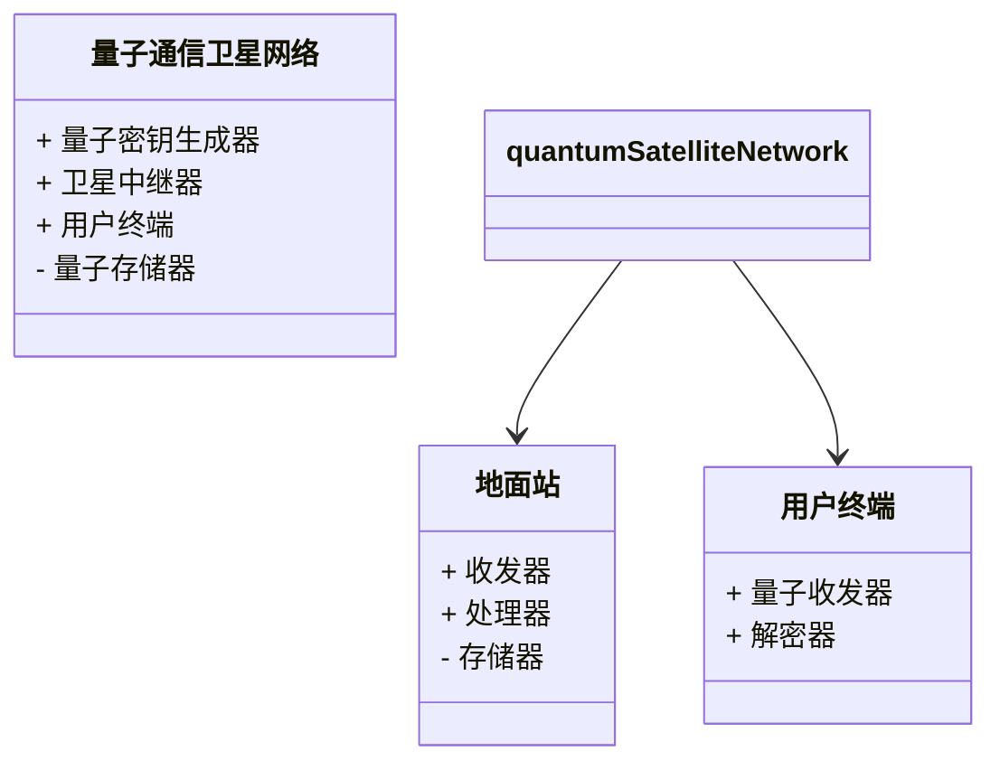
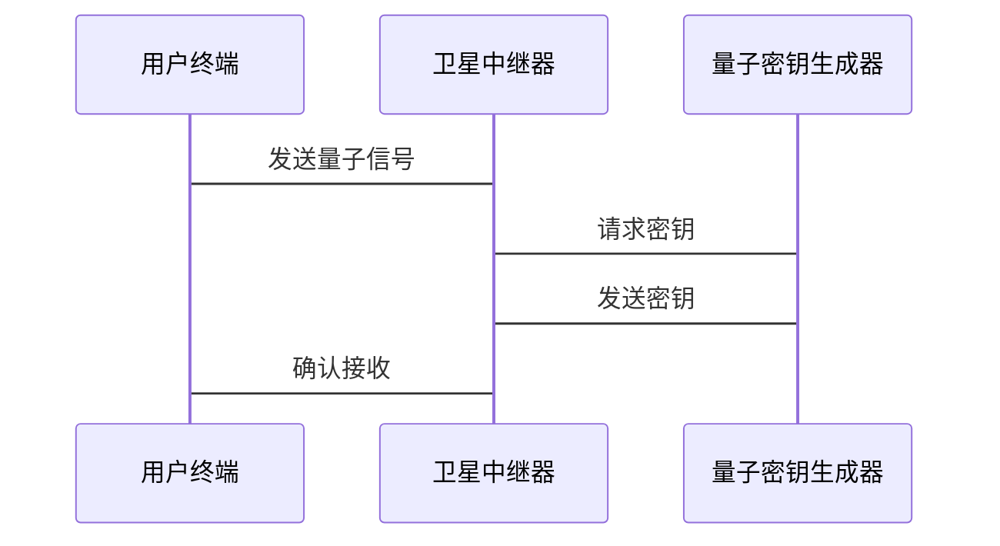

                 


# 巴菲特-芒格的量子通信卫星网络投资：全球量子互联网的骨干

## 关键词
- 量子通信卫星网络
- 巴菲特投资策略
- 芒格多元思维模型
- 全球量子互联网
- 卫星网络架构
- 量子密钥分发

## 摘要
本文探讨了巴菲特和芒格投资量子通信卫星网络的背景、策略及技术细节。通过分析量子通信的核心技术，如量子密钥分发和量子中继，结合卫星网络的架构设计，展示了这些技术在全球量子互联网中的关键作用。文章还详细讲解了投资策略的逻辑，以及系统设计和项目实施的关键点，为读者提供了全面的技术和投资见解。

---

## 第1章：量子通信与卫星网络概述

### 1.1 量子通信的基本概念
#### 1.1.1 量子通信的定义与原理
量子通信利用量子态的不可克隆性和纠缠特性，确保通信的安全性。其核心机制包括量子密钥分发（QKD）和量子中继技术。

#### 1.1.2 卫星网络的结构与功能
卫星网络通过卫星中继信号，覆盖全球，提供高速通信。量子通信卫星网络结合了量子技术和卫星通信，构建安全的全球网络。

#### 1.1.3 量子通信与卫星网络的结合
量子通信卫星网络通过卫星实现长距离通信，克服了地面光纤通信的限制，为全球量子互联网奠定基础。

### 1.2 巴菲特与芒格的投资策略
#### 1.2.1 巴菲特的价值投资理念
巴菲特注重企业的长期价值和竞争优势，投资那些具有持续增长潜力的企业。

#### 1.2.2 芒格的多元思维模型
芒格强调跨学科思维，寻找多个领域的共同点，做出更全面的投资决策。

#### 1.2.3 投资策略与量子通信的关联
巴菲特和芒格的投资策略基于对量子通信技术潜力和市场的深入分析，认为其具备长期增长的潜力。

---

## 第2章：量子通信的核心技术

### 2.1 量子密钥分发（QKD）
#### 2.1.1 QKD的原理与实现
量子密钥分发通过量子态传输密钥，确保只有合法用户能够获取密钥，实现无条件安全通信。

#### 2.1.2 卫星QKD的优势
卫星QKD克服了地面光纤的距离限制，实现更广的覆盖范围，适合全球通信。

#### 2.1.3 QKD的实际应用案例
如中国“墨子号”量子卫星的成功实验，展示了卫星QKD的实际可行性。

### 2.2 量子中继技术
#### 2.2.1 量子中继的原理
量子中继利用量子中继器延长量子通信的距离，通过纠缠分发技术实现长距离通信。

#### 2.2.2 中继在卫星网络中的作用
量子中继技术增强了卫星网络的覆盖能力，提高了通信的稳定性和可靠性。

#### 2.2.3 中继技术的最新进展
最新的量子中继技术结合了更高效率的量子存储和纠缠分发方法，进一步提升了通信性能。

---

## 第3章：卫星网络的架构与挑战

### 3.1 卫星网络的系统架构
#### 3.1.1 卫星通信的基本架构
卫星网络通常由地面站、中继卫星和用户终端组成，形成多层次的通信结构。

#### 3.1.2 量子通信卫星的特殊设计
量子通信卫星需要特殊的硬件和协议设计，确保量子态的稳定传输和安全通信。

#### 3.1.3 网络拓扑结构分析
量子通信卫星网络采用星形拓扑结构，中心卫星连接多个地面站和用户终端，确保高效通信。

### 3.2 技术挑战与解决方案
#### 3.2.1 量子态稳定传输的问题
量子态在传输过程中容易受到环境干扰，需要先进的纠错和编码技术来确保数据完整性。

#### 3.2.2 卫星间通信的技术难点
卫星间通信需要高精度的同步和协调，确保数据的准确传输和网络的稳定性。

#### 3.2.3 现有解决方案的优缺点
现有解决方案如量子中继和纠错编码技术有效缓解了部分问题，但仍需进一步优化以提高通信效率和安全性。

---

## 第4章：巴菲特与芒格的量子通信投资分析

### 4.1 投资背景分析
#### 4.1.1 量子通信市场的现状
量子通信市场正在快速发展，吸引了大量投资，市场潜力巨大。

#### 4.1.2 巴菲特与芒格的投资动向
巴菲特和芒格通过投资相关企业，布局量子通信领域，抓住技术变革带来的投资机会。

#### 4.1.3 量子通信的市场潜力
随着技术成熟和应用拓展，量子通信市场预计将持续增长，为投资者带来丰厚回报。

### 4.2 投资策略的深度解析
#### 4.2.1 价值投资在量子通信领域的应用
巴菲特的价值投资理念注重企业的长期价值和竞争优势，适合量子通信这种技术驱动型行业。

#### 4.2.2 多元思维模型的实践
芒格的多元思维模型帮助投资者从多个角度分析行业风险和机会，做出更全面的投资决策。

#### 4.2.3 风险评估与投资决策
通过对量子通信技术、市场和企业的综合评估，巴菲特和芒格识别出投资机会，规避潜在风险。

---

## 第5章：量子通信卫星网络的系统设计

### 5.1 系统功能设计
#### 5.1.1 用户需求分析
系统需满足高安全性、广覆盖和低延迟的通信需求。

#### 5.1.2 功能模块划分
包括密钥生成、分发、存储和管理等功能模块，确保系统的高效运行。

#### 5.1.3 领域模型设计（Mermaid类图）


### 5.2 系统架构设计
#### 5.2.1 分层架构设计（Mermaid架构图）
```mermaid
repository
    title 量子通信卫星网络架构
    group 量子层 {
        service 量子密钥分发(QKD) {
            state 状态1
            transition 到状态2
        }
    }
    group 卫星层 {
        service 卫星中继器(QR) {
            state 状态A
            transition 到状态B
        }
    }
    group 用户层 {
        service 用户终端(UT) {
            state 状态X
            transition 到状态Y
        }
    }
```

#### 5.2.2 组件间的交互设计（Mermaid序列图）


#### 5.2.3 接口设计与实现
系统需要定义清晰的接口标准，如API和通信协议，确保各组件协同工作。

---

## 第6章：项目实战与案例分析

### 6.1 项目环境配置
#### 6.1.1 开发环境搭建
安装必要的开发工具和库，配置量子通信实验环境。

#### 6.1.2 必要工具安装
如量子态测量设备、通信协议测试工具等。

### 6.2 核心代码实现
#### 6.2.1 量子密钥分发算法实现
```python
import random

def generate_key():
    key = random.getrandbits(1)
    return key

def qkd_protocol(satellite, ground):
    while True:
        key = generate_key()
        satellite.send_key(key)
        if ground.receive_key(key):
            break
```

#### 6.2.2 卫星通信协议编写
```python
class Satellite:
    def __init__(self, id):
        self.id = id
        self.keys = []

    def send_key(self, key):
        self.keys.append(key)

class GroundStation:
    def __init__(self):
        self.keys_received = []

    def receive_key(self, key):
        self.keys_received.append(key)
        return True

# 示例用法
satellite = Satellite(1)
ground = GroundStation()
qkd_protocol(satellite, ground)
```

#### 6.2.3 网络模拟与测试
使用网络模拟软件测试量子通信卫星网络的性能和稳定性。

### 6.3 案例分析与经验总结
#### 6.3.1 实际案例的详细分析
如“墨子号”量子卫星实验，展示了量子通信卫星的实际应用和效果。

#### 6.3.2 项目中的常见问题及解决方案
如量子态传输的干扰问题，解决方案包括优化编码和使用更稳定的传输介质。

#### 6.3.3 项目总结与改进建议
总结项目成果，提出进一步优化的方向，如提高通信效率和安全性。

---

## 第7章：总结与展望

### 7.1 本书的核心观点回顾
量子通信卫星网络是全球量子互联网的重要组成部分，巴菲特和芒格的投资策略为该领域的发展提供了资金支持和技术动力。

### 7.2 量子通信的未来趋势
随着技术的进步和市场的扩展，量子通信将逐步应用于更多领域，推动全球通信体系的升级。

### 7.3 对投资者的建议
投资者应关注量子通信技术的发展和市场动态，结合巴菲特和芒格的投资策略，做出明智的投资决策。

---

## 作者：AI天才研究院/AI Genius Institute & 禅与计算机程序设计艺术 /Zen And The Art of Computer Programming

