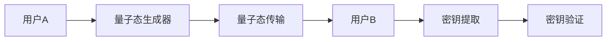

                 


```markdown
# 巴菲特-芒格的量子通信网络投资：下一代互联网的基础

> 关键词：巴菲特, 芒格, 量子通信, 投资策略, 网络技术, 安全性

> 摘要：本文探讨了巴菲特和芒格在量子通信网络领域的投资策略，分析了量子通信网络的核心技术及其在下一代互联网中的应用前景。通过详细的技术背景介绍、算法原理解析、系统架构设计和项目实战案例，本文为读者提供了全面的理解量子通信网络投资价值的视角。

---

# 第一部分: 量子通信网络投资背景

## 第1章: 量子通信网络的核心概念

### 1.1 量子通信的基本概念

量子通信是一种利用量子力学原理进行信息传输的技术，主要依赖于量子叠加态和纠缠态。与传统通信不同，量子通信具有绝对安全性，无法被窃听或篡改。

#### 1.1.1 量子通信与经典通信的对比

| 特性         | 经典通信          | 量子通信          |
|--------------|-------------------|-------------------|
| 数据传输      | 易被窃听          | 绝对安全          |
| 传输速度      | 稳定              | 高速              |
| 技术复杂度    | 较低              | 高                |

#### 1.1.2 量子通信的核心技术

- **量子密钥分发（QKD）**：通过量子态传输密钥，确保密钥的安全性。
- **量子中继技术**：用于延长量子通信的距离，克服量子态衰减的问题。

### 1.2 巴菲特与芒格的投资哲学

#### 1.2.1 巴菲特的价值投资理念

巴菲特强调长期投资，关注企业的内在价值和管理层质量。他认为投资是选择优秀的企业，而不是追求数字上的收益。

#### 1.2.2 芒格的多元思维模型

芒格提倡通过多学科的思维模型来分析问题，避免单一视角的局限性。他强调投资决策的深度思考和风险控制。

### 1.3 量子通信网络的投资价值

#### 1.3.1 量子通信的市场前景

随着信息安全需求的增加，量子通信在金融、军事和政府领域的应用潜力巨大。

#### 1.3.2 量子通信的技术壁垒

量子通信的技术门槛高，研发投入大，但一旦实现商业化，将带来巨大的经济效益。

#### 1.3.3 量子通信的投资风险

技术尚未完全成熟，商业化进程缓慢，政策法规的不确定性也是投资风险之一。

---

## 第2章: 量子通信网络的核心技术

### 2.1 量子密钥分发（QKD）

#### 2.1.1 QKD的基本原理

QKD通过量子态传输密钥，确保只有合法用户能够获取密钥。其流程如下：



#### 2.1.2 QKD的实现方式

量子密钥分发可以通过不同的协议实现，如BB84协议和EPR协议。

#### 2.1.3 QKD的安全性分析

QKD的安全性基于量子力学的不可克隆原理，确保密钥无法被窃听或篡改。

### 2.2 量子中继技术

#### 2.2.1 量子中继的定义

量子中继是一种通过中继站延长量子通信距离的技术，克服量子态衰减的问题。

#### 2.2.2 量子中继的工作原理

量子中继利用量子纠缠和量子存储技术，实现远距离量子通信。

#### 2.2.3 量子中继的应用场景

量子中继适用于长距离通信，如卫星与地面站之间的量子通信。

---

## 第3章: 量子通信网络的投资策略

### 3.1 巴菲特与芒格的投资策略

#### 3.1.1 巴菲特的长期价值投资

巴菲特长期投资于具有强大护城河和稳定现金流的企业。

#### 3.1.2 芒格的多元思维模型

芒格通过多学科分析，寻找投资机会中的确定性。

### 3.2 量子通信网络的投资策略

#### 3.2.1 选择优质企业的标准

投资量子通信企业时，需关注企业的技术实力、管理团队和市场前景。

#### 3.2.2 风险控制与分散投资

通过分散投资和严格的风险评估，降低投资风险。

#### 3.2.3 长期持有的重要性

量子通信技术的成熟需要时间，长期持有有助于分享技术发展的红利。

---

## 第4章: 量子通信网络的技术挑战

### 4.1 量子通信的技术难点

#### 4.1.1 量子态的脆弱性

量子态易受环境干扰，导致信号衰减。

#### 4.1.2 量子通信的距离限制

目前量子通信的距离有限，需依赖中继技术扩展。

#### 4.1.3 量子通信的设备依赖性

量子通信依赖于高精度设备，设备故障可能影响通信质量。

### 4.2 量子通信的标准化问题

#### 4.2.1 量子通信标准的制定

全球范围内量子通信标准尚未统一，影响技术发展。

#### 4.2.2 不同国家的量子通信标准

各国技术标准的差异可能导致技术分裂。

#### 4.2.3 标准化对投资的影响

标准化进程影响量子通信的商业化和投资回报。

### 4.3 量子通信的商业化挑战

#### 4.3.1 市场接受度的问题

市场对量子通信的认知和接受度较低，限制了商业化进程。

#### 4.3.2 技术成本的高昂

量子通信技术的研发和设备成本高，影响市场推广。

#### 4.3.3 产业链的不完善

量子通信产业链尚未完善，缺乏协同效应。

---

## 第5章: 量子通信网络的未来展望

### 5.1 量子通信的未来发展

量子通信技术将逐步成熟，应用场景将不断扩展。

### 5.2 巴菲特与芒格投资策略的启示

量子通信的投资需要长期视角和风险管理，借鉴巴菲特和芒格的策略有助于优化投资决策。

### 5.3 量子通信与下一代互联网

量子通信将作为下一代互联网的重要组成部分，推动信息通信技术的革新。

---

# 第二部分: 量子通信网络投资策略

## 第6章: 量子通信网络的系统架构设计

### 6.1 量子通信网络的分层结构

量子通信网络通常分为量子层、经典层和应用层。

### 6.2 量子通信网络的组成部分

包括量子节点、量子信道和量子管理模块。

### 6.3 量子通信网络的拓扑结构

常用的拓扑结构有星型、链式和网状结构。

## 第7章: 量子通信网络的投资实战

### 7.1 项目实战环境安装

#### 7.1.1 系统环境配置

安装必要的量子通信开发工具和库。

#### 7.1.2 量子通信开发工具

介绍常用的量子通信开发框架和模拟工具。

### 7.2 系统核心实现源代码

#### 7.2.1 量子密钥分发协议实现

```python
import random

def generate_key():
    key = []
    for _ in range(100):
        bit = random.choice([0, 1])
        key.append(bit)
    return key

def compare_keys(key1, key2):
    errors = 0
    for i in range(len(key1)):
        if key1[i] != key2[i]:
            errors += 1
    return errors

# 示例代码
key1 = generate_key()
key2 = generate_key()
error_rate = compare_keys(key1, key2)
print(f"错误率: {error_rate}%")
```

#### 7.2.2 量子中继技术实现

```python
class QuantumRelay:
    def __init__(self, nodes):
        self.nodes = nodes
        self.channels = {}
    
    def add_channel(self, node1, node2):
        self.channels[(node1, node2)] = True
    
    def remove_channel(self, node1, node2):
        self.channels[(node1, node2)] = False
    
    def is_connected(self, node1, node2):
        return self.channels.get((node1, node2), False)
```

### 7.3 代码应用解读与分析

量子密钥分发协议的实现展示了密钥生成和比较的过程，帮助理解量子通信的基本原理。

### 7.4 实际案例分析

分析某量子通信企业的投资案例，探讨其成功和失败的原因。

### 7.5 项目小结

总结项目实施过程中的关键点和经验教训。

---

# 第三部分: 量子通信网络投资的最佳实践

## 第8章: 量子通信网络投资的注意事项

### 8.1 投资前的准备工作

#### 8.1.1 技术调研

深入了解量子通信的技术细节和行业动态。

#### 8.1.2 市场分析

分析量子通信的市场需求和竞争格局。

### 8.2 投资过程中的风险管理

#### 8.2.1 风险评估

识别和评估投资中的潜在风险。

#### 8.2.2 风险控制

制定有效的风险控制策略，降低投资损失。

## 第9章: 量子通信网络投资的未来趋势

### 9.1 量子通信技术的未来发展

量子通信技术将向更高效、更安全的方向发展。

### 9.2 量子通信市场的扩展

随着技术进步，量子通信市场将逐步扩大。

### 9.3 巴菲特与芒格投资策略的演变

巴菲特和芒格的投资策略将根据量子通信技术的发展不断调整。

---

# 作者信息

作者：AI天才研究院/AI Genius Institute & 禅与计算机程序设计艺术/Zen And The Art of Computer Programming
```

