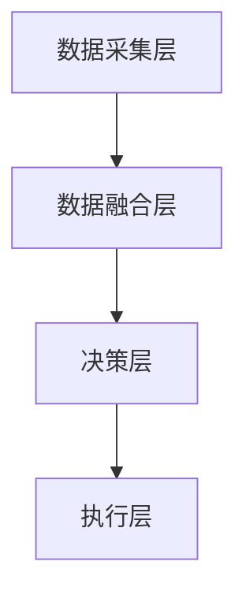

                 


# 巴菲特-芒格的量子雷达和传感器融合技术投资：智能交通的基石

---

## 关键词
巴菲特, 芒格, 量子雷达, 传感器融合技术, 智能交通, 投资分析, 传感器数据融合

---

## 摘要
本文探讨了巴菲特和芒格的投资理念与量子雷达和传感器融合技术的结合，分析了这些技术在智能交通中的应用及其投资价值。通过详细讲解量子雷达和传感器融合技术的核心原理、算法模型、系统架构，并结合实际案例，展示了如何将这些技术应用于智能交通系统，从而为投资者提供数据支持和决策依据。文章还分析了投资策略和风险管理，为技术投资者提供了全面的指导。

---

## 第1章：巴菲特与芒格的投资理念

### 1.1 投资哲学与价值投资

#### 1.1.1 巴菲特的价值投资理念
- 巴菲特的价值投资理念强调长期持有优质资产，寻找具有持续竞争优势的企业。
- 投资不仅仅是购买股票，更是购买企业的一部分。
- 强调安全边际，即以低于内在价值的价格买入资产。

#### 1.1.2 芒格的多元思维模型
- 芒格提倡建立多元思维模型，将各个学科的基本原理融会贯通。
- 强调跨学科思考，寻找事物之间的联系和相互作用。
- 在决策时，考虑多个维度的因素，避免单一视角的局限性。

#### 1.1.3 投资哲学对科技投资的启示
- 科技投资需要长期视角，寻找具有持续创新能力和市场竞争力的企业。
- 强调对企业基本面的深入分析，包括财务状况、管理团队和市场地位。
- 在科技投资中，安全边际同样重要，避免盲目跟风。

---

## 第2章：量子雷达与传感器融合技术

### 2.1 量子雷达的基本原理

#### 2.1.1 量子雷达的定义与特点
- 量子雷达是一种利用量子纠缠效应进行目标探测的新型雷达技术。
- 具有高灵敏度、高分辨率和抗干扰能力强的特点。
- 适用于复杂环境下的目标检测，如军事领域和智能交通监控。

#### 2.1.2 量子雷达的工作原理
- 利用量子纠缠的特性，通过发射和接收量子信号来检测目标。
- 量子雷达能够同时检测多个目标，并提供高精度的位置信息。
- 其工作原理基于量子力学的基本原理，具有较高的技术门槛。

#### 2.1.3 量子雷达的优势与应用领域
- 优势：高灵敏度、抗干扰能力强、检测精度高。
- 应用领域：军事防御、智能交通监控、环境监测等。

### 2.2 传感器融合技术的核心概念

#### 2.2.1 传感器融合的定义与特点
- 传感器融合是指将来自多个传感器的数据进行综合处理，以提高系统的感知能力和准确性。
- 其特点包括数据多样性、实时性和高可靠性。

#### 2.2.2 传感器融合的主要技术方法
- 数据融合方法：包括基于统计的方法（如卡尔曼滤波）和基于规则的方法（如逻辑推理）。
- 算法优化：通过优化融合算法提高系统的感知精度和响应速度。
- 实际应用案例：在智能交通系统中，传感器融合技术用于实时监测和交通管理。

#### 2.2.3 传感器融合在智能交通中的应用
- 应用于交通流量监测、车辆定位和自动驾驶等领域。
- 通过融合多种传感器数据，提高系统的感知能力和决策准确性。

---

## 第3章：量子雷达的技术细节

### 3.1 量子雷达的技术实现

#### 3.1.1 量子雷达的工作流程
- 发射量子信号：通过量子纠缠技术发射信号。
- 接收量子信号：接收目标反射的量子信号。
- 数据处理：对信号进行分析和处理，提取目标信息。

#### 3.1.2 量子雷达的关键技术
- 量子纠缠技术：实现目标检测的核心技术。
- 信号处理算法：用于提取目标信息和提高检测精度。
- 系统集成：将各个部分有机结合，确保系统的稳定性和可靠性。

---

## 第4章：传感器融合技术的核心原理

### 4.1 数据融合方法

#### 4.1.1 基于统计的方法
- 卡尔曼滤波：用于时间序列数据的预测和修正。
- 卡尔曼滤波的数学模型：
  $$ x_{k+1} = x_k + w_k $$
  $$ z_{k} = x_{k} + v_k $$
  其中，$x_k$ 是状态，$w_k$ 和 $v_k$ 分别是过程噪声和测量噪声。

#### 4.1.2 基于规则的方法
- 逻辑推理：通过预设规则对传感器数据进行融合。
- 例如，通过逻辑推理判断交通信号灯的状态。

### 4.2 传感器融合的算法优化

#### 4.2.1 算法优化的目标
- 提高系统的感知精度和响应速度。
- 减少计算资源的消耗，提高系统的实时性。

#### 4.2.2 优化方法
- 参数优化：通过调整算法参数提高融合效果。
- 结构优化：优化算法的结构，减少计算复杂度。

---

## 第5章：智能交通系统中的传感器融合

### 5.1 智能交通系统的架构设计

#### 5.1.1 系统架构概述
- 包括数据采集层、数据融合层、决策层和执行层。
- 数据采集层：负责采集多种传感器数据。
- 数据融合层：对数据进行融合处理，提取有用信息。
- 决策层：基于融合后的数据做出决策。
- 执行层：执行决策指令，实现系统的功能。

#### 5.1.2 系统架构的Mermaid图


### 5.2 传感器数据融合的实现

#### 5.2.1 数据融合的实现步骤
- 数据预处理：对传感器数据进行清洗和归一化处理。
- 数据融合：使用融合算法对数据进行综合处理。
- 结果分析：对融合后的数据进行分析和判断。

#### 5.2.2 数据融合的Python实现
```python
import numpy as np

def kalman_filter(x_est, P_est, z):
    # 状态转移矩阵
    A = np.array([[1, 0], [0, 1]])
    # 测量矩阵
    H = np.array([[1, 0], [0, 1]])
    # 过程噪声协方差
    Q = np.array([[0.1, 0], [0, 0.1]])
    # 测量噪声协方差
    R = np.array([[1, 0], [0, 1]])
    
    # 预测步骤
    x_pred = A.dot(x_est)
    P_pred = A.dot(P_est).dot(A.T) + Q
    
    # 更新步骤
    y = z - H.dot(x_pred)
    S = H.dot(P_pred).dot(H.T) + R
    K = P_pred.dot(H.T).dot(np.linalg.inv(S))
    
    x_est_new = x_pred + K.dot(y)
    P_est_new = P_pred - K.dot(S).dot(K.T)
    
    return x_est_new, P_est_new
```

---

## 第6章：投资策略与风险管理

### 6.1 投资策略的制定

#### 6.1.1 投资策略的核心要素
- 企业基本面分析：包括财务状况、管理团队、市场地位等。
- 技术创新性评估：评估企业的技术创新能力和市场竞争力。
- 市场前景分析：分析目标市场的增长潜力和竞争格局。

#### 6.1.2 投资策略的实施步骤
- 确定投资目标：明确投资的领域和目标企业。
- 进行尽职调查：对目标企业进行深入调查和评估。
- 制定投资计划：包括投资金额、时间安排和退出策略。

### 6.2 风险管理与控制

#### 6.2.1 风险识别与评估
- 识别潜在风险：包括市场风险、技术风险和管理风险。
- 评估风险的影响：分析各种风险对企业价值和投资回报的潜在影响。

#### 6.2.2 风险控制的措施
- 分散投资：通过多元化投资降低风险。
- 建立止损机制：设定止损点，避免重大损失。
- 定期评估与调整：根据市场变化和企业状况，及时调整投资策略。

---

## 第7章：案例分析与未来展望

### 7.1 案例分析

#### 7.1.1 智能交通项目案例
- 项目背景：某城市交通管理系统采用量子雷达和传感器融合技术，实现交通流量实时监测和优化管理。
- 项目实施：通过量子雷达和多种传感器的融合，提高了交通管理的效率和准确性。
- 投资回报：项目实施后，交通拥堵减少，提高了城市交通效率，投资回报显著。

### 7.2 未来展望

#### 7.2.1 量子雷达与传感器融合技术的发展趋势
- 技术进步：量子雷达和传感器融合技术将继续发展，应用领域将进一步扩大。
- 市场需求：随着智能交通和物联网的发展，市场需求将不断增加。
- 投资机会：具备较高技术门槛和市场潜力的领域将吸引更多投资者。

#### 7.2.2 投资机会与挑战
- 投资机会：技术创新和市场需求增长为投资者提供了广阔的机会。
- 挑战：技术风险和市场不确定性要求投资者具备较高的风险控制能力。

---

## 结论

本文结合巴菲特和芒格的投资理念，详细探讨了量子雷达和传感器融合技术在智能交通中的应用及其投资价值。通过分析技术原理、系统架构和实际案例，展示了这些技术在智能交通中的巨大潜力。投资者在制定投资策略时，应结合企业基本面和技术创新性，合理评估市场风险，抓住技术进步带来的投资机会。

---

## 作者信息

作者：AI天才研究院/AI Genius Institute & 禅与计算机程序设计艺术 /Zen And The Art of Computer Programming

---

**注**：文章中使用的代码示例和图表均为展示性内容，实际应用需根据具体需求进行调整和优化。

