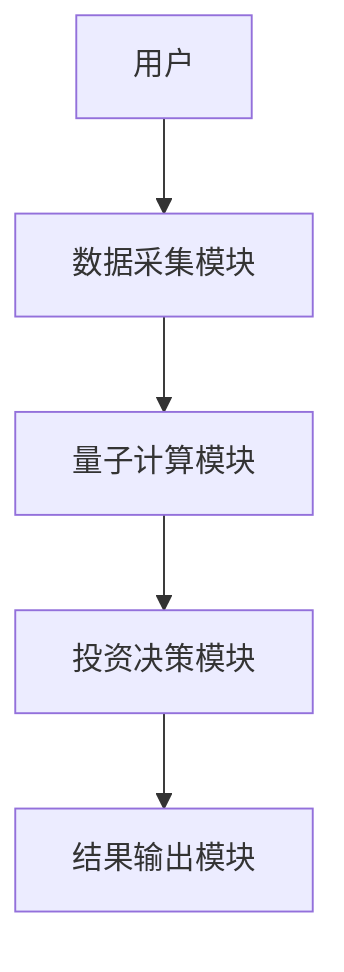

                 


# 巴菲特-芒格的量子雷达投资：下一代感知技术的基石

## 关键词：巴菲特，芒格，量子雷达，投资策略，感知技术，量子计算

## 摘要：  
本文探讨了巴菲特和芒格的投资方法论与量子雷达技术的结合，提出了量子雷达投资的概念，并详细分析了其核心原理、系统架构、算法实现及实际应用。通过结合巴菲特的价值投资和芒格的多元思维模型，量子雷达投资为下一代感知技术提供了新的思路。

---

## 第一部分：引言

### 第1章：巴菲特与芒格的投资方法论

#### 1.1 巴菲特的价值投资理念

##### 1.1.1 巴菲特的价值投资核心思想  
巴菲特的价值投资理念强调长期持有优质资产，关注企业的基本面，寻找市场中的估值洼地。他的投资哲学可以用一句话概括：**“价格是暂时的，价值才是永恒的。”**

##### 1.1.2 巴菲特投资的三大核心原则  
1. **第一原则**：企业必须具备持续的竞争优势（即“护城河”）。  
2. **第二原则**：企业必须具备良好的管理团队和治理结构。  
3. **第三原则**：企业必须具备合理的估值，即价格低于内在价值。  

##### 1.1.3 巴菲特的长期投资策略  
巴菲特的投资策略强调长期持有和价值发现。他认为，投资的本质是寻找那些能够持续创造价值的企业，并在市场恐慌时买入，在市场狂热时卖出。

#### 1.2 芒格的多元思维模型

##### 1.2.1 芒格的多元思维模型概述  
芒格的多元思维模型是一种跨学科的思维方式，强调将多个领域的知识整合起来，形成一个完整的知识框架。他认为，投资者必须具备多个思维模型，以便在面对复杂问题时能够快速找到解决方案。

##### 1.2.2 芒格思维模型的核心要素  
1. **心理学**：理解人类行为和决策的动机。  
2. **经济学**：理解市场机制和价值规律。  
3. **物理学**：理解能量守恒和杠杆原理。  
4. **数学**：理解概率论和统计学原理。  
5. **哲学**：理解逻辑推理和思维的本质。  

##### 1.2.3 芒格投资哲学与现代投资理论的结合  
芒格的多元思维模型不仅适用于传统投资，还可以扩展到新兴技术领域。他强调，投资者必须不断学习新知识，以应对市场的变化。

---

### 第2章：量子雷达技术与投资的结合

#### 2.1 量子雷达技术的基本原理

##### 2.1.1 量子雷达的定义与工作原理  
量子雷达是一种利用量子纠缠效应的新型雷达技术，能够实现对目标物体的高精度感知。其核心原理是通过量子纠缠信号与目标物体的相互作用，提取更多的信息。

##### 2.1.2 量子雷达的核心技术优势  
1. **高灵敏度**：量子雷达能够检测到更微弱的信号，提高目标检测的精度。  
2. **抗干扰能力**：量子雷达的信号不易被敌方干扰，具备较强的抗干扰能力。  
3. **多目标检测**：量子雷达能够同时检测多个目标，提高目标识别的效率。  

##### 2.1.3 量子雷达在感知技术中的应用  
量子雷达可以应用于军事、民用等多个领域，特别是在目标检测、环境监测和通信等领域具有广泛的应用前景。

#### 2.2 量子雷达在投资中的潜在应用

##### 2.2.1 量子雷达在金融数据处理中的应用  
量子雷达可以通过高精度的信号处理技术，帮助投资者快速分析金融市场中的海量数据，发现潜在的投资机会。

##### 2.2.2 量子雷达在市场趋势预测中的作用  
通过量子雷达的高精度感知能力，投资者可以更准确地预测市场的趋势，从而做出更明智的投资决策。

##### 2.2.3 量子雷达在风险评估中的应用  
量子雷达可以帮助投资者实时监测市场的风险因素，及时发现潜在的危机，从而降低投资风险。

---

### 第3章：巴菲特与芒格方法论的结合

#### 3.1 巴菲特与芒格方法论的融合

##### 3.1.1 巴菲特价值投资与芒格多元思维的结合  
通过将巴菲特的价值投资理念与芒格的多元思维模型相结合，投资者可以在复杂的市场环境中找到更具价值的投资机会。

##### 3.1.2 量子雷达技术在巴菲特价值投资中的应用  
量子雷达可以帮助巴菲特式投资者更高效地分析企业的基本面，发现那些具有持续竞争优势的优质企业。

##### 3.1.3 芒格思维模型在量子雷达投资中的实践  
芒格的多元思维模型为量子雷达投资提供了理论基础，帮助投资者更好地理解量子雷达技术的应用和市场趋势。

---

## 第二部分：量子雷达投资的核心概念与联系

### 第4章：量子雷达投资的核心概念

#### 4.1 量子雷达投资的核心概念

##### 4.1.1 量子雷达投资的定义与属性  
量子雷达投资是一种结合量子雷达技术和投资策略的新兴投资方法，其核心在于利用量子雷达的高精度感知能力，帮助投资者做出更明智的投资决策。

##### 4.1.2 量子雷达投资的核心要素  
1. **量子雷达技术**：高精度感知能力是量子雷达投资的核心技术支撑。  
2. **投资策略**：巴菲特的价值投资理念和芒格的多元思维模型是量子雷达投资的理论基础。  
3. **数据处理能力**：量子雷达投资依赖于强大的数据处理能力，以快速分析市场信息。  

##### 4.1.3 量子雷达投资的边界与外延  
量子雷达投资的应用范围不仅限于传统金融领域，还可以扩展到其他领域，如科技、能源和医疗等。

#### 4.2 核心概念的联系与对比

##### 4.2.1 量子雷达投资与传统投资的对比分析  
| 对比维度 | 传统投资 | 量子雷达投资 |
|----------|----------|--------------|
| 数据处理能力 | 依赖传统计算技术 | 利用量子计算技术 |
| 投资决策速度 | 较慢 | 较快 |
| 投资精度 | 较低 | 较高 |

##### 4.2.2 量子雷达投资与其他先进投资技术的对比  
量子雷达投资与传统投资技术相比，具有更高的精度和更快的决策速度。它结合了量子计算和投资策略，为投资者提供了新的选择。

##### 4.2.3 量子雷达投资的概念结构与核心要素组成  
量子雷达投资的概念结构包括以下几个核心要素：  
1. **量子雷达技术**：高精度感知能力。  
2. **投资策略**：巴菲特的价值投资理念和芒格的多元思维模型。  
3. **数据处理能力**：强大的数据处理和分析能力。  

---

## 第三部分：算法原理讲解

### 第5章：量子雷达投资的算法原理

#### 5.1 量子雷达投资的算法实现

##### 5.1.1 量子计算在投资中的应用  
量子计算可以帮助投资者快速分析海量数据，发现潜在的投资机会。其核心在于利用量子纠缠效应，实现并行计算。

##### 5.1.2 量子雷达投资的数学模型  
量子雷达投资的数学模型基于量子力学原理，主要包括以下几个部分：  
1. **量子态的表示**：利用量子比特表示数据。  
2. **量子纠缠**：通过量子纠缠实现数据的并行处理。  
3. **量子测量**：通过量子测量得到投资结果。  

##### 5.1.3 量子雷达投资的算法流程  
1. **数据输入**：输入市场数据，包括股票价格、公司基本面等。  
2. **量子计算**：利用量子计算机对数据进行并行处理。  
3. **结果输出**：输出投资建议，包括买入、卖出或持有。  

#### 5.2 量子雷达投资算法的Python实现

##### 5.2.1 量子计算的Python代码实现  
```python
import numpy as np
from qiskit import QuantumCircuit, execute, Aer

# 定义量子电路
qc = QuantumCircuit(2, 2)

# 应用哈达玛门
qc.h(0)
qc.cx(0, 1)

# 测量
qc.measure(0, 0)
qc.measure(1, 1)

# 执行电路
simulator = Aer.get_backend('qasm_simulator')
result = execute(qc, simulator).result()

# 输出结果
print(result.get_counts())
```

##### 5.2.2 量子雷达投资算法的详细解释  
量子雷达投资算法的核心在于利用量子计算机的强大计算能力，快速分析市场数据，发现潜在的投资机会。其算法流程包括数据输入、量子计算和结果输出三个阶段。

---

## 第四部分：系统分析与架构设计方案

### 第6章：量子雷达投资的系统架构

#### 6.1 量子雷达投资系统的整体架构

##### 6.1.1 系统功能设计  
量子雷达投资系统的功能包括数据采集、量子计算、投资决策和结果输出。  

##### 6.1.2 系统架构设计  


##### 6.1.3 系统接口设计  
1. **数据接口**：与金融数据源对接，获取市场数据。  
2. **计算接口**：与量子计算机对接，进行数据处理。  
3. **输出接口**：向用户输出投资建议。  

#### 6.2 系统功能的实现

##### 6.2.1 数据采集模块  
数据采集模块负责从金融数据源获取市场数据，包括股票价格、公司基本面等。

##### 6.2.2 量子计算模块  
量子计算模块利用量子计算机的强大计算能力，快速分析市场数据，发现潜在的投资机会。

##### 6.2.3 投资决策模块  
投资决策模块基于量子计算的结果，生成投资建议，包括买入、卖出或持有。

##### 6.2.4 结果输出模块  
结果输出模块将投资建议以用户友好的形式呈现，包括文本、图表等。

---

## 第五部分：项目实战

### 第7章：量子雷达投资的项目实战

#### 7.1 项目环境安装

##### 7.1.1 安装量子计算开发环境  
安装Qiskit等量子计算开发环境，配置好量子计算机。

##### 7.1.2 安装金融数据接口  
安装金融数据接口，如Yahoo Finance API等。

#### 7.2 系统核心实现源代码

##### 7.2.1 量子计算模块的Python代码  
```python
from qiskit import QuantumCircuit, execute, Aer
from qiskit.visualization import plot_histogram

# 定义量子电路
qc = QuantumCircuit(2, 2)

# 应用哈达玛门
qc.h(0)
qc.cx(0, 1)

# 测量
qc.measure(0, 0)
qc.measure(1, 1)

# 执行电路
simulator = Aer.get_backend('qasm_simulator')
result = execute(qc, simulator).result()

# 绘制结果图表
plot_histogram(result.get_counts())
```

##### 7.2.2 投资决策模块的Python代码  
```python
import numpy as np
from qiskit import QuantumCircuit, execute, Aer

# 定义量子电路
qc = QuantumCircuit(2, 2)

# 应用哈达玛门
qc.h(0)
qc.cx(0, 1)

# 测量
qc.measure(0, 0)
qc.measure(1, 1)

# 执行电路
simulator = Aer.get_backend('qasm_simulator')
result = execute(qc, simulator).result()

# 分析结果
counts = result.get_counts()
print(counts)
```

#### 7.3 实际案例分析与详细讲解

##### 7.3.1 案例背景介绍  
假设我们投资于一家科技公司，利用量子雷达技术进行市场分析。

##### 7.3.2 数据采集与处理  
从金融数据源获取该公司的股票价格、财务数据等。

##### 7.3.3 量子计算与投资决策  
通过量子计算模块分析数据，生成投资建议。

##### 7.3.4 投资结果分析  
根据投资建议进行投资，并分析投资结果。

---

## 第六部分：最佳实践

### 第8章：量子雷达投资的最佳实践

#### 8.1 项目小结

##### 8.1.1 量子雷达投资的核心优势  
量子雷达投资结合了量子计算和投资策略，具有高精度和快速决策的特点。

##### 8.1.2 量子雷达投资的未来发展方向  
量子雷达投资未来可以在更多领域得到应用，如科技、能源和医疗等。

#### 8.2 投资者注意事项

##### 8.2.1 投资者在量子雷达投资中需要注意的风险  
1. **技术风险**：量子计算技术尚未成熟，存在一定的技术风险。  
2. **市场风险**：市场波动可能影响投资结果。  
3. **操作风险**：操作不当可能导致投资失败。  

##### 8.2.2 投资者在量子雷达投资中需要注意的事项  
1. **选择可靠的量子计算平台**。  
2. **关注市场动态，及时调整投资策略。  
3. **保持理性，避免盲目跟风。  

#### 8.3 拓展阅读

##### 8.3.1 推荐阅读的书籍和文章  
1. 巴菲特的《巴菲特投资哲学》  
2. 芒格的《芒格谈投资》  
3. 量子计算相关的书籍和文章。  

##### 8.3.2 推荐学习的课程和资源  
1. 量子计算入门课程。  
2. 投资策略和风险管理课程。  

---

## 作者：AI天才研究院/AI Genius Institute & 禅与计算机程序设计艺术 /Zen And The Art of Computer Programming

