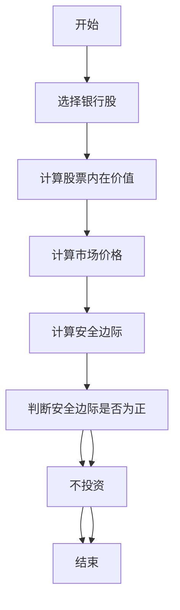
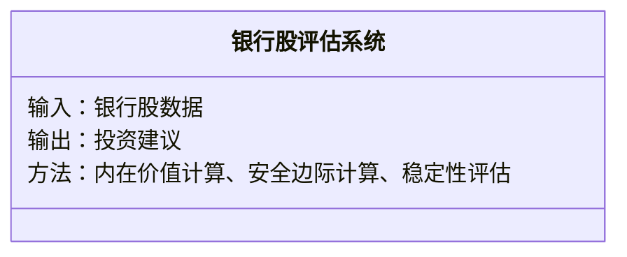
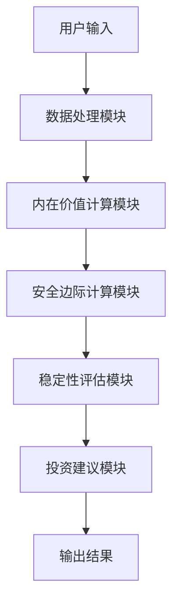

                 


# 巴菲特-芒格的银行股投资策略：看重稳定性和规模

## 关键词：巴菲特、芒格、银行股、投资策略、稳定性、规模、价值投资

## 摘要：  
巴菲特和芒格的银行股投资策略以价值投资为核心，注重企业的稳定性和规模。本文从银行股的投资逻辑、数学模型、系统分析等多个维度，详细解读他们的投资理念，并通过实际案例分析其在投资实践中的应用。

---

# 第1章 引言

## 1.1 背景介绍  
银行股作为金融市场的核心资产，具有高杠杆、高资本密集度和高波动性的特点。巴菲特和芒格在长期的投资实践中，总结出一套以稳定性为核心、注重企业规模的价值投资策略。本文将从理论到实践，深入解析这一策略。

## 1.2 问题背景  
银行股的投资风险较高，且受宏观经济环境影响较大。如何在复杂的市场环境中选择优质银行股，是投资者关注的核心问题。巴菲特和芒格的策略为我们提供了一个重要的参考框架。

## 1.3 问题解决  
本文通过分析巴菲特和芒格的价值投资理念，结合银行股的行业特点，提出了一套基于稳定性和规模的银行股评估体系。

## 1.4 边界与外延  
本文的研究范围限定在银行股，不涉及其他金融资产。同时，本文重点分析价值投资的核心要素，不涉及短期交易策略。

## 1.5 核心要素  
本文的核心要素包括：价值投资理念、银行股稳定性分析、企业规模评估、安全边际计算。

---

# 第2章 核心概念与联系

## 2.1 核心概念  
- **价值投资**：以低于内在价值的价格买入优质资产。  
- **稳定性**：银行股的盈利能力、资产质量、资本充足性等指标的稳定性。  
- **规模**：银行的资产规模、客户基础、市场占有率等。  

## 2.2 概念属性特征对比  

| 概念      | 特征                     | 重要性 |
|-----------|--------------------------|--------|
| 价值投资  | 买入低于内在价值的资产   | 高     |
| 稳定性    | 盈利能力、资本充足性稳定 | 高     |
| 规模      | 资产规模、市场占有率     | 中     |

## 2.3 ER实体关系图  

```mermaid
entity 概念关系 {
  entity 价值投资 {
    指标 内在价值
    指标 安全边际
  }
  entity 稳定性 {
    指标 盈利能力
    指标 资本充足性
  }
  entity 规模 {
    指标 资产规模
    指标 市场占有率
  }
}
```

---

# 第3章 算法原理讲解

## 3.1 算法概述  
巴菲特和芒格的价值投资策略可以看作是一种基于基本面分析的投资算法。核心在于通过数学模型计算股票的内在价值，再结合安全边际进行投资决策。

## 3.2 算法流程图  



---

## 3.3 数学模型与公式

### 3.3.1 股票内在价值计算  
$$ V = \frac{CF}{r - g} $$  
其中：  
- \( V \)：股票的内在价值  
- \( CF \)：未来现金流  
- \( r \)：折现率  
- \( g \)：现金流增长率  

### 3.3.2 安全边际计算  
$$ \text{安全边际} = \text{内在价值} - \text{市场价格} $$  

### 3.3.3 实例计算  
假设某银行股的内在价值为 $50，市场价格为 $40，则安全边际为 $10。此时，巴菲特和芒格会认为这是一个值得投资的机会。

---

# 第4章 系统分析与架构设计

## 4.1 问题场景介绍  
本文将从系统架构的角度，构建一个基于巴菲特-芒格策略的银行股评估系统。该系统能够帮助投资者快速筛选出符合稳定性和规模要求的银行股。

## 4.2 系统功能设计  



## 4.3 系统架构设计  



## 4.4 系统接口设计  
- 输入接口：银行股的财务数据（如ROE、净息差、资本充足率）。  
- 输出接口：投资建议（如“买入”、“持有”、“卖出”）。  

---

# 第5章 项目实战

## 5.1 环境安装  
需要安装Python和相关金融分析库（如Pandas、NumPy）。  

## 5.2 核心实现代码  

```python
import pandas as pd

def calculate_intrinsic_value(cash_flows, discount_rate, growth_rate):
    return cash_flows / (discount_rate - growth_rate)

def calculate_margin_of_safety(intrinsic_value, market_price):
    return intrinsic_value - market_price

# 示例数据
cash_flows = 100
discount_rate = 0.1
growth_rate = 0.05
market_price = 90

# 计算内在价值
iv = calculate_intrinsic_value(cash_flows, discount_rate, growth_rate)
mos = calculate_margin_of_safety(iv, market_price)

print(f"内在价值: {iv:.2f}")
print(f"安全边际: {mos:.2f}")
```

## 5.3 代码解读与分析  
- `calculate_intrinsic_value`函数用于计算股票的内在价值。  
- `calculate_margin_of_safety`函数用于计算安全边际。  
- 示例数据中，内在价值为 $100，市场价格为 $90，安全边际为 $10。此时，巴菲特和芒格会认为这是一个值得投资的机会。

---

## 5.4 实际案例分析  
以富国银行为例，分析其财务数据，计算其内在价值和安全边际，得出投资建议。

---

# 第6章 总结与展望

## 6.1 总结  
本文从理论到实践，详细解读了巴菲特和芒格的银行股投资策略。通过数学模型和系统设计，帮助投资者更好地理解和应用这一策略。

## 6.2 展望  
未来，随着金融市场的变化，巴菲特和芒格的策略也需要不断优化和调整。投资者需要结合市场环境，灵活运用这一策略。

---

# 参考文献  

1. 巴菲特《巴菲特致股东的信》  
2. 芒格《穷查理宝典》  
3. Python金融分析工具：Pandas、NumPy  

---

作者：AI天才研究院/AI Genius Institute & 禅与计算机程序设计艺术 /Zen And The Art of Computer Programming

