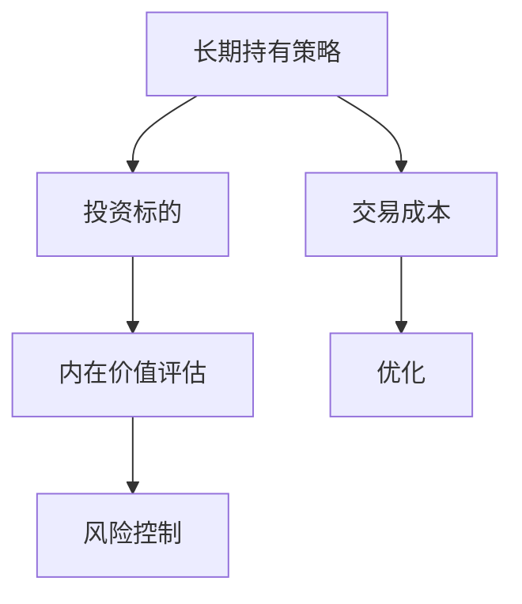
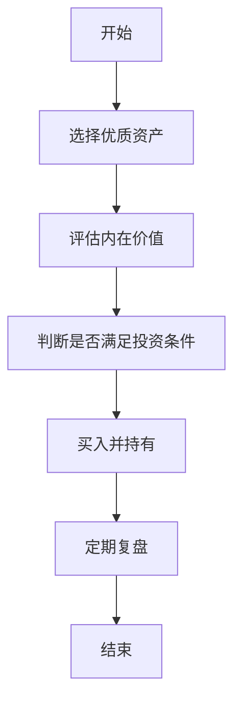
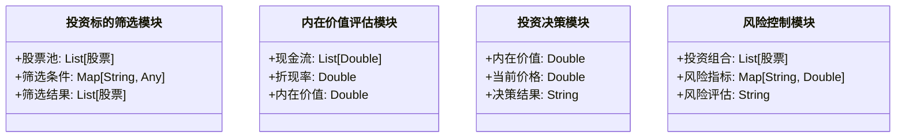
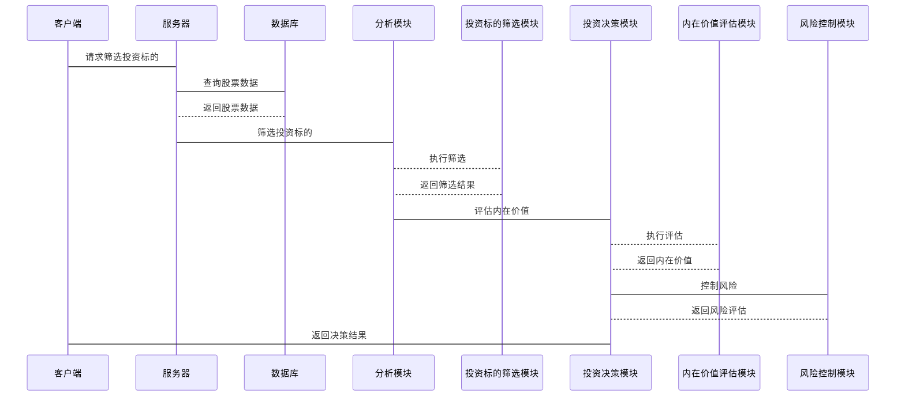

                 


# 巴菲特-芒格的长期持有策略：减少交易成本的智慧

> 关键词：巴菲特, 长期持有策略, 投资成本, 交易成本, 价值投资, 芮格思想, 投资策略

> 摘要：本文深入分析了巴菲特和芒格的长期持有策略，探讨了其在减少交易成本方面的智慧。通过系统的背景介绍、核心概念、算法原理、数学模型、系统架构设计、项目实战以及最佳实践，本文为读者提供了全面的理解和实践指南。

---

# 第一部分: 巴菲特-芒格的长期持有策略概述

# 第1章: 长期持有策略的背景与核心理念

## 1.1 长期持有策略的起源与演变

### 1.1.1 投资市场的基本问题

在投资领域，投资者面临的最基本问题是如何在不确定的市场中实现资产的保值和增值。市场的波动性、信息不对称以及个体决策的复杂性使得投资决策变得极具挑战性。传统的短期交易策略依赖于对市场趋势的精准预测，但这种策略往往伴随着高昂的交易成本和较高的风险。

### 1.1.2 长期持有策略的定义与特点

长期持有策略是一种以长期视角进行投资的策略，其核心在于选择优质资产并长期持有，而非频繁交易。这种策略强调对投资标的的深入研究和长期价值的判断，而非短期价格波动的预测。其特点包括：

- **低交易成本**：减少交易次数，降低佣金、税费等交易成本。
- **低时间成本**：避免频繁交易带来的决策疲劳和时间浪费。
- **低风险**：通过长期持有优质资产，降低市场波动带来的短期风险。

### 1.1.3 巴菲特与芒格投资理念的核心思想

巴菲特和芒格的投资理念深刻影响了长期持有策略的发展。巴菲特的价值投资理论强调买入并持有优质企业，而芒格的多元思维模型则提供了全面分析投资标的的方法。

- **巴菲特的价值投资理论**：强调买入具有持续竞争优势和良好管理的企业，长期持有，等待其内在价值的实现。
- **芒格的多元思维模型**：通过多学科的交叉思考，全面评估投资标的的价值和风险。

## 1.2 巴菲特与芒格的投资哲学

### 1.2.1 巴菲特的价值投资理论

巴菲特的价值投资理论的核心在于寻找具有持续竞争优势和良好管理的企业，并以合理的价格买入并长期持有。他认为市场的短期波动是噪音，而优质企业的长期价值终将体现。

### 1.2.2 芮格的多元思维模型

芒格的多元思维模型强调通过多个学科的交叉思考，全面评估投资标的的价值和风险。这种思维方式帮助投资者避免单一视角的局限性，从而做出更明智的投资决策。

### 1.2.3 长期持有策略的哲学基础

长期持有策略的哲学基础在于对市场波动的理性认知和对优质资产的长期信任。通过减少交易次数，投资者可以避免短期波动的干扰，专注于长期价值的实现。

## 1.3 长期持有策略的核心思想

### 1.3.1 长期持有策略的逻辑框架

长期持有策略的逻辑框架基于以下几个核心要素：

- **优质资产的选择**：选择具有持续竞争优势和良好管理的企业。
- **长期价值的评估**：通过深入分析企业的财务状况、行业地位和未来发展前景，评估其长期价值。
- **风险的控制**：通过分散投资和长期持有，降低短期波动带来的风险。

### 1.3.2 长期持有策略与交易成本的关系

长期持有策略通过减少交易次数，显著降低了交易成本。交易成本包括佣金、税费、买卖价差等，这些成本在频繁交易中会显著增加。长期持有策略通过减少交易次数，有效降低了这些成本，从而提高了投资收益。

### 1.3.3 长期持有策略的成功关键

长期持有策略的成功关键在于对优质资产的长期信任和对市场波动的理性认知。投资者需要具备耐心和纪律性，避免被短期市场波动干扰，专注于实现长期价值。

## 1.4 本章小结

本章介绍了长期持有策略的背景、核心理念以及巴菲特和芒格的投资哲学。通过分析长期持有策略的逻辑框架、与交易成本的关系以及成功关键，我们理解了其在减少交易成本方面的智慧。

---

# 第二部分: 长期持有策略的核心概念与联系

# 第2章: 长期持有策略的核心概念

## 2.1 长期持有策略的核心要素

### 2.1.1 投资标的的选择标准

选择优质资产是长期持有策略的核心。优质资产具有以下特征：

- **持续的竞争优势**：企业具备长期的竞争优势，能够在行业中持续发展。
- **良好的财务状况**：企业具备健康的财务状况，能够抵御短期波动和经济周期的影响。
- **优秀的管理团队**：企业具备优秀的管理团队，能够推动企业持续发展。

### 2.1.2 长期持有策略的内在价值评估

内在价值是长期持有策略的核心评估指标。内在价值是指企业在未来经营中所能创造的现金流的现值。评估内在价值需要考虑企业的财务状况、行业地位、未来发展前景等因素。

### 2.1.3 长期持有策略的风险控制

长期持有策略的风险控制主要通过分散投资和长期持有实现。分散投资可以降低单一资产的风险，而长期持有则可以避免短期波动带来的风险。

## 2.2 长期持有策略与交易成本的对比分析

### 2.2.1 交易成本的定义与分类

交易成本包括佣金、税费、买卖价差等。这些成本在频繁交易中会显著增加。

### 2.2.2 长期持有策略对交易成本的优化

长期持有策略通过减少交易次数，显著降低了交易成本。长期持有策略的交易成本主要集中在初始买入和最终卖出，而频繁交易策略的交易成本则显著增加。

### 2.2.3 长期持有策略与短期交易策略的对比

| 概念 | 长期持有策略 | 短期交易策略 |
|------|--------------|--------------|
| 目标 | 实现资产长期增值 | 追求短期收益 |
| 风险 | 较低 | 较高 |
| 成本 | 低 | 高 |

## 2.3 核心概念对比表格

| 概念 | 长期持有策略 | 短期交易策略 |
|------|--------------|--------------|
| 目标 | 实现资产长期增值 | 追求短期收益 |
| 风险 | 较低 | 较高 |
| 成本 | 低 | 高 |

## 2.4 实体关系图（Mermaid）



---

# 第三部分: 长期持有策略的算法原理

# 第3章: 长期持有策略的算法原理

## 3.1 长期持有策略的算法步骤

### 3.1.1 算法流程



### 3.1.2 价值评估模型

价值评估模型是长期持有策略的核心算法。以下是价值评估模型的数学表达式：

$$
\text{内在价值} = \sum_{t=1}^{\infty} \frac{\text{现金流}_t}{(1 + r)^t}
$$

其中，\( r \) 是折现率，\( \text{现金流}_t \) 是第 \( t \) 年的现金流。

### 3.1.3 投资决策算法

投资决策算法基于价值评估模型，判断是否满足投资条件。以下是投资决策算法的伪代码：

```python
def investment_decision(cash_flow, discount_rate):
    intrinsic_value = sum(cash_flow / (1 + discount_rate)**t for t in range(1, infinity))
    if intrinsic_value > current_price:
        return "买入"
    else:
        return "不买入"
```

## 3.2 长期持有策略的数学模型

### 3.2.1 现金流折现模型（DCF）

现金流折现模型是长期持有策略的核心数学模型。以下是DCF模型的公式：

$$
\text{内在价值} = \frac{\text{现金流}_1}{(1 + r)^1} + \frac{\text{现金流}_2}{(1 + r)^2} + \cdots + \frac{\text{现金流}_n}{(1 + r)^n}
$$

其中，\( r \) 是折现率，\( \text{现金流}_i \) 是第 \( i \) 年的现金流。

### 3.2.2 内在价值评估公式

内在价值评估公式是长期持有策略的核心公式。以下是内在价值评估公式：

$$
\text{内在价值} = \frac{\text{自由现金流}}{\text{加权平均资本成本}}
$$

---

# 第四部分: 长期持有策略的系统分析与架构设计

# 第4章: 长期持有策略的系统分析

## 4.1 系统功能设计

### 4.1.1 系统功能模块

系统功能模块包括：

- 投资标的筛选模块
- 内在价值评估模块
- 投资决策模块
- 风险控制模块

### 4.1.2 领域模型（Mermaid 类图）



### 4.1.3 系统架构设计（Mermaid 架构图）


## 4.2 系统接口设计

### 4.2.1 API 接口

- `筛选投资标的`：输入筛选条件，输出筛选结果。
- `评估内在价值`：输入现金流和折现率，输出内在价值。
- `投资决策`：输入内在价值和当前价格，输出决策结果。
- `风险控制`：输入投资组合，输出风险评估。

### 4.2.2 接口交互流程（Mermaid 序列图）



---

# 第五部分: 长期持有策略的项目实战

# 第5章: 长期持有策略的项目实战

## 5.1 项目环境安装

### 5.1.1 系统环境

- 操作系统：Windows/Mac/Linux
- Python 版本：3.8+

### 5.1.2 安装依赖

```bash
pip install numpy pandas matplotlib
```

## 5.2 核心代码实现

### 5.2.1 投资标的筛选模块

```python
import pandas as pd

def screen_stocks(stocks, criteria):
    selected = []
    for stock in stocks:
        if stock.meets_criteria(criteria):
            selected.append(stock)
    return selected
```

### 5.2.2 内在价值评估模块

```python
import numpy as np

def calculate_intrinsic_value(cash_flows, discount_rate):
    return np.npv(discount_rate, cash_flows)
```

### 5.2.3 投资决策模块

```python
def make_investment_decision(intrinsic_value, current_price):
    if intrinsic_value > current_price:
        return "买入"
    else:
        return "不买入"
```

## 5.3 代码解读与分析

### 5.3.1 投资标的筛选模块

投资标的筛选模块通过给定的筛选条件，从股票池中筛选出符合条件的投资标的。筛选条件可以包括市盈率、市净率、股息率等指标。

### 5.3.2 内在价值评估模块

内在价值评估模块通过现金流折现模型，计算投资标的的内在价值。这一步骤需要输入投资标的的未来现金流和适当的折现率。

### 5.3.3 投资决策模块

投资决策模块根据内在价值和当前价格，判断是否满足投资条件。如果内在价值高于当前价格，则建议买入；否则，建议不买入。

## 5.4 实际案例分析

### 5.4.1 案例背景

假设我们选择投资 Coca-Cola，需要评估其内在价值和当前价格。

### 5.4.2 数据准备

```python
cash_flows = [100, 110, 120, 130, 140]
discount_rate = 0.08
```

### 5.4.3 内在价值计算

```python
import numpy as np

def calculate_intrinsic_value(cash_flows, discount_rate):
    return np.npv(discount_rate, cash_flows)

intrinsic_value = calculate_intrinsic_value(cash_flows, discount_rate)
print("内在价值:", intrinsic_value)
```

### 5.4.4 投资决策

假设当前价格为 $100，内在价值为 $110，则投资决策为“买入”。

## 5.5 项目小结

通过实际案例分析，我们验证了长期持有策略的有效性。通过筛选优质资产、评估内在价值和做出投资决策，我们能够实现长期资产增值。

---

# 第六部分: 长期持有策略的最佳实践

# 第6章: 长期持有策略的最佳实践

## 6.1 最佳实践总结

### 6.1.1 投资标的的选择

选择具有持续竞争优势和良好管理的企业。

### 6.1.2 内在价值的评估

准确评估内在价值是长期持有策略的核心。

### 6.1.3 风险的控制

通过分散投资和长期持有，降低短期波动带来的风险。

## 6.2 注意事项

### 6.2.1 风险提示

- 市场波动风险：长期持有策略无法完全避免市场波动带来的短期风险。
- 信息滞后风险：内在价值评估依赖于未来现金流的预测，存在信息滞后风险。

### 6.2.2 管理建议

- 定期复盘：定期评估投资组合的表现和内在价值的变化。
- 动态调整：根据市场变化和企业情况，动态调整投资组合。

## 6.3 拓展阅读

### 6.3.1 推荐书籍

- 《巴菲特致股东的信》
- 《芒格的决策思维》

### 6.3.2 推荐文章

- 巴菲特和芒格的投资哲学
- 长期持有策略的数学模型与实践

---

# 作者：AI天才研究院/AI Genius Institute & 禅与计算机程序设计艺术 /Zen And The Art of Computer Programming

