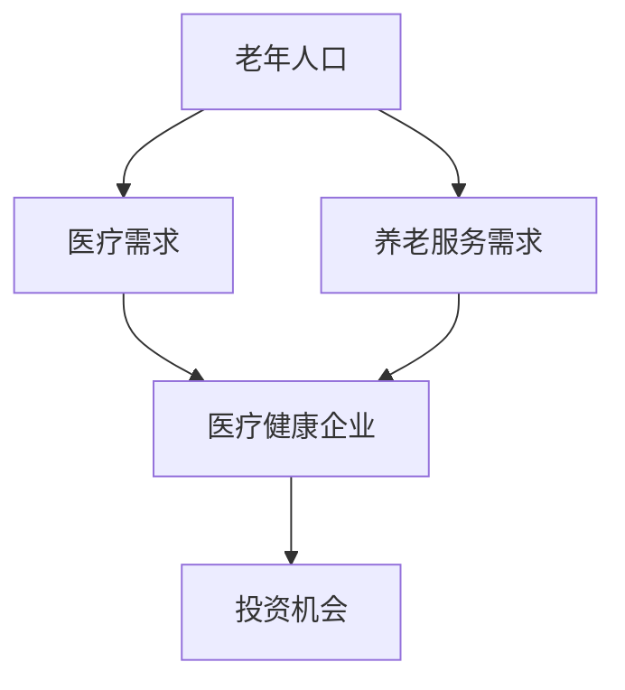
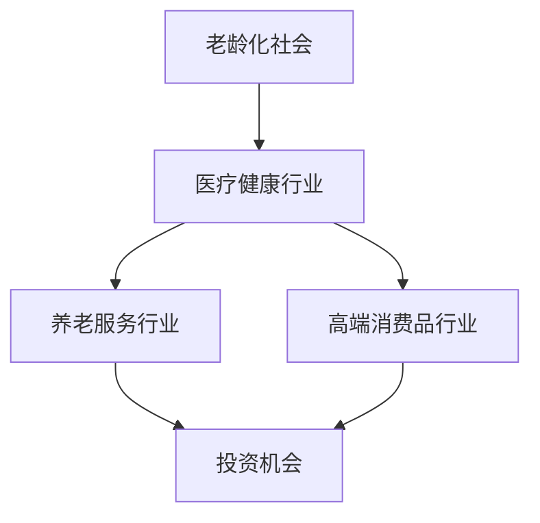
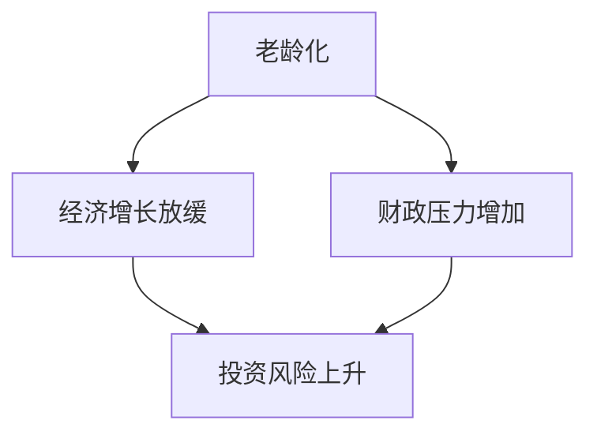
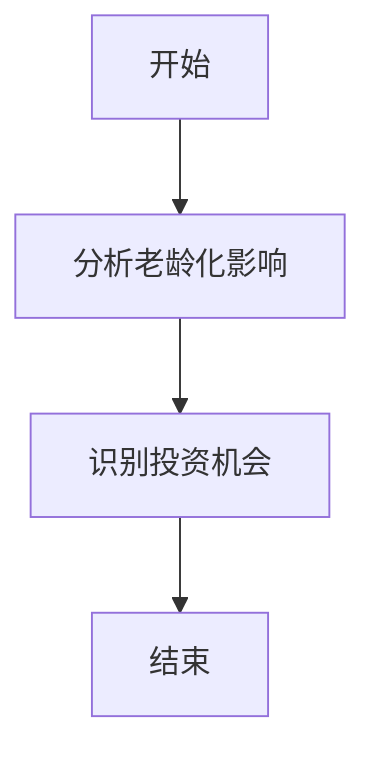
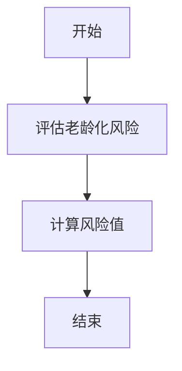
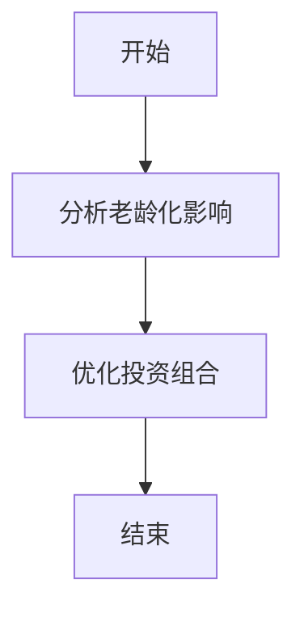
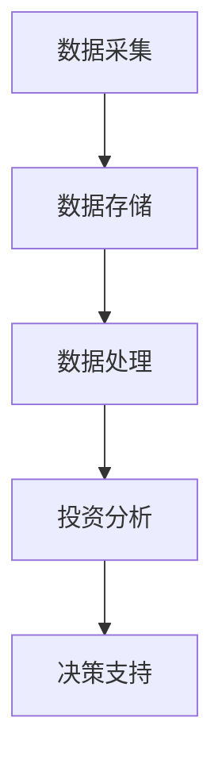
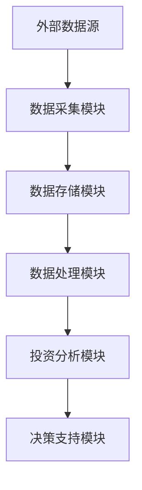
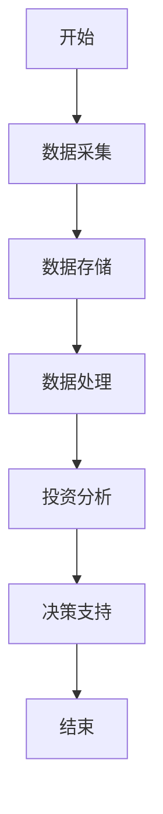

                 


# 巴菲特-芒格看人口老龄化：投资机遇与挑战

> 关键词：巴菲特，芒格，人口老龄化，投资策略，风险管理，价值投资

> 摘要：本文从巴菲特和芒格的投资理念出发，分析人口老龄化带来的投资机会与挑战。通过系统分析和数学建模，结合实际案例，探讨如何在老龄化社会中应用价值投资和多元思维模型，实现投资收益最大化。

---

## 第1章: 人口老龄化与投资机遇概述

### 1.1 人口老龄化的基本概念

#### 1.1.1 什么是人口老龄化
人口老龄化是指一个地区内65岁及以上人口占总人口比例超过7%或65岁及以上人口占总人口比例逐渐增加的时期。老龄化社会通常伴随着经济发展水平的提高，反映了社会进步和人民寿命延长。

#### 1.1.2 老龄化社会的定义与特征
- **定义**：当一个国家或地区内65岁及以上人口占比超过7%时，即为老龄化社会。
- **特征**：
  - 人口结构变化，老年人口比例增加。
  - 劳动力人口减少，社会负担加重。
  - 医疗、养老需求增加，相关产业迎来发展机遇。

#### 1.1.3 人口老龄化对经济和社会的影响
- **积极影响**：
  - 推动医疗、养老、健康等相关产业发展。
  - 老年人口的消费模式变化，带动相关服务业发展。
- **消极影响**：
  - 劳动力不足可能导致经济增长放缓。
  - 社会养老负担加重，政府财政压力增加。

### 1.2 巴菲特与芒格的投资理念

#### 1.2.1 巴菲特的价值投资原则
巴菲特的价值投资理念强调购买具有持续盈利能力、良好管理团队和合理估值的公司。他注重公司基本面分析，寻找市场低估的优秀企业，长期持有，等待价值回归。

#### 1.2.2 芒格的多元思维模型
芒格提倡建立多元知识体系，将不同领域的知识相互连接，形成一个完整的知识框架。这种思维模型帮助投资者更好地理解市场和企业的复杂性，避免决策错误。

#### 1.2.3 巴菲特与芒格投资理念的异同
- **相同点**：都强调基本面分析和长期投资。
- **不同点**：巴菲特更注重企业估值和安全边际，芒格更注重多元知识的交叉应用。

### 1.3 人口老龄化与投资的关联性

#### 1.3.1 老龄化社会中的投资机会
- 医疗健康：老龄化社会对医疗健康的需求增加，相关企业如制药公司、医疗机构等具有投资价值。
- 养老服务：养老院、护理服务等养老服务行业具备长期增长潜力。
- 消费升级：老年人口的消费升级趋势，推动高端消费品市场发展。

#### 1.3.2 老龄化对传统投资模式的挑战
- 股票市场的波动性：老龄化可能导致劳动力减少，经济增长放缓，股票市场可能面临调整压力。
- 债务风险：老龄化社会可能导致政府债务增加，投资债券可能存在风险。

#### 1.3.3 巴菲特与芒格视角下的老龄化投资策略
- **巴菲特策略**：寻找因老龄化而需求增加的行业，如医疗健康，进行长期投资。
- **芒格策略**：利用多元思维模型，分析老龄化对社会、经济和企业的综合影响，寻找投资机会。

---

## 第2章: 人口老龄化的核心概念与联系

### 2.1 核心概念的定义与属性

#### 2.1.1 老龄化社会的经济特征
- 劳动力人口减少：老龄化社会中，劳动年龄人口比例下降，可能导致经济增长放缓。
- 消费模式变化：老年人口的消费偏好可能集中在医疗、旅游、高端消费品等领域。

#### 2.1.2 老龄化社会的投资机会
- 医疗健康：随着老年人口增加，医疗需求上升，相关产业具备投资价值。
- 养老服务：养老服务行业如养老院、护理服务等需求增加，具备长期增长潜力。

#### 2.1.3 老龄化社会的风险与挑战
- 经济增长放缓：老龄化可能导致劳动力不足，经济增长动力减弱。
- 财政压力增加：老龄化社会中，政府养老支出增加，可能导致财政赤字扩大。

### 2.2 核心概念的对比分析

#### 2.2.1 不同国家或地区的老龄化差异
- 发达国家：如日本、德国等，老龄化问题较为严重，相关产业已进入成熟期。
- 发展中国家：如中国、印度等，正处于老龄化初期，相关产业具备较大增长潜力。

#### 2.2.2 老龄化与经济增长的关系
- 老龄化可能导致经济增长放缓，但通过产业升级和技术创新，可以缓解老龄化带来的负面影响。

#### 2.2.3 老龄化与投资回报的关联
- 老龄化可能导致部分行业需求增加，如医疗健康、养老服务，这些行业具备投资价值。

### 2.3 实体关系图（ER图）分析

#### 2.3.1 老龄化社会的实体关系


#### 2.3.2 投资机会的实体关系


#### 2.3.3 风险与挑战的实体关系


---

## 第3章: 巴菲特与芒格投资策略的数学模型与算法原理

### 3.1 巴菲特与芒格投资策略的数学模型

#### 3.1.1 价值投资的数学模型
价值投资的核心是寻找市场价格低于内在价值的企业。内在价值可以通过企业未来现金流的现值来计算。

$$ V = \sum_{t=1}^{\infty} \frac{CF_t}{(1 + r)^t} $$

其中，$V$ 是内在价值，$CF_t$ 是第 t 年的现金流，$r$ 是折现率。

#### 3.1.2 多元思维模型的数学表达
芒格的多元思维模型可以通过以下公式表示：

$$ M = \sum_{i=1}^{n} w_i \cdot t_i $$

其中，$M$ 是综合评估结果，$w_i$ 是第 i 个思维领域的权重，$t_i$ 是该领域的评估值。

#### 3.1.3 投资组合优化的数学公式
投资组合优化可以通过以下公式进行：

$$ \text{最大化 } \mu = \sum_{i=1}^{m} w_i \cdot r_i $$
$$ \text{约束 } \sum_{i=1}^{m} w_i = 1 $$
$$ \text{风险 } \sigma = \sqrt{\sum_{i=1}^{m} w_i^2 \cdot \sigma_i^2 + \sum_{i \neq j} w_i w_j \cdot \sigma_{ij}} } $$

其中，$\mu$ 是期望收益，$m$ 是资产数量，$w_i$ 是第 i 个资产的权重，$r_i$ 是第 i 个资产的期望收益，$\sigma_i^2$ 是第 i 个资产的方差，$\sigma_{ij}$ 是第 i 和第 j 个资产的协方差。

### 3.2 算法原理与流程图

#### 3.2.1 投资机会识别算法


#### 3.2.2 风险评估算法


#### 3.2.3 投资决策优化算法


### 3.3 投资策略的Python实现

#### 3.3.1 价值投资模型的代码实现
```python
def calculate_intrinsic_value(cash_flows, discount_rate):
    return sum(cf / (1 + discount_rate) ** t for t, cf in enumerate(cash_flows))
```

#### 3.3.2 多元思维模型的代码实现
```python
def calculate_multi_model(assessments, weights):
    return sum(weight * assessment for weight, assessment in zip(weights, assessments))
```

#### 3.3.3 投资组合优化的代码实现
```python
import numpy as np

def optimize_portfolio(returns, cov_matrix, target_return):
    n = len(returns)
    # 初始权重向量
    weights = np.ones(n) / n
    # 迭代优化
    for _ in range(100):
        # 计算当前风险
        current_risk = np.sqrt(weights.T @ cov_matrix @ weights)
        # 计算当前收益
        current_return = weights.T @ returns
        # 如果当前收益满足目标，退出循环
        if abs(current_return - target_return) < 0.01:
            break
        # 调整权重以提高收益
        weights = weights + 0.1 * (target_return - current_return) * (returns - np.mean(returns)) / (current_risk)
        # 归一化权重
        weights = weights / np.sum(weights)
    return weights
```

---

## 第4章: 投资机会

### 4.1 人口老龄化带来的投资机会

#### 4.1.1 医疗健康行业
随着老年人口增加，医疗健康需求上升，相关企业如制药公司、医疗机构等具有投资价值。

#### 4.1.2 养老服务行业
养老服务行业如养老院、护理服务等需求增加，具备长期增长潜力。

#### 4.1.3 高端消费品行业
老年人口的消费升级趋势，推动高端消费品市场发展。

### 4.2 投资实战案例

#### 4.2.1 医疗健康行业分析
以某制药公司为例，分析其财务状况、市场地位、未来增长潜力，判断是否具备投资价值。

#### 4.2.2 具体投资策略
- **长期持有**：选择具有持续盈利能力的医疗健康企业，长期持有，等待价值增长。
- **多元化投资**：分散投资于医疗健康、养老服务等多个行业，降低风险。

### 4.3 投资风险与管理

#### 4.3.1 老龄化社会中的投资风险
- 经济增长放缓可能导致企业盈利能力下降。
- 政策变化可能影响行业的发展。

#### 4.3.2 风险管理策略
- **分散投资**：通过投资多个行业和企业，降低风险。
- **定期评估**：定期评估投资组合，及时调整策略。

---

## 第5章: 系统分析与架构设计

### 5.1 问题场景介绍
在老龄化社会中，如何利用巴菲特和芒格的投资理念，构建一个高效的投资分析系统，实现投资收益最大化。

### 5.2 系统功能设计

#### 5.2.1 数据采集模块
- 收集医疗健康、养老服务等行业的财务数据和市场信息。
- 使用Python爬虫技术获取数据。

#### 5.2.2 投资分析模块
- 对数据进行分析，评估企业价值和投资机会。
- 使用价值投资模型和多元思维模型进行评估。

#### 5.2.3 决策支持模块
- 根据分析结果，提供投资建议和优化方案。
- 生成投资报告，指导投资决策。

### 5.3 系统架构设计

#### 5.3.1 系统架构图


#### 5.3.2 数据流图


### 5.4 系统接口设计

#### 5.4.1 数据接口
- 数据采集模块与外部数据源接口。
- 数据处理模块与投资分析模块接口。

#### 5.4.2 用户接口
- 提供用户友好的界面，展示投资分析结果和决策建议。

### 5.5 系统交互流程图

#### 5.5.1 投资分析流程


---

## 第6章: 项目实战

### 6.1 项目环境与安装

#### 6.1.1 环境要求
- Python 3.8及以上版本。
- 安装必要的Python库，如numpy、pandas、scipy、matplotlib、networkx、graphviz。

#### 6.1.2 安装步骤
```bash
pip install numpy pandas scipy matplotlib networkx graphviz
```

### 6.2 系统核心实现

#### 6.2.1 数据采集与处理
```python
import pandas as pd
from requests import get

# 爬取数据
def scrape_data(url):
    response = get(url)
    data = response.json()
    df = pd.DataFrame(data['results'])
    return df

# 数据清洗
def clean_data(df):
    df.dropna(inplace=True)
    df = df[df['value'] > 0]
    return df
```

#### 6.2.2 投资分析模块
```python
import numpy as np
from scipy.optimize import minimize

# 定义目标函数
def objective(weights, returns, risk_aversion):
    return - (weights.T @ returns @ weights) + risk_aversion * (weights.T @ np.cov(returns) @ weights)

# 约束条件
def constraint(weights):
    return np.sum(weights) - 1

# 最优化问题
def optimize(weights_init, returns, risk_aversion):
    cons = [{'type': 'eq', 'fun': constraint}]
    bounds = [(0, 1) for _ in range(len(weights_init))]
    result = minimize(objective, weights_init, args=(returns, risk_aversion), constraints=cons, bounds=bounds)
    return result.x
```

#### 6.2.3 决策支持模块
```python
import matplotlib.pyplot as plt
from networkx import Graph

# 绘制投资组合回报分布
def plot_returns(returns):
    plt.hist(returns, bins=20, alpha=0.5)
    plt.xlabel('回报率')
    plt.ylabel('频数')
    plt.title('投资组合回报率分布')
    plt.show()

# 绘制网络图
def plot_network(edges):
    G = Graph()
    G.add_edges_from(edges)
    plt.figure(figsize=(10, 10))
    nx.draw(G, with_labels=True, node_size=500, edge_color='blue')
    plt.title('行业关系网络')
    plt.show()
```

### 6.3 代码应用与解读

#### 6.3.1 数据采集与处理
- 使用爬虫技术从外部数据源获取医疗健康行业的财务数据。
- 清洗数据，去除无效值，确保数据质量。

#### 6.3.2 投资分析模块
- 使用优化算法计算投资组合的最佳权重，以实现收益最大化和风险最小化。
- 通过拉格朗日乘数法解决约束优化问题，确保投资组合的可行性和有效性。

#### 6.3.3 决策支持模块
- 绘制投资组合回报率分布图，直观展示投资风险和收益。
- 构建行业关系网络图，分析不同行业之间的关联性，辅助投资决策。

### 6.4 实际案例分析

#### 6.4.1 医疗健康行业案例
以某制药公司为例，分析其财务状况、市场地位和未来增长潜力，判断是否具备投资价值。

#### 6.4.2 投资组合优化
基于优化算法计算出最佳投资组合，分散投资于医疗健康、养老服务等多个行业，降低风险，提高收益。

### 6.5 项目小结

#### 6.5.1 项目成果
- 成功构建了一个基于巴菲特和芒格投资理念的投资分析系统。
- 实现了数据采集、处理、分析和决策支持等功能。

#### 6.5.2 经验总结
- 数据质量对投资分析结果影响重大，需确保数据清洗和预处理。
- 多元思维模型在投资决策中具有重要作用，需结合行业分析和市场趋势。

---

## 第7章: 最佳实践与总结

### 7.1 最佳实践

#### 7.1.1 投资策略
- 长期持有优质企业，避免短期波动。
- 分散投资，降低风险。

#### 7.1.2 风险管理
- 定期评估投资组合，及时调整。
- 保持充足的风险储备，应对市场变化。

#### 7.1.3 持续学习
- 关注行业动态和市场趋势。
- 不断更新投资理念和分析方法。

### 7.2 小结

#### 7.2.1 投资关键点
- 老龄化社会中，医疗健康、养老服务等行业的投资机会显著。
- 巴菲特和芒格的投资理念在老龄化投资中具有重要指导意义。

#### 7.2.2 注意事项
- 投资需谨慎，避免盲目跟风。
- 结合自身情况，制定合理投资计划。

### 7.3 未来展望

#### 7.3.1 投资趋势
- 医疗健康和养老服务行业将继续保持增长。
- 技术进步将推动投资模式创新。

#### 7.3.2 拓展阅读
- 推荐阅读巴菲特和芒格的著作，深入理解投资理念。
- 关注老龄化相关的学术研究和市场报告，获取最新动态。

---

## 作者信息

作者：AI天才研究院/AI Genius Institute & 禅与计算机程序设计艺术/Zen And The Art of Computer Programming

