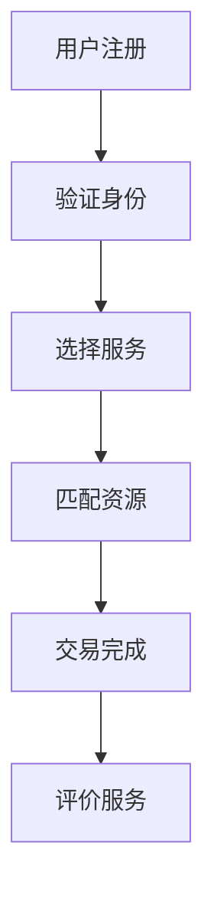
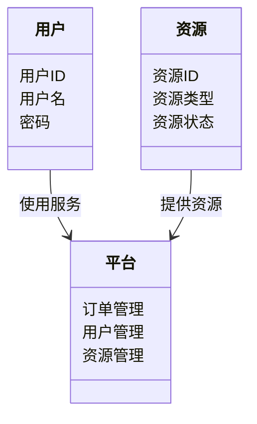
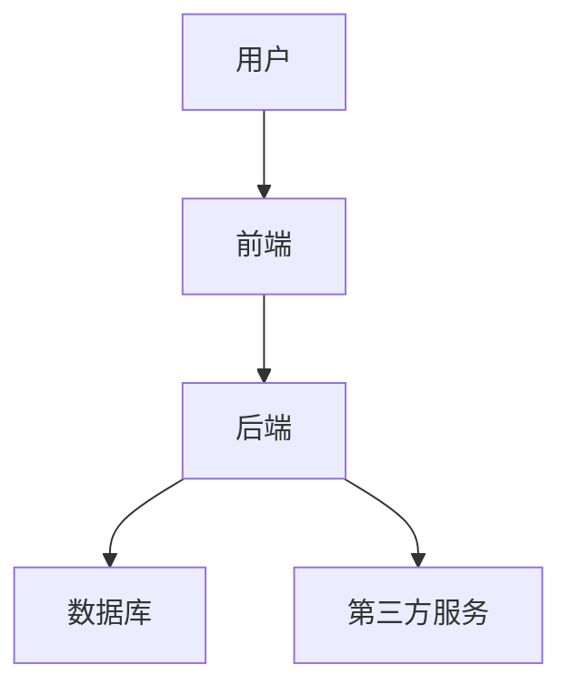

                 


---

# 巴菲特-芒格看共享经济：商业模式的革新

> **关键词**：巴菲特、芒格、共享经济、商业模式、投资哲学、系统架构

> **摘要**：本文从巴菲特和芒格的投资哲学出发，分析共享经济的商业模式、系统架构和算法原理，探讨如何将巴菲特和芒格的价值投资理念与共享经济的创新模式相结合，揭示共享经济未来的发展趋势和投资机会。

---

## 第一章：巴菲特与芒格的投资哲学

### 1.1 巴菲特与芒格的背景介绍

#### 1.1.1 巴菲特的投资理念

沃伦·巴菲特是全球最著名的投资者之一，他的投资理念基于价值投资，即寻找市场低估的公司进行长期投资。他的核心观点是：

- **长期主义**：投资不是短期交易，而是寻找能够持续创造价值的企业。
- **安全边际**：买入价格低于内在价值，以确保投资的安全性。
- **复利效应**：长期投资能够通过复利效应实现财富的指数增长。

#### 1.1.2 芒格的多元思维模型

查理·芒格是巴菲特的合作伙伴，他的思维方式基于“多元思维模型”，即通过多个学科的交叉思考来理解问题。他的核心观点是：

- **跨学科思维**：通过物理学、心理学、经济学等多个学科的视角来看待问题。
- **逆向思维**：从反方向思考问题，找到别人忽略的机会。
- **格栅思维**：将不同领域的知识形成一个知识框架，从而做出更明智的决策。

#### 1.1.3 两人合作的哲学基础

巴菲特和芒格的合作基于对价值投资的共同信仰和对商业本质的深刻理解。巴菲特负责具体的选股和投资操作，而芒格则负责提供多元的思维方式和风险控制策略。

---

### 1.2 巴菲特与芒格的核心投资原则

#### 1.2.1 价值投资的核心理念

价值投资的核心是寻找市场低估的公司。巴菲特认为，市场的短期波动是机会，而企业的内在价值是投资的核心。

#### 1.2.2 安全边际的概念与应用

安全边际是指买入价格与内在价值之间的差距。巴菲特认为，安全边际能够降低投资的风险，确保在市场波动中依然能够获得收益。

#### 1.2.3 长期主义与复利效应

长期主义是巴菲特投资的核心策略。他相信，通过长期持有优质资产，能够实现财富的复利增长。

---

### 1.3 巴菲特与芒格的思维方式

#### 1.3.1 芒格的多元思维模型

芒格的多元思维模型强调从多个角度思考问题。例如，在分析共享经济时，他可能会从经济学、社会学和心理学等多个角度进行分析。

#### 1.3.2 巴菲特的简化与聚焦原则

巴菲特强调简化问题，专注于核心因素。他认为，投资的关键是找到那些能够持续创造价值的企业。

#### 1.3.3 两人决策过程的异同

巴菲特和芒格的决策过程既有相似之处，也有不同之处。巴菲特更注重具体的选股和投资操作，而芒格更注重宏观的思维方式和风险控制。

---

## 第二章：共享经济的背景与现状

### 2.1 共享经济的定义与特征

#### 2.1.1 共享经济的定义

共享经济是一种基于互联网的经济模式，通过共享资源（如闲置资产、时间和技能）来满足需求。

#### 2.1.2 共享经济的核心特征

- **资源利用效率高**：通过共享，资源能够被更充分地利用。
- **去中心化**：共享经济通常基于平台，用户可以直接对接需求。
- **信任机制**：平台需要建立用户之间的信任机制。

#### 2.1.3 共享经济的模式分类

共享经济的模式主要包括：

- **P2P模式**：个人对个人的共享，如Airbnb和滴滴出行。
- **B2P模式**：企业对个人的共享，如共享办公空间WeWork。

---

### 2.2 共享经济的发展现状

#### 2.2.1 全球共享经济的发展历程

共享经济起源于2008年金融危机后，随着互联网技术的发展，共享经济逐渐兴起。

#### 2.2.2 共享经济的典型领域

- **交通领域**：滴滴出行、Uber。
- **住宿领域**：Airbnb。
- **办公空间领域**：WeWork。

#### 2.2.3 共享经济的市场规模与趋势

共享经济的市场规模正在快速增长，预计未来几年将继续保持高速增长。

---

### 2.3 共享经济面临的挑战与问题

#### 2.3.1 市场竞争与垄断问题

共享经济平台之间的竞争日益激烈，垄断问题也随之而来。

#### 2.3.2 用户信任与隐私保护

共享经济平台需要建立信任机制，同时保护用户的隐私。

#### 2.3.3 政策监管与法律风险

共享经济平台面临政策监管和法律风险，例如税收、劳动法等问题。

---

## 第三章：巴菲特与芒格视角下的共享经济分析

### 3.1 巴菲特与芒格对共享经济的评价

#### 3.1.1 巴菲特对共享经济的看法

巴菲特认为，共享经济是一种创新的商业模式，但需要关注其长期盈利能力。

#### 3.1.2 芒格对共享经济的思考

芒格认为，共享经济的成功取决于平台的商业模式和用户信任机制。

#### 3.1.3 两人对共享经济的异同点

巴菲特更关注共享经济的盈利能力，而芒格更关注其商业模式的可持续性和风险控制。

---

### 3.2 巴菲特与芒格的商业模型分析

#### 3.2.1 巴菲特的商业模型

巴菲特的投资模型基于长期主义和价值投资，他更倾向于投资那些能够持续创造价值的企业。

#### 3.2.2 芒格的商业模型

芒格的商业模型基于多元思维模型，他更倾向于从多个角度分析问题，寻找潜在的风险和机会。

#### 3.2.3 共享经济的商业模式

共享经济的商业模式基于P2P平台，通过技术手段实现资源的共享和分配。

---

## 第四章：共享经济的算法原理与数学模型

### 4.1 共享经济的算法原理

#### 4.1.1 算法流程图

以下是一个共享经济平台的算法流程图：



#### 4.1.2 算法实现

以下是一个简单的共享经济平台匹配算法的Python代码：

```python
def match_resource(user_demand, available_resources):
    matched_resources = []
    for resource in available_resources:
        if resource compatible_with(user_demand):
            matched_resources.append(resource)
    return matched_resources
```

---

### 4.2 共享经济的数学模型

#### 4.2.1 收益预测模型

以下是一个收益预测模型的数学公式：

$$ \text{收益} = \alpha \times \text{用户需求} + \beta \times \text{资源供给} $$

其中，$\alpha$ 和 $\beta$ 是模型的参数，需要通过数据训练确定。

---

## 第五章：共享经济的系统分析与架构设计

### 5.1 系统功能设计

#### 5.1.1 领域模型

以下是一个共享经济平台的领域模型：



---

### 5.2 系统架构设计

以下是一个共享经济平台的系统架构图：



---

## 第六章：共享经济的项目实战

### 6.1 环境安装

以下是一个共享经济平台的环境安装步骤：

1. 安装Python和相关库（如Django、Flask）。
2. 安装数据库（如MySQL）。
3. 安装前端框架（如React、Vue）。

---

### 6.2 核心代码实现

以下是一个共享经济平台的核心代码实现：

```python
def authenticate(user, password):
    if user in users and users[user] == password:
        return True
    else:
        return False
```

---

### 6.3 案例分析

以滴滴出行为例，分析其商业模式：

- **核心业务**：网约车服务。
- **收入来源**：用户支付的车费、司机分成。
- **成本结构**：平台运营成本、司机补贴。

---

## 第七章：结论与展望

### 7.1 结论

通过巴菲特和芒格的视角，我们可以更好地理解共享经济的商业模式和未来趋势。

---

### 7.2 未来展望

共享经济未来的发展方向包括：

- **技术创新**：通过人工智能和大数据技术优化资源共享效率。
- **模式创新**：探索新的共享经济模式，例如共享医疗、共享教育。

---

## 附录

### 附录A：术语表

- **P2P**：点对点（Peer-to-Peer）。
- **B2P**：企业对个人（Business-to-Person）。

---

### 附录B：参考文献

1. 巴菲特的《巴菲特致股东的信》。
2. 芒格的《芒格投资原则》。

---

### 附录C：扩展阅读

1. 《共享经济：重构商业未来》。
2. 《巴菲特与芒格的投资智慧》。

---

**作者**：AI天才研究院/AI Genius Institute & 禅与计算机程序设计艺术 /Zen And The Art of Computer Programming

