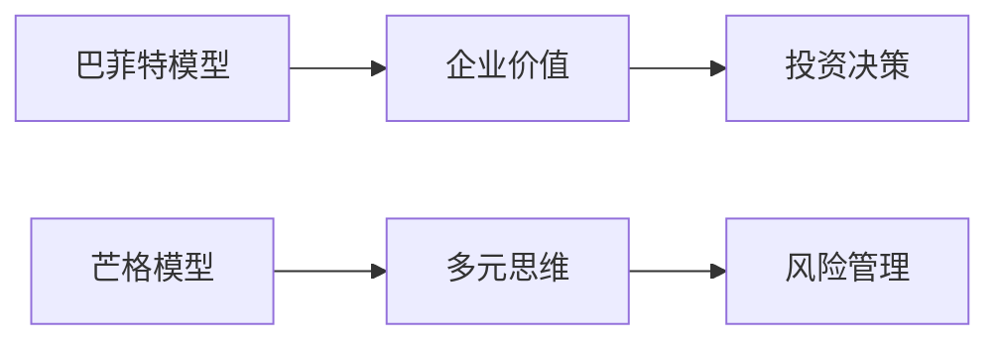
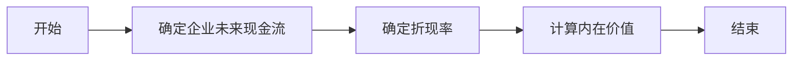
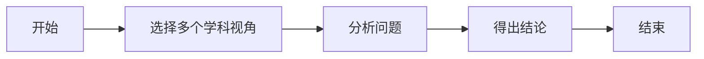
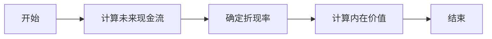
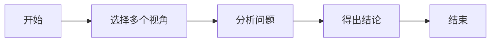
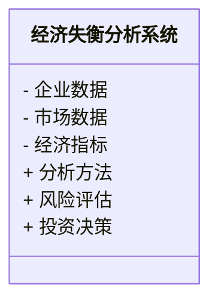
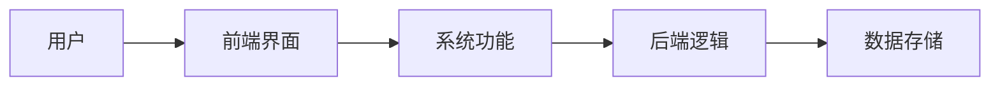

                 


# 巴菲特-芒格看待全球经济失衡：风险与机遇

> 关键词：巴菲特，芒格，全球经济失衡，投资策略，风险管理

> 摘要：本文深入分析巴菲特和芒格看待全球经济失衡的独特视角，探讨其带来的风险与机遇，结合技术博客的形式，从背景、概念、算法、数学模型、系统架构、项目实战等多维度展开，为读者提供全面的分析和实践指导。

---

## 第一部分: 背景介绍

### 第1章: 全球经济失衡的现状与挑战

#### 1.1 全球经济失衡的背景与问题背景

##### 1.1.1 当前全球经济失衡的现状
- **全球经济失衡的定义**：全球经济失衡指的是全球经济体系中各主要经济体之间的经济指标（如贸易差额、货币价值、债务水平等）出现严重不均衡的现象。
- **主要表现**：
  - 贸易不平衡：部分国家出口远大于进口，导致贸易顺差，而另一些国家则相反。
  - 货币贬值与升值：不同国家的货币政策差异导致货币价值波动。
  - 债务与赤字问题：部分国家政府债务高企，财政赤字过大。
- **问题的严重性**：
  - 经济失衡可能导致全球经济不稳定，引发贸易摩擦、货币战争等。
  - 对企业、投资者和个人的经济活动产生深远影响。

##### 1.1.2 经济失衡的核心问题与问题描述
- **核心问题**：
  - 货币政策差异：不同国家的货币政策可能导致全球经济失衡。
  - 贸易保护主义：一些国家采取的贸易保护措施可能加剧经济失衡。
  - 全球化与逆全球化：全球化促进了经济一体化，但也导致了资源分配的不均衡。
- **问题描述**：
  - 经济失衡可能导致全球经济波动，影响投资决策。
  - 对企业和个人的经济活动产生直接或间接影响。

##### 1.1.3 经济失衡对全球经济体系的影响
- **直接影响**：
  - 贸易摩擦：导致关税战、贸易战等。
  - 货币波动：影响汇率，影响跨国投资和贸易。
  - 企业经营压力：经济失衡可能导致企业成本上升或市场需求下降。
- **间接影响**：
  - 投资者信心下降：影响资本市场。
  - 消费者行为变化：影响市场需求。
  - 政策不确定性：影响企业战略规划。

#### 1.2 巴菲特与芒格的背景与投资理念

##### 1.2.1 巴菲特与芒格的个人背景与投资哲学
- **巴菲特**：
  - 慕课网联合创始人，著名天使投资人。
  - 提出“护城河”理论，强调企业核心竞争力。
- **芒格**：
  - 著名律师，巴菲特的长期合作伙伴。
  - 提出“多元思维模型”，强调跨学科思维。
- **投资哲学**：
  - 长期价值投资：寻找具有持续竞争优势的企业。
  - 风险控制：避免重大风险，确保资金安全。

##### 1.2.2 巴菲特与芒格的核心投资理念与原则
- **巴菲特的核心理念**：
  - 寻找具有“护城河”的企业。
  - 重视企业盈利能力和财务健康。
  - 长期投资，避免短期波动。
- **芒格的核心理念**：
  - 多元思维模型：通过跨学科思考，全面分析问题。
  - 避免情绪化决策，保持理性。
  - 重视风险管理，避免重大损失。

##### 1.2.3 巴菲特与芒格分析经济失衡的独特视角
- **巴菲特的视角**：
  - 从企业竞争优势出发，分析经济失衡对企业的影响。
  - 强调长期投资，避免短期波动干扰。
- **芒格的视角**：
  - 从跨学科角度分析经济失衡，考虑心理、社会、经济等多方面因素。
  - 强调风险管理，避免重大损失。

### 第2章: 巴菲特与芒格的经济失衡分析方法

#### 2.1 巴菲特与芒格的分析框架

##### 2.1.1 巴菲特的“护城河”与“经济城堡”概念
- **护城河**：
  - 企业竞争优势的核心来源。
  - 包括成本优势、品牌优势、技术壁垒等。
- **经济城堡**：
  - 企业通过护城河建立的长期竞争优势。
  - 能够抵御外部竞争压力，保持市场份额。

##### 2.1.2 芒格的多元思维模型与决策框架
- **多元思维模型**：
  - 通过多个学科的思维框架，全面分析问题。
  - 包括经济学、心理学、社会学等多学科视角。
- **决策框架**：
  - 从多个维度分析问题，避免单一视角的局限性。
  - 强调全面思考，确保决策的全面性和准确性。

##### 2.1.3 巴菲特与芒格分析经济失衡的核心要素
- **核心要素**：
  - 企业竞争优势：分析企业在经济失衡中的表现。
  - 风险管理：评估经济失衡可能带来的风险。
  - 长期投资：寻找能够在经济失衡中长期受益的机会。

#### 2.2 巴菲特与芒格分析经济失衡的步骤与方法

##### 2.2.1 问题分析与问题解决的步骤
- **问题分析**：
  - 确定经济失衡的具体表现。
  - 分析其对企业和市场的具体影响。
- **问题解决**：
  - 寻找能够应对经济失衡的企业。
  - 评估企业长期竞争优势。
  - 评估风险管理能力。

##### 2.2.2 经济失衡的边界与外延
- **边界**：
  - 限定于宏观经济层面，不涉及微观市场。
  - 分析对象为企业和市场，不涉及个人消费。
- **外延**：
  - 经济失衡对企业竞争格局的影响。
  - 经济失衡对投资决策的影响。

##### 2.2.3 巴菲特与芒格模型的核心要素与属性
- **核心要素**：
  - 企业竞争优势：护城河、经济城堡。
  - 风险管理：多元思维模型。
  - 长期投资：价值评估模型。
- **属性特征**：
  - 竞争优势的持久性。
  - 风险的可管理性。
  - 投资的长期性。

---

## 第三部分: 核心概念与联系

### 第3章: 巴菲特与芒格分析经济失衡的核心概念

#### 3.1 巴菲特与芒格的核心概念与原理

##### 3.1.1 巴菲特的价值评估模型
- **价值评估模型**：
  - 企业内在价值 = 企业未来现金流的现值。
  - 公式：$$内在价值 = \frac{E}{k}$$
  - 其中，E为企业的未来现金流，k为折现率。
- **应用场景**：
  - 评估企业在经济失衡中的价值。
  - 寻找被低估的企业投资机会。

##### 3.1.2 芒格的多元思维模型与决策框架
- **多元思维模型**：
  - 通过多个学科的视角分析问题。
  - 包括经济学、心理学、社会学等多学科视角。
- **决策框架**：
  - 从多个维度分析问题，确保决策的全面性和准确性。
  - 应用场景：分析经济失衡对企业的影响。

##### 3.1.3 巴菲特与芒格分析经济失衡的综合模型
- **综合模型**：
  - 结合巴菲特的价值评估模型和芒格的多元思维模型。
  - 分析企业在经济失衡中的竞争优势和风险管理能力。

#### 3.2 核心概念的属性特征对比

##### 3.2.1 巴菲特与芒格分析模型的对比分析
- **对比分析**：
  | 比较维度 | 巴菲特模型 | 芒格模型 |
  |----------|------------|----------|
  | 核心理念 | 价值评估   | 多元思维  |
  | 应用场景 | 投资决策    | 风险管理  |
  | 输出结果 | 企业价值    | 风险评估  |

##### 3.2.2 巴菲特与芒格模型的属性特征对比表格
- **属性特征对比**：
  | 属性 | 巴菲特模型 | 芒格模型 |
  |------|------------|----------|
  | 分析维度 | 企业价值   | 多元思维  |
  | 分析重点 | 竞争优势   | 风险管理  |
  | 输出结果 | 企业估值   | 风险评估  |

#### 3.3 ER实体关系图架构的 Mermaid 流程图

##### 3.3.1 巴菲特与芒格分析模型的 Mermaid 图


---

## 第四部分: 算法原理讲解

### 第4章: 巴菲特与芒格分析经济失衡的算法原理

#### 4.1 巴菲特的价值评估算法

##### 4.1.1 价值评估算法的 Mermaid 流程图


##### 4.1.2 价值评估算法的 Python 实现
```python
def calculate_intrinsic_value(cash_flow, discount_rate):
    return cash_flow / discount_rate

# 示例
cash_flow = 1000000  # 企业未来现金流
discount_rate = 0.10   # 折现率
intrinsic_value = calculate_intrinsic_value(cash_flow, discount_rate)
print(f"企业内在价值为: {intrinsic_value}")
```

##### 4.1.3 算法原理的数学模型和公式
- **数学模型**：
  $$内在价值 = \frac{E}{k}$$
  其中，E为企业的未来现金流，k为折现率。

#### 4.2 芒格的多元思维模型算法

##### 4.2.1 多元思维模型的 Mermaid 流程图


##### 4.2.2 多元思维模型的 Python 实现
```python
def multi_disciplinary_analysis(issues, perspectives):
    analysis_results = {}
    for issue in issues:
        analysis = {}
        for perspective in perspectives:
            analysis[perspective] = analyze_from_perspective(issue, perspective)
        analysis_results[issue] = analysis
    return analysis_results

# 示例
issues = ["经济失衡", "企业竞争"]
perspectives = ["经济学", "心理学", "社会学"]
results = multi_disciplinary_analysis(issues, perspectives)
print(results)
```

##### 4.2.3 算法原理的数学模型和公式
- **数学模型**：
  $$分析结果 = \sum_{i=1}^{n} perspective_i \times weight_i$$
  其中，n为视角的数量，weight_i为第i个视角的权重。

---

## 第五部分: 数学模型

### 第5章: 巴菲特与芒格分析经济失衡的数学模型

#### 5.1 巴菲特的价值评估模型

##### 5.1.1 价值评估模型的公式推导
- **公式推导**：
  $$内在价值 = \frac{E}{k}$$
  其中，E为企业的未来现金流，k为折现率。
  - 企业未来现金流E的计算：
    $$E = \sum_{t=1}^{n} CF_t$$
    其中，CF_t为第t年的现金流。
  - 折现率k的确定：
    $$k = r + \lambda$$
    其中，r为无风险利率，λ为风险溢价。

##### 5.1.2 价值评估模型的 Mermaid 图


#### 5.2 芒格的多元思维模型

##### 5.2.1 多元思维模型的公式推导
- **公式推导**：
  $$分析结果 = \sum_{i=1}^{n} perspective_i \times weight_i$$
  其中，n为视角的数量，weight_i为第i个视角的权重。

##### 5.2.2 多元思维模型的 Mermaid 图


---

## 第六部分: 系统分析与架构设计方案

### 第6章: 巴菲特与芒格分析经济失衡的系统分析与架构设计

#### 6.1 系统功能设计

##### 6.1.1 领域模型的 Mermaid 类图


#### 6.2 系统架构设计

##### 6.2.1 系统架构的 Mermaid 图


---

## 第七部分: 项目实战

### 第7章: 巴菲特与芒格分析经济失衡的项目实战

#### 7.1 环境安装

##### 7.1.1 安装 Python 环境
```bash
python --version
pip install mermaid
```

#### 7.2 系统核心实现

##### 7.2.1 价值评估算法实现
```python
def calculate_intrinsic_value(cash_flow, discount_rate):
    return cash_flow / discount_rate

cash_flow = 1000000
discount_rate = 0.10
print(calculate_intrinsic_value(cash_flow, discount_rate))
```

#### 7.3 代码应用解读与分析

##### 7.3.1 价值评估算法的应用
- **代码解读**：
  ```python
  def calculate_intrinsic_value(cash_flow, discount_rate):
      return cash_flow / discount_rate
  ```
  - 参数：`cash_flow`为企业的未来现金流，`discount_rate`为折现率。
  - 返回：企业的内在价值。

##### 7.3.2 多元思维模型的应用
- **代码解读**：
  ```python
  def multi_disciplinary_analysis(issues, perspectives):
      analysis_results = {}
      for issue in issues:
          analysis = {}
          for perspective in perspectives:
              analysis[perspective] = analyze_from_perspective(issue, perspective)
          analysis_results[issue] = analysis
      return analysis_results
  ```
  - 参数：`issues`为需要分析的问题，`perspectives`为分析的视角。
  - 返回：每个问题在不同视角下的分析结果。

#### 7.4 案例分析

##### 7.4.1 案例分析与详细讲解
- **案例**：假设我们分析某行业在经济失衡中的表现。
- **步骤**：
  1. 确定行业未来现金流。
  2. 确定折现率。
  3. 计算内在价值。
  4. 应用多元思维模型分析行业风险。

#### 7.5 项目小结

##### 7.5.1 项目总结
- **总结**：
  - 通过价值评估模型和多元思维模型，能够有效分析企业在经济失衡中的表现。
  - 价值评估模型帮助企业确定内在价值，多元思维模型帮助企业全面评估风险。

---

## 第八部分: 最佳实践

### 第8章: 巴菲特与芒格分析经济失衡的最佳实践

#### 8.1 最佳实践 tips

##### 8.1.1 投资策略建议
- **长期投资**：避免短期波动，寻找具有长期竞争优势的企业。
- **风险管理**：使用多元思维模型，全面评估风险。

##### 8.1.2 系统架构设计建议
- **模块化设计**：确保系统功能模块化，便于维护和扩展。
- **数据存储**：选择合适的数据存储方式，确保数据安全和高效访问。

#### 8.2 小结

##### 8.2.1 全文总结
- **总结**：
  - 巴菲特和芒格的分析方法为企业应对经济失衡提供了有效的工具。
  - 价值评估模型帮助企业确定内在价值，多元思维模型帮助企业全面评估风险。

#### 8.3 注意事项

##### 8.3.1 风险提示
- **数据风险**：确保数据的准确性和完整性。
- **模型风险**：模型的有效性依赖于输入数据和假设条件。

#### 8.4 拓展阅读

##### 8.4.1 拓展阅读推荐
- **巴菲特的书籍**：《巴菲特写给股东的信》
- **芒格的书籍**：《芒格的投资心理分析》
- **经济学书籍**：《经济学原理》

---

## 作者：AI天才研究院/AI Genius Institute & 禅与计算机程序设计艺术 /Zen And The Art of Computer Programming

