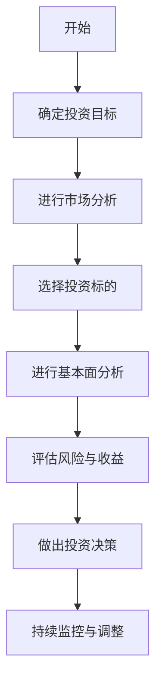
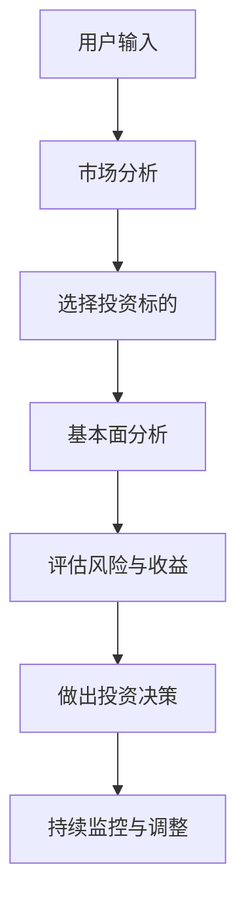

                 


# 巴菲特-芒格看待经济周期：长期视角的重要性

> 关键词：巴菲特，芒格，经济周期，长期视角，价值投资，投资策略

> 摘要：本文将深入探讨巴菲特和芒格的投资哲学，分析他们如何通过长期视角看待经济周期，并为企业投资者提供可操作的投资策略和决策框架。文章从背景介绍、核心理念、经济周期分析、长期视角的重要性、系统化投资决策框架、实战案例分析、项目实战、系统架构设计、小结等方面展开，通过理论与实践结合，为读者提供全面的视角。

---

# 第一部分: 巴菲特与芒格的核心投资理念

## 第1章: 巴菲特与芒格的投资哲学

### 1.1 巴菲特与芒格的背景介绍

#### 1.1.1 巴菲特的生平与投资历程

沃伦·巴菲特（Warren Buffett）是全球最著名的职业投资人之一，被誉为“奥马哈的先知”。他出生于1934年，早年通过投资股票和合伙企业积累了巨额财富。巴菲特的投资理念以“价值投资”为核心，强调寻找具有持续竞争优势、良好管理和强大财务状况的企业进行长期投资。

#### 1.1.2 芒格的哲学与投资理念

查理·芒格（Charlie Munger）是巴菲特的长期合作伙伴，两人共同创立了伯克希尔哈撒韦公司（Berkshire Hathaway）。芒格以其独特的思维方式和跨学科的知识体系闻名。他认为，投资不仅仅是对企业或股票的研究，更是对人性、心理和市场的深刻理解。芒格强调“逆向思维”，即从反方向思考问题，避免随波逐流。

#### 1.1.3 两人合作的黄金时代

自1959年芒格加入巴菲特的合伙企业以来，两人共同管理伯克希尔哈撒韦，将其打造成全球最大的投资公司之一。他们的合作不仅是商业上的成功，更是投资哲学的完美结合，为全球投资者树立了价值投资的典范。

---

### 1.2 巴菲特与芒格的投资哲学

#### 1.2.1 价值投资的定义与核心要素

价值投资是一种以基本面分析为基础的投资策略，强调寻找市场价格低于其内在价值的证券。巴菲特和芒格认为，内在价值是企业未来现金流的现值，可以通过对企业财务状况、行业地位、竞争优势和管理层能力的深入分析来估算。

**核心要素：**
1. **企业竞争优势**：企业是否具备可持续的竞争优势（如专利、品牌、成本优势等）。
2. **财务健康状况**：企业是否有健康的财务状况，包括低负债、稳定的现金流和合理的利润率。
3. **管理层能力**：管理层是否具备诚信、能力和决策能力。

#### 1.2.2 安全边际的概念与应用

安全边际是指市场价格与内在价值之间的差距。巴菲特认为，安全边际是价值投资的核心，通过购买价格低于内在价值的股票，可以降低投资风险并获得超额收益。

#### 1.2.3 长期视角的重要性

巴菲特和芒格强调长期投资的重要性，认为短期市场的波动无法预测，而长期趋势可以通过对企业基本面的深入研究来把握。长期视角不仅减少了短期波动的干扰，还能通过复利效应实现财富的长期增长。

---

## 第2章: 经济周期与投资策略

### 2.1 经济周期的定义与阶段划分

经济周期是指经济活动的波动，通常分为四个阶段：复苏、过热、滞胀和衰退。

#### 2.1.1 不同阶段的特征与影响

| 阶段 | 特征 | 影响 |
|------|------|------|
| 复苏 | 经济开始复苏，企业盈利逐渐恢复 | 投资者可以关注周期性股票，如制造业和科技行业 |
| 过热 | 经济增长过快，通胀上升 | 应警惕市场泡沫，避免过度投资 |
| 滞胀 | 经济增长停滞，通胀高企 | 应寻找防御性投资，如公用事业和消费品行业 |
| 衰退 | 经济衰退，企业盈利下降 | 应寻找估值低、具有长期竞争优势的企业 |

### 2.2 巴菲特与芒格如何看待经济周期

#### 2.2.1 经济周期中的企业分析

巴菲特和芒格认为，企业能否在经济周期中生存并发展是投资的关键。他们更倾向于投资那些在经济衰退中依然能够保持盈利的企业，这些企业通常具有强大的竞争优势和财务实力。

#### 2.2.2 投资者如何应对周期波动

- **识别周期阶段**：通过分析经济指标（如GDP增长率、通胀率、失业率等）判断当前经济所处的阶段。
- **调整投资策略**：根据周期阶段选择合适的投资标的，避免在过热阶段追高，而在衰退阶段寻找估值低洼地。
- **保持耐心**：经济周期的波动是短期的，长期趋势更值得关注。

#### 2.2.3 长期视角下的周期管理

通过长期视角，投资者可以避免被短期波动所干扰，专注于寻找那些在长期中具有持续竞争优势的企业。例如，在经济衰退期间，许多优质企业的股票价格可能被市场低估，为长期投资者提供了买入的机会。

---

## 第3章: 长期视角与投资决策

### 3.1 长期视角的重要性

#### 3.1.1 长期视角的核心理念

长期视角意味着投资者关注的是企业的长期价值，而非短期价格波动。这种思维方式可以帮助投资者避免被市场情绪所左右，专注于寻找那些能够在长期中为股东创造价值的企业。

#### 3.1.2 短期波动对长期投资的影响

短期波动是市场的常态，但长期趋势是由企业的基本面决定的。通过长期视角，投资者可以忽略短期波动，专注于企业的内在价值。

#### 3.1.3 长期复利效应的数学模型

复利效应是长期投资的核心，其数学模型为：

$$
FV = PV \times (1 + r)^n
$$

其中，\( FV \) 是未来价值，\( PV \) 是现值，\( r \) 是年化收益率，\( n \) 是投资时间（年）。

---

### 3.2 长期视角下的投资策略

#### 3.2.1 企业基本面分析

长期投资者需要对企业进行深入的基本面分析，包括企业的财务状况、行业地位、竞争优势和管理层能力等。

#### 3.2.2 股东价值最大化

巴菲特和芒格认为，企业的目标是为股东创造最大化的价值。因此，投资者需要关注企业的股东价值回报率（ROE）和股东权益增长率。

#### 3.2.3 风险控制与投资组合优化

通过分散投资和风险控制，投资者可以降低投资组合的波动性，同时保持长期增长。

---

## 第4章: 巴菲特与芒格的投资决策框架

### 4.1 投资决策的核心要素

#### 4.1.1 企业竞争优势分析

企业竞争优势是巴菲特和芒格选股的核心标准。他们更倾向于投资那些具有“护城河”的企业，即竞争对手难以复制的竞争优势。

#### 4.1.2 财务状况评估

通过分析企业的财务报表，投资者可以了解企业的盈利能力、资产负债情况和现金流状况。

#### 4.1.3 管理层能力评估

管理层的能力和诚信是企业成功的关键因素。巴菲特和芒格倾向于投资那些由诚实、有能力的管理层领导的企业。

### 4.2 决策框架的系统化分析

#### 4.2.1 企业生命周期模型

企业生命周期模型将企业的发展分为多个阶段，包括初创期、成长期、成熟期和衰退期。投资者需要根据企业的生命周期阶段选择合适的投资策略。

#### 4.2.2 投资决策的流程图



#### 4.2.3 风险评估与应对策略

通过建立风险评估模型，投资者可以识别潜在风险，并制定应对策略。例如，通过分散投资降低市场风险，通过长期持有降低短期波动的风险。

---

## 第5章: 实战案例分析

### 5.1 巴菲特的经典投资案例

#### 5.1.1 可口可乐的投资

巴菲特在1988年投资可口可乐，因为其强大的品牌优势和稳定的现金流。尽管在投资期间遇到了市场波动，但可口可乐的长期表现证明了巴菲特的选择是正确的。

---

## 第6章: 项目实战

### 6.1 环境安装

在进行投资分析时，投资者需要掌握基本的财务知识和投资工具，如财务报表分析、估值模型和投资组合管理工具。

### 6.2 系统核心实现源代码

以下是基于巴菲特和芒格投资理念的简单投资决策系统框架：

```python
def evaluate_company(company):
    # 1. 评估企业竞争优势
    if company.competitive_advantage:
        return True
    # 2. 评估财务状况
    if company.financial_health:
        return True
    # 3. 评估管理层能力
    if company.management_capability:
        return True
    return False

def make_investment_decision(stocks):
    for stock in stocks:
        if evaluate_company(stock):
            return stock
    return None
```

### 6.3 代码应用解读与分析

上述代码是一个简单的投资决策系统，通过评估企业的竞争优势、财务状况和管理层能力，选择合适的投资标的。这只是一个基础框架，实际投资需要结合更多的因素和模型。

---

## 第7章: 系统架构设计

### 7.1 系统功能设计

以下是投资决策系统的功能模块：



---

## 第8章: 小结

通过本文的分析，我们可以看到，巴菲特和芒格的投资哲学不仅仅是一种投资策略，更是一种长期视角下的价值创造方法。在经济周期中，长期视角可以帮助投资者避免短期波动的干扰，专注于寻找那些能够在长期中为股东创造价值的企业。

作者：AI天才研究院/AI Genius Institute & 禅与计算机程序设计艺术 /Zen And The Art of Computer Programming

