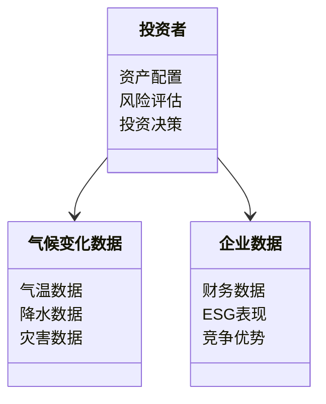

                 


# 巴菲特-芒格看气候变化：对投资决策的影响

> 关键词：巴菲特，芒格，气候变化，投资决策，风险管理，可持续投资

> 摘要：本文探讨了气候变化对投资决策的影响，结合巴菲特和芒格的投资理念，分析了气候变化对传统投资策略的挑战，提出了基于数据驱动的气候变化分析框架，以帮助投资者更好地应对气候变化带来的风险和机会。

---

## 第一部分：背景与概述

### 第1章：巴菲特与芒格的投资理念

#### 1.1 巴菲特的价值投资原则

##### 1.1.1 价值投资的核心理念
巴菲特的价值投资理念强调长期持有优质资产，寻找具有持续竞争优势的企业，并以合理的价格买入。这种理念的核心在于关注企业的内在价值，而不是市场的短期波动。

**关键公式：**
$$ \text{内在价值} = \frac{\text{未来现金流的现值}}{\text{折现率}} $$

##### 1.1.2 巴菲特的投资策略与选股标准
巴菲特选股的“三重标准”：
1. **伟大的企业**：具有持续的竞争优势和高ROE。
2. **合理的估值**：买入价格低于内在价值。
3. **长期持有的耐心**：避免短期波动的干扰。

##### 1.1.3 巴菲特对长期趋势的关注
巴菲特意识到长期趋势对企业价值的影响，尤其是在能源、环保等领域，气候变化已成为不可忽视的长期趋势。

#### 1.2 芮格的认知框架与决策思维

##### 1.2.1 芮格的多元思维模型
芒格强调多元思维模型的重要性，认为投资者需要从多个角度（如物理学、心理学、经济学）理解问题，以避免认知偏差。

##### 1.2.2 芮格对风险的重视
芒格认为，风险管理是投资中最重要的一环，尤其是对“黑天鹅”事件的防范。

##### 1.2.3 芮格的长期主义与安全边际
芒格强调安全边际的重要性，认为在投资中留有余地是应对不确定性的关键。

---

### 第2章：气候变化的现状与挑战

#### 2.1 气候变化的科学基础

##### 2.1.1 气候变化的基本概念
气候变化是指地球气候系统长期的变化，主要由温室气体排放（如CO₂、CH₄）导致的全球变暖。

##### 2.1.2 人类活动对气候变化的影响
工业革命以来，人类活动（如化石燃料使用、森林砍伐）显著增加了大气中的温室气体浓度。

##### 2.1.3 气候变化的潜在后果
气候变化可能导致极端天气（如洪水、干旱）、海平面上升、生态系统破坏等问题。

#### 2.2 气候变化对企业与投资的影响

##### 2.2.1 气候变化对全球经济的潜在影响
气候变化可能引发经济衰退、企业倒闭、资产减值等问题。

##### 2.2.2 气候变化对企业盈利能力和估值的影响
企业如果不能适应气候变化，可能会面临更高的运营成本、监管风险和市场风险。

##### 2.2.3 气候变化对投资组合的风险与机会
气候变化可能带来新的投资机会（如可再生能源）和传统行业的风险。

---

## 第二部分：气候变化对投资决策的影响

### 第3章：气候变化对传统投资策略的挑战

#### 3.1 传统投资策略的局限性

##### 3.1.1 传统财务分析的不足
传统财务分析往往忽视了气候变化对企业运营成本、市场需求和政策风险的影响。

##### 3.1.2 传统估值模型在气候变化下的失效
传统的DCF模型假设现金流稳定，但在气候变化下，企业的现金流可能因极端天气而波动。

##### 3.1.3 传统行业分析的忽视
传统行业分析未充分考虑气候变化对行业格局的影响，例如能源行业的转型需求。

#### 3.2 气候变化对行业风险的放大效应

##### 3.2.1 对能源行业的冲击
气候变化可能导致能源需求的变化，例如可再生能源需求的增加和化石能源需求的减少。

##### 3.2.2 对农业和水资源行业的威胁
气候变化可能导致农作物减产、水资源短缺，从而影响农业企业的盈利能力。

##### 3.2.3 对保险行业的潜在影响
气候变化可能增加自然灾害的发生频率，从而提高保险行业的赔付压力。

---

### 第4章：气候变化与投资组合的重构

#### 4.1 投资组合重构的必要性

##### 4.1.1 传统投资组合的不足
传统投资组合可能过于依赖化石能源相关行业，这些行业在气候变化下的风险较高。

##### 4.1.2 可持续投资的重要性
通过投资于环保企业（如可再生能源、电动汽车制造），投资者可以降低投资组合的碳足迹。

##### 4.1.3 ESG投资的崛起
ESG（环境、社会、治理）投资理念逐渐成为主流，投资者开始关注企业的环境表现和社会责任。

#### 4.2 数据驱动的气候变化分析框架

##### 4.2.1 数据来源与处理
- 数据来源：政府报告、企业披露、学术研究。
- 数据处理：清洗、整合、分析。

##### 4.2.2 气候变化预测模型
使用机器学习模型（如随机森林、神经网络）预测气候变化对企业的影响。

##### 4.2.3 风险评估与投资策略调整
基于预测结果，调整投资组合，增加对高风险行业的分散投资。

---

## 第三部分：系统分析与架构设计

### 第5章：系统功能设计

#### 5.1 领域模型（Mermaid 类图）



---

### 第6章：系统架构设计

#### 6.1 系统架构（Mermaid 架构图）


---

### 第7章：项目实战

#### 7.1 环境安装与数据准备

```bash
# 安装Python和相关库
pip install numpy pandas scikit-learn
```

#### 7.2 核心实现代码

```python
import numpy as np
import pandas as pd
from sklearn.ensemble import RandomForestRegressor

# 数据加载
data = pd.read_csv('climate_investment.csv')

# 特征选择
features = data.drop('target', axis=1)
target = data['target']

# 模型训练
model = RandomForestRegressor()
model.fit(features, target)

# 预测结果
predictions = model.predict(features)
```

---

## 第四部分：结论与建议

### 第8章：结论与建议

#### 8.1 总结
气候变化对投资决策的影响日益显著，投资者需要将气候变化因素纳入分析框架，采用数据驱动的方法进行风险管理。

#### 8.2 投资建议
- 增加对可再生能源和环保企业的投资。
- 采用ESG投资策略，关注企业的可持续发展能力。
- 建立气候风险预警机制，及时调整投资组合。

---

### 第9章：未来展望

#### 9.1 气候变化与投资的长期趋势
气候变化将继续影响全球经济和投资市场，投资者需要持续关注相关政策和技术创新。

#### 9.2 数据驱动投资的未来发展
随着技术进步，数据驱动的气候变化分析将更加精准，帮助投资者做出更明智的决策。

---

作者：AI天才研究院 & 禅与计算机程序设计艺术

