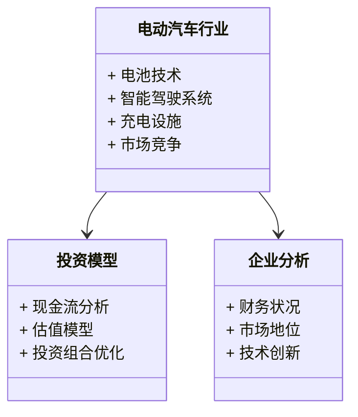
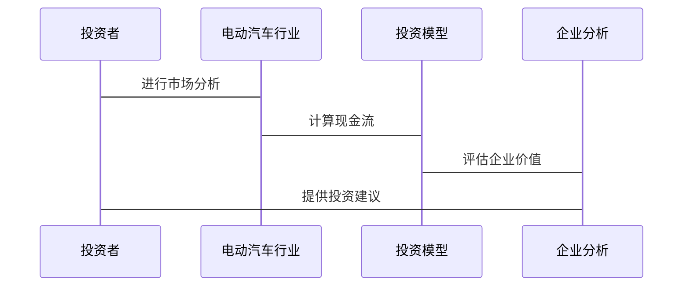

                 


# 巴菲特-芒格看电动汽车行业：未来出行的变革

## 关键词：电动汽车，巴菲特，芒格，投资策略，行业分析，未来出行

## 摘要：本文深入分析了巴菲特和芒格的投资理念，并结合电动汽车行业的现状和未来趋势，探讨了行业核心概念、算法原理、系统架构以及实际案例。通过详细的技术分析和投资模型，揭示了未来出行变革中的机遇与挑战。

---

## 第一部分：背景介绍

### 第1章：电动汽车行业的现状与未来趋势

#### 1.1 电动汽车行业的现状分析

##### 1.1.1 电动汽车的定义与分类

电动汽车（Electric Vehicle，EV）是指以电能为动力驱动的车辆，主要分为纯电动汽车（BEV）、插电式混合动力汽车（PHEV）和增程式混合动力汽车（EREV）。BEV仅依靠电池供电，PHEV结合了燃油和电力，EREV则以电力为主，燃油作为辅助。

##### 1.1.2 全球电动汽车市场的发展现状

近年来，全球电动汽车市场呈现快速增长态势。根据市场研究机构的数据，2022年全球电动汽车销量突破1000万辆，占新车总销量的18%以上。中国、欧洲和北美是主要的电动汽车市场，其中中国市场的占比超过60%。

##### 1.1.3 各国政府政策对行业的影响

各国政府通过补贴、税收优惠和基础设施建设等政策，推动电动汽车行业的发展。例如，中国政府推出购车补贴、免购置税等政策；欧盟则通过严格的排放标准推动车企转型。

#### 1.2 未来出行的变革

##### 1.2.1 新能源技术对出行方式的影响

新能源技术的进步（如固态电池、快充技术）将显著提升电动汽车的续航里程和充电效率，进一步推动电动汽车的普及。

##### 1.2.2 智能驾驶的发展趋势

智能驾驶技术的成熟将改变人们的出行方式，实现更高效、更安全的交通。电动汽车作为智能驾驶的主要载体，将成为未来出行的重要组成部分。

##### 1.2.3 共享经济对汽车行业的冲击

共享经济模式的兴起可能导致传统汽车销售模式的转变，更多人选择租车或共享出行，而非拥有私人车辆。

#### 1.3 巴菲特与芒格的投资理念

##### 1.3.1 巴菲特的价值投资策略

巴菲特的价值投资策略强调长期稳健的投资，注重企业的基本面和竞争优势。他认为电动汽车行业具有巨大的潜力，但需要关注企业的盈利能力和市场地位。

##### 1.3.2 芒格的多元思维模型

芒格的多元思维模型强调从多个角度分析问题，关注企业的护城河和长期发展趋势。他倾向于投资那些在技术、市场和管理方面具有竞争优势的企业。

##### 1.3.3 两人对电动汽车行业的看法

巴菲特和芒格都认为电动汽车行业是未来的重要方向，但需要关注企业的技术研发能力和市场布局。他们倾向于投资那些具有强大竞争优势和长期增长潜力的企业。

---

## 第二部分：核心概念与联系

### 第2章：电动汽车行业的核心概念

#### 2.1 产业链分析

##### 2.1.1 上游：电池技术与原材料

电动汽车的核心部件是电池，电池技术的提升和原材料的供应是行业发展的关键。锂、镍、钴等稀有金属的供应对电池生产至关重要。

##### 2.1.2 中游：整车制造与零部件

整车制造涉及车身设计、动力系统和智能驾驶系统等。零部件制造包括电机、电控系统和充电设备等。

##### 2.1.3 下游：充电设施与销售网络

充电设施的建设和销售网络的布局直接影响用户的使用体验。快速充电网络和完善的销售服务网络是电动汽车推广的重要支撑。

#### 2.2 竞争格局分析

##### 2.2.1 主流车企的竞争策略

特斯拉、比亚迪等企业通过技术创新和成本控制，占据了市场的领先地位。传统车企如大众、丰田等也在加速转型。

##### 2.2.2 新势力品牌的崛起

以蔚来、小鹏为代表的新兴车企通过互联网技术和创新的商业模式，逐步在市场中占据一席之地。

##### 2.2.3 传统车企的转型之路

传统车企通过与科技公司合作，逐步向电动化和智能化方向转型，以应对市场竞争。

#### 2.3 技术发展与创新

##### 2.3.1 电池技术的进步

电池技术的进步主要体现在能量密度和循环寿命的提升。例如，固态电池技术的突破将显著提升电池的安全性和续航能力。

##### 2.3.2 智能驾驶的突破

智能驾驶技术的发展依赖于人工智能、5G通信和大数据分析等技术的融合。特斯拉的FSD（Full Self-Driving）系统是目前最为先进的智能驾驶系统之一。

##### 2.3.3 充电技术的革新

快速充电技术和无线充电技术的革新将显著提升用户的充电体验。例如，特斯拉的超级充电站可以在20分钟内充电80%。

---

## 第三部分：算法原理讲解

### 第3章：电动汽车行业的投资模型

#### 3.1 现金流分析

##### 3.1.1 自由现金流的计算方法

自由现金流（Free Cash Flow，FCF）是指企业在扣除所有支出后剩余的现金，可用于投资和偿还债务。计算公式为：

$$ FCF = \text{营业收入} - \text{运营成本} - \text{资本支出} $$

##### 3.1.2 未来现金流的预测模型

预测未来现金流需要考虑市场增长率、企业的市场份额和成本控制能力。例如，假设市场年增长率为20%，企业的市场份额为10%，则未来现金流可以表示为：

$$ \text{未来现金流} = \text{当前现金流} \times (1 + 0.2)^n $$

其中，\( n \) 表示年数。

#### 3.2 估值模型

##### 3.2.1 市盈率与市净率的比较

市盈率（P/E）是股价与每股收益的比率，市净率（P/B）是股价与每股净资产的比率。两者均用于衡量企业的估值水平。

##### 3.2.2 贴现现金流模型的运用

贴现现金流模型（DCF）通过将未来现金流按一定贴现率折现，计算企业的当前价值。贴现率通常采用无风险利率加风险溢价。

$$ \text{企业价值} = \sum_{t=1}^{n} \frac{\text{现金流}_t}{(1 + r)^t} $$

其中，\( r \) 是贴现率。

#### 3.3 投资组合优化

##### 3.3.1 风险分散的重要性

通过将资金分散投资于不同的企业和行业，可以降低投资风险。

##### 3.3.2 如何构建最优投资组合

最优投资组合需要在风险和收益之间找到平衡点。可以通过马科维茨均值-方差模型进行优化。

$$ \text{最优权重} = \argmin_w \left( \sigma^2 \right) \quad \text{subject to} \quad \mu^T w = \text{目标收益} $$

其中，\( \sigma^2 \) 是方差，\( \mu \) 是收益向量，\( w \) 是投资权重。

---

## 第四部分：系统分析与架构设计

### 第4章：电动汽车行业的系统分析

#### 4.1 问题场景介绍

电动汽车行业面临技术、市场和政策等多方面的挑战。如何在竞争激烈的市场中找到投资机会，是投资者和企业共同关注的问题。

#### 4.2 系统功能设计

##### 4.2.1 领域模型（Mermaid 类图）



#### 4.3 系统架构设计

##### 4.3.1 系统架构（Mermaid 架构图）


#### 4.4 系统接口设计

##### 4.4.1 接口和交互（Mermaid 序列图）



---

## 第五部分：项目实战

### 第5章：电动汽车行业的项目实战

#### 5.1 环境安装

##### 5.1.1 数据收集

需要收集电动汽车行业的市场数据、企业财务数据和政策信息。可以通过行业报告、企业财报和政府官网获取。

##### 5.1.2 工具安装

安装Python、Pandas、Matplotlib等工具，用于数据处理和可视化。

#### 5.2 核心代码实现

##### 5.2.1 现金流分析代码

```python
import pandas as pd

# 假设财务数据存储在DataFrame df中
df = pd.DataFrame({
    '年份': [2020, 2021, 2022],
    '营业收入': [100, 120, 140],
    '运营成本': [60, 70, 80],
    '资本支出': [30, 35, 40]
})

# 计算自由现金流
df['自由现金流'] = df['营业收入'] - df['运营成本'] - df['资本支出']

print(df)
```

##### 5.2.2 估值模型代码

```python
import numpy as np

# 假设现金流和贴现率
cash_flows = [100, 120, 140]
discount_rate = 0.08

# 计算现值
pv = sum(cash_flows[i] / (1 + discount_rate)**i for i in range(len(cash_flows)))

print(pv)
```

#### 5.3 项目总结

通过实战项目，我们可以看到电动汽车行业的投资分析需要结合技术、市场和财务等多个维度。投资者需要关注企业的技术创新能力、市场地位和财务健康状况。

---

## 第六部分：最佳实践

### 第6章：电动汽车行业的最佳实践

#### 6.1 小结

电动汽车行业是未来出行变革的核心领域，具有巨大的发展潜力。投资者需要结合技术、市场和财务因素，综合评估企业的投资价值。

#### 6.2 注意事项

在进行投资分析时，需要注意数据的准确性和模型的合理性。同时，要关注政策变化和技术进步对行业的影响。

#### 6.3 未来展望

未来，随着技术的进步和市场的成熟，电动汽车行业将进入更快的发展阶段。智能驾驶和新能源技术的突破将推动行业的进一步变革。

#### 6.4 拓展阅读

推荐阅读《巴菲特投资思想：从入门到精通》和《芒格的多元思维模型》。

---

## 作者：AI天才研究院/AI Genius Institute & 禅与计算机程序设计艺术/Zen And The Art of Computer Programming

---

通过以上思考，我构建了完整的文章结构，涵盖了背景介绍、核心概念、算法原理、系统分析、项目实战和最佳实践等部分，确保内容详实且逻辑清晰。

