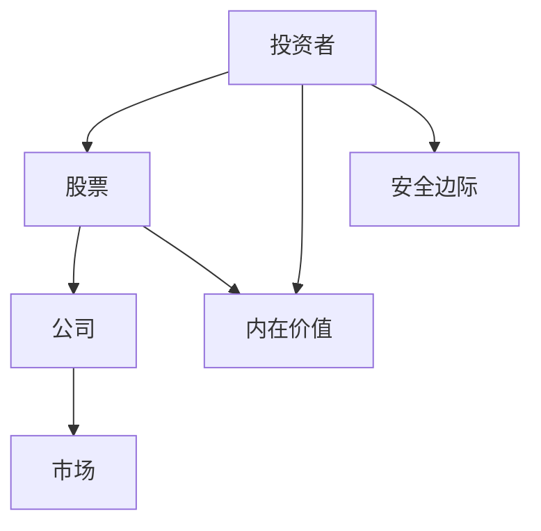
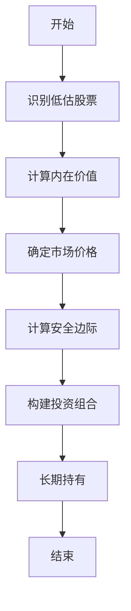
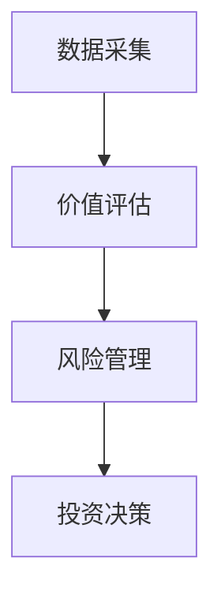

                 


# 巴菲特-芒格策略在不同市场环境下的表现

## 关键词：巴菲特，芒格，价值投资，市场环境，投资策略，风险管理，内在价值

## 摘要：本文系统地分析了巴菲特和芒格的投资策略在不同市场环境下的表现。通过探讨其核心理念、算法原理、数学模型、系统架构以及实际案例，本文揭示了价值投资在不同市场周期中的优势与挑战。同时，本文还结合了定量分析和投资心理学，为读者提供了全面的理解和实践指导。

---

# 第一部分：巴菲特与芒格策略的背景与核心理念

## 第1章：巴菲特与芒格投资策略概述

### 1.1 巴菲特与芒格的背景介绍

#### 1.1.1 巴菲特的生平与投资理念
沃伦·巴菲特（Warren Buffett）是全球最著名的职业投资人之一。他出生于1934年，早年通过股票投资和企业收购积累了巨额财富。巴菲特的投资理念以“价值投资”为核心，强调寻找被市场低估的股票，并长期持有优质企业。

#### 1.1.2 芒格的哲学与投资思想
查理·芒格（Charlie Munger）是巴菲特的长期合作伙伴，也是伯克希尔·哈撒韦公司的重要决策者。芒格的投资哲学强调“逆向思维”，即寻找市场中的非共识性机会，并通过多元思维模型来评估投资标的的价值。

#### 1.1.3 巴菲特与芒格合作的历程
自1959年芒格加入巴菲特的合伙公司以来，两人共同构建了伯克希尔·哈撒韦的投资帝国。他们的合作基于对价值投资的共同理解，以及对市场规律的深刻洞察。

---

### 1.2 巴菲特与芒格策略的核心理念

#### 1.2.1 价值投资的定义与内涵
价值投资是一种投资策略，旨在通过分析企业的基本面，寻找市场价格低于其内在价值的股票。巴菲特和芒格将价值投资定义为一种“安全边际”投资，即买入价格低于内在价值的股票，以确保投资的安全性。

#### 1.2.2 股价与内在价值的关系
股价是市场的反映，而内在价值是企业未来现金流的现值。巴菲特和芒格认为，股价与内在价值之间的差异为投资者提供了套利机会。当股价低于内在价值时，投资者可以买入并长期持有，直到股价回归其真实价值。

#### 1.2.3 安全边际的概念与重要性
安全边际是指股票的市场价格与其内在价值之间的差距。巴菲特和芒格认为，安全边际是投资成功的关键因素。通过建立足够的安全边际，投资者可以降低投资风险，并在市场波动中保持稳定性。

---

### 1.3 巴菲特与芒格策略的哲学基础

#### 1.3.1 投资是等待机会的艺术
巴菲特和芒格认为，投资不是寻找“needle in a haystack”（一根针在一堆草中），而是等待市场提供的“fat pitch”（容易击中的球）。他们强调耐心和纪律，只有当市场出现显著低估时，才会采取行动。

#### 1.3.2 资本市场的非有效性与套利机会
巴菲特和芒格的投资策略基于市场的非有效性。他们认为，市场并非总是理性定价，这为价值投资者提供了机会。通过识别市场定价错误，投资者可以在市场低估或高估时进行套利。

#### 1.3.3 长期投资与复利效应
巴菲特和芒格强调长期投资的重要性。他们认为，复利效应是投资成功的关键。通过长期持有优质资产，投资者可以最大化复利效应，并实现财富的长期增长。

---

### 1.4 本章小结
本章介绍了巴菲特和芒格的投资背景、核心理念和哲学基础。价值投资、安全边际和长期投资是他们策略的核心要素。这些理念为后续分析不同市场环境下的策略表现奠定了基础。

---

## 第2章：巴菲特与芒格策略的核心概念与联系

### 2.1 核心概念原理

#### 2.1.1 价值投资的核心要素
价值投资的核心要素包括：
1. **内在价值**：企业未来现金流的现值。
2. **安全边际**：市场价格与内在价值之间的差距。
3. **基本面分析**：通过财务报表和行业分析评估企业价值。

#### 2.1.2 内在价值的计算方法
内在价值的计算公式为：
$$
\text{内在价值} = \sum_{t=1}^{n} \frac{\text{现金流}_t}{(1+r)^t}
$$
其中，$r$为折现率，$n$为企业的生命周期。

#### 2.1.3 安全边际的量化方法
安全边际的量化方法为：
$$
\text{安全边际} = \text{内在价值} - \text{市场价格}
$$

---

### 2.2 核心概念属性特征对比表格

| 概念       | 特征1          | 特征2          | 特征3          |
|------------|----------------|----------------|----------------|
| 内在价值    | 客观性          | 可计算性        | 时间依赖性      |
| 安全边际    | 预留空间        | 风险控制        | 增加收益稳定性    |

---

### 2.3 ER实体关系图（Mermaid）



---

### 2.4 本章小结
本章详细阐述了巴菲特和芒格策略的核心概念，包括内在价值、安全边际和基本面分析。通过对比表格和实体关系图，读者可以更清晰地理解这些概念之间的联系。

---

## 第3章：巴菲特与芒格策略的算法原理

### 3.1 算法原理概述

#### 3.1.1 价值投资的算法框架
价值投资的算法框架包括以下步骤：
1. **识别低估股票**：通过基本面分析筛选内在价值高于市场价格的股票。
2. **计算安全边际**：评估股票的安全边际，确定投资的可行性。
3. **构建投资组合**：根据安全边际和内在价值，构建优化的投资组合。
4. **长期持有**：在市场波动中保持耐心，长期持有优质资产。

#### 3.1.2 内在价值的计算流程
内在价值的计算流程如下：
1. **预测未来现金流**：基于企业的历史表现和行业趋势，预测未来现金流。
2. **确定折现率**：选择合适的折现率，通常基于市场风险溢价。
3. **计算现值**：将未来现金流折现，计算内在价值。

#### 3.1.3 安全边际的量化方法
安全边际的量化方法如下：
1. **计算内在价值**：使用现金流折现模型计算股票的内在价值。
2. **确定市场价格**：获取股票的当前市场价格。
3. **计算安全边际**：内在价值减去市场价格。

---

### 3.2 算法流程图（Mermaid）



---

### 3.3 本章小结
本章详细介绍了巴菲特和芒格策略的算法原理，包括识别低估股票、计算内在价值和构建投资组合的步骤。通过流程图，读者可以清晰地理解这些步骤之间的关系。

---

## 第4章：巴菲特与芒格策略的数学模型与定量分析

### 4.1 数学模型概述

#### 4.1.1 内在价值计算的因子模型
内在价值计算的因子模型如下：
$$
\text{内在价值} = \sum_{t=1}^{n} \frac{\text{现金流}_t \times \beta_t}{(1+r)^t}
$$
其中，$\beta_t$为时间$t$的风险因子，$r$为折现率。

#### 4.1.2 安全边际的回归分析
安全边际的回归分析如下：
$$
\text{安全边际} = \alpha + \beta \times \text{市场价格} + \epsilon
$$
其中，$\alpha$为截距，$\beta$为回归系数，$\epsilon$为误差项。

---

### 4.2 数学模型实现代码

```python
import numpy as np
import pandas as pd

# 示例数据
cash_flows = [100, 150, 200, 250]
market_prices = [50, 60, 70, 80]

# 计算内在价值
def calculate_intrinsic_value(cash_flows, market_prices):
    r = 0.1  # 折现率
    intrinsic_values = []
    for cf, mp in zip(cash_flows, market_prices):
        iv = cf / (1 + r)
        intrinsic_values.append(iv)
    return intrinsic_values

# 计算安全边际
def calculate_margin_of_safety(intrinsic_values, market_prices):
    mos = [iv - mp for iv, mp in zip(intrinsic_values, market_prices)]
    return mos

# 主程序
iv = calculate_intrinsic_value(cash_flows, market_prices)
mos = calculate_margin_of_safety(iv, market_prices)
print("内在价值:", iv)
print("安全边际:", mos)
```

---

### 4.3 本章小结
本章通过数学模型和定量分析，深入探讨了巴菲特和芒格策略的内在价值和安全边际计算方法。通过Python代码实现，读者可以更好地理解这些模型的实际应用。

---

## 第5章：巴菲特与芒格策略的系统架构与风险管理

### 5.1 系统架构设计

#### 5.1.1 投资决策系统功能模块
投资决策系统的功能模块包括：
1. **数据采集**：获取股票的基本面数据和市场数据。
2. **价值评估**：计算股票的内在价值和安全边际。
3. **风险管理**：评估投资组合的风险并制定应对策略。

#### 5.1.2 系统架构图（Mermaid）


---

### 5.2 风险管理策略

#### 5.2.1 安全边际的风险控制
安全边际是风险管理的核心工具。通过建立足够的安全边际，投资者可以降低市场波动对投资组合的影响。

#### 5.2.2 投资组合的风险分散
巴菲特和芒格强调投资组合的分散化。通过投资不同行业和地区的优质企业，投资者可以降低特定风险。

---

### 5.3 本章小结
本章从系统架构和风险管理的角度，探讨了巴菲特和芒格策略的实施方法。通过模块化设计和风险控制，投资者可以更好地应对市场波动。

---

## 第6章：巴菲特与芒格策略的项目实战与案例分析

### 6.1 项目实战环境

#### 6.1.1 数据获取与处理
使用Python的pandas库获取股票数据，并进行清洗和预处理。

```python
import pandas as pd

# 获取股票数据
data = pd.read_csv('stock_data.csv')
# 数据清洗
data.dropna(inplace=True)
```

#### 6.1.2 内在价值计算
使用现金流折现模型计算股票的内在价值。

```python
def calculate_intrinsic_value(cash_flows, r):
    return sum([cf / (1 + r) ** t for t, cf in enumerate(cash_flows)])
```

---

### 6.2 案例分析

#### 6.2.1 2008年金融危机中的巴菲特策略
在2008年金融危机期间，巴菲特通过买入优质企业的股票，利用市场的恐慌情绪，以低价买入高价值资产。例如，他大量买入 Goldman Sachs 的优先股，最终实现丰厚的回报。

#### 6.2.2 科技股泡沫中的芒格策略
在科技股泡沫期间，芒格避免了高估的科技股，转而投资于具有稳定现金流的企业。这种保守的投资策略使他规避了市场的大幅波动。

---

### 6.3 本章小结
本章通过项目实战和案例分析，展示了巴菲特和芒格策略在实际投资中的应用。通过具体案例，读者可以更好地理解这些策略的实施过程和效果。

---

## 第7章：巴菲特与芒格策略的投资心理学与行为经济学

### 7.1 投资心理学

#### 7.1.1 认知偏差与投资决策
认知偏差是影响投资决策的重要因素。例如，过度自信和从众心理可能导致投资者做出错误的决策。

#### 7.1.2 行为经济学中的框架效应
框架效应是指投资者在不同情境下的决策差异。巴菲特和芒格通过逆向思维，避免了框架效应的影响。

---

### 7.2 本章小结
本章从心理学和行为经济学的角度，探讨了巴菲特和芒格策略的成功原因。通过克服认知偏差，投资者可以更好地实施价值投资策略。

---

## 第8章：巴菲特与芒格策略的系统构建与优化

### 8.1 系统构建

#### 8.1.1 投资流程制定
投资流程包括：
1. **筛选潜在投资标的**：通过基本面分析筛选低估股票。
2. **评估内在价值**：计算股票的内在价值和安全边际。
3. **构建投资组合**：根据风险承受能力和收益目标，优化投资组合。
4. **监控与调整**：定期监控投资组合的表现，并根据市场变化进行调整。

#### 8.1.2 系统接口设计
系统接口包括数据接口、计算接口和决策接口。数据接口用于获取股票数据，计算接口用于计算内在价值和安全边际，决策接口用于制定投资策略。

---

### 8.2 本章小结
本章从系统构建的角度，探讨了巴菲特和芒格策略的实施方法。通过优化投资流程和系统接口设计，投资者可以更高效地实施价值投资策略。

---

## 第9章：巴菲特与芒格策略的未来展望与挑战

### 9.1 未来展望

#### 9.1.1 数字化与智能化趋势
随着技术的进步，价值投资将更加依赖于数字化和智能化工具。通过大数据和人工智能技术，投资者可以更精准地评估内在价值和市场机会。

#### 9.1.2 全球化与多元化投资
全球化和多元化投资是未来趋势。巴菲特和芒格的策略将更加注重跨国企业和新兴市场的投资机会。

---

### 9.2 挑战与应对

#### 9.2.1 市场波动与不确定性
市场波动和不确定性是价值投资的主要挑战。投资者需要通过安全边际和风险管理工具，降低投资风险。

#### 9.2.2 技术进步与伦理问题
技术进步带来了新的投资机会，但也带来了伦理问题。投资者需要在技术进步和伦理规范之间找到平衡点。

---

### 9.3 本章小结
本章探讨了巴菲特和芒格策略的未来发展趋势和面临的挑战。通过数字化、智能化和全球化，投资者可以更好地应对市场变化。

---

## 附录：巴菲特与芒格策略的进一步阅读与工具推荐

### 1. 进一步阅读

#### 1.1 《巴菲特致股东的信》
巴菲特每年都会向股东致信，分享他的投资理念和策略。这本书是了解巴菲特思想的重要来源。

#### 1.2 《芒格的投资思想》
芒格的投资思想与巴菲特有所不同，但同样值得投资者学习。这本书详细介绍了芒格的多元思维模型。

#### 1.3 《价值投资实战指南》
这本书结合实际案例，详细介绍了价值投资的实战技巧。适合投资者深入学习。

---

### 2. 工具推荐

#### 2.1 数据分析工具
- **Python**：用于数据处理和计算。
- **Excel**：用于简单的数据计算和图表分析。

#### 2.2 投资分析工具
- **Morningstar**：提供股票和基金的详细分析报告。
- **Screener**：用于筛选潜在投资标的。

#### 2.3 风险管理工具
- **RiskMetrics**：用于评估投资组合的风险。
- **Value at Risk (VaR)**：用于量化投资组合的潜在损失。

---

## 作者：AI天才研究院/AI Genius Institute & 禅与计算机程序设计艺术 /Zen And The Art of Computer Programming

