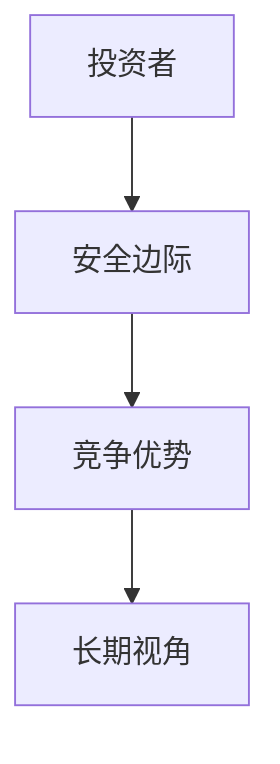
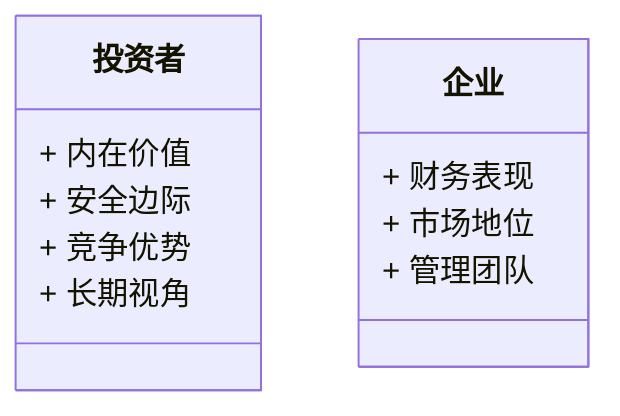
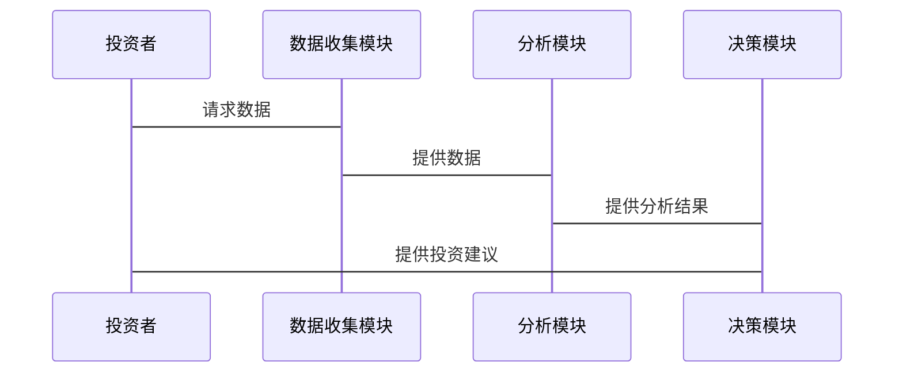

                 


# 巴菲特-芒格策略在全球市场的适用性

## 关键词：
巴菲特, 芒格, 价值投资, 投资策略, 全球市场, 竞争优势, 安全边际

## 摘要：
本文探讨了巴菲特和芒格的价值投资策略在全球市场中的适用性。通过分析其核心原则、系统架构和实际案例，本文展示了如何将这些策略应用于不同市场环境，强调了竞争优势和安全边际的重要性，并提供了实用的投资建议。

---

# 第一部分: 巴菲特-芒格策略概述

## 1.1 巴菲特与芒格的投资理念

### 1.1.1 巴菲特的价值投资原则
巴菲特的价值投资基于以下原则：
1. **安全边际**：购买价格低于内在价值。
2. **长期视角**：关注企业的长期盈利能力。
3. **竞争优势**：投资具有护城河的企业。

### 1.1.2 芒格的多元思维模型
芒格强调跨学科思维，将多个领域的知识整合，形成决策优势。

### 1.1.3 核心要素
- **安全边际**：确保投资的安全性。
- **竞争优势**：识别具有持续竞争优势的企业。
- **长期视角**：投资于能够持续增长的企业。

## 1.2 价值投资的定义与特点

### 1.2.1 定义
价值投资是通过分析企业的内在价值，寻找市场价格低于内在价值的投资机会。

### 1.2.2 核心特点
- **安全边际**：价格低于价值。
- **逆向思维**：在市场恐慌时买入。
- **长期持有**：耐心等待价值实现。

### 1.2.3 与其他策略的对比
| 战略       | 价值投资       | 投机交易       |
|------------|----------------|----------------|
| 标的       | 具体企业       | 市场波动       |
| 时间框架   | 长期           | 短期           |
| 风险       | 较低           | 较高           |

## 1.3 理论基础

### 1.3.1 经济学基础
基于市场有效性和无效性，寻找价格错配的机会。

### 1.3.2 行为金融学视角
解释市场非理性行为，利用认知偏差获利。

### 1.3.3 历史案例
历史案例分析展示了价值投资在不同经济周期中的表现。

---

# 第二部分: 核心概念与联系

## 2.1 核心概念原理

### 2.1.1 安全边际
安全边际 = 内在价值 - 市场价格。

### 2.1.2 竞争优势
竞争优势包括成本优势、品牌忠诚度和技术壁垒。

### 2.1.3 长期视角
通过复利效应，长期投资能够实现财富增长。

## 2.2 概念对比表格

| 概念       | 安全边际       | 竞争优势       |
|------------|----------------|----------------|
| 特征       | 价格折扣       | 抗风险能力     |
| 例子       | 股价低于价值   | 剔除竞争对手     |

## 2.3 ER实体关系图（Mermaid流程图）


---

# 第三部分: 价值投资的系统分析与架构设计

## 3.1 问题场景

### 3.1.1 问题描述
在全球化市场中，价值投资者如何识别具有竞争优势的企业？

## 3.2 系统功能设计

### 3.2.1 领域模型（Mermaid类图）


## 3.3 系统架构设计

### 3.3.1 架构图
```mermaid
container 全球投资系统 {
    投资者模块
    数据收集模块
    分析模块
    决策模块
}
```

## 3.4 系统接口设计

### 3.4.1 接口描述
- 数据接口：获取企业财务数据。
- 分析接口：计算内在价值和竞争优势。

## 3.5 系统交互（Mermaid序列图）


---

# 第四部分: 项目实战

## 4.1 环境安装

### 4.1.1 工具安装
- 数据来源：Yahoo Finance API。
- 分析工具：Python、Pandas、Matplotlib。

## 4.2 核心代码实现

### 4.2.1 计算内在价值（DCF模型）
```python
import pandas as pd
import numpy as np

def calculate_intrinsic_value(revenue, growth_rate, discount_rate, margin):
    cash_flow = revenue * margin
    terminal_value = cash_flow * (1 + growth_rate) / (discount_rate - growth_rate)
    present_value = (terminal_value) / (1 + discount_rate)
    return present_value
```

### 4.2.2 安全边际计算
$$ 安全边际 = 内在价值 - 市场价格 $$

## 4.3 案例分析

### 4.3.1 案例选择
以亚马逊为例，分析其竞争优势和内在价值。

### 4.3.2 分析结果
通过DCF模型计算亚马逊的内在价值，评估其安全边际。

---

# 第五部分: 结论与建议

## 5.1 结论
巴菲特和芒格的策略在全球市场中依然有效，但需要灵活应用。

## 5.2 投资建议
- 识别具有竞争优势的企业。
- 计算安全边际，避免高风险投资。

## 5.3 风险管理
- 定期评估投资组合。
- 保持长期视角，避免短期波动影响决策。

---

# 第六部分: 附录

## 6.1 关键术语
- **内在价值**：企业未来现金流的现值。
- **竞争优势**：企业的独特优势。

## 6.2 数学公式
- DCF模型：
  $$ \text{内在价值} = \frac{\text{终端价值}}{1 + r} $$
  其中，$r$ 是折现率。

## 6.3 工具清单
- 数据分析工具：Python、Pandas。
- 可视化工具：Matplotlib。

---

# 作者：
作者：AI天才研究院/AI Genius Institute  
联系地址：禅与计算机程序设计艺术/Zen And The Art of Computer Programming

