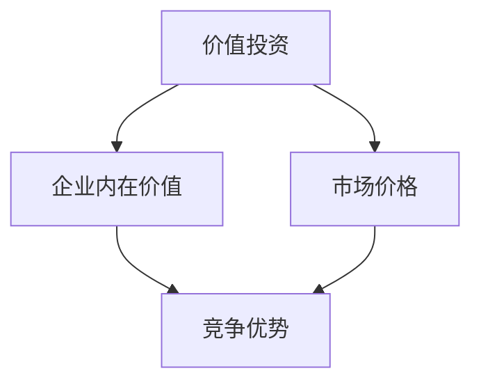
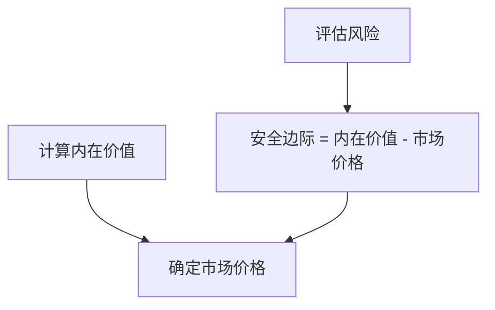
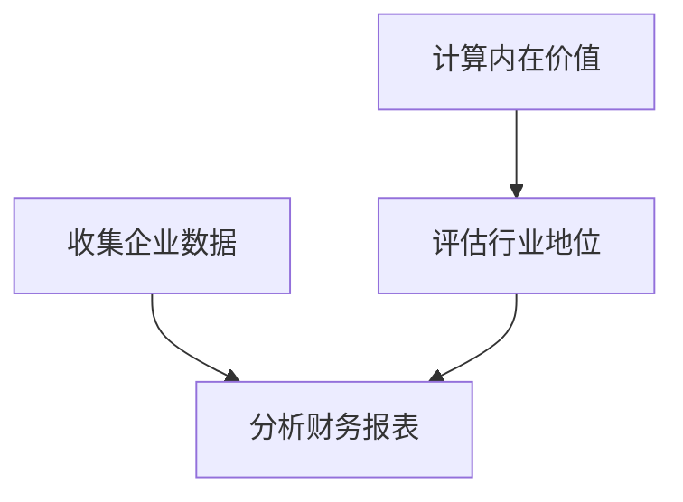
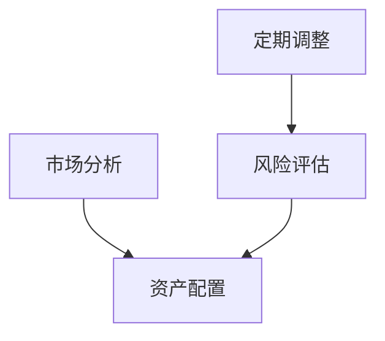
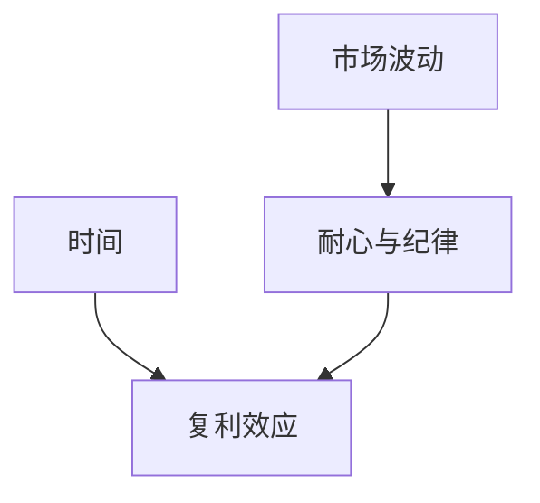
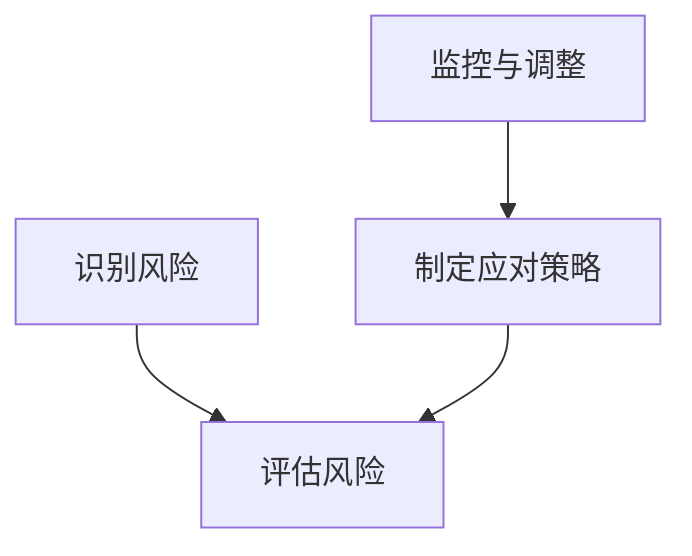

                 

# 巴菲特-芒格策略：长期投资的成功之道

## 关键词：
- 巴菲特投资策略
- 芮格思维模型
- 长期投资
- 价值评估
- 风险管理
- 投资组合管理

## 摘要：
本文系统地介绍了巴菲特和芒格的投资策略，分析了其核心理念、价值评估方法、投资组合管理策略以及长期投资的成功要素。通过结合实际案例和数学模型，详细讲解了安全边际的概念、风险管理的重要性以及心理因素对投资决策的影响。文章还提供了系统架构设计和项目实战案例，帮助读者更好地理解和应用这些策略。

## 第一部分：引言

在当今快速变化的金融市场上，投资者如何实现长期成功？巴菲特和芒格的投资策略为我们提供了宝贵的启示。本文将深入探讨他们的投资理念、方法和成功经验，帮助读者掌握长期投资的精髓。

---

## 第二部分：正文

### 第1章：投资的基石：价值投资理念

#### 1.1 巴菲特的价值投资理念

##### 1.1.1 价值投资的定义与核心原则

**价值投资**是一种以低于其内在价值的价格购买优质股票的投资策略。其核心原则包括：
- 购买具有持续竞争优势的企业。
- 以合理价格买入，长期持有。

**背景介绍**：
价值投资强调企业内在价值的评估，巴菲特认为市场先生的情绪波动为长期投资者提供了低价买入的机会。

##### 核心概念与联系：

| 属性 | 描述 |
|------|------|
| 核心原则 | 购买优质企业 |
| 价格标准 | 低于内在价值 |
| 长期持有 | 避免短期波动干扰 |

**Mermaid图：价值投资的核心要素**

#### 1.1.2 巴菲特投资理念的演变

巴菲特的投资理念从早期的烟蒂股策略逐渐转向购买具有持续竞争优势的企业。这一演变体现了他对企业质量的重视。

#### 1.1.3 价值投资与长期主义的联系

价值投资强调长期持有的理念，而长期主义则是巴菲特成功的关键。通过长期持有优质企业，投资者能够获得复利效应带来的收益。

---

### 第2章：投资的基石：安全边际

#### 2.1 安全边际的概念

**安全边际**是指股票的市场价格低于其内在价值的部分。它提供了在市场波动中保护资本的能力。

##### 2.1.1 安全边际的重要性

安全边际为投资者提供了缓冲空间，减少了因市场波动带来的损失风险。

##### 2.1.2 安全边际与长期投资的关系

通过建立安全边际，投资者能够在市场低迷时保持投资信心，实现长期收益。

**Mermaid图：安全边际的计算流程**

---

### 第3章：投资的基石：价值评估

#### 3.1 价值评估的核心原则

**价值评估**是通过分析企业的财务状况、行业地位和竞争优势来确定其内在价值。

##### 3.1.1 财务报表分析

分析企业的收入、利润和现金流，评估其财务健康状况。

##### 3.1.2 现金流分析

现金流是企业生存和发展的关键，健康的现金流意味着企业具备持续经营能力。

##### 3.1.3 行业地位与竞争优势

行业地位高的企业通常具有更强的竞争优势和定价能力。

**Mermaid图：价值评估的流程**

#### 3.2 巴菲特的选股标准

##### 3.2.1 高ROE企业

ROE（净资产收益率）高的企业通常具有较强的盈利能力。

##### 3.2.2 强大的管理层

管理层的诚信和能力直接影响企业的长期发展。

##### 3.2.3 可持续的竞争优势

企业应具备难以被竞争对手复制的核心竞争力。

---

### 第4章：投资的基石：投资组合管理

#### 4.1 投资组合管理的原则

**投资组合管理**是通过合理配置资产来优化风险和收益的过程。

##### 4.1.1 分散投资的重要性

分散投资可以降低单一资产的风险，实现风险的最小化。

##### 4.1.2 资产配置的策略

根据市场环境和个人风险承受能力，调整资产配置比例。

##### 4.1.3 定期审视与调整

定期评估投资组合的表现，及时调整以适应市场变化。

**Mermaid图：投资组合管理架构**

#### 4.2 巴菲特的投资组合分析

##### 4.2.1 股票选择的标准

巴菲特倾向于投资那些具有强大竞争优势和良好财务状况的企业。

##### 4.2.2 股票权重的分配

根据企业的价值和市场地位，合理分配股票在投资组合中的权重。

##### 4.2.3 投资组合的风险控制

通过分散投资和定期调整，控制投资组合的整体风险。

---

### 第5章：长期投资的成功之道

#### 5.1 长期投资的核心要素

##### 5.1.1 时间的复利效应

复利效应是长期投资获得高收益的关键。

##### 5.1.2 持股的耐心与纪律

长期投资需要耐心和纪律，避免短期波动的干扰。

##### 5.1.3 市场波动中的机会

市场波动为长期投资者提供了低位买入的机会。

**Mermaid图：长期投资的成功要素**

#### 5.2 巴菲特与芒格的成功案例

##### 5.2.1 巴菲特投资可口可乐的案例

可口可乐作为巴菲特的经典投资案例，展示了他对品牌和竞争优势的重视。

##### 5.2.2 芒格投资苹果的案例

芒格的投资决策体现了他对企业管理和创新的深刻理解。

##### 5.2.3 长期投资的成功经验总结

长期投资需要选择优质企业，建立安全边际，并保持耐心和纪律。

---

### 第6章：风险管理与心理因素

#### 6.1 投资中的风险管理

##### 6.1.1 风险的定义与分类

风险是投资回报的不确定性，分为系统性风险和非系统性风险。

##### 6.1.2 巴菲特的风险管理策略

巴菲特强调通过分散投资和选择优质企业来降低风险。

##### 6.1.3 芒格的风险管理思想

芒格认为风险管理是投资过程中最重要的部分，强调避免重大损失。

**Mermaid图：风险管理流程**

#### 6.2 投资心理与行为偏差

##### 6.2.1 投资者常见心理偏差

包括过度自信、从众心理和损失厌恶等。

##### 6.2.2 如何克服情绪化决策

通过理性分析和严格的纪律来克服心理偏差。

##### 6.2.3 理性决策的重要性

理性决策是长期投资成功的关键。

---

## 第三部分：结论

巴菲特和芒格的投资策略为我们提供了长期投资的成功模板。通过价值投资、安全边际、投资组合管理和风险管理，投资者可以在复杂多变的市场中实现稳健的收益。长期投资需要耐心、纪律和对市场的深刻理解。

---

## 作者：AI天才研究院 & 禅与计算机程序设计艺术

