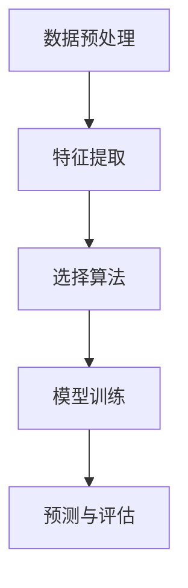

                 


---

# 目录大纲：《巴菲特如何看待人工智能在投资中的应用》

---

## 引言：人工智能与投资的碰撞

### 1.1 人工智能的基本概念

- 定义与核心原理
- 机器学习、深度学习、NLP的简介

### 1.2 巴菲特的投资理念

- 价值投资的核心思想
- 传统投资分析方法的优缺点

### 1.3 结合背景

- AI在金融领域的现状
- AI如何改变投资方式
- 巴菲特理念与AI的结合潜力

---

## 第一部分：人工智能在投资中的技术基础

### 2.1 机器学习算法在投资中的应用

- 线性回归模型：预测股票价格
- 支持向量机（SVM）：分类市场趋势
- 随机森林：多因素分析

#### 算法流程图（Mermaid）



### 2.2 深度学习的应用

- RNN与LSTM：时间序列预测
- CNN：K线图分析

### 2.3 NLP在投资中的应用

- 情感分析：新闻影响评估
- 基于GPT的市场情绪预测

---

## 第二部分：巴菲特价值投资的核心要素

### 3.1 五要素模型

- 企业基本面分析：财务报表、行业地位
- 管理层评估：信任度与决策能力
- 财务指标：ROE、PE、PB

### 3.2 人工智能如何辅助价值投资

- 数据挖掘：识别低估企业
- 自动化估值模型：动态调整
- 风险评估：投资组合优化

---

## 第三部分：人工智能在投资中的实际应用

### 4.1 投资策略优化

- AI驱动的动态资产配置：根据市场变化调整权重
- 风险预测：识别市场拐点

### 4.2 基于AI的市场情绪分析

- NLP分析新闻与社交媒体：预测市场波动

### 4.3 投资组合管理

- AI监控与再平衡：实时跟踪市场变化
- 自适应投资组合：根据市场情况调整

---

## 第四部分：案例分析：巴菲特投资理念的AI辅助

### 5.1 苹果公司投资决策

- 基本面分析：利润率、市场地位
- AI辅助的财务预测：营收与利润预测
- 市场情绪与估值模型：市场情绪与PEG分析

---

## 第五部分：人工智能在投资中的优势与挑战

### 6.1 优势

- 数据处理能力：快速分析大量信息
- 精准预测：提高决策准确性
- 纪律性：避免情绪影响

### 6.2 挑战

- 数据质量问题：影响模型准确性
- 过拟合风险：训练数据偏差
- 黑箱问题：缺乏透明度
- 计算成本：高算力需求

---

## 第六部分：未来展望与趋势分析

### 7.1 技术趋势

- NLP与AI结合：更复杂的市场情绪分析
- 多模态数据融合：结合文本、图像和数值数据
- 区块链技术结合：数据可信度提升

### 7.2 投资策略的演变

- 从传统分析到AI辅助决策
- 从单一模型到多模型融合
- 从被动跟踪到主动预测

---

## 附录

### A. 数学公式与模型

- 线性回归模型：$$y = \beta_0 + \beta_1x + \epsilon$$
- 随机森林算法：基于决策树的集成方法

### B. 算法流程图

- 机器学习流程图：Mermaid图表

### C. Python代码示例

```python
import pandas as pd
from sklearn.linear_model import LinearRegression
from sklearn.metrics import mean_squared_error

# 加载数据
data = pd.read_csv('stock_data.csv')

# 分割特征与目标变量
X = data[['feature1', 'feature2']]
y = data['target']

# 训练模型
model = LinearRegression()
model.fit(X, y)

# 预测与评估
predictions = model.predict(X)
mse = mean_squared_error(y, predictions)
print('均方误差:', mse)
```

### D. 参考文献

- 巴菲特股东大会演讲
- 《投资学原理》
- 《机器学习实战》
- 《深度学习》

---

## 作者：AI天才研究院 & 禅与计算机程序设计艺术

---

### 作者简介：

- **AI天才研究院（AI Genius Institute）**：专注于人工智能与投资的交叉研究，提供深度技术分析与投资策略创新。
- **禅与计算机程序设计艺术（Zen And The Art of Computer Programming）**：探索计算机科学与投资哲学的结合，追求技术与智慧的完美统一。

---

通过以上目录大纲，读者将从基础到应用，全面了解人工智能在投资中的潜力，并结合巴菲特的价值投资理念，探索未来投资的新方向。

