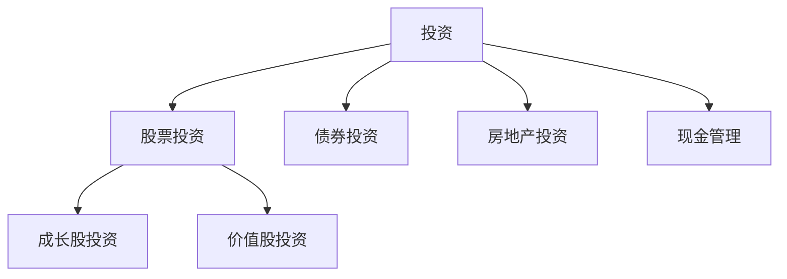

                 

# 巴菲特如何看待分散投资

> **关键词**：巴菲特、分散投资、投资策略、风险管理、资产配置、价值投资、投资组合  
> **摘要**：本文深入探讨巴菲特的分散投资理念，分析其背后的投资策略、风险管理方法以及如何通过分散投资实现长期稳健的收益。从投资的基本概念到分散投资的理论基础，从具体实施步骤到实际案例分析，本文将全面解析巴菲特的分散投资思想，并结合现代投资组合理论，为读者提供清晰的指导和启示。

---

## 第一部分: 投资的基础与分散投资的背景

---

## 第1章: 投资的基本概念与分散投资的意义

### 1.1 投资的基本概念

#### 1.1.1 什么是投资
投资是指将资金投入某个项目或资产，以期在未来获得收益或资本增值的行为。投资的核心目标是通过合理配置资产，实现财富的保值与增值。

**关键概念对比表**：

| 投资类型 | 描述 | 风险 | 收益 |
|----------|------|------|------|
| 股票     | 股权投资 | 高 | 高 |
| 债券     | 固定收益投资 | 中 | 中 |
| 房地产   | 实物资产投资 | 中 | 中 |
| 现金     | 无风险资产 | 低 | 低 |

#### 1.1.2 投资的目的与分类
投资的目的是为了实现财富的增长，同时需要根据个人的财务状况、风险承受能力和投资目标进行选择。

**投资分类的层级图**：

#### 1.1.3 投资的基本原则
- **分散投资**：通过多样化投资降低风险。
- **长期投资**：避免频繁交易，降低成本。
- **价值投资**：选择具有长期增长潜力的优质资产。

---

### 1.2 分散投资的背景与重要性

#### 1.2.1 投资风险的来源
投资风险主要来自市场波动、经济周期、公司基本面变化等因素。

#### 1.2.2 分散投资如何降低风险
分散投资通过将资金分配到不同的资产类别或行业中，降低单一资产波动带来的风险。

#### 1.2.3 分散投资在现代投资中的地位
分散投资是现代投资组合理论的核心思想，旨在通过多样化实现风险与收益的最优平衡。

---

### 1.3 巴菲特的分散投资理念

#### 1.3.1 巴菲特的投资哲学概述
巴菲特强调长期投资、价值投资和分散投资的结合，以实现稳健的收益。

#### 1.3.2 巴菲特分散投资的核心思想
- **集中投资优质资产**：巴菲特并非完全分散，而是集中投资于具有长期竞争优势的公司。
- **分散化是必要的**：通过投资不同行业和资产类别，降低特定风险。

#### 1.3.3 巴菲特分散投资与集中投资的平衡
巴菲特的分散投资策略强调在长期优质资产中分散，而非盲目分散。

---

### 1.4 本章小结
本章从投资的基本概念入手，详细介绍了分散投资的意义和巴菲特的分散投资理念，为后续分析奠定了基础。

---

## 第2章: 分散投资的理论与实践

---

### 2.1 现代投资组合理论

#### 2.1.1 现代投资组合理论的提出
现代投资组合理论由哈里·马科维茨提出，强调通过分散投资降低风险。

#### 2.1.2 投资组合理论的核心假设
- 投资者是理性的。
- 资产收益服从统计分布。

#### 2.1.3 有效前沿的概念与应用
有效前沿是所有可能的投资组合中收益-风险比最优的集合。

---

### 2.2 分散投资的数学模型

#### 2.2.1 投资组合的期望收益与方差
$$ E(r_p) = \sum w_i E(r_i) $$
$$ Var(r_p) = \sum w_i^2 Var(r_i) + 2\sum_{i<j} w_i w_j Cov(r_i, r_j) $$

#### 2.2.2 马科维茨优化模型
$$ \text{最大化 } E(r_p) \text{ 在给定风险下} $$
或
$$ \text{最小化风险 } Var(r_p) \text{ 在给定收益下} $$

---

### 2.3 巴菲特对投资组合理论的诠释

#### 2.3.1 巴菲特对现代投资组合理论的认同
巴菲特认同分散投资的理论，但更注重长期优质资产的选择。

#### 2.3.2 巴菲特分散投资的实践经验
巴菲特通过投资于不同行业的优质企业，实现分散化。

#### 2.3.3 巴菲特对分散投资的动态调整
根据市场变化和个人判断，动态调整投资组合。

---

### 2.4 本章小结
本章通过数学模型和理论分析，详细阐述了分散投资的理论基础和实践应用。

---

## 第3章: 分散投资的策略与实施

---

### 3.1 分散投资的资产配置

#### 3.1.1 资产配置的基本原理
资产配置是分散投资的核心，通过合理分配各类资产权重，降低风险。

#### 3.1.2 不同资产类别的风险与收益特征
| 资产类别 | 风险 | 收益 |
|----------|------|------|
| 股票     | 高   | 高   |
| 债券     | 中   | 中   |
| 房地产   | 中   | 中   |
| 现金     | 低   | 低   |

---

### 3.2 分散投资的具体实施步骤

#### 3.2.1 确定投资目标与风险承受能力
- **投资目标**：明确短期与长期目标。
- **风险承受能力**：评估个人对风险的容忍度。

#### 3.2.2 选择投资标的与权重分配
- **投资标的**：选择不同行业和资产类别。
- **权重分配**：根据风险偏好分配权重。

#### 3.2.3 定期审视与调整投资组合
- **定期审视**：每年至少审视一次投资组合。
- **调整策略**：根据市场变化和个人目标调整。

---

### 3.3 巴菲特分散投资的实践案例

#### 3.3.1 巴菲特的股票投资组合分析
- 投资于可口可乐、苹果等具有长期竞争优势的公司。

#### 3.3.2 巴菲特对债券、房地产等其他资产的配置
- 通过债券和其他资产进一步分散风险。

#### 3.3.3 巴菲特分散投资的实际效果
- 长期稳定的收益，证明了分散投资的有效性。

---

### 3.4 本章小结
本章详细介绍了分散投资的具体策略和实施步骤，并结合巴菲特的实践案例，展示了分散投资的实际应用。

---

## 第4章: 分散投资中的风险管理

---

### 4.1 风险的定义与分类

#### 4.1.1 系统性风险与非系统性风险
- **系统性风险**：市场整体波动带来的风险。
- **非系统性风险**：特定资产或行业带来的风险。

#### 4.1.2 市场风险、流动性风险与信用风险
- **市场风险**：资产价格波动带来的风险。
- **流动性风险**：资产难以变现的风险。
- **信用风险**：债券发行人违约的风险。

---

### 4.2 分散投资如何降低风险

#### 4.2.1 通过多样化投资分散风险
- 投资于不同资产类别和行业，降低特定风险。

#### 4.2.2 定期审视与调整投资组合
- 根据市场变化，及时调整投资组合。

---

### 4.3 巴菲特对风险管理的实践

#### 4.3.1 巴菲特的风险管理策略
- 选择具有长期竞争优势的企业。
- 保持足够的现金储备应对市场波动。

#### 4.3.2 巴菲特风险管理的实践经验
- 在市场恐慌时增加优质资产配置。
- 在市场繁荣时保持谨慎。

---

### 4.4 本章小结
本章分析了分散投资中的风险管理策略，强调了分散投资在降低风险中的重要作用。

---

## 第5章: 巴菲特分散投资的长期策略

---

### 5.1 巴菲特的长期投资理念

#### 5.1.1 长期投资的核心思想
- 长期投资能够熨平市场波动，获得资产的长期增长。

#### 5.1.2 长期投资与分散投资的结合
- 通过长期持有优质资产实现稳健收益。

---

### 5.2 巴菲特的分散投资策略

#### 5.2.1 集中投资优质资产
- 选择具有长期竞争优势的企业，集中投资。

#### 5.2.2 分散化是必要的
- 通过投资不同行业和资产类别降低风险。

---

### 5.3 巴菲特分散投资的长期效果

#### 5.3.1 巴菲特投资组合的长期表现
- 长期稳定的收益，证明了分散投资的有效性。

#### 5.3.2 巴菲特分散投资的未来展望
- 继续坚持长期投资和分散投资的策略。

---

### 5.4 本章小结
本章总结了巴菲特分散投资的长期策略，强调了长期投资与分散投资相结合的重要性。

---

## 第6章: 巴菲特分散投资的实际案例分析

---

### 6.1 巴菲特分散投资的经典案例

#### 6.1.1 可口可乐的投资
- 投资背景：可口可乐的全球市场地位和稳定的现金流。
- 投资策略：长期持有，享受复利效应。

#### 6.1.2 苹果的投资
- 投资背景：苹果的创新能力和市场领导地位。
- 投资策略：集中投资优质科技企业。

---

### 6.2 巴菲特分散投资的其他案例

#### 6.2.1 巴菲特对银行股的投资
- 投资背景：银行股的稳定收益和防御性。
- 投资策略：分散投资于不同银行股。

---

### 6.3 巴菲特分散投资案例的启示

#### 6.3.1 选择优质资产的重要性
- 优质资产是分散投资的基础。

#### 6.3.2 长期持有与分散投资的结合
- 通过长期持有优质资产，实现稳健收益。

---

### 6.4 本章小结
本章通过具体案例分析，展示了巴菲特分散投资的实际应用和成功经验。

---

## 第7章: 巴菲特分散投资的未来展望与总结

---

### 7.1 分散投资的未来发展趋势

#### 7.1.1 数字化投资的兴起
- 通过算法和大数据实现更高效的分散投资。

#### 7.1.2 ESG投资的兴起
- 环境、社会和治理因素成为投资的重要考量。

---

### 7.2 巴菲特分散投资的未来展望

#### 7.2.1 继续坚持长期投资策略
- 长期投资是分散投资的核心。

#### 7.2.2 加强对新兴行业的关注
- 适应市场变化，分散投资于新兴行业。

---

### 7.3 巴菲特分散投资的总结

#### 7.3.1 分散投资的核心思想
- 通过多样化投资降低风险，选择优质资产实现稳健收益。

#### 7.3.2 巴菲特分散投资的成功经验
- 长期投资、价值投资和分散投资相结合。

---

### 7.4 本章小结
本章总结了分散投资的未来发展趋势，展望了巴菲特分散投资的未来策略，并总结了其分散投资的成功经验。

---

## 附录: 巴菲特分散投资的进一步阅读与资源

---

## 作者：AI天才研究院/AI Genius Institute & 禅与计算机程序设计艺术 /Zen And The Art of Computer Programming

