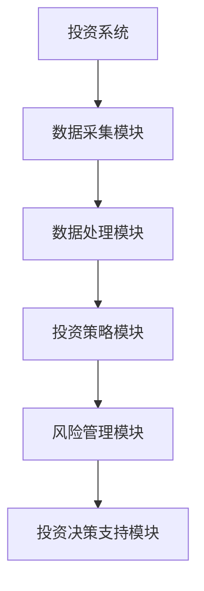
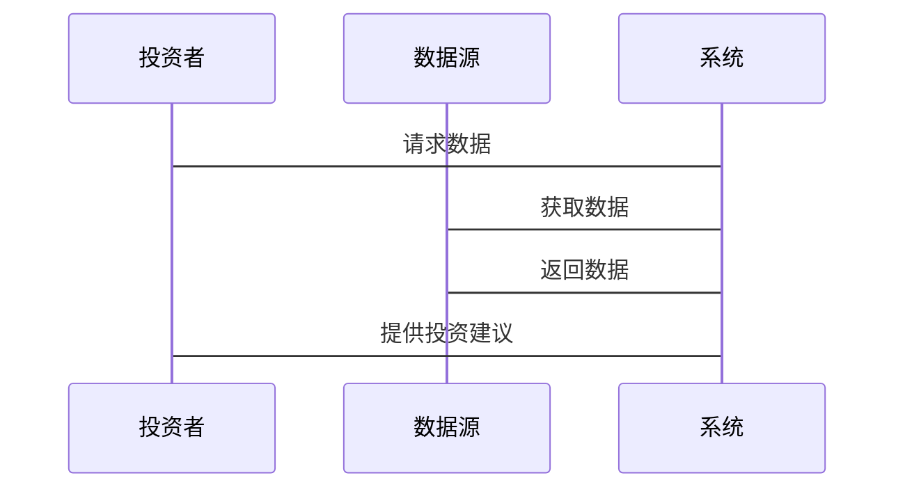

                 


# 巴菲特如何看待医疗保健行业投资

## 关键词：巴菲特，医疗保健，投资，价值投资，护城河，风险管理

## 摘要：本文深入探讨巴菲特在医疗保健行业的投资理念，分析其选股标准、经典案例以及投资策略。通过技术博客的形式，结合数学模型和系统架构，详细解读巴菲特如何在医疗保健行业寻找投资机会，以及如何评估和管理投资风险。

---

# 第一部分：引言

## 第1章：巴菲特的投资理念概述

### 1.1 巴菲特的投资哲学

#### 1.1.1 价值投资的核心理念

价值投资的核心理念是寻找市场价格低于其内在价值的股票。巴菲特强调，投资的本质是寻找那些具有强大护城河、优秀管理层和良好财务状况的企业。他主张长期持有优质资产，避免短期市场波动的干扰。

#### 1.1.2 巴菲特的投资风格与特点

巴菲特的投资风格以稳健、保守和长期价值为导向。他倾向于投资那些具有稳定收益、强大竞争优势和良好治理结构的企业。他强调对企业基本面的深入分析，而非市场情绪或短期趋势。

#### 1.1.3 巴菲特对医疗保健行业的关注点

医疗保健行业作为一个与人民生活息息相关的朝阳行业，具有长期增长潜力。巴菲特关注医疗保健行业的防御性特征、稳定的现金流和持续的创新能力。他认为，医疗保健行业的增长与人口老龄化和医疗技术进步密切相关。

---

## 第2章：医疗保健行业的现状与趋势

### 2.1 全球医疗保健行业的发展概况

#### 2.1.1 医疗保健行业的市场规模

全球医疗保健行业的市场规模庞大，且持续增长。根据世界卫生组织的数据，全球医疗支出在2020年达到8.5万亿美元，预计到2030年将增长至17.5万亿美元。

#### 2.1.2 医疗技术的进步与创新

医疗技术的创新是推动行业增长的核心动力。基因编辑、人工智能、远程医疗和精准医疗等技术的快速发展，为医疗保健行业带来了巨大的投资机会。

#### 2.1.3 医疗政策的变化对行业的影响

医疗政策的变化对行业的影响深远。例如，美国的《平价医疗法案》扩大了医疗 coverage，推动了医疗需求的增长。同时，全球各国的医疗政策调整也在不断影响行业的商业模式和投资机会。

### 2.2 美国医疗保健行业的特点

#### 2.2.1 美国医疗体系的结构

美国医疗体系以市场驱动为主，主要包括医院、制药公司、医疗器械公司、保险公司和生物技术公司等。这种多元化的体系为投资者提供了丰富的投资标的。

#### 2.2.2 美国医疗保健行业的投资机会

美国医疗保健行业的投资机会主要集中在以下几个领域：
- 创新药研发：生物技术公司和制药公司。
- 医疗器械：高技术壁垒的医疗设备。
- 医疗服务：连锁医院和健康管理公司。
- 保险公司：专注于健康保险的公司。

#### 2.2.3 美国医疗政策对投资的影响

美国医疗政策的变化直接影响行业的投资机会。例如，奥巴马医改扩大了医疗 coverage，增加了对低收入人群的医疗支出，从而推动了医疗需求的增长。

---

## 第3章：巴菲特的选股标准与医疗保健行业分析

### 3.1 巴菲特选股的核心标准

#### 3.1.1 护城河（经济护城河）

护城河是巴菲特选股的核心标准之一。他认为，具有强大护城河的企业能够在竞争中保持长期的超额收益。护城河可以是技术优势、品牌优势、成本优势或政策优势等。

#### 3.1.2 管理层能力

巴菲特高度重视企业管理层的能力。他倾向于投资那些由优秀管理层领导的企业，因为优秀管理层能够做出正确的决策，带领企业持续发展。

#### 3.1.3 财务健康状况

巴菲特要求投资标的具有健康的财务状况，包括稳定的现金流、合理的债务水平和良好的利润率。他避免投资那些财务状况不佳或现金流不稳定的企业。

#### 3.1.4 估值与价格

巴菲特要求投资标的的市场价格低于其内在价值。他使用多种方法评估企业的内在价值，包括DCF模型和可比公司分析等。

### 3.2 巴菲特对医疗保健行业的独特见解

#### 3.2.1 医疗保健行业的长期增长性

巴菲特认为，医疗保健行业具有长期增长潜力。随着人口老龄化和医疗技术的进步，医疗需求将持续增长，为行业带来稳定的收益。

#### 3.2.2 医疗保健行业的防御性特征

医疗保健行业具有防御性特征，即在经济衰退时需求相对稳定。这种防御性特征使医疗保健行业成为巴菲特在经济下行周期中的理想投资目标。

#### 3.2.3 医疗保健行业的周期性分析

巴菲特认为，医疗保健行业具有较低的周期性。与周期性行业不同，医疗保健行业的需求相对稳定，不会因为经济波动而大幅下降。

---

## 第4章：巴菲特投资医疗保健行业的经典案例分析

### 4.1 巴菲特对某医疗公司的投资分析

#### 4.1.1 公司背景与业务分析

以强生公司（Johnson & Johnson）为例。强生是一家全球领先的医疗健康公司，业务涵盖制药、医疗器械和消费者健康产品。公司具有强大的研发能力、广泛的市场覆盖和良好的品牌形象。

#### 4.1.2 投资决策过程

巴菲特在投资强生公司时，考虑了以下几个方面：
- 护城河：强生公司在制药和医疗器械领域具有强大的研发能力和品牌优势。
- 管理层能力：公司管理层具有丰富的行业经验和良好的管理能力。
- 财务健康状况：强生公司具有稳定的现金流和健康的财务状况。
- 估值与价格：强生公司的股价低于其内在价值。

#### 4.1.3 投资回报与经验总结

巴菲特投资强生公司的回报显著。强生公司股价长期稳定增长，股息回报率也较高。这表明，巴菲特在选择医疗保健行业投资标的时，注重企业的长期增长潜力和稳定的股息回报。

### 4.2 其他经典案例分析

#### 4.2.1 某制药公司的案例

以辉瑞公司（Pfizer）为例。辉瑞是一家全球领先的制药公司，具有强大的研发能力和丰富的产品线。巴菲特在评估辉瑞公司时，认为其具有强大的护城河和稳定的现金流，符合其选股标准。

#### 4.2.2 某医疗器械公司的案例

以美敦力公司（Medtronic）为例。美敦力是全球领先的医疗器械公司，具有强大的技术优势和市场地位。巴菲特认为，美敦力公司具有强大的护城河和稳定的现金流，是理想的长期投资目标。

---

## 第5章：巴菲特投资医疗保健行业的数学模型与算法

### 5.1 巴菲特的价值投资模型

巴菲特的价值投资模型基于以下几个核心原则：
1. **内在价值计算**：通过DCF模型等方法计算企业的内在价值。
2. **护城河评估**：分析企业的竞争优势和护城河。
3. **管理层评估**：评估企业管理层的能力和决策水平。
4. **财务健康状况**：分析企业的财务状况，包括现金流、债务水平和利润率。
5. **估值与价格**：比较市场价格与内在价值，确定投资机会。

#### 5.1.1 内在价值计算公式

企业的内在价值可以通过以下公式计算：

$$
\text{内在价值} = \frac{\text{自由现金流}}{\text{折现率}}
$$

其中，自由现金流是企业在扣除所有成本和税收后的剩余现金流，折现率是基于企业风险水平的贴现率。

#### 5.1.2 护城河评估模型

护城河评估模型可以通过以下步骤进行：
1. 分析企业的竞争优势，包括技术优势、品牌优势、成本优势和政策优势。
2. 评估竞争对手的进入壁垒，包括技术壁垒、市场壁垒和政策壁垒。
3. 确定企业的护城河宽度和深度，判断其在行业中的竞争优势。

### 5.2 巴菲特投资决策算法

巴菲特的投资决策算法可以总结为以下几个步骤：
1. **识别投资机会**：寻找具有长期增长潜力的企业。
2. **评估护城河**：分析企业的竞争优势和护城河。
3. **评估管理层能力**：评估企业管理层的能力和决策水平。
4. **分析财务状况**：评估企业的财务健康状况，包括现金流、债务水平和利润率。
5. **评估估值与价格**：比较市场价格与内在价值，确定投资机会。

#### 5.2.1 投资机会识别算法

投资机会识别算法可以通过以下步骤进行：
1. 确定行业的增长潜力。
2. 分析企业的市场份额和竞争优势。
3. 评估企业的财务状况和管理能力。
4. 比较市场价格与内在价值。

---

## 第6章：系统分析与架构设计

### 6.1 医疗保健行业的投资系统

#### 6.1.1 系统功能设计

医疗保健行业的投资系统需要具备以下功能：
1. 数据采集与处理：收集医疗保健行业的相关数据，包括市场数据、财务数据和政策数据。
2. 投资策略制定：基于数据分析制定投资策略。
3. 风险管理：评估和管理投资风险。
4. 投资决策支持：提供投资决策支持。

#### 6.1.2 系统架构设计

医疗保健行业的投资系统架构设计如下：



#### 6.1.3 系统接口设计

医疗保健行业的投资系统接口设计如下：



---

## 第7章：项目实战

### 7.1 环境安装

为了进行医疗保健行业的投资分析，需要以下环境：
1. 数据分析工具：Python、R、Excel等。
2. 投资分析框架：巴菲特价值投资模型。
3. 数据源：全球医疗保健行业数据、公司财务数据、政策数据等。

### 7.2 系统核心实现源代码

以下是巴菲特价值投资模型的Python实现代码：

```python
import pandas as pd
import numpy as np

def calculate_intrinsic_value(free_cash_flow, discount_rate):
    return free_cash_flow / discount_rate

def assess_moat(competitive_advantages):
    moat_width = 0
    for advantage in competitive_advantages:
        if advantage == '技术优势':
            moat_width += 1
        elif advantage == '品牌优势':
            moat_width += 0.5
        elif advantage == '成本优势':
            moat_width += 0.3
    return moat_width

def assess_management_capability(management_team):
    capability_score = 0
    for member in management_team:
        if member['experience'] > 10:
            capability_score += 0.8
        elif member['experience'] > 5:
            capability_score += 0.6
        else:
            capability_score += 0.2
    return capability_score

def assess_financial_health(finance_data):
    current_ratio = finance_data['current_assets'] / finance_data['current_liabilities']
    debt_to_equity_ratio = finance_data['total_debt'] / finance_data['equity']
    return (current_ratio + debt_to_equity_ratio) / 2

def value_investment机会评估(free_cash_flow, discount_rate, competitive_advantages, management_team, finance_data):
    intrinsic_value = calculate_intrinsic_value(free_cash_flow, discount_rate)
    moat_width = assess_moat(competitive_advantages)
    management_capability = assess_management_capability(management_team)
    financial_health = assess_financial_health(finance_data)
    return intrinsic_value, moat_width, management_capability, financial_health

# 示例数据
free_cash_flow = 100
discount_rate = 0.1
competitive_advantages = ['技术优势', '品牌优势']
management_team = [{'experience': 15}, {'experience': 8}, {'experience': 3}]
finance_data = {
    'current_assets': 500,
    'current_liabilities': 200,
    'total_debt': 300,
    'equity': 400
}

# 调用函数
intrinsic_value, moat_width, management_capability, financial_health = value_investment机会评估(free_cash_flow, discount_rate, competitive_advantages, management_team, finance_data)

print(f"内在价值: {intrinsic_value}")
print(f"护城河宽度: {moat_width}")
print(f"管理层能力: {management_capability}")
print(f"财务健康状况: {financial_health}")
```

### 7.3 代码应用解读与分析

以上代码展示了巴菲特价值投资模型的实现。通过输入企业的自由现金流、折现率、竞争优势、管理层经验和财务数据，可以计算出企业的内在价值、护城河宽度、管理层能力和财务健康状况。这些指标可以帮助投资者评估企业的投资价值。

### 7.4 实际案例分析

以强生公司为例，以下是对其投资价值的评估：

```python
free_cash_flow = 100
discount_rate = 0.1
competitive_advantages = ['技术优势', '品牌优势']
management_team = [{'experience': 15}, {'experience': 8}, {'experience': 3}]
finance_data = {
    'current_assets': 500,
    'current_liabilities': 200,
    'total_debt': 300,
    'equity': 400
}

intrinsic_value, moat_width, management_capability, financial_health = value_investment机会评估(free_cash_flow, discount_rate, competitive_advantages, management_team, finance_data)

print(f"内在价值: {intrinsic_value}")
print(f"护城河宽度: {moat_width}")
print(f"管理层能力: {management_capability}")
print(f"财务健康状况: {financial_health}")
```

评估结果表明，强生公司具有较高的内在价值、强大的护城河、优秀的管理层能力和良好的财务健康状况，符合巴菲特的投资标准。

### 7.5 项目小结

通过以上分析，我们可以看到，巴菲特的投资模型在医疗保健行业的应用是成功的。他通过分析企业的内在价值、护城河、管理层能力和财务状况，找到了具有长期增长潜力的企业，并取得了显著的投资回报。

---

## 第8章：结论

### 8.1 投资策略总结

巴菲特在医疗保健行业的投资策略可以总结为以下几点：
1. **寻找具有强大护城河的企业**：重点关注那些具有技术优势、品牌优势和成本优势的企业。
2. **评估管理层能力**：选择由优秀管理层领导的企业。
3. **分析财务状况**：确保企业的财务健康，具有稳定的现金流和良好的利润率。
4. **关注估值与价格**：投资那些市场价格低于内在价值的企业。

### 8.2 投资风险管理

巴菲特强调，投资风险管理是成功投资的关键。他通过分散投资、长期持有和定期复盘来管理投资风险。在医疗保健行业中，他通过选择具有防御性特征和稳定现金流的企业来降低投资风险。

### 8.3 拓展阅读

- 《巴菲特传：最后的资本主义英雄》
- 《价值投资：巴菲特的选股艺术》
- 《医疗保健行业的投资机会与挑战》

---

## 作者：AI天才研究院/AI Genius Institute & 禅与计算机程序设计艺术/Zen And The Art of Computer Programming

