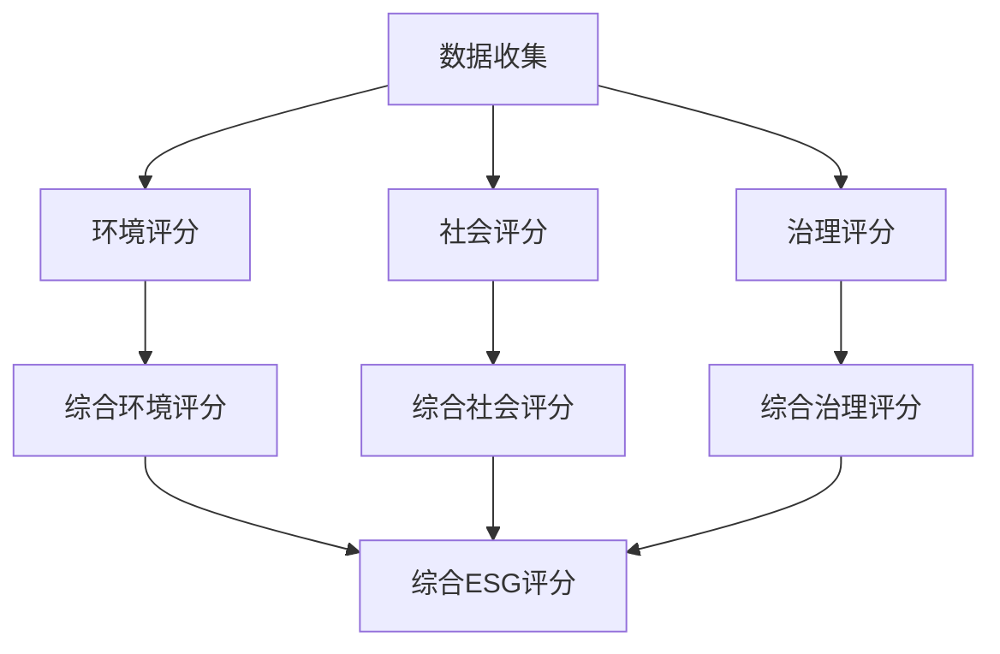
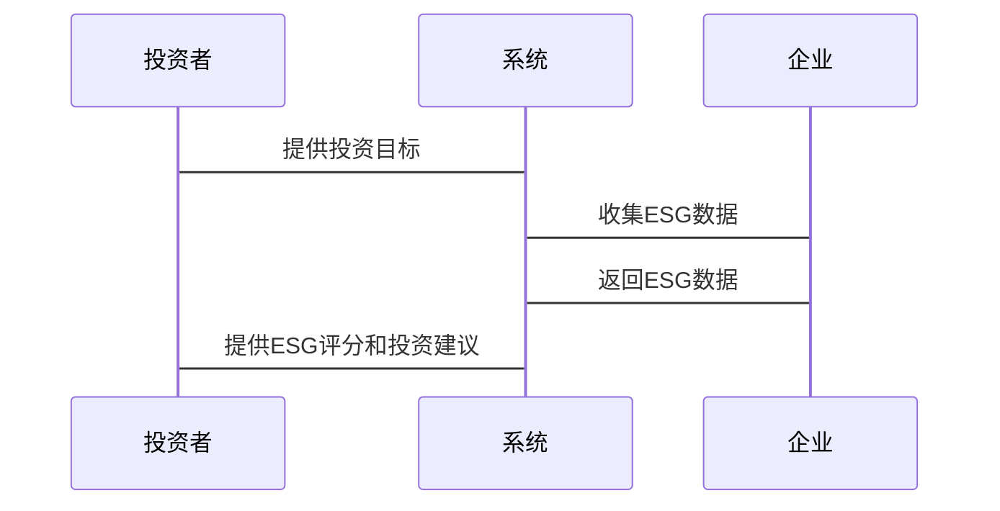

                 

# 巴菲特如何看待环境、社会和治理(ESG)投资

## 关键词：巴菲特，ESG投资，环境，社会，治理，价值投资

## 摘要：本文深入探讨了巴菲特对环境、社会和治理（ESG）投资的看法，分析了ESG投资的核心概念、其与巴菲特投资理念的契合点以及实际应用策略。通过详细阐述环境、社会和治理三个维度，结合巴菲特的投资哲学，本文为读者提供了全面的视角，帮助理解ESG投资的重要性及其在长期价值投资中的作用。

---

## 第1章: 引言

### 1.1 背景介绍
环境、社会和治理（ESG）投资近年来成为全球关注的焦点。随着全球气候变化、社会不平等等问题的加剧，投资者开始关注企业在环境、社会和治理方面的表现，以评估其长期价值。然而，作为价值投资的倡导者，巴菲特对ESG投资的态度一直是投资者关注的焦点。

### 1.2 问题描述
本文旨在分析巴菲特如何看待ESG投资，探讨ESG投资的核心概念及其与巴菲特投资理念的契合点。

---

## 第2章: ESG投资的核心概念

### 2.1 核心概念术语说明
ESG投资关注企业在环境、社会和治理三个维度的表现：
- **环境（E）**：企业在资源使用、排放、污染等方面的表现。
- **社会（S）**：企业在员工权益、社区责任、产品安全等方面的表现。
- **治理（G）**：企业在董事会结构、高管薪酬、透明度等方面的表现。

### 2.2 问题背景与外延
ESG投资不仅关注企业的财务表现，还关注其对环境和社会的影响，以及公司治理的透明度。这种投资方式强调长期价值，而非短期收益。

### 2.3 核心要素组成
ESG投资的核心要素包括：
- **环境因素**：碳排放、能源使用效率。
- **社会因素**：员工权益、社会责任。
- **治理因素**：董事会结构、高管薪酬。

---

## 第3章: 巴菲特与ESG投资的契合点

### 3.1 巴菲特的投资理念
巴菲特的价值投资理念强调寻找具有持续竞争优势和良好治理结构的企业。他注重企业的长期价值，而非短期市场波动。

### 3.2 ESG与巴菲特投资理念的契合
ESG投资与巴菲特的价值投资理念在多个方面契合：
- **长期价值**：ESG表现良好的企业通常具有稳定的财务表现。
- **治理结构**：巴菲特注重企业的治理结构，认为良好的治理是企业长期成功的关键。
- **社会责任**：巴菲特认为企业应关注社会影响，这与ESG投资的社会维度相符。

### 3.3 巴菲特对ESG投资的看法
巴菲特曾表示，他更关注企业的基本面，但也在某些情况下考虑企业的社会责任和治理结构。他并未明确支持或反对ESG投资，但其投资实践与ESG理念有诸多相似之处。

---

## 第4章: ESG投资的算法与系统架构

### 4.1 算法原理
ESG投资可以通过以下步骤进行评估：
1. **数据收集**：收集企业在环境、社会和治理方面的数据。
2. **指标评分**：根据各维度的指标对企业进行评分。
3. **综合评估**：结合各维度的评分，综合评估企业的ESG表现。
4. **投资决策**：基于ESG评分，选择具有良好表现的企业进行投资。

### 4.2 算法流程图（Mermaid）

### 4.3 系统架构设计
- **数据层**：收集和存储企业ESG数据。
- **计算层**：计算各维度的评分。
- **决策层**：基于评分做出投资决策。

### 4.4 系统交互图（Mermaid）

---

## 第5章: 实际操作与案例分析

### 5.1 实际操作指南
1. **环境因素**：关注企业的碳排放和能源使用效率。
2. **社会因素**：关注员工权益和社区责任。
3. **治理因素**：关注董事会结构和高管薪酬。

### 5.2 案例分析
以巴菲特投资的某企业为例，分析其在ESG方面的表现：
- **环境**：企业是否采用可持续的生产方式。
- **社会**：企业是否关注员工福利和社区发展。
- **治理**：企业是否具有透明的治理结构。

---

## 第6章: 结论与展望

### 6.1 结论
巴菲特的投资理念与ESG投资在多个方面契合，尤其是长期价值和企业治理。ESG投资不仅是社会责任的体现，也是企业长期价值的重要组成部分。

### 6.2 展望
随着全球对可持续发展的关注增加，ESG投资将成为未来投资的重要方向。巴菲特的投资实践将为ESG投资提供更多的经验和启示。

---

## 作者：AI天才研究院/AI Genius Institute & 禅与计算机程序设计艺术 /Zen And The Art of Computer Programming

