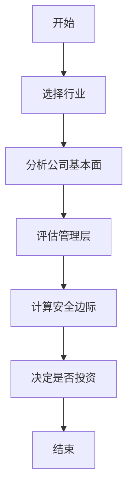

                 


# 目录大纲：《巴菲特如何看待电动汽车行业的投资前景》

---

# 第一部分：电动汽车行业的投资背景

## 第1章：电动汽车行业的现状与趋势

### 1.1 电动汽车行业的背景介绍
- 1.1.1 电动汽车行业的定义与范围
  - 电动汽车的定义
  - 电动汽车的分类与特点
  - 电动汽车行业的产业链结构
- 1.1.2 电动汽车行业的核心驱动因素
  - 政策支持与法规驱动
  - 技术进步与成本下降
  - 市场需求与消费者偏好
- 1.1.3 电动汽车行业的边界与外延
  - 电动汽车行业的上下游关系
  - 与传统汽车行业的对比分析
  - 电动汽车行业的未来发展趋势

### 1.2 电动汽车行业的核心概念与联系
- 1.2.1 电动汽车行业的核心概念原理
  - 电动汽车的核心技术：电池、电机、电控系统
  - 电动汽车的商业模式：整车制造、充电服务、电池回收
- 1.2.2 电动汽车行业与相关领域的对比分析
  - 电动汽车与可再生能源的关系
  - 电动汽车与智慧城市的关系
  - 电动汽车与环保政策的关系
- 1.2.3 电动汽车行业的ER实体关系图
  ```mermaid
  graph TD
      A[电动汽车] --> B[电池供应商]
      A --> C[电机供应商]
      A --> D[电控系统供应商]
      B --> E[原材料供应商]
      C --> E
      D --> E
  ```

---

## 第2章：巴菲特的投资理念与策略

### 2.1 巴菲特的价值投资理论
- 2.1.1 巴菲特的价值投资核心理念
  - 价值投资的定义与核心思想
  - 巴菲特的投资哲学：寻找具有持续竞争优势的企业
  - 巴菲特的长期投资策略
- 2.1.2 巴菲特投资决策的关键指标
  - 市盈率（P/E）
  - 市净率（P/B）
  - 股东权益回报率（ROE）
- 2.1.3 巴菲特投资组合的构建逻辑
  - 投资组合的分散化
  - 重点投资具有长期竞争优势的企业
  - 避免短期市场波动的影响

### 2.2 巴菲特投资策略的数学模型
- 2.2.1 企业价值评估的公式：$$企业价值 = 股东权益 + 负债 - 现金储备$$
- 2.2.2 投资回报率的计算：$$ROE = 净利润 / 平均股东权益$$
- 2.2.3 投资组合优化的数学模型：$$最大收益 = \sum (权重_i \times 收益_i)$$

### 2.3 巴菲特投资策略的流程图


---

## 第3章：电动汽车行业的投资价值分析

### 3.1 电动汽车行业的核心要素
- 3.1.1 行业增长潜力
  - 电动汽车市场的增长速度
  - 政策支持与行业壁垒
  - 技术进步带来的成本下降
- 3.1.2 市场竞争格局
  - 主要参与者与市场份额
  - 行业集中度与竞争强度
  - 新进入者的威胁与机会
- 3.1.3 技术创新周期
  - 电池技术的突破与迭代
  - 充电技术的进步与应用
  - 智能化与网联化的发展趋势

### 3.2 电动汽车行业的数学模型
- 3.2.1 行业增长预测模型：$$GDP增长率与电动汽车销量的关系$$
- 3.2.2 市场渗透率预测公式：$$渗透率 = (电动汽车销量 / 总汽车销量) \times 100\%$$
- 3.2.3 投资回报率的计算：$$ROI = (净利润 / 投资成本) \times 100\%$$

### 3.3 电动汽车行业的SWOT分析
- 优势（Strengths）
  - 技术进步带来的成本下降
  - 政策支持与市场潜力
- 劣势（Weaknesses）
  - 电池技术的瓶颈与不确定性
  - 市场竞争的激烈程度
- 机会（Opportunities）
  - 新能源技术的突破
  - 全球市场的扩张
- 威胁（Threats）
  - 原材料价格波动
  - 环保法规的严格化

---

## 第4章：电动汽车行业的投资策略与实施

### 4.1 电动汽车行业的投资框架
- 4.1.1 投资框架的核心逻辑
  - 以巴菲特的价值投资理念为基础
  - 结合电动汽车行业的特点与趋势
  - 构建长期投资策略
- 4.1.2 投资框架的数学模型
  - 电动汽车行业的投资价值评估公式：$$投资价值 = 企业价值 \times 市场渗透率 \times 技术创新潜力$$
  - 投资风险评估公式：$$风险系数 = 市场波动率 \times 行业竞争强度 \times 政策不确定性$$

### 4.2 电动汽车行业的投资策略
- 4.2.1 短期投资策略
  - 投资高增长潜力的电动汽车企业
  - 关注政策变化与市场波动
- 4.2.2 长期投资策略
  - 投资具有持续竞争优势的电动汽车企业
  - 关注行业龙头企业的长期发展

### 4.3 电动汽车行业的投资案例分析
- 4.3.1 特斯拉的投资分析
  - 特斯拉的商业模式与竞争优势
  - 巴菲特是否会投资特斯拉的潜在逻辑
- 4.3.2 其他电动汽车企业的分析
  - 比亚迪、蔚来、小鹏等企业的投资价值分析

---

## 第5章：电动汽车行业的未来投资机会

### 5.1 电动汽车行业的未来趋势
- 5.1.1 技术创新与成本下降
  - 电池技术的突破与成本下降
  - 充电技术的革新与普及
- 5.1.2 市场扩张与全球化
  - 新兴市场的投资机会
  - 全球电动汽车市场的整合
- 5.1.3 新能源与智能驾驶的融合
  - 智能化与网联化的发展趋势
  - 新能源技术的进一步突破

### 5.2 电动汽车行业的投资机会
- 5.2.1 技术创新领域的投资机会
  - 电池技术的投资机会
  - 充电技术的投资机会
- 5.2.2 市场扩张领域的投资机会
  - 新兴市场的投资机会
  - 全球化布局的投资机会
- 5.2.3 新能源与智能驾驶的融合
  - 投资智能驾驶技术的企业
  - 投资新能源技术的企业

---

## 第6章：总结与展望

### 6.1 总结
- 巴菲特投资理念的核心思想
- 电动汽车行业的投资价值与风险
- 结合巴菲特投资理念的电动汽车行业投资策略

### 6.2 展望
- 电动汽车行业的未来发展趋势
- 电动汽车行业的投资机会与挑战
- 巴菲特投资理念的长期价值与应用前景

---

# 作者：AI天才研究院/AI Genius Institute & 禅与计算机程序设计艺术 /Zen And The Art of Computer Programming

