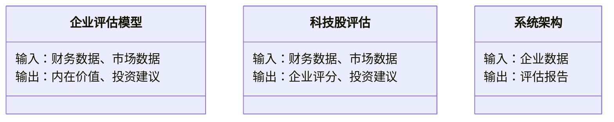
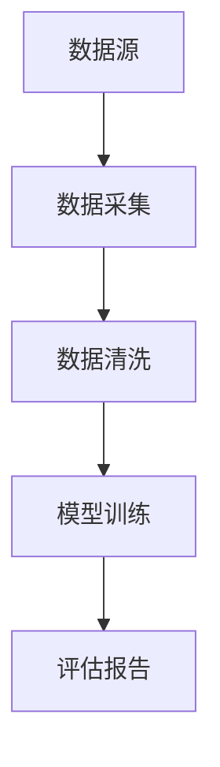

                 


# 巴菲特如何看待科技股投资

## 关键词：巴菲特，科技股，价值投资，投资策略，科技股分析，投资框架

## 摘要：  
本文从巴菲特的价值投资理念出发，深入分析了他在科技股投资中的独特视角。通过系统分析与架构设计，构建了科技股投资的框架，结合具体案例和数学模型，探讨了巴菲特的选股标准、企业评估方法以及投资决策流程。文章还提供了实战部分，通过Python代码实现科技股分析，并总结了投资中的注意事项与建议。

---

## 第1章 巴菲特的价值投资理念

### 1.1 巴菲特的价值投资核心理念

#### 1.1.1 投资的本质：寻找内在价值

$$\text{投资的本质是寻找企业的内在价值，而非市场的波动。}$$

- **内在价值**：企业未来现金流的现值，是投资决策的核心。
- **安全边际**：买入价格低于内在价值，确保投资的安全性。

#### 1.1.2 巴菲特的投资策略

- **长期持有**：巴菲特倡导长期投资，避免短期波动。
- **价值导向**：关注企业的基本面，寻找被市场低估的投资标的。

#### 1.1.3 巴菲特的选股标准

- **护城河**：企业竞争优势的核心来源。
- **管理层**：管理层的诚信与能力是企业成功的关键。
- **财务健康**：关注企业的盈利能力和现金流。

---

## 第2章 科技股的特点与挑战

### 2.1 科技股的高增长与高风险

- **高增长**：科技行业的快速变化和技术进步带来高增长潜力。
- **高风险**：技术更新快，市场变化大，企业风险较高。

### 2.2 科技股的创新与竞争优势

- **技术创新**：科技企业的核心竞争力在于技术创新。
- **市场竞争**：科技行业竞争激烈，护城河难以维持。

### 2.3 巴菲特与科技股的矛盾

- **巴菲特的质疑**：巴菲特曾对科技股持怀疑态度，认为科技企业的护城河难以持久。
- **科技股的估值**：科技股的高估值与巴菲特的价值投资理念冲突。

---

## 第3章 巴菲特的科技股投资框架

### 3.1 企业评估模型

#### 3.1.1 企业价值评估维度

- **财务指标**：ROE（净资产收益率）、ROA（资产回报率）、净利润率。
- **市场地位**：市场份额、竞争对手分析。
- **管理能力**：管理层的诚信与战略眼光。

#### 3.1.2 企业评估模型的数学表达

$$\text{内在价值} = \sum_{t=1}^{n} \frac{\text{现金流}}{(1 + r)^t}$$

其中，$r$ 是折现率，现金流是未来各年的自由现金流。

### 3.2 投资决策流程

#### 3.2.1 筛选阶段

- **初步筛选**：通过财务指标和市场地位筛选潜在标的。
- **深入分析**：研究企业的商业模式和竞争优势。

#### 3.2.2 投资决策

- **价值评估**：计算内在价值，判断是否低估。
- **风险评估**：分析企业的财务健康和市场风险。

---

## 第4章 科技股投资的系统分析

### 4.1 企业评估模型的设计

#### 4.1.1 领域模型



#### 4.1.2 系统架构设计



### 4.2 系统实现

#### 4.2.1 环境安装

```bash
pip install pandas numpy matplotlib
```

#### 4.2.2 核心代码实现

```python
import pandas as pd
import numpy as np

def calculate_intrinsic_value(financial_data, discount_rate):
    cash_flows = financial_data['现金流']
    present_value = np.npv(discount_rate, cash_flows)
    return present_value

# 示例数据
data = {
    '现金流': [100, 150, 200, 250],
    '折现率': 0.1
}
financial_data = pd.DataFrame(data)
intrinsic_value = calculate_intrinsic_value(financial_data, 0.1)
print(f"内在价值：{intrinsic_value}")
```

---

## 第5章 实战：科技股投资案例分析

### 5.1 案例选择

- **苹果公司（Apple）**
  - 护城河：品牌价值和生态系统。
  - 财务状况：稳定的现金流和高利润率。
- **微软公司（Microsoft）**
  - 护城河：强大的云服务和生态系统。
  - 管理层：Satya Nadella的领导力。

### 5.2 投资决策流程

#### 5.2.1 数据采集与清洗

```python
import pandas as pd

# 示例数据
data = {
    '公司': ['苹果', '微软', '亚马逊'],
    'ROE': [25%, 20%, 15%],
    'ROA': [15%, 12%, 10%],
    '现金流': [50, 40, 30]
}
df = pd.DataFrame(data)
print(df)
```

#### 5.2.2 价值评估

```python
def calculate_roe(roe, roa):
    return roe / roa

valuation = calculate_roe(25, 15)
print(f"价值评估结果：{valuation}")
```

---

## 第6章 总结与建议

### 6.1 总结

- 巴菲特的价值投资理念在科技股投资中需要灵活运用。
- 科技股的高增长与高风险并存，投资者需谨慎评估。

### 6.2 投资建议

- **长期投资**：避免短期波动，关注企业的长期价值。
- **价值导向**：寻找被市场低估的科技股。
- **风险控制**：设置止损点，分散投资组合。

---

## 附录

### 附录A 巴菲特的经典语录

- “价格是会波动的，但价值不会。”
- “投资的唯一目的是获取企业的部分所有权。”

### 附录B 推荐阅读

- 《巴菲特传》
- 《价值投资实战》

---

## 作者：AI天才研究院/AI Genius Institute & 禅与计算机程序设计艺术 /Zen And The Art of Computer Programming

