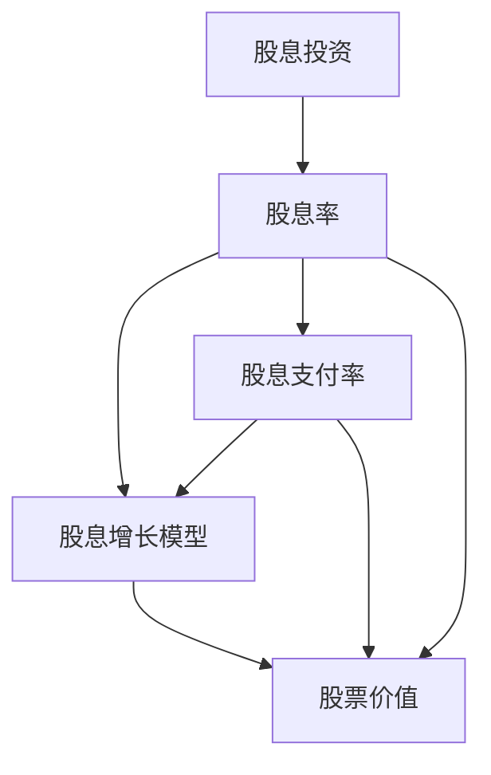

                 

# 巴菲特如何看待股息投资

> 关键词：巴菲特，股息投资，价值投资，股息率，股息增长模型

> 摘要：本文从巴菲特的股息投资理念出发，详细分析了股息投资的核心概念、策略、案例以及风险管理。通过数学模型和实际案例，探讨了如何通过股息投资实现长期稳定的收益。文章还结合了巴菲特的经典投资案例，总结了股息投资的优缺点，并提出了在现代金融环境下的优化策略。

---

# 目录大纲

## 第一部分: 股息投资的背景与基础

## 第二部分: 股息投资的核心概念与原理

## 第三部分: 巴菲特股息投资的核心策略

## 第四部分: 股息投资的风险管理与优化

## 第五部分: 股息投资的未来展望

---

## 第一部分: 股息投资的背景与基础

### 第1章: 股息投资的基本概念

#### 1.1 股息的定义与特点

- **1.1.1 股息的定义**
  - 股息是公司分配给股东的利润部分，通常以每股形式发放。
  - 股息可以是现金、股票或其他资产，但最常见的形式是现金股息。
  - 股息的发放取决于公司的净利润和股息政策。

- **1.1.2 股息的分类与计算方法**
  - 现金股息：公司直接向股东支付现金。
  - 股票股息：公司以新发行的股票作为股息。
  - 特殊股息：公司偶尔发放的大额股息，通常在公司盈利特别丰厚时发放。
  - 股息率计算公式：
    $$\text{股息率} = \frac{\text{每股股息}}{\text{股价}}$$

- **1.1.3 股息投资的优势与劣势**
  - 优势：
    - 稳定的现金流。
    - 抗跌性较强，尤其是在市场下跌时，高股息股票往往表现较好。
    - 复利效应，股息再投资可以带来额外收益。
  - 劣势：
    - 高股息率的股票可能面临增长潜力不足的问题。
    - 在低利率环境下，高股息率股票可能被高估，存在较大的估值风险。

#### 1.2 股息投资的历史演变

- **1.2.1 股息投资的起源与发展**
  - 股息投资的起源可以追溯到古代股份制公司的出现，但现代股息投资的概念起源于19世纪。
  - 在20世纪，股息投资逐渐成为一种主流的投资方式，尤其是在美国市场。

- **1.2.2 不同时期股息投资的特点**
  - 20世纪初：股息投资主要集中在铁路和工业公司，这些公司具有稳定的收益能力。
  - 20世纪70年代至90年代：科技股的兴起使得股息投资的行业分布更加多元化。
  - 21世纪：随着全球化的推进，股息投资开始向国际化、多元化方向发展。

- **1.2.3 股息投资与现代金融体系的结合**
  - 股息投资在现代金融体系中扮演着重要的角色，尤其是在养老金管理和机构投资中。
  - 股息投资与指数基金、ETF等现代金融工具的结合，使得投资者能够更便捷地进行股息投资。

#### 1.3 巴菲特的价值投资理念

- **1.3.1 巴菲特的投资哲学**
  - 巴菲特的投资理念基于价值投资，即以低于内在价值的价格买入优质资产。
  - 他强调长期投资和对公司基本面的深入分析。

- **1.3.2 巴菲特对股息投资的独特见解**
  - 巴菲特认为，股息是公司盈利能力的体现，也是投资安全的重要保障。
  - 他倾向于投资那些能够持续增长股息的公司，这些公司通常具有强大的竞争优势和稳定的盈利能力。

- **1.3.3 巴菲特股息投资的成功案例**
  - **可口可乐（Coca-Cola）**：可口可乐是一家高分红、高成长的公司，巴菲特长期持有该公司股票。
  - **美国运通（American Express）**：美国运通是一家具有强大品牌优势的公司，巴菲特对其进行了长期投资。

---

### 第2章: 股息投资的核心概念与原理

#### 2.1 股息投资的核心概念

- **2.1.1 股息率的计算与意义**
  - 股息率是衡量股票投资回报的重要指标之一。
  - 高股息率的股票通常被视为高分红股票，但需要警惕高股息率可能带来的估值风险。

- **2.1.2 股息支付率的定义与影响**
  - 股息支付率是指公司实际支付的股息占净利润的比例。
  - 高股息支付率可能意味着公司具有较强的盈利能力，但也可能意味着公司缺乏足够的 reinvestment opportunities。

- **2.1.3 股息增长模型的解释**
  - 股息增长模型用于估计股票的内在价值，假设股息将以固定速率增长。
  - 股息增长模型的数学公式：
    $$P = \frac{D_1}{r - g}$$
    其中，\(P\) 是股票的内在价值，\(D_1\) 是第一年的股息，\(r\) 是折现率，\(g\) 是股息增长率。

#### 2.2 股息投资的数学模型与公式

- **2.2.1 股息率的计算公式**
  $$\text{股息率} = \frac{\text{每股股息}}{\text{股价}}$$

- **2.2.2 股息增长模型**
  $$P = \frac{D_1}{r - g}$$
  其中，\(D_1\) 是第一年的股息，\(r\) 是折现率，\(g\) 是股息增长率。

- **2.2.3 股息率与股票价值的关系**
  - 高股息率的股票通常具有较高的价值，但需要考虑公司的盈利能力和成长潜力。

#### 2.3 股息投资的属性特征对比表

| 特性          | 股息率          | 股息支付率      | 股息增长模型      |
|---------------|-----------------|-----------------|-------------------|
| 定义          | 每股股息与股价的比率 | 股息支付与净利润的比率 | 股息按固定增长率增长的模型 |
| 作用          | 评估投资回报    | 评估公司分红能力 | 评估股票内在价值  |
| 限制          | 忽略了股息增长潜力 | 忽略了股价波动   | 忽略了股息支付的稳定性 |

#### 2.4 股息投资的核心概念图（Mermaid图）

---

### 第3章: 巴菲特股息投资的核心策略

#### 3.1 巴菲特选股的标准

- **3.1.1 公司基本面分析**
  - 重点关注公司的盈利能力、资产负债表健康状况和现金流情况。
  - 公司的ROE（净资产收益率）和ROA（资产回报率）是衡量公司盈利能力的重要指标。

- **3.1.2 股息支付能力评估**
  - 评估公司的股息支付率和股息增长能力。
  - 选择那些股息支付率适中且具有稳定增长潜力的公司。

- **3.1.3 行业地位与竞争优势**
  - 选择那些在行业内具有竞争优势的公司，这些公司通常具有较强的定价能力和较高的市场占有率。

#### 3.2 巴菲特股息投资的选股标准

- **3.2.1 低市盈率与高股息率**
  - 巴菲特倾向于选择那些市盈率较低且股息率较高的股票。
  - 这种策略可以帮助投资者在市场低迷时获得较高的分红收益。

- **3.2.2 公司的财务健康状况**
  - 公司的资产负债表需要健康，债务水平不宜过高。
  - 公司的现金流状况良好，能够支持持续的股息支付。

- **3.2.3 公司的长期增长潜力**
  - 股票的长期增长潜力是巴菲特选股的重要标准之一。
  - 公司需要具有较强的创新能力和发展潜力。

#### 3.3 巴菲特股息投资的案例分析

- **案例1：可口可乐**
  - 可口可乐是一家高分红、高成长的公司。
  - 公司具有强大的品牌优势和全球市场。
  - 巴菲特长期持有可口可乐股票，获得了稳定的股息收益和资本增值。

- **案例2：美国运通**
  - 美国运通是一家具有强大品牌优势的信用卡公司。
  - 公司具有稳定的盈利能力，股息支付率较高。
  - 巴菲特长期持有美国运通股票，获得了较高的股息收益和资本增值。

#### 3.4 巴菲特股息投资的策略总结

- **3.4.1 长期投资与价值投资结合**
  - 巴菲特强调长期投资和价值投资，选择那些具有长期增长潜力的公司。
  - 通过长期持有优质股票，投资者可以实现资本增值和股息收益的双重目标。

- **3.4.2 专注于优质公司**
  - 巴菲特倾向于投资那些在行业内具有竞争优势的公司。
  - 这些公司通常具有较强的盈利能力和发展潜力，能够为投资者提供稳定的股息收益和资本增值。

- **3.4.3 股息再投资策略**
  - 巴菲特倡导股息再投资，通过复利效应实现财富的长期增长。
  - 股息再投资可以降低交易成本，同时充分利用复利效应。

---

## 总结

通过以上分析，我们可以看到，巴菲特的股息投资理念以价值投资为核心，注重选择那些具有长期增长潜力和稳定股息收益的优质公司。投资者在进行股息投资时，需要综合考虑公司的基本面、财务状况和行业地位，选择那些具有长期增长潜力的公司。同时，股息再投资策略可以帮助投资者实现财富的长期增长。

--- 

作者：AI天才研究院/AI Genius Institute & 禅与计算机程序设计艺术 /Zen And The Art of Computer Programming

