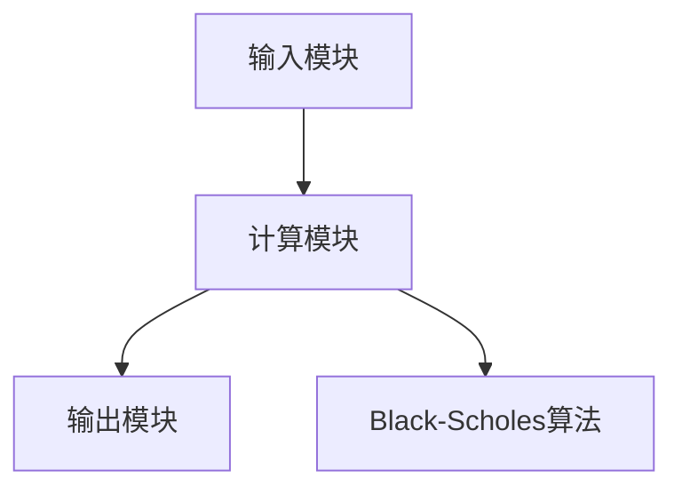

                 


# 巴菲特如何看待衍生品投资

## 关键词：巴菲特、衍生品、投资策略、风险管理、Black-Scholes模型

## 摘要：
本文深入分析了巴菲特对衍生品投资的看法，探讨了衍生品的核心概念、定价模型及其在巴菲特投资策略中的应用。通过结合数学模型和实际案例，本文揭示了巴菲特如何通过衍生品进行风险管理，并总结了其在投资中的最佳实践。

---

# 第一部分: 巴菲特如何看待衍生品投资

## 第1章: 衍生品投资的背景与概述

### 1.1 衍生品的基本概念

#### 1.1.1 什么是衍生品
衍生品是一种金融工具，其价值来源于基础资产（如股票、债券、商品等）的价格变动。常见的衍生品包括期货、期权、掉期和互换。

#### 1.1.2 衍生品的种类与特点
- **期货**：标准化合约，用于在未来某一时间以预定价格买卖资产。
- **期权**：赋予买方在特定时间内以预定价格买入或卖出资产的权利。
- **掉期**：协议双方交换现金流，通常基于资产价格或利率。

### 1.2 巴菲特的投资理念

#### 1.2.1 巴菲特的长期投资策略
巴菲特以价值投资著称，注重长期持有优质资产，避免短期波动。

#### 1.2.2 巴菲特对风险的定义
他认为风险主要来自杠杆使用不当和流动性不足，而非市场的波动性。

#### 1.2.3 巴菲特对衍生品的态度
他谨慎对待衍生品，认为它们复杂且容易滥用，但有时用于套期保值是必要的。

### 1.3 衍生品与巴菲特投资策略的联系

#### 1.3.1 衍生品在巴菲特投资组合中的作用
- **套期保值**：用于对冲持有的资产风险。
- **风险管理**：通过衍生品锁定价格波动，确保投资组合的稳定性。

#### 1.3.2 巴菲特对衍生品市场的看法
他认为衍生品市场存在过度投机，可能导致系统性风险。

---

## 第2章: 衍生品的核心概念与风险评估

### 2.1 衍生品的主要类型

#### 2.1.1 期货
用于对冲价格波动，锁定未来交易价格。

#### 2.1.2 期权
分为看涨和看跌期权，赋予买方选择权。

#### 2.1.3 掉期
用于对冲利率或汇率风险，降低融资成本。

### 2.2 衍生品的风险评估

#### 2.2.1 市场风险
价格波动可能导致衍生品价值下降。

#### 2.2.2 信用风险
交易对手违约的风险。

#### 2.2.3 流动性风险
难以迅速买卖衍生品而不影响价格。

#### 2.2.4 操作风险
因操作失误导致的损失风险。

### 2.3 巴菲特的风险管理策略

#### 2.3.1 巴菲特对衍生品风险的控制
- **限制杠杆使用**：避免过度杠杆放大风险。
- **严格审查交易对手**：确保交易对手的信用worthy。
- **对冲策略**：通过相反头寸抵消部分风险。

---

## 第3章: 衍生品定价的数学模型与算法

### 3.1 衍生品定价的基本原理

#### 3.1.1 随机构建与定价基础
衍生品价值取决于基础资产的预期未来价格。

#### 3.1.2 马科维茨投资组合理论
通过分散投资降低风险，优化投资组合回报。

#### 3.1.3 Black-Scholes模型
用于期权定价的数学模型，考虑了标的资产价格波动性和时间因素。

### 3.2 Black-Scholes模型的详细讲解

#### 3.2.1 模型的假设与局限性
- 假设：资产价格遵循几何布朗运动，无股息支付，波动率恒定。
- 局限性：忽略了市场深度和流动性因素。

#### 3.2.2 模型的数学推导

$$
C = S_0 e^{-r \tau} N(d_1) - K e^{-r T} N(d_2)
$$

其中：
$$
d_1 = \frac{\ln(\frac{S_0}{K}) + (r + \frac{\sigma^2}{2})(T - \tau)}{\sigma \sqrt{T - \tau}}
$$
$$
d_2 = d_1 - \sigma \sqrt{T - \tau}
$$

#### 3.2.3 模型的应用与实际案例
以股票期权为例，计算其理论价值，并与市场价对比。

### 3.3 衍生品定价的算法实现

#### 3.3.1 使用Python实现Black-Scholes模型

```python
import numpy as np
from scipy.stats import norm

def black_scholes(S, K, T, r, sigma):
    tau = T
    d1 = (np.log(S/K) + (r + sigma**2/2)*tau) / (sigma * np.sqrt(tau))
    d2 = d1 - sigma * np.sqrt(tau)
    C = S * norm.cdf(d1) * np.exp(-r*tau) - K * norm.cdf(d2) * np.exp(-r*tau)
    return C

# 示例计算
S = 100
K = 105
T = 1
r = 0.05
sigma = 0.2
print(black_scholes(S, K, T, r, sigma))
```

---

## 第4章: 系统分析与架构设计

### 4.1 问题场景介绍

#### 4.1.1 项目介绍
构建一个简单的衍生品定价系统，用于计算期权的理论价值。

### 4.1.2 功能模块
- 输入模块：接收S、K、T、r、sigma参数。
- 计算模块：应用Black-Scholes模型计算期权价值。
- 输出模块：显示计算结果。

### 4.2 系统架构设计



---

## 第5章: 项目实战

### 5.1 环境安装
安装Python和必要的库，如numpy和scipy。

### 5.2 核心实现

```python
import numpy as np
from scipy.stats import norm

def calculate_option_value(S, K, T, r, sigma):
    d1 = (np.log(S/K) + (r + 0.5*sigma**2)*T) / (sigma*np.sqrt(T))
    d2 = d1 - sigma*np.sqrt(T)
    call_value = S * norm.cdf(d1) - K * np.exp(-r*T) * norm.cdf(d2)
    return call_value

# 输入参数
S = 100
K = 105
T = 1
r = 0.05
sigma = 0.2

# 计算
value = calculate_option_value(S, K, T, r, sigma)
print(f"期权的理论价值为：{value}")
```

### 5.3 案例分析
分析实际市场案例，比较理论价与市场价，探讨影响因素。

---

## 第6章: 总结与最佳实践

### 6.1 小结
- 巴菲特谨慎使用衍生品，主要用于套期保值。
- 衍生品定价依赖数学模型，需考虑多种风险因素。

### 6.2 投资建议
- 严格控制杠杆使用。
- 选择可靠的交易对手。
- 定期审查和调整投资组合。

### 6.3 注意事项
- 衍生品复杂，需专业人员操作。
- 避免过度投机，注重风险管理。

### 6.4 拓展阅读
推荐相关书籍和资源，深入学习衍生品投资。

---

# 作者：AI天才研究院 & 禅与计算机程序设计艺术

---

通过以上结构和内容，文章详细探讨了巴菲特如何看待衍生品投资，结合理论与实践，为读者提供了全面的分析和见解。

