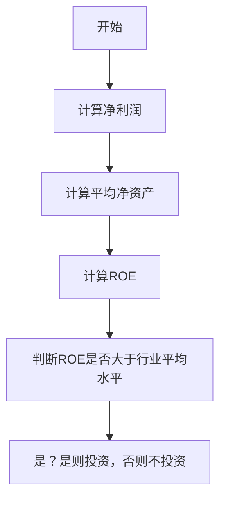
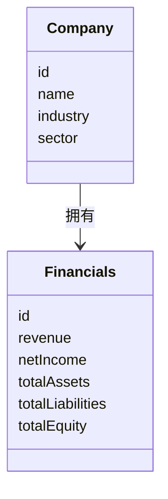
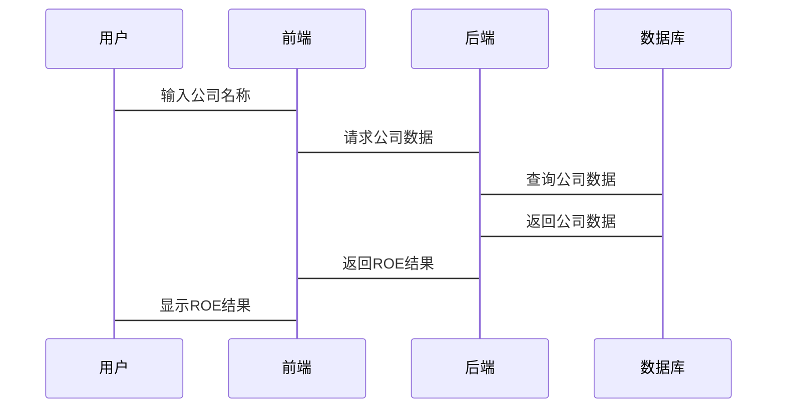

                 


# 巴菲特指标：评估市场估值的有效工具

## 关键词：巴菲特指标, ROE, 市场估值, 投资工具, 股票分析

## 摘要：巴菲特指标，即净资产收益率（ROE），是一种有效的市场估值工具。本文将详细探讨其核心概念、算法原理、实际应用以及与其他估值指标的对比，帮助读者全面理解并掌握这一投资工具。

## 正文：

### 第一部分：背景介绍

#### 第1章：巴菲特指标的基本概念

##### 1.1 巴菲特指标的定义
- 巴菲特指标，由投资大师沃伦·巴菲特提出，用于评估公司的盈利能力，具体指净资产收益率（ROE）。
- 公式：ROE = 净利润 / 平均净资产 × 100%。

##### 1.2 投资中的重要性
- 帮助投资者识别高回报、低风险的股票。
- 通过ROE评估公司的盈利能力，进而判断其投资价值。

##### 1.3 问题背景
- 投资者在选择股票时，需准确评估其价值，避免高估或低估。
- 市场上存在大量估值工具，ROE作为其中之一，具有独特优势。

### 第二部分：核心概念与联系

#### 第2章：巴菲特指标的核心概念

##### 2.1 核心概念
- 净利润：公司扣除所有费用后的利润。
- 平均净资产：公司总资产减去总负债后的平均值。
- ROE计算公式：$$ROE = \frac{\text{净利润}}{\text{平均净资产}} \times 100\%$$。

##### 2.2 核心概念对比表
| 指标名称 | 计算公式 | 主要用途 |
|----------|----------|----------|
| ROE      | 净利润/平均净资产×100% | 评估公司盈利能力 |
| 市盈率    | 股价/每股收益 | 评估股价高低 |
| 市净率    | 股价/每股净资产 | 评估股价与净资产的比例 |

#### 第2.3 ER实体关系图
```mermaid
erDiagram
    company {
        id
        name
        industry
        sector
    }
    financials {
        id
        revenue
        netIncome
        totalAssets
        totalLiabilities
        totalEquity
    }
    company --> financials : 拥有
```

### 第三部分：算法原理

#### 第3章：算法原理与实现

##### 3.1 算法流程图


##### 3.2 Python代码实现
```python
def calculate_roe(net_income, average_equity):
    return (net_income / average_equity) * 100

# 示例数据
net_income = 1000000  # 净利润（美元）
total_assets = 5000000  # 总资产（美元）
total_liabilities = 2000000  # 总负债（美元）

# 计算平均净资产
average_equity = (total_assets - total_liabilities) / 2

# 计算ROE
roe = calculate_roe(net_income, average_equity)
print(f"ROE: {roe}%")
```

##### 3.3 实际案例分析
- 公司A：净利润=100万，平均净资产=500万，ROE=20%。
- 行业平均ROE=15%，公司A的ROE高于行业平均水平，具有投资价值。

### 第四部分：系统分析与架构

#### 第4章：系统分析与架构设计

##### 4.1 领域模型


##### 4.2 系统架构


##### 4.3 系统交互


### 第五部分：项目实战

#### 第5章：项目实战与应用

##### 5.1 项目目标
- 开发一个基于ROE的股票估值系统。

##### 5.2 核心实现
```python
def analyze_company(roes):
    for company, roe in roes.items():
        if roe > 15:  # 假设行业平均ROE为15%
            print(f"{company}的投资价值高。")
        else:
            print(f"{company}的投资价值一般。")

# 示例数据
roes = {
    "公司A": 20,
    "公司B": 12,
    "公司C": 18
}

analyze_company(roes)
```

##### 5.3 案例分析
- 公司A：ROE=20%，高于行业平均，值得投资。
- 公司B：ROE=12%，低于行业平均，投资价值较低。

### 第六部分：总结与建议

#### 第6章：总结与投资建议

##### 6.1 总结
- 巴菲特指标（ROE）是评估公司盈利能力的重要工具。
- 高ROE的公司通常具有较高的投资价值。

##### 6.2 投资建议
- 在选择股票时，结合ROE与其他指标（如市盈率、市净率）进行综合分析。
- 长期关注ROE的变化，评估公司的持续盈利能力。

##### 6.3 注意事项
- ROE高并不意味着绝对安全，需注意公司的财务健康状况。
- 避免仅凭ROE高低做投资决策，需全面分析。

##### 6.4 拓展阅读
- 《巴菲特选股术》
- 《投资学基础》

## 作者：AI天才研究院 & 禅与计算机程序设计艺术

---

这篇文章详细探讨了巴菲特指标（ROE）的各个方面，从定义到应用，帮助读者全面理解这一投资工具。通过实际案例和系统分析，提供了实用的指导和建议。

