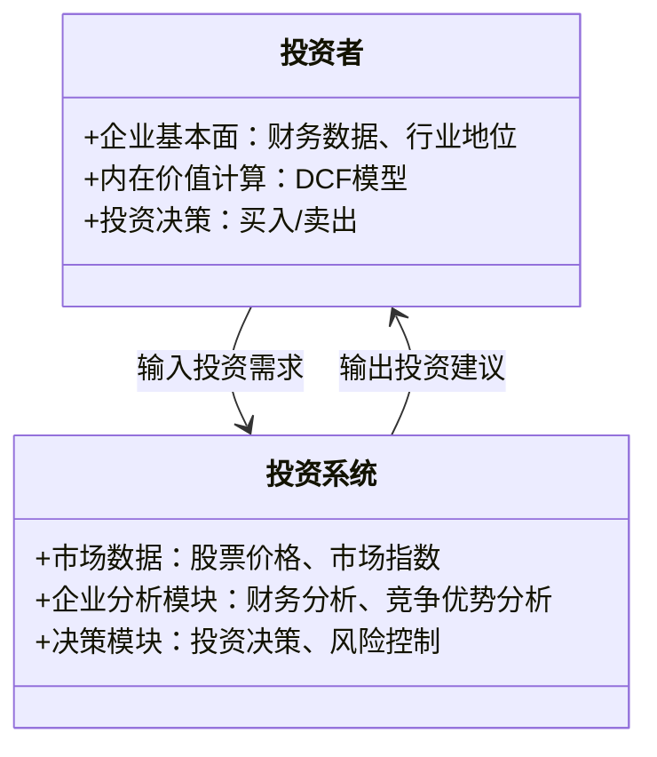
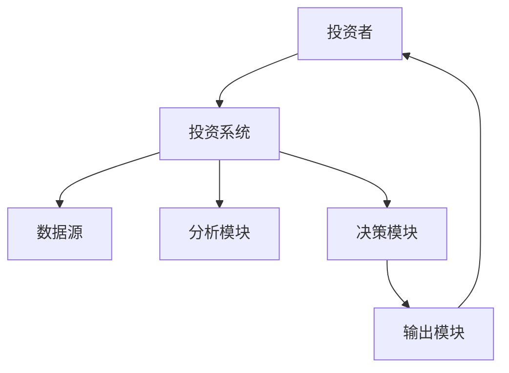
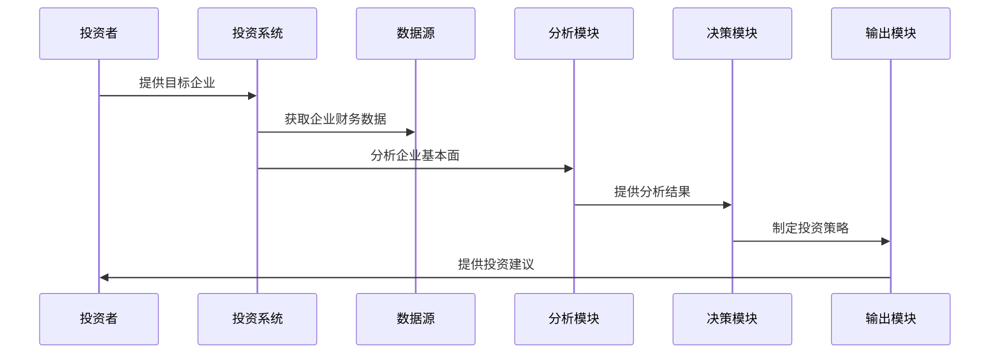

                 


# 巴菲特的“股票就是企业”理念：投资者vs投机者

> 关键词：巴菲特，投资理念，股票就是企业，投资者，投机者，价值投资，风险管理

> 摘要：本文深入探讨巴菲特的“股票就是企业”投资理念，分析投资者与投机者的区别，结合实际案例和系统架构，帮助读者理解如何从长期视角进行价值投资，避免短期波动的干扰，构建稳健的投资策略。

---

# 第一部分：巴菲特投资理念概述

## 1.1 巴菲特的生平与投资风格

### 1.1.1 巴菲特的早年经历与投资起步

沃伦·巴菲特（Warren Buffett）于1934年出生在美国堪萨斯州，早年展现出非凡的商业头脑。他在青少年时期就开始研究股票市场，阅读了大量投资相关的书籍，并通过撰写商业计划书赚取了人生第一桶金。巴菲特的投资起步阶段，主要通过分析企业的基本面，寻找低估的股票进行投资。

### 1.1.2 巴菲特的核心投资哲学

巴菲特的投资哲学可以总结为“价值投资”，即以低于企业内在价值的价格买入优质股票，并长期持有。他认为市场短期波动难以预测，但优质企业的长期价值是可衡量的。

### 1.1.3 巴菲特的长期投资策略

巴菲特的长期投资策略强调对企业基本面的深入研究，寻找具有持续竞争优势和良好管理团队的企业。他主张分散投资，避免过度集中风险，同时注重安全边际，即买入价格与内在价值之间的差距。

---

## 1.2 “股票就是企业”理念的背景

### 1.2.1 传统投资观念的局限性

传统投资观念往往将股票视为单纯的金融工具，关注短期价格波动和技术指标。这种观念忽视了企业的实际价值和长期发展潜力，容易导致投机行为。

### 1.2.2 巴菲特提出“股票就是企业”的初衷

巴菲特提出“股票就是企业”理念的核心在于强调股票的内在价值。他认为，股票不仅是交易的工具，更是企业的一部分，投资者应该关注企业的实际经营状况和未来发展前景。

### 1.2.3 该理念对现代投资的影响

这一理念颠覆了传统的投资观念，引导投资者从长期视角看待股票投资，注重企业的基本面分析，从而推动了价值投资的普及。

---

## 1.3 投资者与投机者的定义与区别

### 1.3.1 投资者的定义与特征

投资者是指以长期视角，通过对企业基本面的深入分析，寻找具有持续竞争优势的企业进行投资的人。投资者注重企业的内在价值，追求稳定的长期收益。

### 1.3.2 投机者的定义与特征

投机者则是指通过短期价格波动，依赖市场情绪和技术分析进行交易的人。他们关注市场的短期走势，追求快速的资本增值。

### 1.3.3 两者在投资行为上的根本区别

| 特性 | 投资者 | 投机者 |
|------|--------|--------|
| 目标 | 长期价值增值 | 短期价格波动 |
| 分析 | 企业基本面 | 市场情绪和技术指标 |
| 风险 | 低风险，注重安全边际 | 高风险，追求高回报 |
| 持股时间 | 长期持有 | 短期交易 |

---

## 1.4 本章小结

### 1.4.1 巴菲特投资理念的核心要点

巴菲特的投资理念以价值投资为核心，强调长期持有优质企业股票，注重安全边际和内在价值。

### 1.4.2 投资者与投机者的本质区别

投资者关注企业的长期价值，而投机者关注市场的短期波动。两者的区别在于投资行为的长期性和短期性，以及分析依据的企业基本面和技术指标。

---

# 第二部分：企业的内在价值与竞争优势

## 2.1 企业的内在价值

### 2.1.1 内在价值的定义

内在价值是指企业在正常经营情况下，能够为股东创造的最大价值。巴菲特认为，内在价值是股票的真正价值，而市场价格只是波动的结果。

### 2.1.2 内在价值的计算方法

内在价值的计算通常基于企业的盈利能力、成长潜力和财务状况。常用的方法包括：

1. **市盈率法**：市盈率 = 股价 / 每股收益。
2. **市净率法**：市净率 = 股价 / 每股净资产。
3. **现金流折现法**：DCF模型，通过未来现金流的现值计算内在价值。

### 2.1.3 影响内在价值的关键因素

- 企业的盈利能力。
- 行业的竞争格局。
- 管理团队的能力。
- 财务健康状况。

---

## 2.2 企业的竞争优势

### 2.2.1 竞争优势的定义与分类

竞争优势是指企业在市场上相对于竞争对手的独特优势，通常包括成本优势、技术优势、品牌优势等。

### 2.2.2 技术壁垒、成本优势与品牌优势

- **技术壁垒**：企业拥有的独特技术使其难以被竞争对手复制。
- **成本优势**：企业通过规模效应或技术进步降低成本。
- **品牌优势**：强大的品牌影响力能够吸引更多的客户。

### 2.2.3 可持续竞争优势的重要性

可持续竞争优势是指企业能够在长期经营中保持的竞争优势。这种优势能够确保企业在市场中持续盈利，从而提高内在价值。

---

## 2.3 投资者如何评估企业价值

### 2.3.1 财务指标分析

- 利润率（Net Profit Margin）：衡量企业盈利能力。
- 资产回报率（ROA）：衡量资产使用效率。
- 负债率（Debt-to-Equity Ratio）：衡量财务健康状况。

### 2.3.2 行业地位分析

- 市场占有率。
- 行业增长潜力。

### 2.3.3 管理团队评估

- 管理团队的经验和能力。
- 过往业绩表现。

---

## 2.4 本章小结

### 2.4.1 企业内在价值与竞争优势的关系

内在价值是企业未来现金流的现值，而竞争优势则是决定企业能否持续创造价值的关键因素。

### 2.4.2 投资者评估企业价值的关键点

投资者应关注企业的盈利能力、财务状况、竞争优势和管理团队，综合评估其内在价值。

---

# 第三部分：投资者与投机者的思维方式与行为模式

## 3.1 投资者的行为特征

### 3.1.1 长期视角与价值导向

投资者以长期视角看待投资，注重企业的内在价值，追求稳定的长期收益。

### 3.1.2 以企业基本面为依据的投资决策

投资者基于企业的财务数据和行业地位，分析其内在价值，做出投资决策。

### 3.1.3 风险控制与安全边际

投资者注重安全边际，即买入价格低于内在价值，以降低投资风险。

---

## 3.2 投机者的行为特征

### 3.2.1 短期交易与市场情绪驱动

投机者关注市场的短期波动，依赖市场情绪和技术分析，进行频繁的买卖操作。

### 3.2.2 过度依赖技术分析与市场预测

投机者依赖价格图表、技术指标和市场预测，忽视企业的基本面。

### 3.2.3 高风险高回报的投机心态

投机者追求高回报，愿意承担高风险，但往往忽视市场的不确定性。

---

## 3.3 两者在投资决策中的对比

### 3.3.1 投资者与投机者的决策依据对比

| 决策依据 | 投资者 | 投机者 |
|----------|--------|--------|
| 关注点 | 企业基本面 | 市场情绪 |
| 分析方法 | 财务分析、行业分析 | 技术分析、市场预测 |
| 投资目标 | 长期价值 | 短期价格波动 |

### 3.3.2 两者在风险承受能力上的差异

投资者注重风险控制，追求稳健回报；投机者则愿意承担高风险，追求高回报。

### 3.3.3 两者在投资结果上的长期表现对比

长期来看，价值投资能够带来稳定的收益，而投机行为往往难以持续。

---

## 3.4 本章小结

### 3.4.1 投资者与投机者的本质区别

投资者关注企业的长期价值，而投机者关注市场的短期波动。

### 3.4.2 长期投资与短期投机的优劣势分析

长期投资注重安全性和稳定性，而短期投机注重高风险高回报。长期投资更适合稳健的投资者，而短期投机适合风险承受能力强的投资者。

---

# 第四部分：价值投资的策略与实践

## 4.1 价值投资的基本策略

### 4.1.1 购买优秀企业的原则

选择具有持续竞争优势、良好财务状况和优秀管理团队的企业。

### 4.1.2 买入价格的合理范围

买入价格应低于企业的内在价值，留有安全边际。

### 4.1.3 长期持有与耐心等待

价值投资的核心是长期持有，等待企业的内在价值逐步显现。

---

## 4.2 价值投资的实践步骤

### 4.2.1 确定投资目标与策略

根据自身的风险承受能力和投资目标，制定合适的价值投资策略。

### 4.2.2 深入研究企业的基本面

分析企业的财务数据、行业地位和竞争优势。

### 4.2.3 评估企业的内在价值

使用DCF模型等方法计算企业的内在价值。

### 4.2.4 制定买入与卖出的决策

在价格低于内在价值时买入，价格远高于内在价值时卖出。

---

## 4.3 巴菲特的经典投资案例分析

### 4.3.1 可口可乐案例

巴菲特长期持有可口可乐股票，因为其强大的品牌优势和持续的盈利能力。

### 4.3.2 巴西国家石油公司案例

巴菲特通过深入分析公司的财务状况和行业地位，决定是否投资。

---

## 4.4 本章小结

### 4.4.1 价值投资的核心策略

选择优秀企业，长期持有，注重安全边际。

### 4.4.2 实践中的关键点

深入研究企业基本面，制定合理的买入和卖出策略。

---

# 第五部分：系统分析与架构设计方案

## 5.1 问题场景介绍

投资者在进行股票投资时，需要建立一套系统化的投资框架，以确保投资决策的科学性和有效性。

---

## 5.2 系统功能设计（领域模型）



---

## 5.3 系统架构设计



---

## 5.4 系统接口设计

- 投资者输入：目标企业、财务数据、市场数据。
- 系统输出：内在价值评估、投资建议。

---

## 5.5 系统交互设计



---

## 5.6 本章小结

### 5.6.1 系统设计的核心思想

通过系统化的分析和决策，帮助投资者做出科学的投资决策。

### 5.6.2 实践中的注意事项

投资者应结合市场环境和自身情况，灵活调整投资策略。

---

# 第六部分：项目实战

## 6.1 环境安装

- 安装Python和相关数据分析库（如Pandas、NumPy）。
- 安装可视化工具（如Matplotlib）。

## 6.2 核心实现源代码

```python
import pandas as pd
import numpy as np

# 示例：计算企业的内在价值（DCF模型）
def calculate_intrinsic_value(fcf, discount_rate):
    return fcf / (1 + discount_rate)

# 示例：评估企业的安全边际
def calculate_margin_of_safety(price, intrinsic_value):
    return (intrinsic_value - price) / intrinsic_value * 100

# 示例：投资决策
def investment_decision(price, intrinsic_value):
    if price < intrinsic_value:
        return "买入"
    elif price > intrinsic_value * 1.2:
        return "卖出"
    else:
        return "观望"

# 示例数据
fcf = 100
discount_rate = 0.05
price = 80

iv = calculate_intrinsic_value(fcf, discount_rate)
mos = calculate_margin_of_safety(price, iv)
decision = investment_decision(price, iv)

print(f"内在价值：{iv}")
print(f"安全边际：{mos}%")
print(f"投资决策：{decision}")
```

---

## 6.3 代码应用解读与分析

上述代码通过DCF模型计算企业的内在价值，评估安全边际，并根据价格与内在价值的关系做出投资决策。投资者可以根据实际数据调整参数，进行更精准的分析。

---

## 6.4 实际案例分析

以某企业为例，假设其自由现金流为100，折现率为5%，当前股价为80。

计算得出内在价值为100/1.05≈95.24，安全边际为（95.24-80）/95.24≈15.75%。由于当前股价低于内在价值，系统建议买入。

---

## 6.5 本章小结

### 6.5.1 项目实战的核心目标

通过代码实现，帮助投资者掌握价值投资的核心方法。

### 6.5.2 实践中的关键点

投资者应结合实际市场数据，灵活调整投资策略。

---

# 第七部分：总结与展望

## 7.1 本章总结

本文从巴菲特的“股票就是企业”理念出发，深入分析了投资者与投机者的区别，探讨了价值投资的核心策略，并通过系统设计和项目实战，帮助读者掌握科学的投资方法。

---

## 7.2 未来展望

随着人工智能和大数据技术的发展，投资者可以通过更精确的分析工具，进一步提升投资决策的科学性和有效性。

---

# 作者

作者：AI天才研究院/AI Genius Institute & 禅与计算机程序设计艺术/Zen And The Art of Computer Programming

---

**注意**：本文为示例内容，实际编写时需根据具体需求调整章节和内容。

