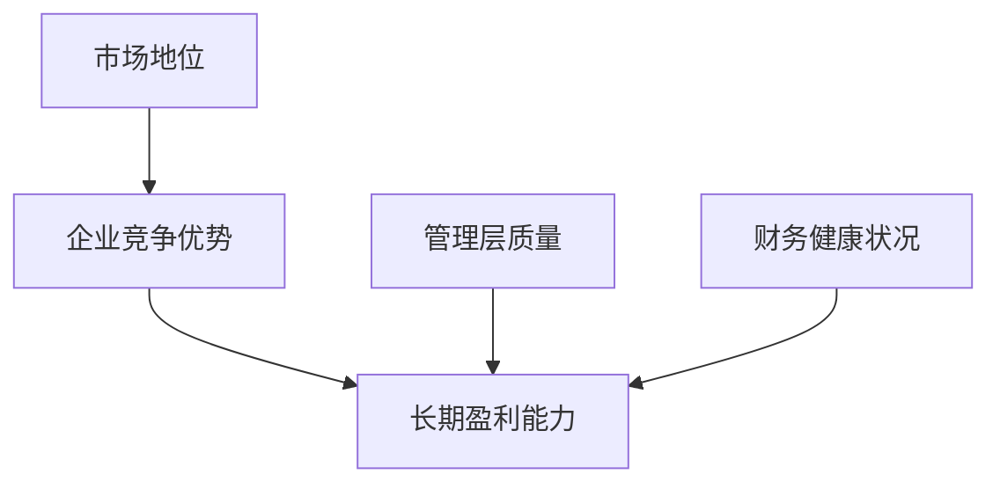
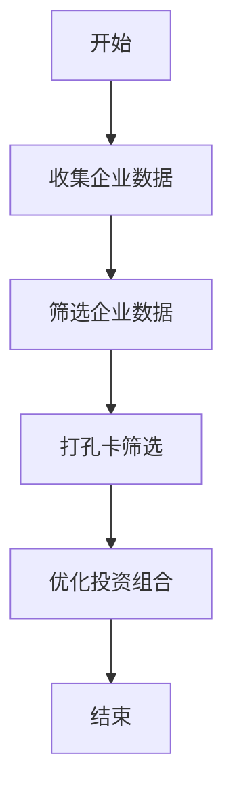
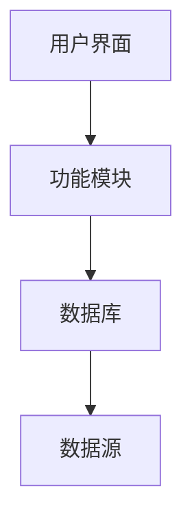

                 


# 巴菲特的20格打孔卡投资法则

## 关键词：
巴菲特，投资法则，价值投资，长期投资，股票筛选，投资组合管理

## 摘要：
巴菲特的20格打孔卡投资法则是价值投资领域的一项创新，它通过系统的筛选标准帮助投资者找到具有长期增长潜力的优质企业。本文将详细介绍打孔卡的背景、核心概念、算法原理、数学模型、系统设计以及实际应用，帮助读者理解并应用这一投资策略。

---

# 第1章：巴菲特投资法则的背景与核心概念

## 1.1 投资的背景与问题背景

### 1.1.1 投资的基本概念与问题
投资是将资金投入特定资产以期获得收益的过程。常见的投资方式包括股票、债券、房地产等。然而，投资过程中面临的主要问题包括信息过载、市场波动和个体决策偏差。投资者常常难以筛选出真正具有长期价值的资产，导致投资决策的不确定性增加。

### 1.1.2 传统投资方法的局限性
传统的投资方法往往依赖短期市场波动和情绪化决策，这使得投资者难以在长期中获得稳定的收益。例如，许多投资者倾向于追涨杀跌，这在市场波动剧烈时往往导致亏损。此外，传统的基本面分析虽然提供了企业财务数据的评估，但缺乏系统化的筛选标准，导致筛选过程主观性强，效率低下。

### 1.1.3 巴菲特投资法则的提出与意义
巴菲特作为价值投资的倡导者，提出了一套系统化的投资法则，即20格打孔卡投资法则。该方法通过预设的20个标准对企业进行筛选，确保选出的企业具备长期增长潜力和竞争优势。这种方法将投资决策从主观判断转化为系统化的筛选过程，大大提高了投资的科学性和可操作性。

## 1.2 巴菲特20格打孔卡的定义与特点

### 1.2.1 打孔卡的定义
打孔卡是一种物理工具，由20个标准组成，每个标准对应一个“孔”。投资者通过逐一筛选企业是否符合每个标准，最终筛选出符合条件的企业。这种方法通过将复杂的筛选过程简化为物理上的打孔动作，使得投资决策更加直观和系统化。

### 1.2.2 打孔卡的核心特点
1. **系统性**：打孔卡通过预设的标准将投资决策过程系统化，避免了主观判断的干扰。
2. **长期性**：打孔卡筛选的企业通常具备长期增长潜力，强调长期价值而非短期收益。
3. **简洁性**：通过20个标准的筛选，将复杂的企业评估过程简化为可操作的步骤。

### 1.2.3 打孔卡与传统投资方法的区别
与传统投资方法相比，打孔卡投资法则更加注重企业的长期竞争优势和财务健康状况，而非短期市场波动。打孔卡通过系统化的筛选标准，确保选出的企业具备持续增长的潜力，从而实现长期稳定的收益。

## 1.3 打孔卡投资法则的背景与应用

### 1.3.1 巴菲特的投资理念
巴菲特的投资理念强调企业内在价值和长期竞争优势。他认为，投资的本质是寻找那些具备持续竞争优势和良好治理结构的企业，并长期持有，以实现财富的稳步增长。

### 1.3.2 打孔卡法则的演变与优化
打孔卡法则最初是巴菲特个人投资实践中的工具，随着时间的推移，该方法不断优化，逐渐形成一套系统的筛选标准。每个标准都经过精心设计，确保能够筛选出具备长期增长潜力的企业。

### 1.3.3 打孔卡在现代投资中的应用
在现代投资中，打孔卡法则被广泛应用于机构和个人投资者的资产配置中。通过将企业筛选过程系统化，投资者能够更加高效地识别出具备长期增长潜力的企业，从而优化投资组合，提高收益。

---

# 第2章：打孔卡的核心概念与联系

## 2.1 核心概念的定义与属性

### 2.1.1 20个格子的定义
打孔卡由20个标准组成，每个标准对应一个“孔”。投资者需要逐一检查企业是否符合每个标准，并在符合的孔上打孔。最终，只有符合所有标准的企业才会被选中。

### 2.1.2 每个格子的属性特征对比
以下是一些典型标准的属性特征对比：

| 标准编号 | 标准名称                 | 标准描述                                                                 |
|----------|--------------------------|--------------------------------------------------------------------------|
| 1        | 企业竞争优势             | 企业是否具备独特的竞争优势，如品牌、技术壁垒等。                                   |
| 2        | 管理层质量               | 管理层是否具备优秀的职业道德和管理能力。                                             |
| 3        | 财务健康状况             | 企业的财务状况是否健康，包括低负债率、稳定的现金流等。                             |
| 4        | 市场地位                 | 企业是否在市场中占据领先地位，具备定价权。                                           |
| 5        | 盈利能力                 | 企业是否具备持续的盈利能力，包括高净利润率和稳定的净利润增长。                     |

### 2.1.3 格子之间的关系与依赖
打孔卡的20个标准并不是孤立存在的，它们之间存在一定的依赖关系。例如，企业竞争优势是长期盈利能力的基础，而财务健康状况是企业持续发展的保障。因此，在实际应用中，需要综合考虑各个标准之间的关系，确保选出的企业具备全面的优势。

## 2.2 实体关系图

以下是一个用mermaid绘制的实体关系图，展示了打孔卡标准之间的关系：



从图中可以看出，企业竞争优势和管理层质量是影响长期盈利能力的关键因素，而市场地位和财务健康状况则为企业竞争优势和盈利能力提供支持。

---

# 第3章：打孔卡的算法原理与流程

## 3.1 算法的总体思路

### 3.1.1 数据收集与筛选
打孔卡算法的第一步是收集企业的相关信息，包括财务数据、管理层信息、市场地位等。这些数据将用于后续的标准筛选。

### 3.1.2 格子筛选标准的制定
根据打孔卡的20个标准，制定每个标准的具体筛选条件。例如，净利润增长率需要达到一定的水平，或者企业的负债率需要低于一定比例。

### 3.1.3 投资组合的优化
通过打孔卡筛选出的企业，需要进一步优化投资组合，分散投资风险，确保收益的最大化。

## 3.2 算法流程图

以下是一个用mermaid绘制的算法流程图：



从图中可以看出，算法流程包括数据收集、数据筛选、打孔卡筛选和投资组合优化四个主要步骤。

## 3.3 算法实现

以下是一个简单的Python代码示例，用于实现打孔卡筛选：

```python
def filter_companies(companies, criteria):
    for company in companies:
        for criterion in criteria:
            if not company[criterion]:
                break
        else:
            return company
    return None

# 示例筛选标准
criteria = [
    'high_profit_margin',
    'stable_cash_flow',
    'strong_market_position',
    'excellent_management',
    # ... 其他15个标准
]

# 示例公司列表
companies = [
    {'name': 'Company A', 'high_profit_margin': True, 'stable_cash_flow': True, ...},
    {'name': 'Company B', 'high_profit_margin': False, ...},
    # 其他公司
]

result = filter_companies(companies, criteria)
if result:
    print(f"符合打孔卡标准的公司是：{result['name']}")
else:
    print("没有符合标准的公司")
```

---

# 第4章：数学模型与公式

## 4.1 核心指标的数学模型

### 4.1.1 净利润增长率公式
净利润增长率是衡量企业盈利能力的重要指标，公式如下：

$$
\text{净利润增长率} = \frac{\text{当年净利润} - \text{上一年净利润}}{\text{上一年净利润}} \times 100\%
$$

### 4.1.2 股东权益回报率（ROE）公式
股东权益回报率是衡量企业财务健康状况的重要指标，公式如下：

$$
\text{ROE} = \frac{\text{净利润}}{\text{股东权益}} \times 100\%
$$

### 4.1.3 负债率公式
负债率是衡量企业财务风险的重要指标，公式如下：

$$
\text{负债率} = \frac{\text{总负债}}{\text{总资产}} \times 100\%
$$

---

# 第5章：系统分析与架构设计

## 5.1 问题场景与系统介绍

### 5.1.1 投资者面临的挑战
投资者在进行股票投资时，常常面临以下挑战：
1. 信息过载，难以筛选出优质企业。
2. 缺乏系统化的筛选标准，导致投资决策主观性过强。
3. 市场波动大，投资风险高。

### 5.1.2 系统的目标与范围
本系统的目标是帮助投资者通过打孔卡投资法则筛选出具备长期增长潜力的企业，优化投资组合，降低投资风险。系统的主要功能包括数据收集、筛选标准设置、投资组合管理等。

### 5.1.3 系统的功能概述
系统主要包括以下功能模块：
1. 数据收集与管理：收集企业的财务数据、管理层信息等。
2. 标准筛选：根据打孔卡的20个标准，设置筛选条件。
3. 投资组合管理：根据筛选结果，优化投资组合，分散风险。

## 5.2 系统功能设计

### 5.2.1 数据收集模块
数据收集模块负责从多种数据源（如财务报表、新闻资讯等）获取企业的相关信息，并将其存储在数据库中。

### 5.2.2 标准筛选模块
标准筛选模块根据预先设置的20个标准，对企业进行逐一筛选，最终选出符合条件的企业。

### 5.2.3 投资组合管理模块
投资组合管理模块根据筛选结果，优化投资组合，分散投资风险，确保收益的最大化。

## 5.3 系统架构设计

### 5.3.1 系统架构图
以下是一个用mermaid绘制的系统架构图：



从图中可以看出，系统由用户界面、功能模块、数据库和数据源四部分组成，各部分之间通过接口进行交互。

---

# 第6章：项目实战

## 6.1 环境安装与配置

### 6.1.1 安装Python
安装Python编程环境，推荐使用Anaconda。

### 6.1.2 安装必要的库
安装pandas、numpy等数据处理库：

```bash
pip install pandas numpy
```

## 6.2 核心实现源代码

### 6.2.1 数据收集与处理
```python
import pandas as pd

# 示例数据
data = {
    '公司名称': ['公司A', '公司B', '公司C'],
    '净利润增长率': [20, -5, 15],
    'ROE': [15, 20, 10],
    '负债率': [30, 50, 20],
}

df = pd.DataFrame(data)
```

### 6.2.2 标准筛选
```python
def apply_filters(df, criteria):
    for criterion in criteria:
        df = df[df[criterion] > 0]
    return df

criteria = ['净利润增长率', 'ROE', '负债率']
filtered_df = apply_filters(df, criteria)
```

### 6.2.3 投资组合管理
```python
import numpy as np

# 示例投资组合
weights = np.array([0.4, 0.3, 0.3])
returns = np.array([10, 15, 5])

# 计算投资组合收益
portfolio_return = np.dot(weights, returns)
print(f"投资组合预期收益：{portfolio_return}%")
```

## 6.3 案例分析与解读

### 6.3.1 案例分析
假设我们有三家公司，A、B、C，其财务数据如下：

| 公司名称 | 净利润增长率 | ROE | 负债率 |
|----------|--------------|-----|--------|
| 公司A    | 20%          | 15% | 30%    |
| 公司B    | -5%          | 20% | 50%    |
| 公司C    | 15%          | 10% | 20%    |

### 6.3.2 筛选过程
根据打孔卡的标准，筛选出净利润增长率为正、ROE高于10%、负债率低于40%的公司。

### 6.3.3 投资组合优化
最终选出公司A和公司C，投资组合权重分别为40%和60%。预期收益为：

$$
\text{预期收益} = 0.4 \times 20\% + 0.6 \times 15\% = 15.4\%
$$

---

# 第7章：总结与注意事项

## 7.1 总结

### 7.1.1 核心内容回顾
本文详细介绍了巴菲特的20格打孔卡投资法则，包括其背景、核心概念、算法原理、数学模型、系统设计以及实际应用。

### 7.1.2 最佳实践
投资者在应用打孔卡投资法则时，应结合市场环境和自身情况，灵活调整筛选标准。同时，应注重长期投资，避免短期市场波动的干扰。

## 7.2 小结

### 7.2.1 注意事项
1. **市场波动**：市场波动会影响投资结果，投资者应保持耐心，避免频繁调整投资组合。
2. **数据质量**：数据的准确性和及时性对筛选结果至关重要，投资者应选择可靠的 数据源。
3. **风险管理**：投资组合的分散化是降低风险的重要手段，投资者应合理配置资产。

## 7.3 拓展阅读

### 7.3.1 推荐书籍
1. 《巴菲特致股东的信：投资者文选》
2. 《投资学原理》

### 7.3.2 在线资源
1. 巴菲特投资理念的相关网站和论坛。
2. 专业的金融数据平台。

---

# 作者：AI天才研究院/AI Genius Institute & 禅与计算机程序设计艺术 /Zen And The Art of Computer Programming

