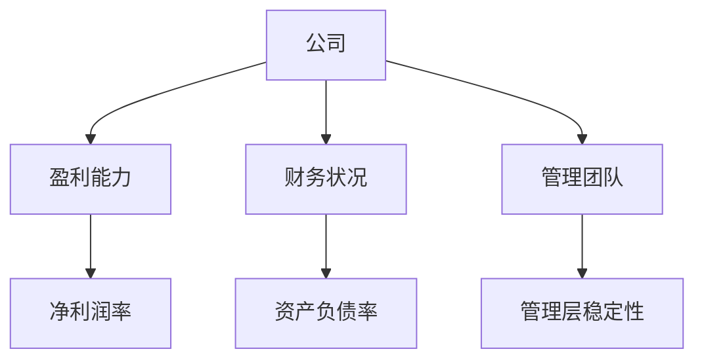
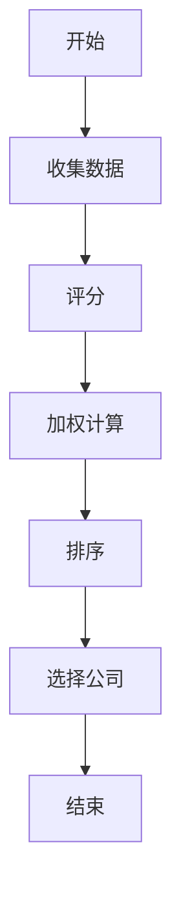
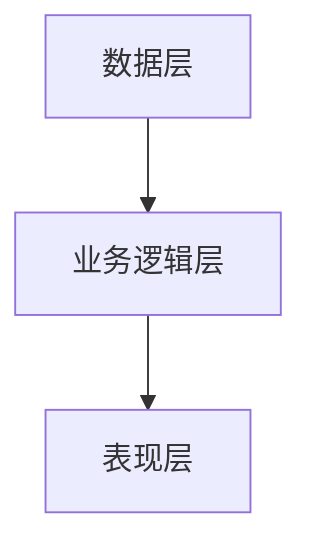
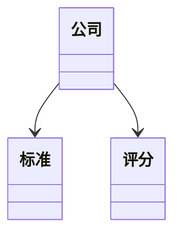

                 


# 巴菲特的20格打孔卡：集中投资的智慧

## 关键词：
巴菲特, 投资策略, 价值投资, 20格打孔卡, 算法模型, 系统设计

## 摘要：
本文深入探讨了巴菲特的20格打孔卡投资策略，分析其背后的核心理念、数学模型及系统设计。通过详细讲解每个标准的属性和相互关系，结合实际案例，展示了如何运用这些标准进行投资决策，并提供了基于Python的实现代码。文章还设计了一个完整的投资系统架构，帮助读者理解如何将打孔卡策略应用于实际投资中。

## 第一部分：巴菲特的投资理念与20格打孔卡背景

### 第1章：巴菲特的投资哲学

#### 1.1 巴菲特的投资理念概述

##### 1.1.1 价值投资的定义与核心原则
价值投资是一种长期投资策略，强调购买低于其内在价值的股票。巴菲特的核心原则包括：
1. **安全边际**：购买价格远低于内在价值的资产，以降低风险。
2. **长期视角**：关注企业的长期盈利能力，而非短期波动。
3. **优质企业**：投资于具有强大护城河和良好管理的企业。

##### 1.1.2 巴菲特的投资策略与成功案例
巴菲特的成功在于他坚持买入并持有优质企业的策略。他的成功案例包括可口可乐、美国运通和 Berkshire Hathaway 等。这些投资不仅产生了稳定的收益，还体现了他对企业基本面的深刻理解。

##### 1.1.3 价值投资与现代投资理论的联系
价值投资与现代投资组合理论有交集，但更强调个体股票分析。巴菲特将价值投资与技术分析相结合，形成了独特的投资策略。

#### 1.2 20格打孔卡的背景与意义

##### 1.2.1 巴菲特使用20格打孔卡的原因
20格打孔卡是巴菲特筛选投资目标的工具，基于20个核心标准，确保投资标的符合其严格的价值投资理念。

##### 1.2.2 打孔卡在投资决策中的作用
打孔卡通过筛选满足特定标准的公司，帮助巴菲特集中投资于少数优质企业，减少决策错误。

##### 1.2.3 打孔卡与集中投资策略的关系
集中投资于少数优质企业是巴菲特成功的关键。打孔卡帮助他筛选出最优质的标的，集中投资以获得更高收益。

## 第二部分：20格打孔卡的核心标准

### 第2章：20格打孔卡的标准解析

#### 2.1 标准的定义与分类

##### 2.1.1 20个标准的具体内容
巴菲特的20格打孔卡包括以下标准：
1. 盈利能力
2. 财务状况
3. 管理团队
4. 行业地位
5. 市场潜力
6. 利润质量
7. 负债情况
8. 资产效率
9. 现金流量
10. 股东权益
11. 股价合理性
12. 竞争优势
13. 创新能力
14. 可持续性
15. 法律风险
16. 管理层稳定性
17. 历史表现
18. 股息支付
19. 估值指标
20. 风险管理

##### 2.1.2 标准的分类与优先级
标准分为财务、管理、行业和市场四类，优先级基于对企业长期价值的影响。

##### 2.1.3 标准的相互影响
某些标准（如盈利能力）可能与其他标准（如资产效率）相互影响，需综合评估。

#### 2.2 标准的属性对比

##### 2.2.1 标准属性对比表格
| 标准                | 定义                              | 重要性 | 示例 |
|---------------------|-----------------------------------|--------|------|
| 盈利能力            | 净利润与收入的比例                | 高     | ROE |
| 财务状况            | 资产负债表健康程度                | 高     | 负债率 |
| 管理团队            | 管理层的经验与稳定性              | 高     | CEO历史 |
| 行业地位            | 市场份额与竞争地位                | 中     | 市占率 |

##### 2.2.2 标准的权重与重要性分析
高权重的标准如盈利能力、财务状况和管理团队，对投资决策影响最大。

#### 2.3 标准的ER实体关系图


## 第三部分：20格打孔卡的算法与数学模型

### 第3章：20格打孔卡的筛选算法

#### 3.1 算法概述

##### 3.1.1 筛选过程的步骤
1. 收集数据：获取目标公司的20项标准数据。
2. 评分：根据每个标准的重要性评分，范围为1-10分。
3. 加权计算：计算加权总分，权重基于标准的重要性。
4. 排序：从高到低排序，选择分数最高的公司。

##### 3.1.2 筛选标准的数学模型
加权评分模型：
$$ \text{总分} = \sum (\text{标准评分} \times \text{权重}) $$

##### 3.1.3 算法的优化与改进
结合机器学习模型，如随机森林，提高筛选准确性。

#### 3.2 算法流程图


## 第四部分：系统分析与架构设计方案

### 第4章：系统分析与架构设计

#### 4.1 问题场景介绍
设计一个投资系统，基于20格打孔卡筛选优质企业，帮助投资者做出投资决策。

#### 4.2 项目介绍

##### 4.2.1 系统功能设计
核心功能包括数据收集、评分计算、结果展示和报告生成。

##### 4.2.2 系统架构设计
采用分层架构：数据层、业务逻辑层和表现层。

##### 4.2.3 系统架构图


#### 4.3 系统功能设计

##### 4.3.1 领域模型设计


## 第五部分：项目实战

### 第5章：项目实战

#### 5.1 环境安装

##### 5.1.1 安装必要的库
安装pandas、numpy和scikit-learn。

```bash
pip install pandas numpy scikit-learn
```

#### 5.2 系统核心实现

##### 5.2.1 核心代码实现
```python
import pandas as pd
import numpy as np

def calculate_score(company_data):
    # 加权评分
    weights = np.array([0.15, 0.15, 0.10, ...])  # 各标准权重
    scores = company_data.dot(weights)
    return scores

# 示例数据
company_data = pd.DataFrame({
    '盈利能力': [0.2, 0.3],
    '财务状况': [0.8, 0.6],
    '管理团队': [0.9, 0.7],
    ...
})
scores = calculate_score(company_data)
print(scores)
```

## 第六部分：最佳实践

### 第6章：最佳实践

#### 6.1 小结
本文详细探讨了巴菲特的20格打孔卡策略，结合算法和系统设计，展示了其在现代投资中的应用。

#### 6.2 注意事项
1. 数据来源的可靠性至关重要。
2. 定期更新标准以适应市场变化。
3. 结合其他分析方法以提高准确性。

#### 6.3 拓展阅读
推荐阅读《巴菲特致股东的信》和《投资学原理》以深入理解价值投资。

## 结语

通过系统化的分析和实践，巴菲特的20格打孔卡策略为投资者提供了有效的工具，帮助他们做出明智的投资决策。结合现代技术，这一策略在当前的投资环境中更具应用价值。

## 作者

作者：AI天才研究院/AI Genius Institute & 禅与计算机程序设计艺术 /Zen And The Art of Computer Programming

