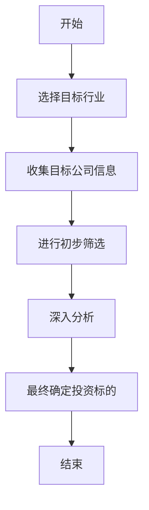
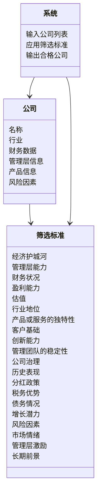

                 


# 巴菲特的20格打孔卡：集中投资的艺术

> 关键词：巴菲特，20格打孔卡，价值投资，投资策略，投资筛选

> 摘要：本文详细介绍了巴菲特的20格打孔卡方法，分析了其背后的逻辑和投资哲学，结合技术细节和实际案例，展示了如何通过系统化的方法进行集中投资。

---

## 目录

1. [背景介绍](#背景介绍)
2. [核心概念与联系](#核心概念与联系)
3. [算法原理讲解](#算法原理讲解)
4. [系统分析与架构设计方案](#系统分析与架构设计方案)
5. [项目实战](#项目实战)
6. [数学公式](#数学公式)
7. [最佳实践 tips 和小结](#最佳实践 tips 和小结)
8. [注意事项和拓展阅读](#注意事项和拓展阅读)

---

## 背景介绍

### 1.1 巴菲特投资理念的核心思想

沃伦·巴菲特是世界上最著名的价值投资者之一。他的投资理念基于“以合理的价格买入优质的公司并长期持有”。这种理念的核心是通过深入分析企业的基本面，寻找那些具有持续竞争优势、良好管理团队和合理估值的公司。

#### 1.1.1 巴菲特的成长经历与投资理念的形成

巴菲特的投资理念深受他的老师本杰明·格雷厄姆的影响。格雷厄姆的价值投资理论强调安全边际和对公司基本面的深入分析。巴菲特在此基础上加入了对管理层信任、企业竞争优势和长期前景的考量。

#### 1.1.2 巴菲特的价值投资理论

巴菲特的价值投资理论强调以下几点：
- **安全边际**：买入价格低于内在价值。
- **竞争优势**：投资具有持续竞争优势的公司。
- **长期持有**：集中投资于优质公司，长期持有。

#### 1.1.3 巴菲特投资理念的核心原则

巴菲特的投资原则可以总结为：
- **只投资自己理解的公司**。
- **集中投资**：将资金集中在少数优质公司上。
- **长期持有**：避免频繁交易，降低交易成本。

---

### 1.2 20格打孔卡方法的背景与目的

#### 1.2.1 打孔卡方法的起源与目的

20格打孔卡方法是巴菲特在实践中总结出的一种投资筛选工具。它的目的是帮助投资者系统化地筛选出具有投资价值的公司。

#### 1.2.2 打孔卡方法的基本原理

通过20个格子的筛选标准，投资者可以逐步排除不符合条件的公司，最终筛选出少数优质的投资标的。

#### 1.2.3 打孔卡方法的适用场景

适用于对股票投资感兴趣，希望通过系统化方法筛选出优质公司的投资者。

---

## 核心概念与联系

### 2.1 20格打孔卡的核心筛选标准

以下是20格打孔卡的主要筛选标准：

1. **经济护城河**：公司是否有持续的竞争优势。
2. **管理层能力**：管理层是否优秀且值得信任。
3. **财务状况**：公司财务是否健康，是否有足够的现金流。
4. **盈利能力**：公司是否具有持续的盈利能力。
5. **估值**：公司股价是否低于其内在价值。
6. **行业地位**：公司在行业中的地位如何。
7. **产品或服务的独特性**：公司是否有独特的产品或服务。
8. **客户基础**：公司客户基础是否稳定。
9. **创新能力**：公司是否有持续的创新能力。
10. **管理团队的稳定性**：管理团队是否稳定。
11. **公司治理**：公司治理结构是否合理。
12. **历史表现**：公司过去的表现如何。
13. **分红政策**：公司是否有稳定的分红政策。
14. **税务优势**：公司是否具有税务优势。
15. **债务情况**：公司债务是否合理。
16. **增长潜力**：公司未来是否有增长潜力。
17. **风险因素**：公司面临的风险是否可控。
18. **市场情绪**：市场情绪是否过于乐观或悲观。
19. **管理层激励**：管理层是否有足够的激励机制。
20. **长期前景**：公司未来5-10年的前景如何。

#### 2.1.1 核心概念对比表格

| 筛选标准                | 关注点                          |
|-------------------------|---------------------------------|
| 经济护城河              | 竞争优势                       |
| 管理层能力              | 管理团队的信任与能力           |
| 财务状况                | 现金流、债务、利润              |
| 盈利能力                | 净利润、ROE                    |
| 估值                    | 市盈率、市净率                  |
| 行业地位                | 市场份额、竞争地位             |
| 产品或服务的独特性      | 独特性、差异化                  |
| 客户基础                | 客户稳定性、忠诚度             |
| 创新能力                | 研发投入、创新能力             |
| 管理团队的稳定性        | 团队稳定性、经验               |
| 公司治理                | 治理结构、透明度               |
| 历史表现                | 过去的业绩、稳定性             |
| 分红政策                | 分红的持续性、金额             |
| 税务优势                | 税务负担、优惠政策             |
| 债务情况                | 债务规模、偿债能力             |
| 增长潜力                | 市场扩展、新产品开发           |
| 风险因素                | 行业风险、财务风险             |
| 市场情绪                | 市场波动、投资者情绪           |
| 管理层激励              | 激励机制、股权结构             |
| 长期前景                | 未来5-10年的发展潜力           |

---

## 算法原理讲解

### 3.1 20格打孔卡的筛选流程

#### 3.1.1 算法流程图



#### 3.1.2 算法步骤解释

1. **选择目标行业**：根据当前市场环境和经济趋势，选择具有增长潜力的行业。
2. **收集目标公司信息**：收集目标公司的财务报表、管理层信息、行业地位等数据。
3. **进行初步筛选**：通过20格打孔卡的初步筛选标准，排除不符合条件的公司。
4. **深入分析**：对通过初步筛选的公司进行更详细的分析，包括财务状况、管理层能力和长期前景等。
5. **最终确定投资标的**：根据综合分析结果，确定最终的投资标的。

#### 3.1.3 Python代码实现

```python
def巴菲特筛选法(公司列表):
    筛选标准 = [
        经济护城河检查,
        管理层能力检查,
        财务状况检查,
        盈利能力检查,
        估值检查,
        行业地位检查,
        产品或服务的独特性检查,
        客户基础检查,
        创新能力检查,
        管理团队的稳定性检查,
        公司治理检查,
        历史表现检查,
        分红政策检查,
        税务优势检查,
        债务情况检查,
        增长潜力检查,
        风险因素检查,
        市场情绪检查,
        管理层激励检查,
        长期前景检查
    ]
    合格公司 = []
    for 公司 in 公司列表:
        合格 = True
        for 标准 in 筛选标准:
            if not 标准(公司):
                合格 = False
                break
        if 合格:
            合格公司.append(公司)
    return 合格公司

# 示例用法
公司列表 = [公司1, 公司2, 公司3, ...]
合格公司 = 巴菲特筛选法(公司列表)
```

---

## 系统分析与架构设计方案

### 4.1 系统功能设计

#### 4.1.1 领域模型



---

## 项目实战

### 5.1 环境安装

为了实现20格打孔卡的筛选功能，我们需要以下环境：

- Python 3.8+
- pandas库
- numpy库
- matplotlib库

安装命令：
```bash
pip install pandas numpy matplotlib
```

---

### 5.2 核心实现代码

```python
import pandas as pd
import numpy as np

def 经济护城河检查(公司数据):
    return 公司数据['竞争优势'] >= 0.7

def 管理层能力检查(公司数据):
    return 公司数据['管理层评分'] >= 0.6

def 财务状况检查(公司数据):
    return 公司数据['现金流'] > 0 and 公司数据['债务/资产'] <= 0.5

def 盈利能力检查(公司数据):
    return 公司数据['净利润率'] >= 0.1

def 估值检查(公司数据):
    return 公司数据['市盈率'] <= 15 or 公司数据['市净率'] <= 2

# 更多筛选标准的函数...

def 巴菲特筛选法(公司数据):
    合格公司 = []
    for index, row in 公司数据.iterrows():
        合格 = True
        if not 经济护城河检查(row):
            合格 = False
        if not 管理层能力检查(row):
            合格 = False
        if not 财务状况检查(row):
            合格 = False
        if not 盈利能力检查(row):
            合格 = False
        if not 估值检查(row):
            合格 = False
        # 继续其他标准的检查...
        if 合格:
            合格公司.append(index)
    return 合格公司

# 示例数据
data = {
    '公司': ['公司A', '公司B', '公司C'],
    '竞争优势': [0.8, 0.6, 0.7],
    '管理层评分': [0.7, 0.5, 0.6],
    '现金流': [100, -50, 80],
    '债务/资产': [0.3, 0.6, 0.4],
    '净利润率': [0.15, 0.08, 0.1],
    '市盈率': [12, 20, 15],
    '市净率': [1.5, 2.5, 1.8]
}

company_data = pd.DataFrame(data)

合格公司 = 巴菲特筛选法(company_data)
print("合格公司:",合格公司)
```

---

## 数学公式

### 6.1 相关公式

1. **市盈率（P/E）公式**：
   $$ P/E = \frac{股价}{每股收益} $$

2. **ROE（净资产收益率）公式**：
   $$ ROE = \frac{净利润}{净资产} $$

3. **市净率（P/B）公式**：
   $$ P/B = \frac{股价}{每股净资产} $$

---

## 最佳实践 tips 和小结

### 7.1 最佳实践 tips

1. **长期持有**：避免频繁交易，降低交易成本。
2. **分散与集中**：虽然集中投资，但不要过于集中，分散风险。
3. **持续学习**：市场变化快，需要不断学习新的知识和案例。
4. **保持耐心**：投资需要时间，耐心等待企业成长。
5. **避免情绪化决策**：市场波动时，保持冷静，遵循逻辑决策。

---

## 注意事项和拓展阅读

### 8.1 注意事项

1. **数据准确性**：确保筛选标准的数据来源可靠。
2. **动态调整**：根据市场变化和公司情况，动态调整筛选标准。
3. **风险管理**：尽管集中投资，但仍需注意分散风险。
4. **避免过度优化**：不要为了满足筛选标准而忽视公司的实际情况。

---

### 8.2 拓展阅读

1. 《巴菲特的智慧》
2. 《投资的 sı 上界》
3. 《价值投资实战》
4. 《投资学原理》

---

作者：AI天才研究院/AI Genius Institute & 禅与计算机程序设计艺术 /Zen And The Art of Computer Programming

