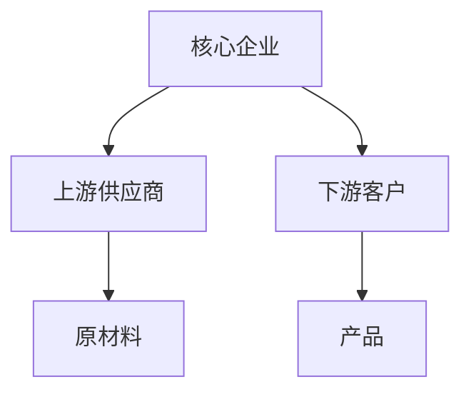
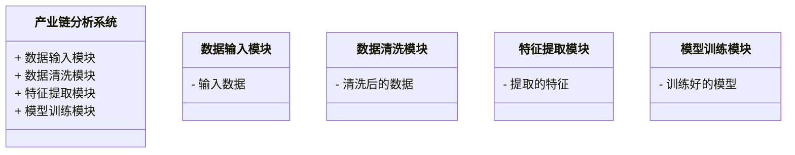
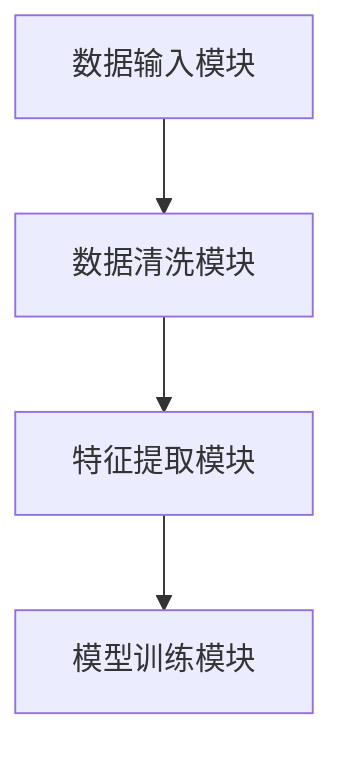
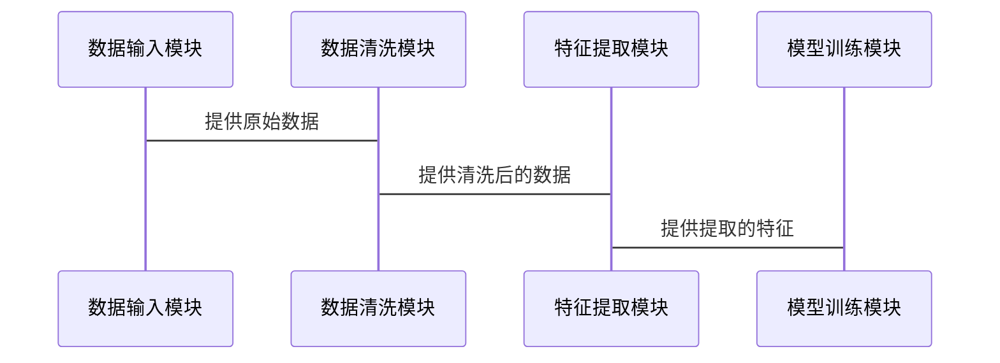

                 


# 巴菲特的产业链分析3.0：全球供应链重构下的投资机会

## 关键词：
- 巴菲特投资理念
- 产业链分析
- 全球供应链重构
- 企业价值评估
- 数字化转型

## 摘要：
在全球供应链重构的背景下，巴菲特的产业链分析方法迎来3.0版本的升级。本文将结合技术与投资的视角，详细探讨产业链分析的核心概念、算法原理、系统架构，并通过实际案例分析，揭示全球供应链重构下的投资机会。文章最后总结了最佳实践和未来展望。

---

## 第一部分: 巴菲特产业链分析3.0的背景与核心概念

### 第1章: 产业链分析的演变与全球供应链重构

#### 1.1 产业链分析的演变历程

##### 1.1.1 从1.0到3.0的产业链分析发展
- **1.0版本**：基于企业个体的财务分析，关注单个企业的盈利能力和估值。
- **2.0版本**：从单个企业扩展到产业链上下游，关注企业之间的协同效应和竞争优势。
- **3.0版本**：结合全球供应链重构的背景，引入数字化与智能化的分析工具，关注产业链的整体价值和系统性优化。

##### 1.1.2 全球供应链重构的背景与驱动因素
- **疫情的影响**：全球供应链中断，企业开始重新评估和优化供应链布局。
- **全球化与区域化的平衡**：企业逐步从全球化供应链转向区域化供应链，以降低风险。
- **数字化与智能化**：技术进步推动供应链的数字化转型，提升了效率和透明度。

##### 1.1.3 巴菲特投资理念的演变与产业链分析的结合
- 巴菲特早期的投资理念注重企业的财务健康和管理层能力。
- 随着供应链的复杂化，巴菲特开始关注企业的上游和下游合作伙伴，逐步形成产业链分析的方法。
- 在全球供应链重构的背景下，巴菲特的产业链分析3.0版本强调了对产业链整体价值的评估。

#### 1.2 全球供应链重构的现状与趋势
##### 1.2.1 疫情对全球供应链的深远影响
- 疫情导致的供应链中断暴露了传统供应链的脆弱性。
- 企业开始重新评估供应链的稳定性，推动了供应链的本地化和区域化。

##### 1.2.2 全球化与区域化的平衡：供应链重构的方向
- **全球化供应链**：跨国企业依赖全球化的供应链，但面临更高的风险。
- **区域化供应链**：企业开始将供应链分散到不同区域，以降低风险。
- **区域化供应链的优势**：更短的供应链、更低的运输成本、更高的供应链透明度。

##### 1.2.3 数字化与智能化对供应链重构的推动
- **技术驱动**：人工智能、大数据、物联网等技术推动供应链的数字化转型。
- **效率提升**：技术的应用提升了供应链的透明度和效率，优化了库存管理和物流效率。

#### 1.3 巴菲特产业链分析3.0的核心框架
##### 1.3.1 产业链分析的核心要素与逻辑
- **核心要素**：上游原材料、中游制造、下游销售。
- **逻辑**：分析产业链各环节的协同效应，评估企业的竞争优势。

##### 1.3.2 从企业价值到产业链价值的延伸
- **企业价值**：单个企业的财务健康和盈利能力。
- **产业链价值**：产业链的整体价值和协同效应，关注上下游合作伙伴的稳定性。

##### 1.3.3 全球供应链重构下的投资机会识别
- **投资机会**：供应链重构带来的投资机会，例如区域化供应链的优势。

### 第2章: 产业链分析的核心概念与联系

#### 2.1 产业链分析的核心概念
##### 2.1.1 产业链的定义与构成
- **定义**：产业链是指生产过程中各环节的分工与协作关系。
- **构成**：上游原材料、中游制造、下游销售。

##### 2.1.2 产业链各环节的特征与属性
- **上游**：原材料供应，成本敏感性高。
- **中游**：制造环节，技术门槛高。
- **下游**：销售环节，市场敏感性高。

##### 2.1.3 产业链分析的关键维度与指标
- **关键维度**：供应链的稳定性、效率、成本。
- **指标**：库存周转率、物流成本、供应链透明度。

#### 2.2 产业链分析的核心要素对比
##### 2.2.1 上游、中游、下游环节的特征对比
| 环节   | 特征                           |
|--------|--------------------------------|
| 上游   | 原材料供应，成本敏感性高       |
| 中游   | 制造环节，技术门槛高           |
| 下游   | 销售环节，市场敏感性高         |

##### 2.2.2 核心企业与非核心企业的角色区分
- **核心企业**：产业链的核心企业，具有较强的议价能力和竞争力。
- **非核心企业**：产业链中的辅助企业，依赖核心企业的需求。

##### 2.2.3 产业链的垂直整合与水平整合模式
- **垂直整合**：企业整合上下游环节，降低供应链风险。
- **水平整合**：企业与同一环节的多家企业合作，提升效率。

#### 2.3 产业链的实体关系图


---

## 第二部分: 产业链分析的算法与数学模型

### 第3章: 产业链分析的算法原理

#### 3.1 产业链分析的数学模型
##### 3.1.1 产业链价值的量化评估模型
- **模型**：产业链价值 = ∑（各环节的价值贡献）
- **公式**：$$产业链价值 = \sum_{i=1}^{n} v_i$$，其中 \(v_i\) 表示第i环节的价值贡献。

##### 3.1.2 企业价值与产业链价值的关系
- **关系**：企业价值是产业链价值的一部分，企业需要通过优化产业链各环节的协同效应来提升整体价值。

##### 3.1.3 数学公式与模型的构建
- **企业价值评估公式**：$$企业价值 = 企业收入 - 企业成本$$
- **产业链价值评估公式**：$$产业链价值 = ∑（各环节的价值贡献）$$

#### 3.2 产业链分析的算法流程
##### 3.2.1 数据输入与清洗
- **数据输入**：收集产业链各环节的数据，包括成本、收入、利润等。
- **数据清洗**：剔除异常值和错误数据，确保数据的准确性。

##### 3.2.2 特征提取与模型训练
- **特征提取**：从数据中提取关键特征，例如成本、收入、利润等。
- **模型训练**：使用机器学习算法训练模型，预测产业链各环节的价值贡献。

##### 3.2.3 模型实现与测试
- **模型实现**：使用Python代码实现模型，例如：
```python
# 示例代码：产业链价值评估模型
def calculate_value_contributions(revenue, cost):
    return revenue - cost
```

- **模型测试**：通过实际数据测试模型的准确性，优化模型参数。

---

### 第4章: 系统分析与架构设计方案

#### 4.1 系统功能设计
##### 4.1.1 领域模型（Mermaid类图）


##### 4.1.2 系统架构设计（Mermaid架构图）


##### 4.1.3 系统接口设计
- **输入接口**：接收产业链各环节的数据。
- **输出接口**：输出产业链各环节的价值贡献。

##### 4.1.4 系统交互设计（Mermaid序列图）


---

### 第5章: 项目实战

#### 5.1 环境安装
- **Python安装**：安装Python 3.8及以上版本。
- **依赖库安装**：安装pandas、numpy、scikit-learn等库。

#### 5.2 系统核心实现源代码
##### 5.2.1 数据处理代码
```python
import pandas as pd
import numpy as np

# 示例代码：数据清洗模块
def clean_data(df):
    # 删除缺失值
    df.dropna(inplace=True)
    # 处理异常值
    df = df[(df['收入'] > 0) & (df['成本'] > 0)]
    return df
```

##### 5.2.2 模型训练代码
```python
from sklearn.linear_model import LinearRegression

# 示例代码：模型训练模块
def train_model(X, y):
    model = LinearRegression()
    model.fit(X, y)
    return model
```

##### 5.2.3 模型应用代码
```python
# 示例代码：产业链价值评估
def calculate_

