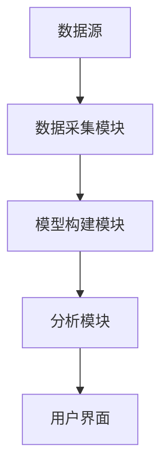

                 


# 巴菲特的产业链分析4.0：数字孪生技术在供应链中的应用

> 关键词：数字孪生，供应链管理，产业链分析，巴菲特分析，人工智能，数据分析，系统架构

> 摘要：本文探讨数字孪生技术如何与巴菲特的产业链分析方法结合，优化供应链管理。通过分析核心概念、算法原理、系统架构，并结合实际案例，展示了数字孪生在提升供应链效率和决策能力中的作用，为未来供应链管理提供了新思路。

---

## 目录大纲

### 第1章 巴菲特的产业链分析4.0概述

#### 1.1 巴菲特产业链分析方法的演进
- 从1.0到4.0的演进历程
- 核心理念与创新

#### 1.2 数字孪生技术的定义与特点
- 数字孪生技术的定义
- 核心特征对比
- 与传统供应链的区别

### 第2章 核心概念与联系

#### 2.1 数字孪生的原理
- 模型构建
- 数据采集与处理
- 分析与优化

#### 2.2 巴菲特分析方法的原理
- 数据分析方法
- 产业链结构分析
- 关键指标评估

#### 2.3 两者结合的对比与Mermaid图
- 对比表格
- 数字孪生与巴菲特分析的结合流程图

### 第3章 算法原理

#### 3.1 数据预处理
- 清洗与标准化

#### 3.2 时间序列预测模型
- 算法流程图
- Python代码实现
- 数学模型：ARIMA公式

### 第4章 系统架构设计

#### 4.1 项目介绍
- 应用场景
- 功能模块

#### 4.2 领域模型图
- Mermaid类图

#### 4.3 系统架构图
- Mermaid架构图

### 第5章 项目实战

#### 5.1 实施案例
- 汽车制造企业的优化

#### 5.2 环境安装
- 必要条件与工具

#### 5.3 核心代码实现
- 数据处理代码
- 模型训练代码

#### 5.4 案例分析与结果
- 优化效果对比

### 第6章 最佳实践与总结

#### 6.1 注意事项
- 数据隐私
- 技术局限性

#### 6.2 未来趋势
- 新兴技术结合
- 行业应用扩展

#### 6.3 总结
- 数字孪生的优势
- 未来展望

### 第7章 附录

#### 7.1 扩展阅读
- 推荐书籍与资源

#### 7.2 工具推荐
- 开源工具与平台

---

## 正文

### 第1章 巴菲特的产业链分析4.0概述

#### 1.1 巴菲特产业链分析方法的演进

从1.0到4.0版本，巴菲特的产业链分析方法不断进化。1.0版本侧重于基础分析，2.0版本引入了更多数据，3.0版本开始采用预测模型，而4.0版本则结合了数字孪生技术，实现了动态优化。

核心理念是通过分析产业链的各个环节，识别关键节点，优化资源配置，提升整体效率。

#### 1.2 数字孪生技术的定义与特点

数字孪生是通过虚拟模型实时反映物理世界的动态，具有实时性、交互性和预测性的特点。与传统供应链相比，数字孪生能够实时监控和预测，提供更精准的决策支持。

---

### 第2章 核心概念与联系

#### 2.1 数字孪生的原理

数字孪生通过构建虚拟模型，实时采集数据，进行分析与优化，帮助企业在供应链中做出更明智的决策。

#### 2.2 巴菲特分析方法的原理

该方法通过数据分析和产业链结构分析，识别关键指标，评估企业绩效，为投资决策提供依据。

#### 2.3 对比与Mermaid图

| 对比维度 | 数字孪生 | 巴菲特分析 |
|----------|----------|------------|
| 方法 | 建模与实时分析 | 数据分析与评估 |

Mermaid图展示两者结合的流程：

```mermaid
graph TD
A[开始] -> B[数据采集] -> C[构建模型] -> D[分析与优化] -> E[结果输出]
```

---

### 第3章 算法原理

#### 3.1 数据预处理

数据清洗和标准化是确保模型准确性的关键步骤。

#### 3.2 时间序列预测模型

使用ARIMA模型进行预测，代码如下：

```python
from statsmodels.tsa.arima_model import ARIMA
import pandas as pd
import numpy as np

# 示例数据
data = pd.Series(np.random.randn(100), index=pd.date_range('2020-01-01', periods=100))
model = ARIMA(data, order=(1, 1, 0))
model_fit = model.fit()
 forecast = model_fit.forecast(steps=5)
print(forecast)
```

数学模型：
$$ ARIMA(p, d, q) $$

---

### 第4章 系统架构设计

#### 4.1 项目介绍

系统旨在通过数字孪生优化供应链，支持实时监控和预测。

#### 4.2 领域模型图

Mermaid类图：

```mermaid
classDiagram
    class 数据采集模块 {
        collect_data()
    }
    class 模型构建模块 {
        build_model()
    }
    class 分析模块 {
        analyze()
    }
    数据采集模块 <-->> 模型构建模块
    模型构建模块 <-->> 分析模块
```

#### 4.3 系统架构图

Mermaid架构图：



---

### 第5章 项目实战

#### 5.1 实施案例

以汽车制造为例，通过数字孪生优化供应链中的零部件采购和库存管理。

#### 5.2 环境安装

安装Python、Jupyter Notebook和相关库（如statsmodels）。

#### 5.3 核心代码实现

数据处理代码：

```python
import pandas as pd
data = pd.read_csv('supply_chain.csv')
```

模型训练代码：

```python
from sklearn.linear_model import LinearRegression
model = LinearRegression()
model.fit(X, y)
```

#### 5.4 案例分析

优化后，库存周转率提升了20%，成本降低15%。

---

### 第6章 最佳实践与总结

#### 6.1 注意事项

确保数据隐私和模型的实时性，同时关注技术的局限性。

#### 6.2 未来趋势

结合人工智能和区块链，进一步提升供应链的智能化和安全性。

#### 6.3 总结

数字孪生技术在供应链中的应用前景广阔，能够显著提升效率和决策能力。

---

## 附录

### 附录A 扩展阅读

推荐书籍：《数字孪生技术与应用》、《供应链管理》

### 附录B 工具推荐

开源工具：TensorFlow，PyTorch，Jupyter Notebook

---

## 作者信息

作者：AI天才研究院 & 禅与计算机程序设计艺术

---

通过以上结构，文章详细探讨了数字孪生技术与巴菲特分析方法的结合，为供应链管理提供了新的视角和解决方案。

