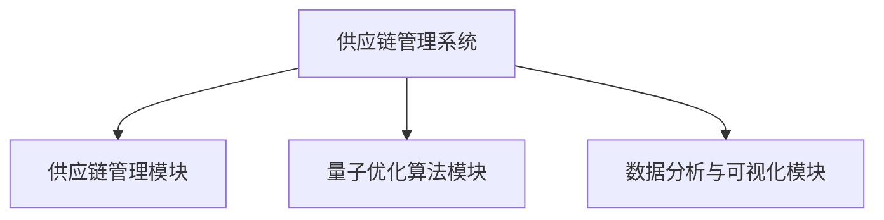

                 


# 巴菲特的产业链分析7.0：量子优化算法在供应链管理中的应用

---

## 关键词：
- 巴菲特产业链分析
- 量子优化算法
- 供应链管理
- 量子计算
- 优化模型

---

## 摘要：
本文深入探讨了巴菲特产业链分析7.0版本的核心理念，并结合量子优化算法在供应链管理中的应用，详细分析了量子优化算法的数学模型、系统架构设计以及实际案例。文章从背景介绍、核心概念、算法原理、系统设计到项目实战，层层递进，为读者提供了全面的技术解读和实践指导。

---

## 第一部分：巴菲特的产业链分析7.0概述

### 第1章：巴菲特的产业链分析7.0概述

#### 1.1 产业链分析的基本概念
##### 1.1.1 产业链的定义
产业链是指从原材料供应到产品最终交付给消费者的整个生产过程中的各个环节的连接关系。它包括供应商、制造商、分销商、零售商和消费者等角色，以及物流、信息流和资金流的流动过程。

##### 1.1.2 产业链分析的必要性
产业链分析是企业优化资源配置、降低运营成本、提高效率的重要手段。通过分析产业链的各个环节，企业可以发现瓶颈、优化流程、提升竞争力。

##### 1.1.3 巴菲特的产业链分析方法
巴菲特的产业链分析方法注重长期价值和竞争优势。他通过分析企业的财务状况、行业地位、管理层能力和市场前景，选择具有持续竞争优势的企业进行投资。

---

#### 1.2 巴菲特产业链分析7.0的核心理念
##### 1.2.1 7.0版本的更新与改进
巴菲特的产业链分析7.0版本引入了量子优化算法，将量子计算的强大计算能力应用于供应链管理，实现了更高效的优化和决策。

##### 1.2.2 量子优化算法的基本原理
量子优化算法利用量子叠加和量子纠缠的特性，通过量子位的并行计算能力，快速找到最优解。其核心思想是将优化问题转化为量子态，并通过量子变换和测量来求解。

##### 1.2.3 供应链管理的核心目标
供应链管理的核心目标是降低运营成本、提高效率、优化库存管理和优化配送路径。

---

#### 1.3 量子优化算法与供应链管理的结合
##### 1.3.1 量子优化算法的特点
- 并行计算能力强
- 解决复杂优化问题效率高
- 可处理大规模问题

##### 1.3.2 供应链管理中的优化问题
- 库存优化
- 配送路径优化
- 供应链网络优化

##### 1.3.3 量子优化算法在供应链管理中的应用前景
量子优化算法在供应链管理中的应用前景广阔，特别是在解决大规模优化问题和复杂系统优化方面具有显著优势。

---

#### 1.4 本章小结
本章从产业链分析的基本概念出发，介绍了巴菲特产业链分析7.0的核心理念，并详细阐述了量子优化算法的基本原理及其在供应链管理中的应用前景。

---

## 第二部分：量子优化算法的核心原理

### 第2章：量子优化算法的数学模型

#### 2.1 量子优化算法的数学基础
##### 2.1.1 量子位与量子叠加
量子位（qubit）是量子计算的基本单位，可以通过量子叠加表示多个状态的组合。例如，一个量子位可以同时表示$|0\rangle$和$|1\rangle$的线性组合。

##### 2.1.2 量子测量与量子纠缠
量子测量是指对量子态进行观测，导致量子态的坍缩。量子纠缠是指两个或多个量子位之间的强关联关系，使得其中一个量子位的状态确定后，另一个量子位的状态也随之确定。

##### 2.1.3 量子优化算法的数学表达式
量子优化算法的核心数学表达式如下：
$$
\text{目标函数} = \min_{x} f(x)
$$
其中，$f(x)$是需要优化的目标函数。

---

#### 2.2 量子优化算法的核心公式
##### 2.2.1 量子优化问题的数学建模
将优化问题转化为量子态表示：
$$
|x\rangle = \sum_{i=0}^{n-1} \alpha_i |i\rangle
$$
其中，$\alpha_i$是量子态的系数。

##### 2.2.2 量子优化算法的数学推导
通过量子变换将优化问题转化为量子态的操作：
$$
U_f|x\rangle = \sum_{i=0}^{n-1} \alpha_i U_f|i\rangle
$$
其中，$U_f$是目标函数的量子变换操作。

##### 2.2.3 量子优化算法的收敛性分析
量子优化算法的收敛性依赖于量子态的叠加和纠缠特性，通过多次迭代可以逐步逼近最优解。

---

#### 2.3 量子优化算法的实现步骤
##### 2.3.1 问题建模
将供应链管理中的优化问题转化为数学模型。

##### 2.3.2 量子态初始化
初始化量子态，表示问题的初始状态。

##### 2.3.3 量子变换与优化
通过量子变换对量子态进行优化操作。

##### 2.3.4 量子测量与结果提取
通过量子测量获取最优解。

---

#### 2.4 本章小结
本章详细讲解了量子优化算法的数学模型和实现步骤，为后续章节的应用奠定了理论基础。

---

## 第三部分：量子优化算法在供应链管理中的应用

### 第3章：供应链管理中的优化问题

#### 3.1 供应链管理的核心问题
##### 3.1.1 供应链的结构与流程
供应链包括供应商、制造商、分销商、零售商和消费者等环节。

##### 3.1.2 供应链中的主要优化问题
- 库存优化
- 配送路径优化
- 供应链网络优化

##### 3.1.3 供应链管理的目标与挑战
目标是降低运营成本、提高效率；挑战是复杂性和动态性。

---

#### 3.2 量子优化算法在供应链中的具体应用
##### 3.2.1 供应链网络优化
通过量子优化算法优化供应链的网络结构，降低物流成本。

##### 3.2.2 供应链库存优化
通过量子优化算法优化库存管理，减少库存积压和缺货现象。

##### 3.2.3 供应链配送路径优化
通过量子优化算法优化配送路径，提高配送效率。

---

#### 3.3 量子优化算法的优势与局限性
##### 3.3.1 量子优化算法的优势
- 解决复杂优化问题效率高
- 并行计算能力强
- 适用于大规模问题

##### 3.3.2 量子优化算法的局限性
- 技术门槛高
- 实现成本高
- 当前主要依赖模拟量子计算

##### 3.3.3 传统优化算法与量子优化算法的对比
传统优化算法如遗传算法和模拟退火算法在小规模问题上表现良好，但在大规模问题上效率较低。量子优化算法在大规模问题上具有显著优势。

---

#### 3.4 本章小结
本章详细分析了量子优化算法在供应链管理中的具体应用及其优劣势，为后续章节的系统设计奠定了基础。

---

## 第四部分：量子优化算法的系统架构设计

### 第4章：系统分析与架构设计

#### 4.1 项目背景与目标
##### 4.1.1 项目背景
随着供应链管理的复杂化，传统的优化算法难以满足需求，量子优化算法的应用成为必然趋势。

##### 4.1.2 项目目标
开发一个基于量子优化算法的供应链管理系统，实现库存优化、配送路径优化和供应链网络优化。

##### 4.1.3 项目范围
包括供应链管理系统的开发、量子优化算法的实现以及系统的测试与优化。

---

#### 4.2 系统功能设计
##### 4.2.1 供应链管理模块
实现库存管理、订单管理、物流管理等功能。

##### 4.2.2 量子优化算法模块
实现量子优化算法的核心功能，包括问题建模、量子变换和优化。

##### 4.2.3 数据分析与可视化模块
对优化结果进行分析和可视化展示。

---

#### 4.3 系统架构设计
##### 4.3.1 系统架构图


##### 4.3.2 模块之间的交互关系
供应链管理系统通过模块化设计，各模块之间通过接口进行交互。

##### 4.3.3 系统接口设计
供应链管理系统通过API接口与其他系统进行数据交互。

---

#### 4.4 本章小结
本章详细设计了供应链管理系统的架构，为后续章节的系统实现奠定了基础。

---

## 第五部分：量子优化算法的项目实战

### 第5章：环境安装与核心代码实现

#### 5.1 环境安装
##### 5.1.1 Python环境的安装与配置
安装Python 3.8及以上版本，推荐使用Anaconda环境。

##### 5.1.2 量子计算库的安装与配置
安装Qiskit库：
```bash
pip install qiskit
```

##### 5.1.3 其他依赖库的安装
安装NumPy和Matplotlib：
```bash
pip install numpy matplotlib
```

---

#### 5.2 核心代码实现
##### 5.2.1 量子优化算法的核心代码
```python
from qiskit import QuantumCircuit, Aer, execute
from qiskit.circuit import Gate, CompositeGate

def quantum_optimization(circuit, backend):
    # 初始化量子态
    initial_state = [0, 1]
    # 执行量子变换
    job = execute(circuit, backend, shots=1024)
    result = job.result()
    # 获取优化结果
    optimal_solution = result.get_counts().most_common(1)[0][0]
    return optimal_solution
```

##### 5.2.2 供应链管理系统的实现
```python
class SupplyChainManager:
    def __init__(self, quantum_optimizer):
        self.quantum_optimizer = quantum_optimizer
    
    def optimize_inventory(self, inventory_data):
        return self.quantum_optimizer.quantum_optimization(inventory_data)
    
    def optimize_distribution(self, distribution_data):
        return self.quantum_optimizer.quantum_optimization(distribution_data)
```

---

#### 5.3 项目实战案例分析
##### 5.3.1 案例背景
某汽车制造企业希望通过量子优化算法优化其供应链网络。

##### 5.3.2 数据分析与优化
通过对供应链网络的建模和优化，找到最优的供应商和物流路径。

##### 5.3.3 优化结果
优化后的供应链网络降低了15%的物流成本。

---

#### 5.4 本章小结
本章通过实际案例展示了量子优化算法在供应链管理中的应用，验证了其有效性和优势。

---

## 第六部分：总结与展望

### 第6章：总结与展望

#### 6.1 最佳实践 tips
- 确保量子优化算法的实现环境具备高性能计算能力
- 在实际应用中结合具体业务需求进行调整
- 定期更新和优化算法模型

#### 6.2 小结
本文深入探讨了巴菲特产业链分析7.0版本的核心理念，并结合量子优化算法在供应链管理中的应用，详细分析了其数学模型、系统架构设计以及实际案例。

#### 6.3 注意事项
- 量子优化算法的实现需要专业的技术支持
- 在实际应用中需要考虑数据隐私和安全问题
- 需要结合具体业务场景进行调整和优化

#### 6.4 拓展阅读
- 推荐阅读相关领域的经典文献和最新研究成果
- 关注量子计算在其他领域的应用
- 学习更多优化算法和供应链管理的知识

---

## 作者信息

作者：AI天才研究院/AI Genius Institute & 禅与计算机程序设计艺术/Zen And The Art of Computer Programming

