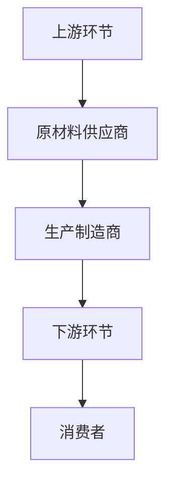
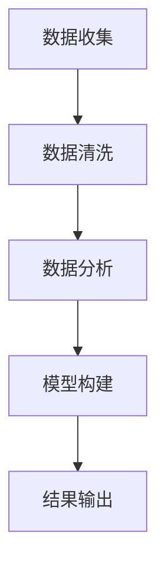
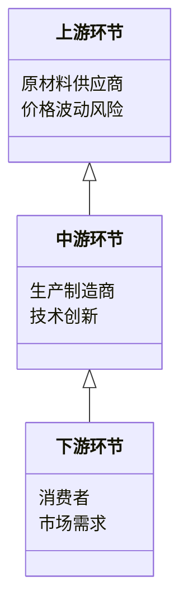
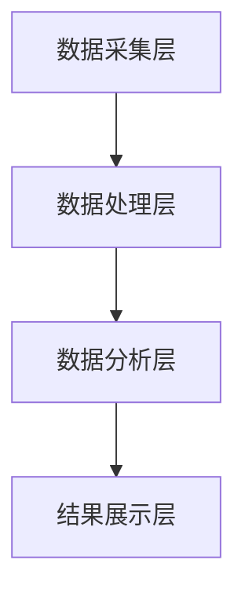

                 


# 巴菲特的产业链分析方法：全面理解公司的竞争环境

## 关键词：巴菲特，产业链分析，投资方法，竞争环境，企业分析

## 摘要：本文深入探讨巴菲特的产业链分析方法，分析其如何通过理解企业的产业链布局来评估公司的竞争环境和市场地位。通过实际案例分析，展示如何将产业链分析应用于投资决策，帮助投资者更好地理解企业的核心竞争力。

---

# 第1章: 巴菲特的产业链分析方法概述

## 1.1 巴菲特投资理念的背景

### 1.1.1 巴菲特的投资哲学
巴菲特的投资哲学以“长期价值投资”为核心，强调对公司基本面的深入分析和长期持有优质资产。他认为，投资的本质是寻找具有持续竞争优势、良好管理和稳固财务状况的企业。

### 1.1.2 价值投资的定义与核心要素
价值投资是一种投资策略，旨在通过购买价格低于其内在价值的股票，实现长期的资本增值。核心要素包括：①企业基本面分析；②竞争优势评估；③管理层质量；④财务健康状况。

### 1.1.3 产业链分析在巴菲特投资中的重要性
产业链分析是巴菲特评估企业竞争环境的重要工具。通过对产业链的分析，巴菲特能够识别企业在整个产业链中的位置、上下游关系以及潜在的竞争优势。

---

## 1.2 产业链分析的基本概念

### 1.2.1 产业链的定义与分类
产业链是指从原材料供应到产品最终到达消费者的全过程。产业链通常分为上游、中游和下游三个部分：
- **上游**：提供原材料和基础资源的企业。
- **中游**：负责生产制造和加工的企业。
- **下游**：直接面向消费者的销售和分销环节。

### 1.2.2 产业链分析的核心要素
- **上游环节**：关注原材料的供应稳定性、价格波动风险。
- **中游环节**：分析生产效率、成本控制和技术创新能力。
- **下游环节**：评估市场需求、客户忠诚度和品牌影响力。

### 1.2.3 产业链分析的边界与外延
产业链分析需要明确企业的业务范围和影响因素，避免过度延伸或遗漏关键环节。例如，对于一家制造企业，上游可能包括供应商，下游可能包括分销商和零售商。

---

## 1.3 产业链分析的意义与应用

### 1.3.1 产业链分析在投资决策中的作用
- **识别行业风险**：通过分析产业链中的薄弱环节，预测行业风险和潜在问题。
- **评估企业竞争力**：了解企业在产业链中的位置和竞争优势，判断其长期盈利能力。
- **制定投资策略**：根据产业链分析结果，优化投资组合，选择具有稳定增长潜力的企业。

### 1.3.2 产业链分析的实际应用场景
- **行业研究**：分析某一行业的产业链，识别行业趋势和关键驱动因素。
- **企业估值**：结合企业所在产业链的位置，评估其盈利能力和成长空间。
- **风险管理**：通过分析产业链的不确定性，制定风险应对策略。

### 1.3.3 产业链分析的局限性与注意事项
- **信息不对称**：产业链分析依赖于公开信息，可能存在信息不全的问题。
- **行业差异**：不同行业的产业链差异较大，分析方法需要灵活调整。
- **动态变化**：产业链可能因技术进步或政策变化而调整，分析结果需定期更新。

---

# 第2章: 产业链分析的核心概念与联系

## 2.1 产业链分析的核心要素

### 2.1.1 上游环节：资源与原材料
- **原材料供应商**：分析供应商的数量、集中度和议价能力。
- **原材料价格波动**：评估价格波动对企业成本的影响。

### 2.1.2 中游环节：生产与制造
- **生产效率**：衡量企业的生产能力和成本控制水平。
- **技术创新**：分析企业在技术研发方面的投入和成果。

### 2.1.3 下游环节：市场与消费者
- **市场需求**：研究产品的市场容量和增长潜力。
- **消费者行为**：分析消费者偏好和购买习惯，评估品牌影响力。

---

## 2.2 产业链环节的特征对比

### 2.2.1 上游环节的特征对比表

| 特征     | 上游环节                  |
|----------|--------------------------|
| 代表企业 | 原材料供应商（如矿石开采企业） |
| 风险     | 价格波动、供应稳定性       |
| 竞争格局 | 可能存在寡头垄断或分散供应 |

### 2.2.2 中游环节的特征对比表

| 特征     | 中游环节                  |
|----------|--------------------------|
| 代表企业 | 制造商（如汽车制造商）     |
| 风险     | 成本上升、技术替代         |
| 竞争格局 | 竞争较为激烈               |

### 2.2.3 下游环节的特征对比表

| 特征     | 下游环节                  |
|----------|--------------------------|
| 代表企业 | 零售商、分销商             |
| 风险     | 市场需求变化、品牌竞争     |
| 竞争格局 | 市场集中度可能较高         |

---

## 2.3 产业链分析的ER实体关系图



---

# 第3章: 产业链分析的算法原理

## 3.1 产业链分析的算法流程

### 3.1.1 数据收集与处理
- **数据来源**：收集企业的财务报表、行业报告、供应链信息等。
- **数据清洗**：去除无效数据，确保数据的准确性和完整性。

### 3.1.2 数据分析与建模
- **数据分析**：使用统计方法分析企业的财务指标、市场地位和竞争优势。
- **模型构建**：构建产业链模型，模拟企业的盈利能力和风险敞口。

### 3.1.3 结果输出与可视化
- **可视化**：通过图表展示产业链的各个环节及其相互关系。
- **报告撰写**：撰写分析报告，总结企业的竞争优势和潜在风险。

---

## 3.2 产业链分析的数学模型

### 3.2.1 财务指标分析

$$ \text{ROE} = \frac{\text{净利润}}{\text{净资产}} $$

$$ \text{ROA} = \frac{\text{净利润}}{\text{总资产}} $$

### 3.2.2 产业链竞争力评价模型

$$ \text{竞争力指数} = \sum (\text{上游竞争力} \times 0.3 + \text{中游竞争力} \times 0.4 + \text{下游竞争力} \times 0.3) $$

---

## 3.3 产业链分析的mermaid流程图



---

# 第4章: 产业链分析的系统架构设计

## 4.1 问题场景介绍

### 4.1.1 问题描述
分析一家企业的产业链，评估其在行业中的竞争力和潜在风险。

### 4.1.2 项目介绍
选择某行业（如科技行业）中的代表性企业，进行产业链分析。

---

## 4.2 系统功能设计

### 4.2.1 领域模型mermaid类图



### 4.2.2 系统架构设计mermaid架构图



### 4.2.3 系统接口设计
- **输入接口**：接收企业的财务数据和行业报告。
- **输出接口**：生成分析报告和可视化图表。

---

## 4.3 系统交互设计

### 4.3.1 系统交互mermaid序列图

```mermaid
sequenceDiagram
    用户 -> 数据采集层: 提供企业数据
    数据采集层 -> 数据处理层: 数据清洗
    数据处理层 -> 数据分析层: 数据分析
    数据分析层 -> 用户: 输出分析结果
```



---

# 第5章: 项目实战

## 5.1 环境安装

### 5.1.1 安装Python和相关库
```bash
pip install numpy pandas matplotlib
```

## 5.2 系统核心实现源代码

### 5.2.1 数据分析代码
```python
import pandas as pd
import numpy as np

# 假设我们有一个企业的财务数据
data = {
    '收入': [100, 200, 300],
    '成本': [50, 100, 150],
    '利润': [50, 100, 150]
}
df = pd.DataFrame(data)

# 计算ROE和ROA
df['ROE'] = df['利润'] / (df['收入'] - df['成本'])
df['ROA'] = df['利润'] / df['收入']

print(df)
```

### 5.2.2 代码应用解读与分析
- **收入与成本分析**：分析企业的收入增长和成本控制能力。
- **ROE和ROA分析**：评估企业的盈利能力，判断其财务健康状况。

## 5.3 实际案例分析

### 5.3.1 案例介绍
选择某公司（如苹果）进行产业链分析，评估其在产业链中的竞争力。

### 5.3.2 产业链分析结果
- **上游环节**：苹果的芯片供应商（如台积电）具有较高的议价能力。
- **中游环节**：苹果的制造环节依赖于代工企业，需关注其成本控制和技术创新。
- **下游环节**：苹果的市场需求稳定，品牌影响力强大。

---

## 5.4 项目小结
通过实际案例分析，验证了产业链分析方法的有效性，帮助投资者更好地理解企业的竞争环境和潜在风险。

---

# 第6章: 总结与最佳实践

## 6.1 小结
本文深入探讨了巴菲特的产业链分析方法，结合实际案例，展示了如何通过分析企业的产业链布局，评估其竞争环境和市场地位。

## 6.2 投资建议
- **长期投资**：选择具有持续竞争优势的企业进行长期投资。
- **风险管理**：关注产业链中的潜在风险，制定合理的风险管理策略。

## 6.3 注意事项
- **动态调整**：定期更新产业链分析结果，适应市场变化。
- **信息收集**：充分利用公开信息，进行深入的企业基本面分析。

## 6.4 拓展阅读
推荐阅读巴菲特的著作《 Intelligent Investor》和相关投资策略书籍。

---

# 作者：AI天才研究院 & 禅与计算机程序设计艺术

通过本文的详细分析，读者可以全面理解巴菲特的产业链分析方法，并将其应用于实际投资决策中。

