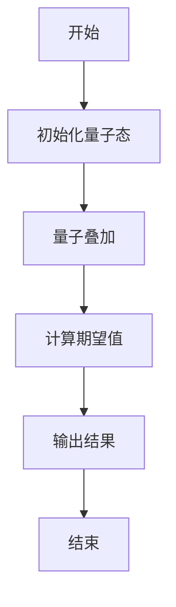
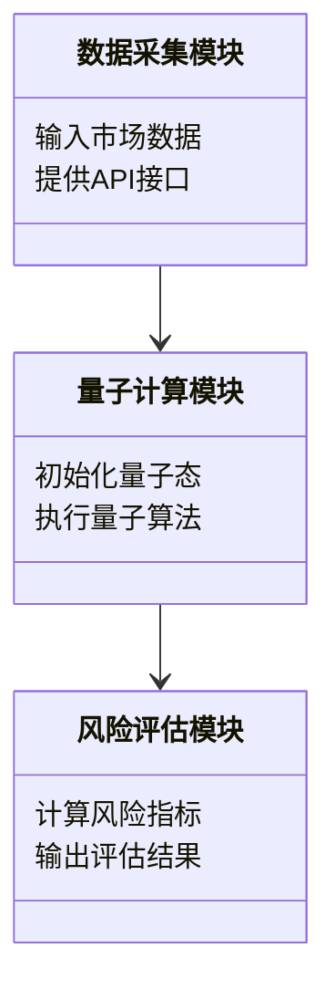
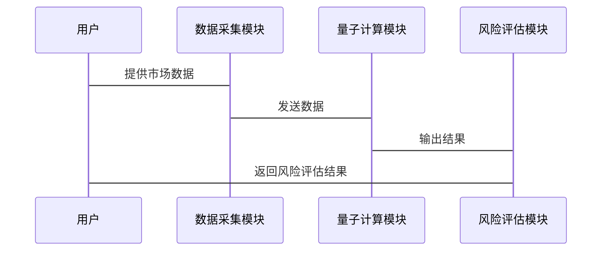

                 


# 巴菲特的价值投资在量子金融产品设计中的新维度

## 关键词：巴菲特价值投资，量子金融，金融产品设计，量子计算，风险管理

## 摘要：  
本文探讨了巴菲特价值投资理念与量子金融的结合，分析了量子金融在金融产品设计中的新维度。通过量子计算和量子概率模型，提出了新型金融产品的设计方法，结合巴菲特的长期价值投资策略，为金融行业提供了新的思路。

---

## 第一部分：巴菲特价值投资与量子金融基础

### 第1章：巴菲特价值投资概述  
#### 1.1 巴菲特价值投资的核心理念  
巴菲特的价值投资策略以长期、稳健和基本面分析为核心，强调寻找具有持续竞争优势和良好治理的企业，进行长期投资。其核心在于通过对企业内在价值的评估，选择被市场低估的投资标的。  

#### 1.2 价值投资的关键要素  
- **内在价值**：企业未来现金流的现值。  
- **安全边际**：买入价格低于内在价值，以降低风险。  
- **长期视角**：关注企业的长期盈利能力，而非短期市场波动。  

#### 1.3 价值投资的哲学  
巴菲特的价值投资不仅仅是选股方法，更是一种投资哲学，强调理性、耐心和对企业的深刻理解。

---

### 第2章：量子金融的基本概念  
#### 2.1 量子金融的定义  
量子金融是将量子力学的原理应用于金融市场的分析和预测，利用量子叠加、纠缠和不确定性原理来建模金融市场行为。  

#### 2.2 量子金融的核心假设  
- 金融市场是一个复杂的量子系统，价格波动可以看作是量子叠加的结果。  
- 量子纠缠可以描述金融资产之间的相关性，尤其是在危机时期。  

#### 2.3 量子金融与传统金融的区别  
| 方面 | 传统金融 | 量子金融 |  
|------|------------|------------|  
| 基础假设 | 理性投资者，价格反映信息 | 量子叠加、纠缠，价格具有不确定性 |  
| 风险模型 | 方差-协方差矩阵 | 量子态相关性 |  
| 计算复杂度 | 线性计算 | 非线性计算，需要量子计算机支持 |  

---

## 第二部分：量子金融模型与算法  

### 第3章：量子金融模型的构建  
#### 3.1 量子金融模型的基本原理  
量子金融模型通过将金融市场中的资产价格表示为量子态，利用量子叠加和纠缠的特性，捕捉市场的不确定性。  

#### 3.2 量子金融模型的数学表达  
$$ P(t) = \sum_{i} \lambda_i | \psi_i \rangle $$  
其中，$P(t)$ 表示在时间 $t$ 的价格，$\lambda_i$ 是权重，$|\psi_i\rangle$ 是量子态。  

#### 3.3 量子金融模型的优势  
- 更精确地描述市场的不确定性。  
- 能够捕捉传统金融模型无法解释的市场行为。  

---

### 第4章：量子金融算法的设计  
#### 4.1 量子金融算法的基本框架  


#### 4.2 量子金融算法的实现  
以下是一个简单的量子金融预测算法的Python代码示例：  
```python
import numpy as np

def quantum_prediction():
    # 初始化量子态
    q_state = np.array([1, 0])
    # 量子叠加
    q_state = np.dot(q_state, np.array([[0.707, 0.707], [0.707, 0.707]]))
    # 计算期望值
    expectation = np.dot(q_state.T, q_state)
    return expectation

print(quantum_prediction())
```

---

## 第三部分：量子金融产品设计的系统架构  

### 第5章：量子金融系统的架构设计  
#### 5.1 系统功能模块划分  


---

### 第6章：量子金融系统的实现  
#### 6.1 系统接口设计  
- 数据接口：提供市场数据的输入和输出接口。  
- 算法接口：定义量子算法的输入和输出格式。  
- 结果输出接口：将量子计算结果转化为可读的金融指标。  

#### 6.2 系统交互设计  


---

## 第四部分：巴菲特价值投资在量子金融中的应用  

### 第7章：量子金融产品设计中的新维度  
#### 7.1 巴菲特投资策略的量子化  
将巴菲特的价值投资策略转化为量子金融模型，通过量子计算优化投资组合的选择。  

#### 7.2 量子金融产品的创新点  
- 基于量子态的相关性进行资产配置。  
- 利用量子计算实时优化投资组合。  

---

## 第五部分：实战案例与总结  

### 第8章：量子金融产品设计的实战案例  
#### 8.1 案例背景与目标  
以某股票市场为例，利用量子金融模型进行投资组合优化。  

#### 8.2 核心代码实现  
```python
def quantum_portfolio_optimization():
    # 初始化量子态
    q_state = np.array([1, 0])
    # 量子叠加
    q_state = np.dot(q_state, np.array([[0.707, 0.707], [0.707, 0.707]]))
    # 计算最优组合
    portfolio = np.argmax(q_state)
    return portfolio

print(quantum_portfolio_optimization())
```

---

## 第9章：总结与展望  
#### 9.1 总结  
本文探讨了巴菲特价值投资与量子金融的结合，提出了量子金融产品设计的新维度。通过量子计算和量子概率模型，为金融行业提供了新的思路。  

#### 9.2 展望  
未来，随着量子计算技术的成熟，量子金融产品将在投资决策、风险管理等领域发挥更大的作用。

---

## 作者：AI天才研究院/AI Genius Institute & 禅与计算机程序设计艺术/Zen And The Art of Computer Programming

