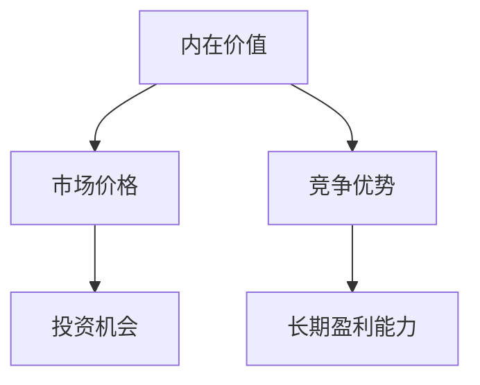
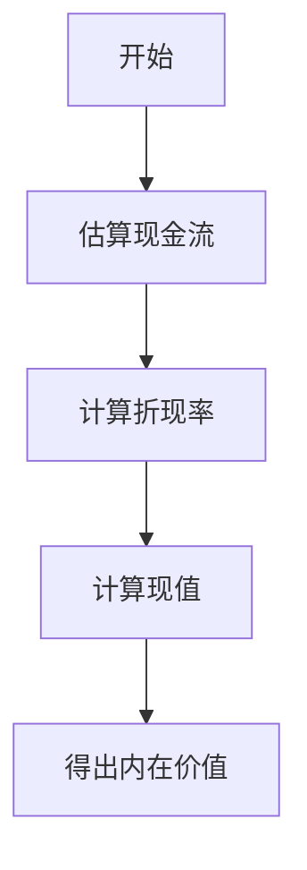
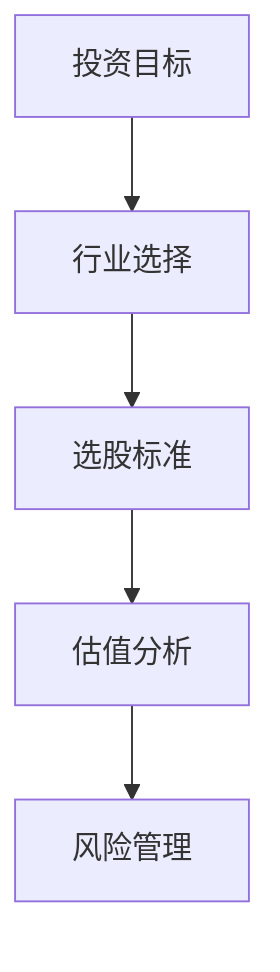

                 


# 巴菲特的价值投资理念：如何识别被低估的股票

**关键词**：价值投资、巴菲特、股票估值、内在价值、安全边际、投资策略

**摘要**：本文深入探讨巴菲特的价值投资理念，解析如何识别被低估的股票。通过分析内在价值、安全边际、竞争优势等核心概念，结合数学模型和实际案例，为投资者提供系统化的投资方法。

---

# 第一部分: 巴菲特的价值投资理念基础

## 第1章: 巴菲特价值投资理念概述

### 1.1 价值投资的定义与核心理念

#### 1.1.1 价值投资的定义
价值投资是一种以基本面分析为基础的投资策略，旨在通过识别市场价格与内在价值之间的差异，寻找具有长期投资价值的股票。巴菲特将其定义为：**价格是半个直男，价值才是关键**。

#### 1.1.2 巴菲特价值投资的核心理念
巴菲特的价值投资理念强调以下几点：
- **安全边际**：买入价格低于内在价值，确保足够的安全空间。
- **竞争优势**：投资具有强大护城河的企业。
- **长期思维**：关注企业的长期盈利能力，而非短期波动。

#### 1.1.3 价值投资与投机的对比
| 价值投资 | 投机 |
|----------|------|
| 基于基本面分析 | 基于市场情绪 |
| 长期持有 | 短期交易 |
| 风险可控 | 风险较高 |

### 1.2 巴菲特的投资哲学

#### 1.2.1 投资是第二好的职业
巴菲特认为，投资需要深入研究和耐心等待。他将投资比作职业，强调专业性和长期性。

#### 1.2.2 长期投资与复利效应
长期投资通过复利效应，能够显著提高投资收益。巴菲特的“雪球效应”理论强调，优质资产会随着时间积累更多财富。

#### 1.2.3 市场先生的智慧
巴菲特将市场波动比作“市场先生”，认为市场先生的情绪化为投资者提供了廉价买入的机会。

### 1.3 价值投资的适用场景

#### 1.3.1 价值投资的适用市场环境
- 稳定或温和增长的经济环境。
- 市场出现非理性波动时。

#### 1.3.2 不适合价值投资的情况
- 市场极度泡沫化时。
- 企业基本面发生根本性变化时。

#### 1.3.3 价值投资的长期视角
价值投资强调长期视角，避免短期市场的干扰。巴菲特建议投资者将股票持有时间延长至5年以上。

---

## 第2章: 价值投资的核心概念与背景

### 2.1 价值投资的背景介绍

#### 2.1.1 价值投资的起源与发展
价值投资起源于20世纪初，格雷厄姆和多德是该理念的创始人。巴菲特从格雷厄姆那里学习了价值投资的精髓，并加以发展。

#### 2.1.2 巴菲特对价值投资的贡献
巴菲特将价值投资的理念与长期投资相结合，提出了“安全边际”和“竞争优势”两大核心概念。

#### 2.1.3 价值投资在全球市场的应用
价值投资理念在全球范围内被广泛应用，尤其在成熟市场表现更为显著。

### 2.2 核心概念与联系

#### 2.2.1 内在价值与市场价值的对比
- **内在价值**：企业未来现金流的现值。
- **市场价值**：市场交易价格。

两者之间的差异为价值投资提供了机会。

#### 2.2.2 价值投资与基本面分析的关系
基本面分析是价值投资的基础，通过分析企业的财务报表和行业地位，评估其内在价值。

#### 2.2.3 使用 Mermaid 绘制的概念关系图



---

## 第3章: 价值投资的数学模型与估值方法

### 3.1 股票估值的数学模型

#### 3.1.1 内在价值的计算公式

股票的内在价值（V）可以通过以下公式计算：

$$
V = \sum_{t=1}^{n} \frac{CF_t}{(1+r)^t}
$$

其中，\( CF_t \) 是第 \( t \) 年的现金流，\( r \) 是折现率。

#### 3.1.2 市盈率与市净率的计算

- **市盈率（P/E）**：
$$
P/E = \frac{股价}{每股收益}
$$

- **市净率（P/B）**：
$$
P/B = \frac{股价}{每股净资产}
$$

#### 3.1.3 折现现金流模型（DCF）

DCF模型是评估企业内在价值的重要工具。以下是DCF模型的步骤：

1. 估算未来自由现金流。
2. 使用加权平均资本成本（WACC）进行折现。
3. 计算终值。
4. 总和得到企业价值。

### 3.2 股票估值的算法原理

#### 3.2.1 使用 Mermaid 绘制的估值流程图



#### 3.2.2 估值算法的 Python 实现

以下是一个简单的DCF模型的Python代码：

```python
def calculate_intrinsic_value(fcf, wacc, horizon, growth_rate=0):
    terminal_value = fcf * (1 + growth_rate) / (wacc - growth_rate)
    present_value = 0
    for t in range(1, horizon + 1):
        cash_flow = fcf * (1 + growth_rate)**(t-1)
        present_value += cash_flow / (1 + wacc)**t
    intrinsic_value = present_value + terminal_value / (1 + wacc)**horizon
    return intrinsic_value

# 示例
fcf = 100
wacc = 0.1
horizon = 5
iv = calculate_intrinsic_value(fcf, wacc, horizon)
print(f"内在价值：{iv}")
```

#### 3.2.3 估值模型的优缺点分析

| 优点 | 缺点 |
|------|------|
| 精确性高 | 需要准确预测现金流 |
| 可量化 | 依赖假设参数 |

### 3.3 估值案例分析

#### 3.3.1 某公司的估值分析

假设某公司未来5年的自由现金流分别为100、120、140、160、180万元，折现率为10%，终值增长率为5%。

计算内在价值：

$$
terminal\_value = \frac{180 \times 1.05}{0.10 - 0.05} = 3780 \text{万元}
$$

现值计算：

$$
present\_value = \sum_{t=1}^{5} \frac{CF_t}{(1+0.10)^t} = 420 \text{万元}
$$

内在价值：

$$
intrinsic\_value = 420 + \frac{3780}{(1+0.10)^5} = 420 + 230 = 650 \text{万元}
$$

---

# 第二部分: 系统化投资方法

## 第4章: 价值投资的系统化方法

### 4.1 价值投资的系统化框架

#### 4.1.1 投资目标与策略
- 明确投资目标。
- 制定投资策略。

#### 4.1.2 系统化投资流程

1. 选择行业：关注具有稳定增长的行业。
2. 选股标准：筛选低市盈率、低市净率的公司。
3. 估值分析：计算内在价值，确定安全边际。
4. 风险管理：分散投资，控制仓位。

### 4.2 价值投资的风险管理

#### 4.2.1 风险识别
- 市场风险。
- 企业基本面变化风险。

#### 4.2.2 风险控制
- 分散投资：避免过度集中。
- 设置止损点：当股价下跌超过一定比例时卖出。

### 4.3 使用 Mermaid 绘制的系统架构图



---

## 第5章: 项目实战：价值投资策略实现

### 5.1 环境安装与工具准备

- **工具**：Python、Excel、投资分析软件（如Morningstar）。

### 5.2 核心实现：股票筛选与估值

#### 5.2.1 股票筛选标准
| 标准 | 说明 |
|------|------|
| 低市盈率 | P/E < 市场平均值 |
| 低市净率 | P/B < 市场平均值 |
| 高ROE | 净资产收益率 > 15% |

#### 5.2.2 估值实现

使用Python代码实现DCF模型，评估目标公司的内在价值。

### 5.3 案例分析

#### 5.3.1 公司基本面分析

- **公司名称**：可口可乐
- **行业**：饮料制造
- **财务数据**：收入、利润、现金流。

#### 5.3.2 估值与投资决策

通过DCF模型计算可口可乐的内在价值，与市场价格对比，决定是否投资。

---

## 第6章: 最佳实践与小结

### 6.1 最佳实践 tips

- **长期持有**：避免频繁交易。
- **分散投资**：降低风险。
- **持续学习**：更新投资理念。

### 6.2 投资小结

价值投资是一种科学且艺术的投资方法，需要耐心、纪律和持续学习。通过系统化的分析和实践，投资者可以在市场中找到被低估的股票，实现长期稳定的收益。

---

# 作者：AI天才研究院/AI Genius Institute & 禅与计算机程序设计艺术 /Zen And The Art of Computer Programming

---

**本文内容基于巴菲特的价值投资理念，结合技术分析方法，为投资者提供了系统化的投资策略。通过深入分析内在价值、安全边际和竞争优势，帮助投资者识别被低估的股票，实现长期稳定的投资收益。**

