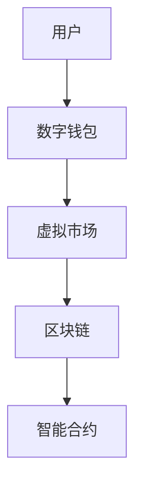

                 


# 巴菲特的价值链分析：元宇宙经济下的价值重构

## 关键词
- 巴菲特价值投资理论
- 元宇宙经济
- 价值链分析
- 数字经济
- 经济重构

## 摘要
本文探讨了巴菲特的价值链分析方法在元宇宙经济中的应用，分析了元宇宙经济的重构过程，结合实际案例，详细阐述了价值评估的数学模型、算法实现以及系统架构设计，最后给出了最佳实践建议。

---

## 第一部分: 元宇宙经济与巴菲特的价值链分析背景

### 第1章: 元宇宙经济的基本概念

#### 1.1 元宇宙的定义与特征
元宇宙（Metaverse）是一个虚拟的、去中心化的、三维的数字世界，结合了增强现实（AR）和虚拟现实（VR）技术，用户可以通过数字化身份在这个虚拟空间中进行社交、交易、创作和互动。元宇宙的核心特征包括：
- **去中心化**：通过区块链技术实现资产的分布式管理。
- **沉浸式体验**：用户可以通过VR设备获得身临其境的感受。
- **经济系统**：元宇宙中的虚拟资产具有实际价值，用户可以在虚拟市场中进行交易。

#### 1.2 巴菲特价值投资理论概述
巴菲特的价值投资理论强调长期持有优质资产，关注企业的基本面，如盈利能力、财务状况和管理团队。其核心思想包括：
- **价值投资**：寻找具有长期竞争优势的企业，长期持有。
- **安全边际**：以低于内在价值的价格买入资产。
- **股东价值**：通过企业的盈利能力和股息支付来实现股东价值最大化。

#### 1.3 元宇宙与现实经济的联系
元宇宙作为一个虚拟经济体系，其经济结构与现实经济有相似之处，但也存在显著差异。元宇宙经济的核心特征包括：
- **虚拟资产**：如虚拟货币、数字艺术品、虚拟土地等。
- **去中心化金融（DeFi）**：通过智能合约实现金融交易的自动化。
- **经济生态**：元宇宙中的经济体系需要通过数字资产的流动和交换来维持。

### 第2章: 元宇宙经济的现状与挑战

#### 2.1 元宇宙经济体系的构建
元宇宙经济体系的构建需要考虑以下几个方面：
- **数据层**：通过区块链技术实现资产的记录和交易。
- **协议层**：定义经济体系的规则和机制。
- **应用层**：开发虚拟市场、数字钱包等应用。

#### 2.2 巴菲特分析方法的适用性
巴菲特的价值链分析方法在元宇宙经济中的适用性主要体现在以下几个方面：
- **价值评估**：通过对元宇宙中的虚拟资产进行分析，评估其实际价值。
- **长期投资**：选择具有长期竞争优势的虚拟资产进行投资。
- **风险管理**：通过安全边际的概念，降低投资风险。

#### 2.3 元宇宙经济中的价值重构
元宇宙经济的重构过程包括以下几个步骤：
1. **价值发现**：发现具有潜力的虚拟资产。
2. **价值评估**：通过对虚拟资产的分析，评估其实际价值。
3. **价值实现**：通过交易和投资实现资产的价值。

---

## 第二部分: 巴菲特价值链分析的核心概念与联系

### 第3章: 巴菲特价值链分析的核心原理

#### 3.1 价值创造的定义与特征
价值创造是指通过优化资源配置、提高效率、降低成本等方式，实现资产价值的提升。其特征包括：
- **可持续性**：价值创造需要长期持续。
- **可衡量性**：价值创造可以通过量化指标进行评估。
- **可实现性**：价值创造需要通过实际操作实现。

#### 3.2 价值评估的数学模型
价值评估的数学模型可以通过以下公式表示：
$$
V = \frac{CF}{r}
$$
其中，\( V \) 表示资产的内在价值，\( CF \) 表示未来现金流，\( r \) 表示折现率。

#### 3.3 价值传递的机制
价值传递是指通过市场机制，将资产的价值从创造者传递给投资者。其机制包括：
- **市场定价**：通过市场供求关系确定资产的价格。
- **交易机制**：通过虚拟市场实现资产的买卖。
- **价值流动**：通过资产的流动实现价值的传递。

#### 3.4 巴菲特价值链分析的流程
巴菲特价值链分析的流程可以分为以下几个步骤：
1. **数据收集**：收集企业的财务数据和市场数据。
2. **数据分析**：通过数据分析，评估企业的盈利能力。
3. **价值评估**：通过数学模型评估企业的内在价值。
4. **投资决策**：根据评估结果，做出投资决策。

---

### 第4章: 巴菲特价值链分析在元宇宙中的应用

#### 4.1 元宇宙经济中的价值重构
元宇宙经济中的价值重构需要考虑以下几个方面：
- **虚拟资产的特性**：虚拟资产具有独特性和不可替代性。
- **市场机制**：通过市场机制实现虚拟资产的定价和交易。
- **风险管理**：通过风险管理，降低投资风险。

#### 4.2 巴菲特分析方法的优化
为了适应元宇宙经济的特点，巴菲特分析方法需要进行优化，包括：
- **数据源的扩展**：考虑虚拟资产的数据。
- **模型的调整**：调整数学模型，适应虚拟资产的特性。
- **分析方法的改进**：改进分析方法，提高分析的准确性。

#### 4.3 元宇宙经济中的价值传递
元宇宙经济中的价值传递需要通过以下机制实现：
- **虚拟货币**：通过虚拟货币实现资产的交易。
- **智能合约**：通过智能合约实现资产的自动交易。
- **数字身份**：通过数字身份实现资产的归属。

---

## 第三部分: 巴菲特价值链分析的系统架构与实现

### 第5章: 系统架构设计

#### 5.1 系统功能设计
系统功能设计包括以下几个方面：
- **数据采集**：采集虚拟资产的市场数据。
- **数据分析**：通过数据分析，评估虚拟资产的价值。
- **价值评估**：通过数学模型评估虚拟资产的内在价值。
- **投资决策**：根据评估结果，做出投资决策。

#### 5.2 系统架构图
以下是一个元宇宙经济系统的架构图：



---

### 第6章: 算法实现与案例分析

#### 6.1 算法实现
以下是一个基于巴菲特分析方法的元宇宙经济价值评估算法的Python代码示例：

```python
def value_analysis(cf, r):
    return cf / r

cf = 1000000  # 未来现金流
r = 0.05      # 折现率
value = value_analysis(cf, r)
print(f"资产的内在价值为：{value}")
```

#### 6.2 案例分析
以Decentraland为例，分析其虚拟资产的价值评估过程：

1. **数据收集**：收集Decentraland的市场数据和财务数据。
2. **数据分析**：通过数据分析，评估Decentraland的盈利能力。
3. **价值评估**：通过数学模型评估Decentraland的内在价值。
4. **投资决策**：根据评估结果，做出投资决策。

---

## 第四部分: 最佳实践与总结

### 第7章: 最佳实践

#### 7.1 关键点总结
- **价值创造**：通过优化资源配置，提高效率，降低成本，实现资产价值的提升。
- **价值评估**：通过数学模型评估资产的内在价值。
- **价值传递**：通过市场机制实现资产的价值传递。

#### 7.2 注意事项
- **数据准确性**：确保数据的准确性和完整性。
- **模型适用性**：根据实际情况调整模型。
- **风险管理**：通过风险管理，降低投资风险。

#### 7.3 拓展阅读
- 推荐阅读《巴菲特的午餐：价值投资的真谛》。

---

## 作者信息

作者：AI天才研究院/AI Genius Institute & 禅与计算机程序设计艺术/Zen And The Art of Computer Programming

---

以上是关于“巴菲特的价值链分析：元宇宙经济下的价值重构”的完整目录和内容概述。

